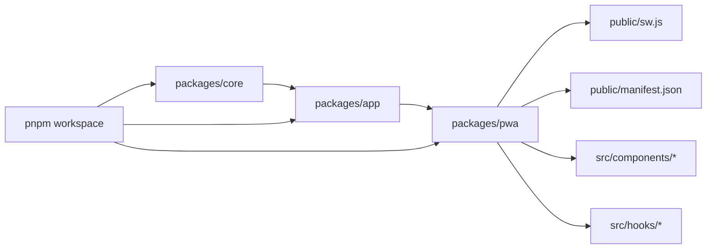
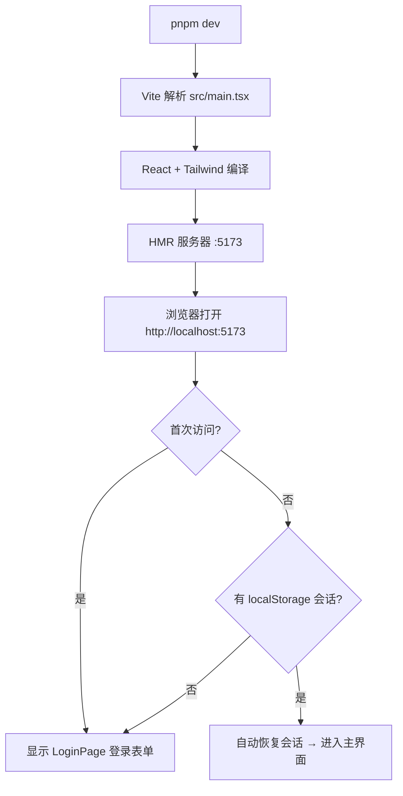

本指南面向初次接触此项目的开发者，旨在帮助你在本地快速运行 PWA（渐进式 Web 应用）版本的 Bluesky 客户端，并将其部署到公网。与 TUI 终端客户端不同，PWA 客户端运行在浏览器中，无需 `.env` 文件——所有凭证通过**登录表单**输入并持久化在浏览器的 `localStorage` 中。如果你尚未了解项目整体架构，建议先阅读 [项目概览：双界面 Bluesky 客户端与深度 AI 集成](1-xiang-mu-gai-lan-shuang-jie-mian-bluesky-ke-hu-duan-yu-shen-du-ai-ji-cheng)。

Sources: [PWA 迁移指南](docs/PWA_GUIDE.md#L12-L18)

---

## 环境要求

在开始之前，请确认你的开发环境满足以下条件：

| 依赖 | 最低版本 | 用途 |
|------|----------|------|
| Node.js | ≥ 18 | 运行构建工具链与开发服务器 |
| pnpm | ≥ 8 | 管理工作区中的多包依赖（monorepo） |

> 本项目使用 **pnpm workspace** 作为包管理器。如果尚未安装 pnpm，请运行 `npm install -g pnpm` 全局安装。`npm` 或 `yarn` 无法正确解析工作区引用路径。

Sources: [根 package.json](package.json#L12-L15)、[工作区配置](pnpm-workspace.yaml#L1-L4)

整体项目采用单体仓库结构，PWA 包位于 `packages/pwa/`，依赖关系如下：



`@bsky/pwa` 仅负责**渲染层**，所有业务逻辑（认证、时间线、发帖、AI 对话、翻译等）来自下层包 `@bsky/app` 和 `@bsky/core`。你可以在 [单体仓库架构：core → app → tui/pwa 的三层依赖体系](5-dan-ti-cang-ku-jia-gou-core-app-tui-pwa-de-san-ceng-yi-lai-ti-xi) 中了解完整的层级设计。

Sources: [PWA 包依赖](packages/pwa/package.json#L18-L25)、[tsconfig 引用](packages/pwa/tsconfig.json#L18-L23)

---

## 第一步：克隆与安装依赖

```bash
# 1. 克隆仓库
git clone <repository-url>
cd bsky

# 2. 安装所有依赖（包括 core、app、pwa 三个包）
pnpm install
```

`pnpm install` 会根据 `pnpm-workspace.yaml` 中声明的包路径（`packages/*`）自动解析并链接内部依赖。如果你的网络环境受限，可配置 `.npmrc` 中已有的 `shamefully-hoist=true` 来扁平化依赖结构。安装完成后，`packages/pwa/node_modules` 下应当包含 React、Tailwind CSS、Vite 等所有必需的前端依赖。

Sources: [pnpm-workspace.yaml](pnpm-workspace.yaml#L1-L4)、[.npmrc](.npmrc#L1-L3)

---

## 第二步：启动开发服务器

```bash
# 进入 PWA 包目录
cd packages/pwa

# 启动 Vite 开发服务器
pnpm dev
```

运行上述命令后，Vite 会启动一个基于 esbuild 的模块热更新（HMR）服务器，默认监听 `http://localhost:5173`。在 `vite.config.ts` 中配置了自动打开浏览器（`open: true`），因此终端执行后浏览器会自动弹出。



开发服务器的完整配置如下：

| 配置项 | 值 | 说明 |
|--------|-----|------|
| 端口 | 5173 | 可通过 `vite.config.ts` 修改 |
| 自动打开 | 是 | `open: true` |
| 基础路径 | `./` | 使用相对路径，兼容静态部署 |
| 解析别名 | `os`→`stubs/os.ts` 等 | 抹平 Node.js 内置模块差异 |

PWA 与 TUI 的一个关键区别在于**凭证管理**：TUI 使用 `.env` 文件读取 Bluesky 凭证和 AI API Key，而 PWA 将这些信息放在**浏览器本地**。首次启动时你会看到一个简洁的登录页面，输入你的 Bluesky Handle 和 App Password 即可通过 AT 协议认证。登录成功后，凭证自动写入 `localStorage`（键名 `bsky_session`），下次刷新页面无需再次登录。AI API Key 则在进入主界面后通过设置面板（⚙️）配置，同样持久化在 `localStorage`（键名 `bsky_app_config`）。

Sources: [vite.config.ts](packages/pwa/vite.config.ts#L1-L24)、[useSessionPersistence.ts](packages/pwa/src/hooks/useSessionPersistence.ts#L1-L27)、[useAppConfig.ts](packages/pwa/src/hooks/useAppConfig.ts#L1-L43)

---

## 第三步：登录与配置

### 获取 Bluesky App Password

PWA 使用 **App Password（应用密码）** 进行认证，而非主账号密码。你需要前往 Bluesky 官网生成：

1. 登录 [bsky.app/settings/app-passwords](https://bsky.app/settings/app-passwords)
2. 点击 **Add App Password**，输入名称（如 "bsky-pwa"）
3. 复制生成的 16 位密码——系统不会再次显示

### 登录表单

登录页面的核心代码位于 `LoginPage.tsx`，它使用 `useAuth` 钩子（来自 `@bsky/app`）执行 AT 协议认证：

```tsx
const { client, loading, error, login } = useAuth();
// login(handle, password) → 调用 BskyClient 的 createSession API
```

| 输入字段 | 说明 | 示例 |
|----------|------|------|
| Handle | Bluesky 用户名 | `your-handle.bsky.social` |
| App Password | 应用密码（16 位） | `xxxx-xxxx-xxxx-xxxx` |

登录成功后，`App.tsx` 中的 `useEffect` 会自动调用 `saveSession()` 将 JWT 令牌写入 `localStorage`，此后页面刷新时 `restoreSession()` 会恢复会话。

Sources: [LoginPage.tsx](packages/pwa/src/components/LoginPage.tsx#L1-L99)、[App.tsx](packages/pwa/src/App.tsx#L42-L52)

### 配置 AI 与偏好

进入主界面后，点击顶部栏的 ⚙️ 按钮打开设置面板（`SettingsModal`），可配置：

| 配置项 | 键名（localStorage） | 默认值 | 说明 |
|--------|---------------------|--------|------|
| AI API Key | `bsky_app_config` 中的 `aiConfig.apiKey` | 空 | DeepSeek / OpenAI 兼容 API 密钥 |
| AI Base URL | 同上 `aiConfig.baseUrl` | `https://api.deepseek.com` | API 端点 |
| AI Model | 同上 `aiConfig.model` | `deepseek-v4-flash` | 模型名称 |
| 翻译目标语言 | 同上 `targetLang` | `zh` | 支持 `zh`/`en`/`ja`/`ko` 等 |
| 翻译模式 | 同上 `translateMode` | `simple` | `simple` 或 `json` |
| 深色模式 | 同上 `darkMode` | `false` | 通过 `<html class="dark">` 切换 |

Sources: [useAppConfig.ts](packages/pwa/src/hooks/useAppConfig.ts#L1-L43)、[环境变量指南](docs/ENV.md#L28-L51)

---

## 第四步：生产构建

```bash
# 在 packages/pwa 目录下执行
pnpm build
```

构建过程分为两步：

1. **TypeScript 编译**（`tsc -b`）：检查类型错误，输出 `.d.ts` 声明文件
2. **Vite 打包**（`vite build`）：将 React + TypeScript 代码转化为静态资源

构建产物输出到 `packages/pwa/dist/` 目录，结构如下：

```
dist/
├── index.html            # 入口 HTML
├── manifest.json         # PWA 清单（来自 public/）
├── sw.js                 # Service Worker（来自 public/）
├── icons/                # 应用图标
│   ├── icon-64.png
│   ├── icon-192.png
│   └── icon-512.png
└── assets/               # 打包的 JS/CSS 资源
    ├── index-xxxx.js
    └── index-xxxx.css
```

你可以使用 `pnpm preview` 在本地预览生产构建的效果，Vite 会在 `http://localhost:4173` 启动一个静态文件服务器。

Sources: [package.json scripts](packages/pwa/package.json#L7-L12)、[vite.config.ts build 配置](packages/pwa/vite.config.ts#L17-L19)

---

## 第五步：部署到公网

PWA 客户端是**纯静态应用**——所有 API 请求（Bluesky 的 AT 协议、DeepSeek 的 AI 接口）均从浏览器直接发出，无需后端服务器支持。因此 `dist/` 目录可以部署到任何静态托管平台。

### 推荐：Cloudflare Pages

项目已有 Cloudflare Pages 部署配置，在线演示地址为 `https://ai-bsky.pages.dev`：

```bash
# 在 packages/pwa 目录下
pnpm build

# 方式 A：通过 wrangler CLI 部署
npx wrangler pages deploy dist --project-name ai-bsky --commit-dirty=true

# 方式 B：通过 Cloudflare Dashboard 手动上传
# 1. 登录 Cloudflare → Workers & Pages → Pages → Direct Upload
# 2. 将 dist/ 文件夹拖入上传区域
# 3. 设置项目名称 → 部署
```

### 其他平台

| 平台 | 部署方式 | 注意事项 |
|------|----------|----------|
| Netlify | 拖拽 `dist/` 或连接 Git 仓库 | 无需额外配置 |
| Vercel | 连接 Git 仓库，输出目录设为 `dist` | 框架预设选 Vite |
| GitHub Pages | 将 `dist/` 推送到 `gh-pages` 分支 | 需确保 `base: './'` 配置 |
| 任何静态服务器 | 上传 `dist/` 到 `nginx` / `Apache` 的 web 根目录 | 确保 `index.html` 可访问 |

### 关于 CORS

Bluesky 的公共 API（`public.api.bsky.app`）和用户 PDS 端点均支持浏览器端的跨域请求，因此部署到任何域名均可正常工作，无需配置代理。如果遇到 CORS 错误，请确认你的 Cloudflare Pages 项目没有开启代理（Proxy）模式——设为 DNS Only 即可。

Sources: [PWA 迁移指南 — 部署](docs/PWA_GUIDE.md#L8-L18)、[Service Worker fetch 策略](packages/pwa/public/sw.js#L40-L53)

---

## PWA 离线支持

项目内置了完整的 PWA 渐进增强特性，部署后浏览器会自动注册 Service Worker：

| 特性 | 实现方式 | 文件 |
|------|----------|------|
| Service Worker | 缓存静态资源 + API 请求网络优先 | [sw.js](packages/pwa/public/sw.js#L1-L80) |
| Web App Manifest | 定义应用名称、图标、启动模式 | [manifest.json](packages/pwa/public/manifest.json#L1-L31) |
| 桌面安装 | `display: standalone` 启动模式 | 同上 `manifest.json` |
| 缓存策略 | 静态资源缓存优先（Cache-First），API 请求网络优先（Network-First） | `sw.js#L40-L80` |
| 会话持久化 | `localStorage` 存储 JWT 令牌 | [useSessionPersistence.ts](packages/pwa/src/hooks/useSessionPersistence.ts) |
| 聊天记录持久化 | IndexedDB 存储 AI 对话历史 | [indexeddb-chat-storage.ts](packages/pwa/src/services/indexeddb-chat-storage.ts) |

Service Worker 的核心策略：

- **缓存优先（Cache-First）**：对 `index.html`、`manifest.json`、图标、JS/CSS 打包资源，优先从缓存响应，无缓存时回退到网络请求
- **网络优先（Network-First）**：对发往 `bsky.social`、`public.api.bsky.app`、`api.deepseek.com` 等 API 端点的请求，优先请求网络以获取最新数据；网络失败时从缓存返回离线响应

这意味着部署后用户即使在弱网环境下，也能看到之前加载过的帖子和页面结构。

Sources: [Service Worker](packages/pwa/public/sw.js#L1-L80)、[PWA 注册入口](packages/pwa/src/main.tsx#L11-L17)、[PWA 离线支持](26-pwa-chi-xian-zhi-chi-service-worker-manifest-json-yu-zhuo-mian-an-zhuang)

---

## 目录结构与关键文件速查

```
packages/pwa/
├── index.html                  # 入口 HTML（中文元标签 + Inter 字体）
├── package.json                # 依赖声明 & 脚本
├── vite.config.ts              # Vite 配置（别名、构建、HMR）
├── tailwind.config.ts          # Tailwind CSS 自定义主题色
├── postcss.config.js           # PostCSS + Tailwind + Autoprefixer
├── tsconfig.json               # TypeScript 配置（引用 core + app）
├── public/
│   ├── manifest.json           # PWA 清单（名称、图标、display: standalone）
│   ├── sw.js                   # Service Worker（缓存策略）
│   └── icons/                  # 应用图标（64/192/512px）
└── src/
    ├── main.tsx                # React 入口 + SW 注册
    ├── App.tsx                 # 视图路由 + 会话恢复 + 登录/主界面切换
    ├── index.css               # Tailwind 指令 + CSS 变量（浅色/深色主题）
    ├── components/             # 页面级组件
    │   ├── LoginPage.tsx       # 登录表单
    │   ├── Layout.tsx          # 全局布局（顶栏 + 侧边栏 + 三栏结构）
    │   ├── Sidebar.tsx         # 7 标签导航栏
    │   ├── FeedTimeline.tsx    # 时间线（虚拟滚动 + IntersectionObserver）
    │   ├── ThreadView.tsx      # 讨论串视图（回复树 + 翻译）
    │   ├── PostCard.tsx        # 帖子卡片（头像 + 图片网格 + 灯箱）
    │   ├── ComposePage.tsx     # 发帖/回复编辑器（含图片上传）
    │   ├── AIChatPage.tsx      # AI 对话页面（流式渲染 + Markdown）
    │   ├── ProfilePage.tsx     # 用户主页
    │   ├── SearchPage.tsx      # 搜索页面
    │   ├── NotifsPage.tsx      # 通知列表
    │   ├── BookmarkPage.tsx    # 书签列表
    │   └── SettingsModal.tsx   # AI/Bluesky/主题配置弹窗
    ├── hooks/                  # PWA 特有钩子
    │   ├── useHashRouter.ts    # 基于 URL hash 的 SPA 路由
    │   ├── useSessionPersistence.ts  # localStorage 会话 CRUD
    │   └── useAppConfig.ts     # localStorage 配置存储
    ├── services/
    │   └── indexeddb-chat-storage.ts  # IndexedDB 聊天历史
    ├── stubs/                  # Node.js 模块桩（fs/os/path 空实现）
    └── utils/
        └── format.ts           # 时间格式化 & URI 辅助
```

---

## 常见问题

| 问题 | 原因 | 解决方法 |
|------|------|----------|
| `pnpm dev` 后浏览器窗口空白 | Vite 无法解析工作区引用 | 检查 `pnpm install` 是否成功完成；确认 `packages/core` 和 `packages/app` 均已安装依赖 |
| 登录后提示认证失败 | App Password 格式错误或已过期 | 前往 bsky.app 重新生成 App Password；注意不要使用主账号密码 |
| 页面刷新后回到登录页 | `localStorage` 被清除或 JWT 过期 | 检查浏览器设置中是否启用了"退出时清除数据"；PWA 会在认证错误时自动清除会话 |
| Service Worker 未注册 | 浏览器不支持或不安全上下文 | Service Worker 仅支持 HTTPS 或 `localhost`；部署到生产环境需确认使用 HTTPS |
| AI 聊天无响应 | API Key 未配置或 Base URL 错误 | 进入设置面板（⚙️）检查 AI 配置；确认 DeepSeek API Key 有效且余额充足 |

---

## 后续阅读路径

你已经成功让 PWA 在本地运行并部署到公网。接下来，建议按以下顺序深入了解：

- **[环境变量配置指南（TUI 的 .env 与 PWA 的 localStorage）](4-huan-jing-bian-liang-pei-zhi-zhi-nan-tui-de-env-yu-pwa-de-localstorage)** —— 理解 TUI 与 PWA 两种配置方式的差异
- **[PWA 迁移指南：从 TUI 到 Web 的渲染层替换策略](6-pwa-qian-yi-zhi-nan-cong-tui-dao-web-de-xuan-ran-ceng-ti-huan-ce-lue)** —— 理解 TUI 代码如何映射到 React DOM 组件
- **[导航状态机：基于栈的 AppView 路由与视图切换](7-dao-hang-zhuang-tai-ji-ji-yu-zhan-de-appview-lu-you-yu-shi-tu-qie-huan)** —— 深入 Hash 路由的工作原理
- **[PWA 离线支持：Service Worker、manifest.json 与桌面安装](26-pwa-chi-xian-zhi-chi-service-worker-manifest-json-yu-zhuo-mian-an-zhuang)** —— 深入了解离线缓存策略与安装流程
- **[PWA 组件全景：页面组件、钩子与服务层清单](24-pwa-zu-jian-quan-jing-ye-mian-zu-jian-gou-zi-yu-fu-wu-ceng-qing-dan)** —— 掌握每个组件的数据来源与交互方式