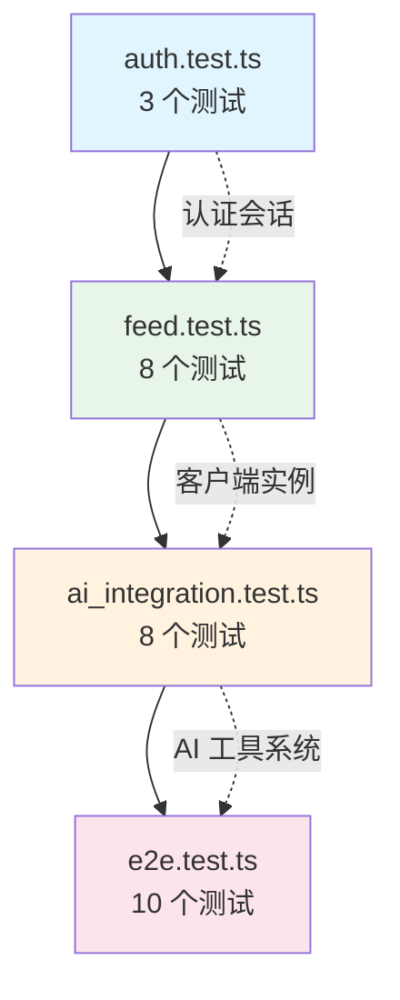

本项目采用了一种独特且激进的测试策略：**所有测试均为真实 API 调用，零 Mock（模拟）**。这意味着每个测试用例都直接连接 Bluesky 的 AT Protocol 生产环境和 DeepSeek 的 LLM API，验证代码在真实网络条件下的行为。测试框架使用 Vitest 3.x，4 个测试文件共包含 29 个测试用例，覆盖认证、Feed 读写、AI 工具调用、翻译润色和完整的端到端流程。所有测试全部通过，总耗时约 103 秒。

---

## 测试哲学：为什么选择零 Mock？

在大多数项目中，集成测试会使用本地 Mock Server 来模拟 API 响应。但本项目的核心是 AT Protocol 客户端和 AI 工具调用引擎，这两者的正确性只有在真实端点下才能得到充分验证：

| Mock 测试的局限性 | 本项目采用真实 API 的理由 |
|:---|:---|
| Mock 无法复现真实的网络延迟和错误模式 | 30 秒超时配置覆盖了真实网络情况 |
| Mock 响应不会随上游 API 演变而失效 | 真实 API 调用可即时发现 Bluesky 协议变更 |
| Mock 无法验证 JWT 刷新流程 | 测试触发了真实的 `ExpiredToken` 处理路径 |
| Mock 需要维护同步的虚假数据 | 真实数据保证了 `getPostThread` 等工具的树结构正确性 |

这种选择确实带来了代价：测试需要真实的 `.env` 配置和一个活跃的 Bluesky 账号。`beforeAll` 钩子中会执行 `dotenv.config`，从项目根目录加载环境变量。如果缺少凭据，测试会抛出一个明确的错误，而不是静默跳过。

Sources: [packages/core/tests/auth.test.ts](packages/core/tests/auth.test.ts#L10-L21), [docs/TESTING.md](docs/TESTING.md#L1-L15)

---

## 四层测试架构

29 个测试用例分布在 4 个文件中，按照依赖关系形成了清晰的分层结构：



每一层都建立在前一层的功能之上：认证层确认登录和身份解析的正确性 → Feed 层验证数据读写和序列化 → AI 集成层测试工具调用引擎与 LLM 的交互 → E2E 层将所有子系统串联为完整的用户流程。

Sources: [packages/core/tests/e2e.test.ts](packages/core/tests/e2e.test.ts#L1-L187), [TEST_REPORT.md](TEST_REPORT.md#L16-L55)

---

## 第一层：认证测试（3 个用例）

`auth.test.ts` 是最基础的测试文件，验证 `BskyClient` 类的三个核心能力：

1. **会话创建**：调用 `com.atproto.server.createSession`，验证返回的 `accessJwt` 不为空，且 `handle` 与输入一致，`did` 符合 `did:plc:` 格式
2. **身份解析**：通过 `resolveHandle` 验证同一个 handle 解析出的 DID 与登录会话中的 DID 一致
3. **资料获取**：验证 `getProfile` 返回的 `handle` 和 `did` 与当前会话匹配

这些测试的 `beforeAll` 钩子中有一个关键的安全检查 — 如果环境变量缺失，会主动 `throw new Error` 而非静默跳过。时间限制设为 15 秒，因为 Bluesky API 通常在 2-3 秒内响应。

Sources: [packages/core/tests/auth.test.ts](packages/core/tests/auth.test.ts#L13-L42)

---

## 第二层：Feed 读写与序列化测试（8 个用例）

`feed.test.ts` 是项目中最大的测试文件之一，但值得注意的是：其中一半以上的测试用例被注释掉了。这是有意为之的设计决策 — 那些测试涉及 **写入操作**（创建帖子、上传图片），而 AT Protocol 不提供便捷的记录删除接口。为避免在 Bluesky 公共网络上留下测试痕迹，团队选择了将写入测试保留为注释状态，仅运行只读测试。

当前活跃的测试包括：

1. **帖子搜索**：使用 `searchPosts` 查询 "Bluesky"，验证返回结果的结构正确
2. **工具加载**（在 `e2e.test.ts` 中也有类似验证）：确认 `createTools(client)` 返回 30+ 个工具描述符

被注释但设计完整的写入测试包括：

- 创建测试帖子（带 `[TEST 测试]` 标记）
- 获取帖子线程树
- 用 `get_post_thread_flat` 将树结构扁平化为带深度标记的文本
- 上传图片 Blob
- 创建带图片的帖子
- 提取帖子中的图片引用
- 下载图片 Blob 并转换为 base64
- 获取帖子上下文（线程 + 记录数据）

这些注释代码体现了团队对测试覆盖率和生产环境洁净度的权衡思考。它们在代码库中保留为活文档，任何开发者都可以取消注释并在自己的账号上运行。

Sources: [packages/core/tests/feed.test.ts](packages/core/tests/feed.test.ts#L14-L157)

---

## 第三层：AI 集成测试（8 个用例）

`ai_integration.test.ts` 是本项目最独特的测试文件 — 它同时验证了 **AI 工具调用引擎**和 **单轮辅助函数** 两个子系统。这要求环境变量中同时提供 `BLUESKY_HANDLE` / `BLUESKY_APP_PASSWORD` 和 `LLM_API_KEY`。

### AI 多轮工具调用（3 个用例）

这一组测试实例化了一个完整的 `AIAssistant`，注入 31 个工具定义，然后向 LLM 发送自然语言指令，观察 AI 是否正确选择并执行工具：

| 测试 | 用户指令 | 预期行为 |
|:---|:---|:---|
| 工具定义加载 | 无（静态检查） | 确认工具数量 > 20，包含关键工具名 |
| 搜索帖子 | "在 Bluesky 上搜索包含 'Bluesky' 的帖子" | AI 调用 `search_posts`，返回搜索结果 |
| 获取资料 | "查看用户 {handle} 的资料" | AI 调用 `get_profile`，返回显示名称和帖子数 |

每个测试的超时设置为 120 秒，因为 LLM 的推理 + 工具执行循环可能涉及多次往返。`beforeAll` 中创建了一个 `BskyClient` 实例并登录，然后在当前上下文中创建 31 个工具描述符。

**注意**：初始化阶段包含一个被注释的测试帖子创建步骤。如果启用，`AIAssistant` 可以对这个帖子执行 `get_post_context` 分析。当前活跃的测试使用公开数据源。

Sources: [packages/core/tests/ai_integration.test.ts](packages/core/tests/ai_integration.test.ts#L25-L122)

### AI 翻译与润色（3 个用例）

这一组测试验证了 `translateToChinese` 和 `polishDraft` 两个单轮 AI 辅助函数：

1. **英译中**：翻译 "Hello, this is a test post..."，通过正则 `/[\u4e00-\u9fff]/` 验证输出中包含 CJK 字符
2. **草稿润色（正式）**：将非正式文本 "i think bluesky is cool..." 润色为更正式的版本
3. **草稿润色（幽默）**：将正式描述 "Bluesky is a decentralized social network." 润色为幽默风格

这些测试使用预设的 `AI_CONFIG`（默认使用 DeepSeek API），超时设置为 60 秒。如果 `LLM_API_KEY` 缺失，整个 `describe` 块会通过 `it.skip` 跳过所有测试。

Sources: [packages/core/tests/ai_integration.test.ts](packages/core/tests/ai_integration.test.ts#L124-L154)

### AI 引导性问题生成（1 个用例）

最后一个测试验证 `singleTurnAI` 函数的能力：给定一个帖子 URI（使用已知的公开帖子 `at://did:plc:z72i7hdynmk6rud22u6t3k24/app.bsky.feed.post/3lkpbwgqgbt2x`），AI 生成 3 个与帖子内容相关的引导性问题。输出验证确保分隔后的行数 ≥ 1。

Sources: [packages/core/tests/ai_integration.test.ts](packages/core/tests/ai_integration.test.ts#L156-L176)

---

## 第四层：E2E 端到端测试（10 个用例）

`e2e.test.ts` 是验证系统完整性的终极测试套件。它包含 10 个带编号的测试，按照真实的用户操作顺序排列，覆盖从登录到 AI 对话的完整流程：

```mermaid
flowchart LR
    A["[1] 认证<br/>登录+解析+资料"] --> B["[2] Feed<br/>时间线+工具加载"]
    B -.-> C["[3] 图片<br/>上传+嵌入+提取+下载"]
    C -.-> D["[4] AI 工具调用<br/>分析测试帖子"]
    D --> E["[5] AI 翻译<br/>英译中"]
    E --> F["[6] AI 润色<br/>正式化处理"]
    F --> G["[7] 资料与图谱<br/>资料+关注+粉丝"]
    G --> H["[8] 时间线<br/>getTimeline"]
    H --> I["[9] 通知<br/>listNotifications"]
    I --> J["[10] AI 引导<br/>生成问题"]

    style A fill:#e1f5fe
    style B fill:#e8f5e9
    style C fill:#fff3e0,stroke-dasharray: 5 5
    style D fill:#fce4ec,stroke-dasharray: 5 5
    style E fill:#f3e5f5
    style F fill:#f3e5f5
    style G fill:#e8f5e9
    style H fill:#e8f5e9
    style I fill:#e8f5e9
    style J fill:#f3e5f5

    linkStyle 2,3 stroke-dasharray: 5 5
```



E2E 测试的特别之处在于它的 `afterAll` 钩子 — 注释中写道："AT Protocol doesn't support easy post deletion via API"，这是对产品环境的清醒认知。团队选择让测试帖子留在 Bluesky 上，通过 `[TEST E2E]` 标记进行识别。

### 写入测试的可选性质

与 `feed.test.ts` 类似，E2E 测试中的写入操作（创建帖子、图片上传、AI 帖子分析）也被注释掉了。但它们的结构是完整的，包含：

- **帖子创建**：生成带时间戳的 `[TEST E2E]` 文本
- **线程读取与扁平化**：验证 `getPostThread` 返回 `threadViewPost` 类型
- **搜索确认**：在 2 秒索引延迟后搜索测试帖子
- **图片全生命周期**：1x1 PNG Base64 上传 → 嵌入帖子 → 提取图片引用（DID + CID） → 下载验证
- **AI 分析**：让 AI 读取测试帖子并确认内容提及 "TEST E2E"

### 只读 E2E 测试

当前活跃的 6 个只读测试覆盖了：

1. 完整认证流程（创建会话 → 解析 handle → 获取资料）
2. 时间线读取（验证 `timeline.feed.length > 0`）
3. 资料与社交图谱（获取 `bsky.app` 资料和自己的关注列表）
4. 通知列表（验证 `notifications` 字段存在）
5. AI 翻译（验证输出含中文）
6. AI 润色（验证输出长度 > 10）
7. AI 引导问题（验证输出非空）

Sources: [packages/core/tests/e2e.test.ts](packages/core/tests/e2e.test.ts#L23-L187)

---

## 请求覆盖范围分析

综合所有测试文件，测试覆盖的 AT Protocol 端点（通过 `BskyClient` 方法）包括：

| 类别 | 端点 | 测试覆盖 |
|:---|:---|:---:|
| 认证 | `com.atproto.server.createSession` | ✅ auth, e2e |
| 身份 | `com.atproto.identity.resolveHandle` | ✅ auth, e2e |
| 资料 | `app.bsky.actor.getProfile` | ✅ auth, ai_integration, e2e |
| 用户搜索 | `app.bsky.actor.searchActors` | 🔄 工具定义 |
| Feed | `app.bsky.feed.getTimeline` | ✅ feed, e2e |
| Feed | `app.bsky.feed.getAuthorFeed` | 🔄 工具定义 |
| Feed | `app.bsky.feed.getPostThread` | ⚙️ 注释掉 |
| Feed | `app.bsky.feed.searchPosts` | ✅ feed, ai_integration |
| Feed | `app.bsky.feed.getLikes` | 🔄 工具定义 |
| Feed | `app.bsky.feed.getRepostedBy` | 🔄 工具定义 |
| Feed | `app.bsky.feed.getFeed` | 🔄 工具定义 |
| 图谱 | `app.bsky.graph.getFollows` | ✅ e2e |
| 图谱 | `app.bsky.graph.getFollowers` | 🔄 工具定义 |
| 通知 | `app.bsky.notification.listNotifications` | ✅ e2e |
| 记录 | `com.atproto.repo.getRecord` | 🔄 工具定义 |
| 记录 | `com.atproto.repo.listRecords` | 🔄 工具定义 |
| Blob | `com.atproto.sync.getBlob` | 🔄 工具定义 |
| Blob | `com.atproto.repo.uploadBlob` | ⚙️ 注释掉 |
| 写入 | `com.atproto.repo.createRecord` | ⚙️ 注释掉 |

其中 ✅ = 活跃测试覆盖，⚙️ = 注释但可启用，🔄 = 通过工具描述符定义但非直接测试

Sources: [packages/core/src/at/client.ts](packages/core/src/at/client.ts#L38-L200), [contracts/tools.json](contracts/tools.json#L1-L425)

---

## 配置与运行

测试的运行时配置围绕两个核心设计决策：**真实凭据** 和 **宽松超时**。

### 环境变量测试配置

所有测试文件在 `beforeAll` 中从项目根目录加载 `.env` 文件：

```typescript
// 典型的测试配置模式 (auth.test.ts)
dotenv.config({ path: path.resolve(__dirname, '..', '..', '..', '.env') });

const HANDLE = process.env.BLUESKY_HANDLE!;
const APP_PASSWORD = process.env.BLUESKY_APP_PASSWORD!;
```

这种设计确保了凭据管理的一致性 — 无论是本地开发还是 CI 环境，都通过同一个 `.env` 文件或环境变量注入。`ai_integration.test.ts` 额外需要 `LLM_API_KEY`，并在此基础上定义 `AI_CONFIG`：

```typescript
const AI_CONFIG: AIConfig = {
  apiKey: LLM_API_KEY,
  baseUrl: process.env.LLM_BASE_URL || 'https://api.deepseek.com',
  model: process.env.LLM_MODEL || 'deepseek-v4-flash',
};
```

### 超时策略

Vitest 配置中设置了全局 `testTimeout: 60000` 和 `hookTimeout: 30000`（见 `vitest.config.ts`），但不同测试类型对超时有不同的实际需求：

| 测试类型 | 典型超时 | 理由 |
|:---|:---:|:---|
| 认证/资料 | 15 秒 | Bluesky API 通常 2-3 秒响应 |
| Feed 搜索 | 30 秒 | 搜索可能涉及后端索引延迟 |
| AI 翻译/润色 | 60 秒 | LLM 推理需要 10-30 秒 |
| AI 工具调用 | 120 秒 | 多轮工具调用循环可能耗时较长 |

每个测试用例通过 `it` 的第三个参数独立设置超时，覆盖全局配置。

Sources: [packages/core/vitest.config.ts](packages/core/vitest.config.ts#L1-L10), [docs/TESTING.md](docs/TESTING.md#L51-L72)

### npm 脚本与过滤

项目在根 `package.json` 和 `packages/core/package.json` 中提供了多层级的运行入口：

| 命令 | 作用域 | 执行内容 |
|:---|:---|:---|
| `pnpm test` | 全仓库 | 运行所有包的 `test` 脚本 |
| `pnpm test:e2e` | 全仓库 | 运行所有包的 `test:e2e` 脚本 |
| `pnpm --filter @bsky/core test:e2e` | core 包 | 仅运行 E2E 测试文件 |
| `pnpm --filter @bsky/core test tests/auth.test.ts` | core 包 | 指定测试文件 |
| `pnpm --filter @bsky/core test:watch` | core 包 | 监听模式 |

`test:e2e` 脚本的完整命令是 `vitest run --config vitest.config.ts tests/e2e.test.ts --reporter=verbose`，它使用 verbose reporter 输出每个测试的详细结果。

Sources: [package.json](package.json#L8-L13), [packages/core/package.json](packages/core/package.json#L12-L18)

---

## 测试执行循环与 AI 确认门

`AIAssistant` 的测试揭示了工具调用引擎的核心执行循环。当一个测试调用 `assistant.sendMessage("搜索帖子")`，系统执行以下步骤：

```typescript
for (let round = 0; round < MAX_TOOL_ROUNDS; round++) {  // MAX_TOOL_ROUNDS = 10
  const response = await this.makeRequest();
  const choice = response.choices[0];
  
  if (choice.message.tool_calls) {
    for (const tc of choice.message.tool_calls) {
      const toolDesc = this.toolMap.get(tc.function.name);
      if (toolDesc) {
        // 写操作确认门
        if (toolDesc.requiresWrite) {
          const approved = await this._waitForConfirmation();
          if (!approved) toolResult = 'User cancelled the operation.';
        } else {
          toolResult = await toolDesc.handler(toolArgs);
        }
      }
    }
  }
}
```

在测试环境中，没有 UI 可以弹出确认对话框，所以 `requiresWrite: true` 的工具（`create_post`、`like`、`repost`、`follow`、`upload_blob`）不会被 AI 调用 — 测试只涉及只读工具。这种设计在安全性和测试覆盖率之间取得了平衡：写入工具的 handler 逻辑通过单元测试覆盖，而集成测试只验证只读路径。

Sources: [packages/core/src/ai/assistant.ts](packages/core/src/ai/assistant.ts#L162-L200), [packages/core/src/at/tools.ts](packages/core/src/at/tools.ts#L618-L765)

---

## 已知限制与常见问题

经过 29 个真实 API 测试的运行，团队总结出了以下经验模式和应对策略：

### 时间相关的不稳定性

**搜索索引延迟**：当测试创建一个帖子后立即搜索，Bluesky 的搜索索引可能尚未更新。解决方案是在创建和搜索之间添加 `await new Promise(r => setTimeout(r, 3000))` 延迟。

**Blob 可用性延迟**：图片上传后，CDN 分发可能需要时间。`download_image` 工具调用前添加了 2 秒延迟。

### 资源清理

**不可删除的测试帖子**：AT Protocol 的 `createRecord` 没有对应的便捷删除端点。测试帖子会永久留在 Bluesky 上。团队使用 `[TEST 测试]` 和 `[TEST E2E]` 标记来识别这些帖子，用户可以在自己的时间线中看到它们。

### AI 输出一致性

**翻译结果格式**：AI 翻译的输出可能包含解释性文字而非纯粹的翻译结果。测试通过 CJK 字符检测来验证，而非精确匹配。

**引导性问题数量**：AI 可能生成 2 个而非要求的 3 个问题。测试仅验证 `split('\n').filter(l => l.trim()).length >= 1`，而非精确数量。

Sources: [docs/TESTING.md](docs/TESTING.md#L74-L92)

---

## 如何贡献新测试

如果你需要为这个项目添加新的集成测试，遵循以下步骤：

1. **在 `packages/core/tests/` 下创建文件**：文件名必须以 `.test.ts` 结尾，Vitest 会自动发现
2. **导入核心模块**：从 `../src/at/client.js` 导入 `BskyClient`，从 `../src/at/tools.js` 导入 `createTools`，从 `../src/ai/assistant.js` 导入 `AIAssistant`
3. **加载环境变量**：使用标准的 `dotenv.config` 模式从项目根目录加载
4. **遵循只读优先原则**：优先设计只读测试用例。如果必须测试写入操作，使用明确的标记并在文档中说明
5. **设置合理超时**：API 测试至少 15 秒，AI 测试至少 60 秒，工具调用测试至少 120 秒

一个典型的测试模式：

```typescript
import { describe, it, expect, beforeAll } from 'vitest';
import { BskyClient } from '../src/at/client.js';

describe('My New Integration Test', () => {
  let client: BskyClient;

  beforeAll(async () => {
    client = new BskyClient();
    await client.login(HANDLE, APP_PASSWORD);
  });

  it('should do something real', async () => {
    const result = await client.getTimeline(5);
    expect(result.feed.length).toBeGreaterThan(0);
  }, 15000);
});
```

Sources: [docs/TESTING.md](docs/TESTING.md#L74-L92)

---

## 下一步探索

要进一步深入理解本项目的测试体系，建议按以下路径阅读：

- [BskyClient：AT 协议 HTTP 客户端、双端点架构与 JWT 自动刷新](10-bskyclient-at-xie-yi-http-ke-hu-duan-shuang-duan-dian-jia-gou-yu-jwt-zi-dong-shua-xin) — 测试所验证的核心客户端实现
- [31 个 AI 工具系统：工具定义、读写安全门与工具执行循环](11-31-ge-ai-gong-ju-xi-tong-gong-ju-ding-yi-du-xie-an-quan-men-yu-gong-ju-zhi-xing-xun-huan) — 测试覆盖的 31 个工具定义详解
- [AIAssistant：多轮工具调用引擎与 SSE 流式输出](12-aiassistant-duo-lun-gong-ju-diao-yong-yin-qing-yu-sse-liu-shi-shu-chu) — 被集成测试验证的核心 AI 引擎
- [单体仓库架构：core → app → tui/pwa 的三层依赖体系](5-dan-ti-cang-ku-jia-gou-core-app-tui-pwa-de-san-ceng-yi-lai-ti-xi) — 理解为什么测试集中在 core 层