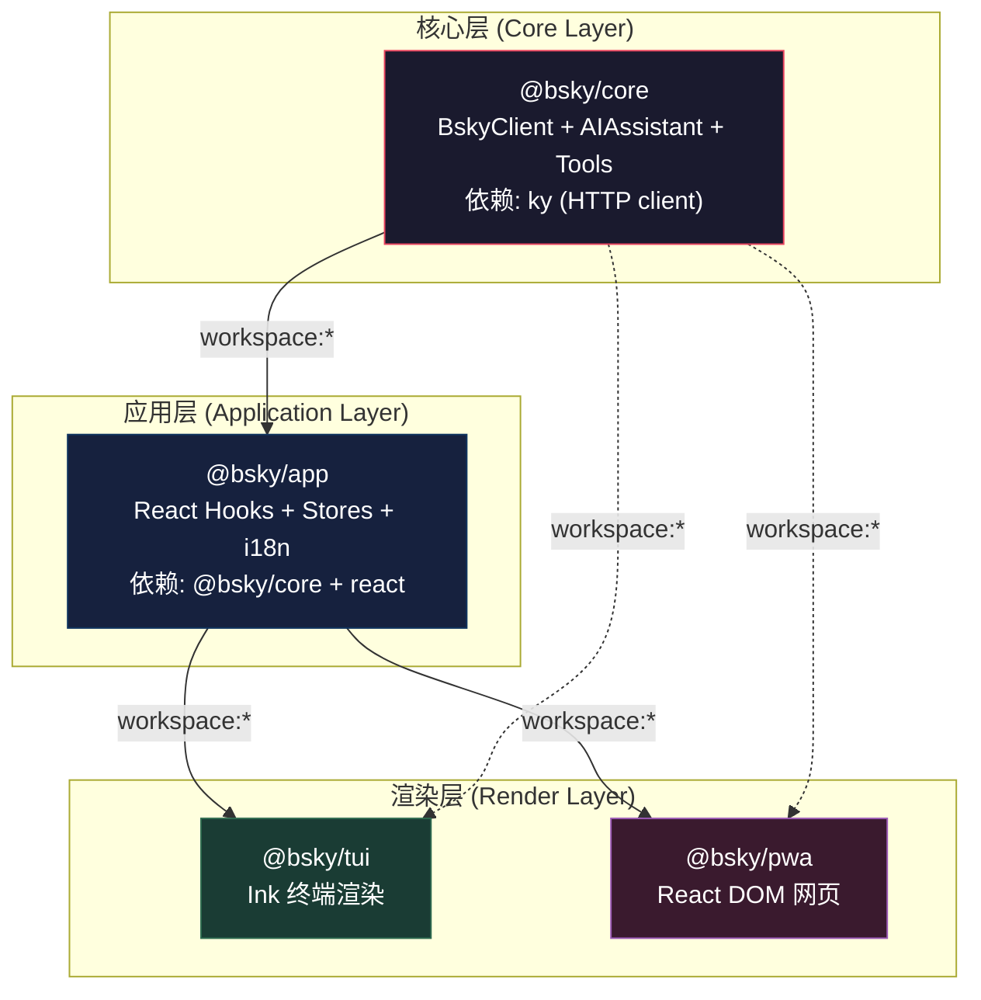
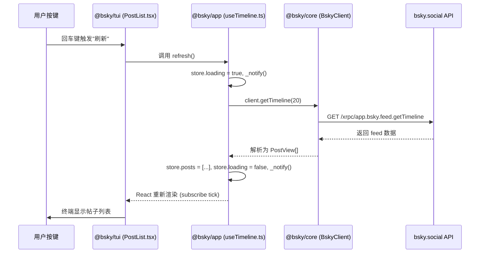

## 架构概览：为何是三层？

这个项目的核心设计决策是将业务逻辑、UI 无关的"引擎层"与 UI 框架彻底分离。Bluesky 客户端天然需要同时运行在终端（TUI）和浏览器（PWA）两个完全不同的渲染环境中——Ink 的虚拟 DOM 与 React DOM 的差异巨大，不可能共用任何 UI 组件。但如果把 AT 协议客户端、AI 工具系统、状态管理逻辑也分别复制两份，就会出现代码腐烂的典型症状：修复一个 bug 要改两个地方，新功能开发速度减半。

解决方案就是 `core → app → tui/pwa` 这层依赖金字塔。三层架构保证了 UI 无关的逻辑只写一次，React 钩子层只写一次，终端和浏览器只需要实现各自的渲染组件即可。Sources: [package.json](package.json#L1-L20), [pnpm-workspace.yaml](pnpm-workspace.yaml#L1-L4)



依赖传递的精确规则：**tui 和 pwa 都直接依赖 `@bsky/app` 和 `@bsky/core`**，但绝大多数情况下它们只通过 `@bsky/app` 的导出使用 core 的类型。core 的类型（如 `PostView`、`AIConfig`）在 app 的钩子签名中以参数或返回值的形式出现，所以渲染层需要直接安装 `@bsky/core` 才能获得这些类型的编译时引用。Sources: [tui/package.json](packages/tui/package.json#L1-L39), [pwa/package.json](packages/pwa/package.json#L1-L34), [app/package.json](packages/app/package.json#L1-L30), [core/package.json](packages/core/package.json#L1-L32)

---

## 第一层：@bsky/core — 纯净引擎层

core 是整个项目的基石，**零 UI 依赖**——它的 `package.json` 中没有任何 `react`、`ink` 或 DOM 相关的包。唯一的运行时依赖是 `ky`（轻量 HTTP 客户端）和 `dotenv`（环境变量加载）。Sources: [core/package.json](packages/core/package.json#L1-L32)

### core 的职责边界

| 模块 | 文件 | 职责 |
|------|------|------|
| `BskyClient` | `src/at/client.ts` | AT 协议 HTTP 客户端，双端点架构（PDS + 公共 API），JWT 自动刷新 |
| `createTools` | `src/at/tools.ts` | 31 个 AI 工具定义，读写安全门分类（`requiresWrite: boolean`），MCP 格式的 handler 注册 |
| `AIAssistant` | `src/ai/assistant.ts` | 多轮工具调用引擎，SSE 流式输出，消息队列管理 |
| `translateText` / `singleTurnAI` | `src/ai/assistant.ts` | 单轮对话辅助函数：翻译（simple/json 双模式）、润色草稿、单次推理 |
| AT Protocol 类型 | `src/at/types.ts` | `PostView`、`ProfileView`、`ThreadViewPost`、`CreateSessionResponse` 等 30+ 接口 |

Sources: [core/src/index.ts](packages/core/src/index.ts#L1-L25), [core/src/at/client.ts](packages/core/src/at/client.ts#L1-L385), [core/src/at/tools.ts](packages/core/src/at/tools.ts#L1-L80), [core/src/ai/assistant.ts](packages/core/src/ai/assistant.ts#L1-L695)

### 为何 core 不依赖 React？

这是一个刻意的架构决策。`AIAssistant` 的多轮工具调用引擎在 `core/ai/assistant.ts` 中实现，它只操作 `ChatMessage[]` 数组和 `fetch` API，完全不知道 React 的 `useState` 或 `useEffect` 的存在。这样做的直接好处是：**测试不需要 JSDOM 或 React Testing Library**。core 的集成测试直接调用 `AIAssistant.chat()` 并断言返回值，启动快、稳定性高。Sources: [core/tests/ai_integration.test.ts](packages/core/tests), [core/vitest.config.ts](packages/core/vitest.config.ts)

---

## 第二层：@bsky/app — React 应用层

app 是连接核心引擎和 UI 渲染的桥梁层。它引入 `react` 作为依赖，提供一整套 **React 钩子（hooks）** 和 **监听器模式的状态存储（stores）**。Sources: [app/package.json](packages/app/package.json#L1-L30)

### app 的两大子系统

#### 1. 状态管理层 — Stores + State

app 实现了一种**单向监听器 Store 模式**：每个 store 是一个纯对象，包含数据字段和修改方法，通过 `subscribe(fn)` / `_notify()` 模式通知 React 重新渲染。这与 Redux 或 Zustand 不同——没有不可变更新要求，没有选择器，只有最简的发布-订阅。

```typescript
// 典型模式：createXxxStore + useXxx 钩子
// stores/auth.ts — 认证状态
export function createAuthStore(): AuthStore { ... }

// hooks/useAuth.ts — React 桥接
export function useAuth() {
  const [store] = useState(() => createAuthStore());
  const [, force] = useState(0);
  const tick = useCallback(() => force(n => n + 1), []);
  useEffect(() => store.subscribe(tick), [store, tick]);
  return { client: store.client, session: store.session, ... };
}
```

Sources: [app/src/stores/auth.ts](packages/app/src/stores/auth.ts#L1-L70), [app/src/hooks/useAuth.ts](packages/app/src/hooks/useAuth.ts#L1-L23), [app/src/stores/timeline.ts](packages/app/src/stores/timeline.ts#L1-L75), [app/src/stores/postDetail.ts](packages/app/src/stores/postDetail.ts#L1-L128)

`navigation.ts` 实现了一个基于栈的路由控制器 `createNavigation()`，管理 `AppView` 联合类型的 push/pop。TUI 直接使用这个栈式导航；PWA 则用 `useHashRouter` 将 hash 路由映射到相同的 `AppView` 类型上，保持视图状态的一致性。Sources: [app/src/state/navigation.ts](packages/app/src/state/navigation.ts#L1-L66), [pwa/src/hooks/useHashRouter.ts](packages/pwa/src/hooks/useHashRouter.ts#L1-L137)

#### 2. React Hooks API 清单

所有钩子都遵循相同的签名模式：接收 `BskyClient` 或其他依赖作为参数，返回响应式数据和方法对象。

| 钩子 | 文件 | 核心职责 |
|------|------|---------|
| `useAuth` | `hooks/useAuth.ts` | 登录/恢复会话、暴露 `client` / `session` / `profile` |
| `useTimeline` | `hooks/useTimeline.ts` | 首页时间线加载、分页、刷新 |
| `useThread` | `hooks/useThread.ts` | 帖子讨论串获取、扁平化为 `FlatLine[]` |
| `usePostDetail` | `hooks/usePostDetail.ts` | 帖子详情 + 翻译缓存 + 操作集合（点赞/转发/回复） |
| `useCompose` | `hooks/useCompose.ts` | 发帖编辑器状态（文本/图片/引用） |
| `useDrafts` | `hooks/useDrafts.ts` | 草稿持久化存储 |
| `useAIChat` | `hooks/useAIChat.ts` | AI 对话引擎集成：流式渲染、写操作确认、撤销/重试 |
| `useChatHistory` | `hooks/useChatHistory.ts` | 聊天历史列表管理 |
| `useTranslation` | `hooks/useTranslation.ts` | 翻译功能（带缓存），延迟导入 `@bsky/core` 的 `translateText` |
| `useProfile` | `hooks/useProfile.ts` | 用户主页 + 关注列表 |
| `useSearch` | `hooks/useSearch.ts` | 搜索帖子/用户 |
| `useNotifications` | `hooks/useNotifications.ts` | 通知列表 + 未读计数 |
| `useBookmarks` | `hooks/useBookmarks.ts` | 书签列表 |
| `useNavigation` | `hooks/useNavigation.ts` | 栈式导航控制器的 React 封装 |
| `useI18n` | `i18n/useI18n.ts` | 国际化（zh/en/ja），单例 Store + 即时切换 |

Sources: [app/src/index.ts](packages/app/src/index.ts#L1-L31), [app/src/hooks/useAIChat.ts](packages/app/src/hooks/useAIChat.ts#L1-L348), [app/src/hooks/useTimeline.ts](packages/app/src/hooks/useTimeline.ts#L1-L30), [app/src/hooks/useTranslation.ts](packages/app/src/hooks/useTranslation.ts#L1-L48)

### ChatStorage 抽象与双实现

app 层定义了 `ChatStorage` 接口和 `FileChatStorage`（基于 Node.js fs 模块）。PWA 无法使用 fs，所以通过 `stubs` 目录提供了空实现的 fs/os/path 垫片，同时用 `IndexedDBChatStorage` 实现了同一接口。这是"依赖倒置原则"的实战案例——高层（app）定义抽象，低层（tui/pwa）各自实现。Sources: [app/src/services/chatStorage.ts](packages/app/src/services/chatStorage.ts#L1-L89), [pwa/src/services/indexeddb-chat-storage.ts](packages/pwa/src/services/indexeddb-chat-storage.ts#L1-L77), [pwa/src/stubs/fs.ts](packages/pwa/src/stubs/fs.ts#L1-L8), [pwa/src/stubs/os.ts](packages/pwa/src/stubs/os.ts#L1-L3)

---

## 第三层：tui / pwa — 双渲染实现

### @bsky/tui — 终端客户端

基于 **Ink**（React 终端渲染框架），TUI 的组件树直接从 `@bsky/app` 导入钩子，将数据渲染为终端文本组件。

```
cli.ts → App.tsx → Sidebar / PostList / ProfileView / AIChatView / ...
                    ↓
              useAuth / useTimeline / useNavigation / ... (from @bsky/app)
                    ↓
              BskyClient / AIAssistant / ... (from @bsky/core)
```

TUI 特有的工具链：
- `utils/markdown.tsx` — 自研 Ink 兼容的 Markdown 渲染器（零外部依赖）
- `utils/text.ts` — CJK 感知的 `visualWidth` / `wrapLines` 文字换行
- `utils/mouse.ts` — 终端鼠标事件追踪
- 键盘快捷键系统 — 5 个 `useInput` 处理器 + 全局保留键规则

Sources: [tui/src/components/App.tsx](packages/tui/src/components/App.tsx#L1-L60), [tui/src/cli.ts](packages/tui/src/cli.ts), [tui/package.json](packages/tui/package.json#L1-L39)

### @bsky/pwa — 浏览器客户端

基于 **Vite + React DOM + Tailwind CSS**，PWA 的组件树同样从 `@bsky/app` 导入钩子，但用 Web 组件替代终端组件。

```
index.html → main.tsx → App.tsx → Layout / FeedTimeline / ThreadView / AIChatPage / ...
                    ↓
              useAuth / useTimeline / useNavigation / ... (from @bsky/app)
                    ↓
              BskyClient / AIAssistant / ... (from @bsky/core)
```

PWA 特有的工具链：
- `hooks/useHashRouter.ts` — 将 `AppView` 联合类型映射到 URL hash 路由
- `services/indexeddb-chat-storage.ts` — IndexedDB 实现的 ChatStorage
- 离线支持 — Service Worker（`public/sw.js`）+ `manifest.json`
- CSS 层 — Tailwind CSS + 自定义语义色板系统
- 虚拟滚动 — `@tanstack/react-virtual` 优化大列表性能
- Markdown 渲染 — `react-markdown` + `rehype-highlight`（Web 侧用成熟的生态，而非自研）

Sources: [pwa/src/App.tsx](packages/pwa/src/App.tsx#L1-L60), [pwa/vite.config.ts](packages/pwa/vite.config.ts), [pwa/package.json](packages/pwa/package.json#L1-L34)

---

## 跨层数据流：一次完整请求的生命周期

以"用户在终端加载首页时间线"为例，展示三层如何协作：



**关键设计点**：app 层通过 `createTimelineStore()` 内部的 `_notify()` 调用触发 React 重渲染，而不是由 core 层直接触发 UI 更新。这意味着 core 层完全不知道 React 的存在——它的 `BskyClient.getTimeline()` 只是返回一个 Promise。Sources: [app/src/stores/timeline.ts](packages/app/src/stores/timeline.ts#L1-L75), [app/src/hooks/useTimeline.ts](packages/app/src/hooks/useTimeline.ts#L1-L30)

---

## 构建与类型安全体系

### TypeScript Project References

core 和 app 的 `tsconfig.json` 都设置了 `"composite": true`，这意味着它们支持 TypeScript 的项目引用（project references）增量构建。tui 和 pwa 则没有设置 composite——它们是终端产物，不需要被其他包引用。所有包都继承自根目录的 `tsconfig.base.json`，其中定义了 `target: ES2022`、`module: ESNext`、`strict: true` 等共享编译选项。Sources: [tsconfig.base.json](tsconfig.base.json#L1-L21), [core/tsconfig.json](packages/core/tsconfig.json#L1-L14), [app/tsconfig.json](packages/app/tsconfig.json#L1-L14), [tui/tsconfig.json](packages/tui/tsconfig.json#L1-L13)

### pnpm workspace 依赖管理

所有包都用 `"workspace:*"` 协议，确保在 monorepo 内部始终引用本地构建的版本，而不是从 npm registry 拉取。根目录的 `package.json` 提供了统一的 `pnpm -r build / test / typecheck` 脚本，可对所有包批量执行。Sources: [pnpm-workspace.yaml](pnpm-workspace.yaml#L1-L4), [package.json](package.json#L1-L20)

---

## 架构决策记录

| 决策 | 理由 | 代价 |
|------|------|------|
| core 零 UI 依赖 | 测试速度快，可在 Node 24 中直接运行 | tui/pwa 需重复安装 |
| 监听器 Store 模式而非 Redux | 零依赖、类型安全、适合中小规模状态 | 缺少 DevTools、时间旅行调试 |
| app 层统一 Hooks API | TUI/PWA 视图组件可互换，减少认知负担 | PWA 需 stubs 处理 Node API 差异 |
| PWA Hash 路由映射 AppView | 静态部署无需服务端路由配置 | URL 可读性降低，`?uri=at://...` 编码冗长 |
| `ChatStorage` 接口抽象 | 同一业务逻辑在不同环境有不同实现 | 需维护两个实现，接口变更需同步更新 |

---

## 下一步阅读建议

完成本页后，可以根据你的关注点选择以下路径深入：

- 如果你关注**渲染层的差异与迁移**：阅读 `[PWA 迁移指南：从 TUI 到 Web 的渲染层替换策略](6-pwa-qian-yi-zhi-nan-cong-tui-dao-web-de-xuan-ran-ceng-ti-huan-ce-lue)`
- 如果你要理解**导航状态机**的具体实现：阅读 `[导航状态机：基于栈的 AppView 路由与视图切换](7-dao-hang-zhuang-tai-ji-ji-yu-zhan-de-appview-lu-you-yu-shi-tu-qie-huan)`
- 如果你对**AT 协议客户端的双端点架构**感兴趣：阅读 `[BskyClient：AT 协议 HTTP 客户端、双端点架构与 JWT 自动刷新](10-bskyclient-at-xie-yi-http-ke-hu-duan-shuang-duan-dian-jia-gou-yu-jwt-zi-dong-shua-xin)`
- 如果你想了解**30+ 钩子的具体用法**：阅读 `[数据钩子清单：useAuth / useTimeline / useThread / useProfile 等](17-shu-ju-gou-zi-qing-dan-useauth-usetimeline-usethread-useprofile-deng)`