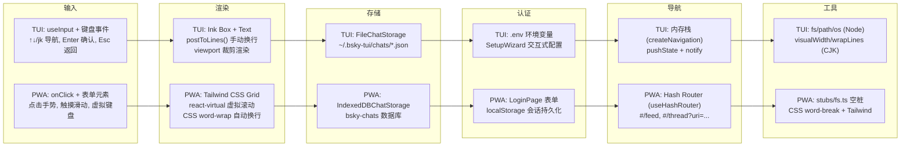

本指南面向中级开发者，详细阐述如何将基于 Ink 终端的 Bluesky 客户端（TUI）迁移至基于 React DOM 的渐进式 Web 应用（PWA）。核心洞察是：**迁移不是重写，而是渲染层的战略性替换**。业务逻辑层（`@bsky/core`）和数据钩子层（`@bsky/app`）被设计为 UI 无关的共享库，PWA 只需实现约 500 行的渲染组件即可完成迁移。

---

## 一、架构基石：三层依赖体系的渲染无关性

### 依赖流向

整个单体仓库遵循自底向上的纯依赖方向：`core` → `app` → `tui`/`pwa`。其中核心层与数据钩子层完全不依赖任何 UI 框架，这是渲染层可替换的根本前提。

```mermaid
flowchart TD
    subgraph Layer0["Layer 0: 零 UI 依赖"]
        CORE["@bsky/core<br/>AT 协议客户端<br/>AI 助手引擎<br/>31 个工具函数<br/>类型定义"]
    end

    subgraph Layer1["Layer 1: UI 无关的业务逻辑"]
        APP["@bsky/app<br/>数据钩子 (Hooks)<br/>导航状态机<br/>国际化系统<br/>ChatStorage 接口"]
    end

    subgraph Layer2_1["Layer 2 (终端): Ink/React"]
        TUI["@bsky/tui<br/>Ink 渲染器<br/>键盘事件系统<br/>终端 Markdown<br/>FileChatStorage"]
    end

    subgraph Layer2_2["Layer 2 (Web): React DOM"]
        PWA["@bsky/pwa<br/>Hash 路由<br/>Tailwind 组件<br/>IndexedDB 存储<br/>Service Worker"]
    end

    CORE -->|"纯 TS 导出"| APP
    APP -->|"共享 hooks"| TUI
    APP -->|"共享 hooks"| PWA
    
    style CORE fill:#1a1a2e,stroke:#00A5E0
    style APP fill:#16213e,stroke:#00A5E0
    style TUI fill:#0f3460,stroke:#e94560
    style PWA fill:#0f3460,stroke:#00FF88
```



`@bsky/core` 层包含 `BskyClient`（AT 协议 HTTP 客户端）、`AIAssistant`（多轮工具调用引擎）以及 31 个 Bluesky 工具函数，所有这些均以纯 TypeScript 编写，**零 React/Node/浏览器依赖**。Source: [ARCHITECTURE.md](docs/ARCHITECTURE.md#L1-L114)

`@bsky/app` 层导出的所有数据钩子 — `useAuth`、`useTimeline`、`useThread`、`usePostDetail`、`useAIChat`、`useTranslation` 等 — 都是标准 React hooks，仅依赖 `react` 包本身，**不依赖 Ink 或 react-dom 的任何特性**。这意味着 TUI 和 PWA 可以同等地调用 `useTimeline(client)` 获取时间线数据，区别仅在于如何渲染数据。Source: [app src index](packages/app/src/index.ts#L1-L31)

---

## 二、渲染层替换图谱

渲染层替换可分解为 6 个正交维度。以下逐维度展开说明。



### 维度一：导航路由 — 内存栈 vs URL Hash

TUI 的导航基于内存中的栈结构。`createNavigation()` 维护一个 `AppView[]` 栈，通过 `goTo`（压栈）、`goBack`（弹栈）、`goHome`（清空并压入 feed）三个操作控制导航状态，通过观察者模式（`subscribe`/`notify`）通知 React 重新渲染。Source: [navigation.ts](packages/app/src/state/navigation.ts#L1-L66)

PWA 的 `useHashRouter` 则基于浏览器原生 `history.pushState` + `popstate` 事件，将导航状态编码为 URL hash：`#/feed`、`#/thread?uri=at://...`、`#/profile?actor=did:plc:...` 等。这种设计有两个关键优势：

1. **静态托管兼容** — 不依赖服务端路由配置，任何静态文件服务器（Cloudflare Pages、Netlify、GitHub Pages）均可零配置部署。
2. **浏览器原生前进/后退** — 用户可以使用浏览器自带的导航按钮，无需 PWA 自己管理浏览历史堆栈。

Hash 路由的编码解析由 `encodeView()` / `parseHash()` 两个纯函数完成，每个 `AppView` 类型对应一组 hash 到 view 的双向映射规则。Source: [useHashRouter.ts](packages/pwa/src/hooks/useHashRouter.ts#L1-L137)

### 维度二：输入事件 — 键盘驱动 vs 多点触达

这是渲染层替换最显著的差异。TUI 是纯键盘驱动的：

| TUI 键盘快捷键 | PWA 等价交互 | 迁移要点 |
|---|---|---|
| `↑↓` / `jk` 在时间线移动焦点 | 鼠标滚轮 / 触摸滑动 | 移除 Ink 的 `useInput`，改用浏览器的滚动事件 |
| `Enter` 查看帖子 | `onClick` 点击帖子卡片 | `PostCard` 添加 `onClick={() => goTo({type:'thread', uri: post.uri})}` |
| `Esc` 返回上级 | 点击「←」返回按钮 | `Layout` 组件渲染 `goBack` 按钮，固定在页面顶栏 |
| `r` 回复 | 点击「💬 回复」按钮 | 每个帖子卡片内渲染操作按钮组 |
| `t` 翻译 | 点击「🌐 翻译」按钮 | 可通过 `useTranslation` 钩子获取翻译结果 |
| `Ctrl+G` 打开 AI 面板 | 点击「🤖 AI 分析」按钮 | 路由跳转至 `aiChat` 视图 |
| `Tab` 切换焦点面板 | 点击不同 UI 区域 | 移除面板焦点概念，Web 默认多区域可操作 |
| `,` 打开设置 | 点击「⚙️」设置按钮 | `SettingsModal` 作为悬浮 modal |

Source: [TUI App.tsx](packages/tui/src/components/App.tsx#L1-L200), [PWA Layout.tsx](packages/pwa/src/components/Layout.tsx#L1-L167)

**迁移核心理念**：TUI 中一个按键事件可能触发的动作（Enter → 查看帖子），在 PWA 中分解为元素的 `onClick` 和视觉反馈（hover 态、cursor:pointer）。PWA 不需要也没有「焦点概念」的等价物，因为 Web 默认允许多个交互点同时可见。

### 维度三：渲染模型 — 手动换行 vs CSS 自动布局

这是技术差异最深的维度。Ink 终端渲染基于字符网格，宽度固定（`stdout.columns`），不支持 CSS。因此 TUI 必须手动计算每个帖子的显示行数：

```typescript
// TUI: 预计算每行的显示文本
export function postToLines(post: PostView, index: number, isSelected: boolean, cols: number, ...): PostLine[] {
  // 作者行: 手动拼接文本
  lines.push({ text: `${name} @${post.author.handle} [${index}]`, isSelected, isName: true });
  // 正文行: CJK 感知换行
  const maxCols = Math.max(20, cols - 4);
  for (const l of wrapLines(text, maxCols)) {
    lines.push({ text: l, isSelected, isName: false });
  }
  // 统计行: 手动格式化
  lines.push({ text: `♥ ${post.likeCount ?? 0} ♺ ${post.repostCount ?? 0} ...`, isSelected, isName: false });
  // 分隔行
  lines.push({ text: '', isSelected: false, isName: false });
  return lines;
}
```

PWA 则利用浏览器的布局引擎：

```tsx
// PWA: CSS 自动布局 + 虚拟滚动
return (
  <div ref={scrollRef} className="flex-1 overflow-y-auto">
    <div style={{ height: `${virtualizer.getTotalSize()}px`, position: 'relative' }}>
      {virtualizer.getVirtualItems().map(virtualItem => (
        <div key={post.uri} style={{ transform: `translateY(${virtualItem.start}px)` }}>
          <PostCard post={post} onClick={() => goTo({ type: 'thread', uri: post.uri })} />
        </div>
      ))}
    </div>
  </div>
);
```

PWA 使用 `@tanstack/react-virtual` 实现虚拟滚动：只在 DOM 中渲染可视区域内的帖子（约 10-15 个），并通过 `IntersectionObserver` 实现自动加载更多（触发条件是加载哨兵元素进入视口）。而 TUI 的 `PostList` 使用另一种逻辑：预计算全部帖子的 PostLine 数组，仅渲染视口高度能容纳的行。Source: [PostItem.tsx](packages/tui/src/components/PostItem.tsx#L1-L99), [FeedTimeline.tsx](packages/pwa/src/components/FeedTimeline.tsx#L1-L189)

**虚拟滚动 vs 终端视口渲染**的本质区别：

| 特性 | TUI (Ink) | PWA (react-virtual) |
|---|---|---|
| 渲染单位 | 文本行（PostLine） | React 组件（PostCard） |
| 溢出处理 | `wrapLines()` 手动断词 | CSS `word-break: break-word` |
| 滚动机制 | ANSI 鼠标追踪 + 键盘 ↑↓ | 浏览器原生滚动 + 触摸 |
| 可见窗口估计 | 每次渲染测量 `stdout.rows` | `estimateSize()` 预估值 ~120px |
| 加载更多 | 滚动到底部时触发 | `IntersectionObserver` 检测哨兵元素 |

### 维度四：认证流程 — 环境变量 vs 用户表单

TUI 的使用流程假设用户会在 `.env` 文件中预先配置 Bluesky 凭证和 AI API 密钥。首次运行时，`SetupWizard` 提供交互式输入界面并写入 `.env` 文件。Source: [cli.ts](packages/tui/src/cli.ts#L1-L128)

PWA 则是纯浏览器端应用，无法访问文件系统，因此认证流程完全不同：

1. **应用启动** → 检查 `localStorage` 中是否存在 `bsky_session` 键
2. **有已保存的会话** → `restoreSession()` 从 localStorage 恢复 `accessJwt` / `refreshJwt`
3. **无会话或令牌过期** → 展示 `LoginPage`，用户输入 Bluesky handle 与 App Password
4. **登录成功** → `saveSession()` 将 JWT 写入 localStorage 用于下次自动登录
5. **会话过期**（长时间休眠后）→ `useSessionPersistence` 检测到授权错误，自动清空会话并要求重新登录

此流程全部由 `useAuth` 钩子 + `useSessionPersistence` 工具函数实现，PWA 无需关心 JWT 刷新细节 — `BskyClient` 的 `ky` HTTP 客户端已通过 `afterResponse` hook 自动处理了令牌过期刷新。Source: [useSessionPersistence.ts](packages/pwa/src/hooks/useSessionPersistence.ts#L1-L27), [App.tsx](packages/pwa/src/App.tsx#L1-L198)

同样地，AI 配置（API Key、模型、基础 URL）和界面偏好（目标语言、翻译模式、暗色模式）也存储在 localStorage 中，通过 `useAppConfig` 读取/写入。Source: [useAppConfig.ts](packages/pwa/src/hooks/useAppConfig.ts#L1-L43)

### 维度五：持久化存储 — JSON 文件 vs IndexedDB

`ChatStorage` 接口定义了聊天历史的通用操作（`saveChat`、`loadChat`、`listChats`、`deleteChat`），两个渲染层各有一套实现：

| 特性 | TUI: FileChatStorage | PWA: IndexedDBChatStorage |
|---|---|---|
| 存储介质 | 文件系统 JSON 文件 | 浏览器 IndexedDB |
| 存储路径 | `~/.bsky-tui/chats/{id}.json` | `bsky-chats` 数据库的 `chats` 对象存储 |
| 文件/记录格式 | 每聊天一个 JSON 文件 | 每聊天一个对象记录（keyPath: id） |
| 初始化时机 | 构造函数中 `mkdirSync` | 首次操作时 `indexedDB.open` |
| 排序方式 | 读取全部文件后按 `updatedAt` 排序 | `getAll()` 后按 `updatedAt` 排序 |
| 错误处理 | try/catch 单个文件读写 | Promise reject → 静默失败 |

Source: [chatStorage.ts](packages/app/src/services/chatStorage.ts#L1-L89), [indexeddb-chat-storage.ts](packages/pwa/src/services/indexeddb-chat-storage.ts#L1-L77)

两种实现均实现了相同的 `ChatStorage` 接口，因此 `useAIChat` 钩子和 `useChatHistory` 钩子无需任何修改即可在两种环境下运行。这是依赖倒置原则（Dependency Inversion Principle）的实践：高层模块（hooks）不依赖低层模块（存储实现），而是依赖抽象接口。

### 维度六：Node 模块桩 — 浏览器兼容的编译技巧

`@bsky/app` 层的 `FileChatStorage` 直接引入了 Node 原生模块（`fs`、`path`、`os`），这在浏览器环境中编译时会报错。PWA 的解决方案是提供空桩（stub）：

```
packages/pwa/src/stubs/
├── fs.ts    # existsSync() → false, readFileSync() → '', writeFileSync() → noop
├── os.ts    # (empty exports)
└── path.ts  # join(...args) → args.join('/')
```

在 `vite.config.ts` 中通过 resolve alias 将 `fs`/`os`/`path` 指向这些空桩，确保编译通过：Source: [vite.config.ts](packages/pwa/vite.config.ts#L1-L24)

```typescript
resolve: {
  alias: {
    os: resolve(__dirname, 'src/stubs/os.ts'),
    fs: resolve(__dirname, 'src/stubs/fs.ts'),
    path: resolve(__dirname, 'src/stubs/path.ts'),
  },
},
```

**核心约束**：PWA 必须**永远不会调用**这些 Node API。`@bsky/app` 中的 `FileChatStorage` 是 TUI 独有的实现，PWA 通过 `IndexedDBChatStorage` 绕过它。stubs 仅用于满足 TypeScript 类型检查和 Vite 的编译需求，运行时不应到达这些函数。

---

## 三、PWA 特有的新增组件

PWA 并非完全复刻 TUI 的功能对应关系。作为浏览器原生应用，PWA 额外实现了以下能力：

### Service Worker 注册

```typescript
// main.tsx — 页面加载后注册 SW
if ('serviceWorker' in navigator) {
  window.addEventListener('load', () => {
    navigator.serviceWorker.register('./sw.js', { scope: './' });
  });
}
```

### 暗色模式切换

通过 Tailwind 的 `darkMode: 'class'` 策略，在 `<html>` 元素上切换 `dark` 类名，配合 CSS 变量自动切换所有颜色：Source: [tailwind.config.ts](packages/pwa/tailwind.config.ts#L1-L31), [index.css](packages/pwa/src/index.css#L1-L121)

```css
:root {
  --color-surface: #F8F9FA;
  --color-text-primary: #0F172A;
}
.dark {
  --color-surface: #121212;
  --color-text-primary: #F1F5F9;
}
```

### 图片网格与灯箱

PWA 的 `PostCard` 实现了完整的图片展示：使用 CSS Grid 呈现 1-4 张图片的布局（1张全宽、2张并排、3张前2并排第3跨列、4张2×2网格），点击任意图片弹出全屏灯箱（通过 `ReactDOM.createPortal` 渲染到 `document.body`）。TUI 受限于终端仅能显示图片 URL（OSC-8 超链接）。Source: [PostCard.tsx](packages/pwa/src/components/PostCard.tsx#L1-L200)

### 响应式三栏布局

PWA 的 `Layout` 组件做了自适应的三栏/两栏/单栏布局：

| 断点 | 左侧栏 | 内容区 | 右侧栏 | 移动端 hamburger |
|---|---|---|---|---|
| `>= lg` (1024px) | 280px Sidebar | 居中 880px | 300px 右侧面板 | 隐藏 |
| `>= md` (768px) | 280px Sidebar | 剩余宽度 | 隐藏 | 隐藏 |
| `< md` (768px) | 隐藏（弹出 overlay） | 全宽 | 隐藏 | 显示 ☰ 按钮 |

Source: [Layout.tsx](packages/pwa/src/components/Layout.tsx#L1-L167)

---

## 四、迁移工作流：从 TUI 到 PWA 的分步指南

```mermaid
flowchart TD
    Step1["Step 1: 理解共享层<br/>阅读 @bsky/app/src/index.ts<br/>掌握 16 个可复用 hooks"]
    Step2["Step 2: 搭建脚手架<br/>pnpm create vite<br/>配置 Tailwind + PostCSS<br/>添加 vite.config stubs"]
    Step3["Step 3: 实现导航系统<br/>复制 useHashRouter.ts<br/>实现 AppView 分支路由"]
    Step4["Step 4: 实现认证页<br/>LoginPage.tsx<br/>useSessionPersistence.ts"]
    Step5["Step 5: 实现渲染组件<br/>按视图类型逐个实现:<br/>FeedTimeline → ThreadView<br/>→ ComposePage → ..."]
    Step6["Step 6: 实现存储层<br/>IndexedDBChatStorage.ts<br/>替换 FileChatStorage"]
    Step7["Step 7: PWA 增强<br/>manifest.json + sw.js<br/>暗色模式 + 响应式"]

    Step1 --> Step2 --> Step3 --> Step4 --> Step5 --> Step6 --> Step7
    
    style Step1 fill:#1a1a2e,stroke:#00A5E0
    style Step5 fill:#0f3460,stroke:#00FF88
    style Step7 fill:#0f3460,stroke:#e94560
```



### 建议的组件实现顺序

考虑到依赖关系和复杂度，建议按以下顺序逐一实现 PWA 组件：

| 优先级 | 组件 | 依赖的 hooks | 复杂度 | 备注 |
|---|---|---|---|---|
| 1 | `LoginPage.tsx` | `useAuth` | ⭐ | 最轻量，无需其他组件 |
| 2 | `Layout.tsx` + `Sidebar.tsx` | `useI18n` | ⭐⭐ | 框架级容器 |
| 3 | `FeedTimeline.tsx` | `useTimeline` | ⭐⭐⭐ | 虚拟滚动 | 
| 4 | `PostCard.tsx` | — | ⭐⭐ | 无状态渲染，可并行开发 |
| 5 | `ThreadView.tsx` | `useThread`, `useTranslation` | ⭐⭐⭐⭐ | 子树展开 + 翻译 |
| 6 | `ComposePage.tsx` | `useCompose`, `useDrafts` | ⭐⭐⭐ | 图片上传 |
| 7 | `ProfilePage.tsx` | `useProfile` | ⭐⭐ | 用户资料 |
| 8 | `SearchPage.tsx` | `useSearch` | ⭐⭐ | 搜索 |
| 9 | `NotifsPage.tsx` | `useNotifications` | ⭐⭐ | 通知列表 |
| 10 | `AIChatPage.tsx` | `useAIChat`, `useChatHistory` | ⭐⭐⭐⭐⭐ | 流式渲染 + 聊天历史 |
| 11 | `BookmarkPage.tsx` | `useBookmarks` | ⭐⭐ | 收藏列表 |
| 12 | `SettingsModal.tsx` | `useI18n`, `useAppConfig` | ⭐⭐ | 配置弹窗 |

每个组件的实现在 `<div>` 内调用对应的 `@bsky/app` 钩子获取数据，然后渲染为 Tailwind 样式的 HTML 元素。以 `FeedTimeline` 为例，它只需要在 `useEffect` 中调用 `loadMore()` 和 `refresh()`，其余状态管理（loading、error、posts 数组）都由 `useTimeline` 钩子处理。

---

## 五、关键架构决策回顾

1. **AppView 类型作为统一的路由契约** — TUI 和 PWA 共享同一组视图类型（feed、thread、compose、profile、aiChat、search 等），只是导航的实现在 TUI 中是内存栈、在 PWA 中是 URL hash。

2. **ChatStorage 接口作为存储抽象** — TUI 的 JSON 文件存储和 PWA 的 IndexedDB 存储共享同一接口，`useAIChat` 和 `useChatHistory` 不依赖具体实现。

3. **写操作确认层** — `useAIChat` 钩子实现了写操作安全门（确认/拒绝/撤销），AI 在执行可能导致数据变更的工具调用前会请求用户确认。这在 TUI 和 PWA 中表现一致，区别仅在于 TUI 使用键盘快捷键确认、PWA 使用按钮点击确认。

4. **国际化不变** — `useI18n` 钩子提供了统一的 `t()` 翻译函数，支持 zh/en/ja 三语言即时切换，TUI 和 PWA 使用相同的语言包。Source: [i18n](packages/app/src/i18n)

5. **Stubs 是编译时的妥协，不是架构特性** — Node 模块桩的存在是为了让 `@bsky/app` 中的 `FileChatStorage` 在浏览器编译时不报错。在架构上正确的做法是：`@bsky/app` 通过依赖注入提供默认实现，PWA 显式传入 `IndexedDBChatStorage`。

---

## 六、部署与验证

PWA 构建产物为纯静态文件，部署到任何静态托管平台（Cloudflare Pages、Netlify、Vercel）均无需后端：

```bash
cd packages/pwa
pnpm build       # → dist/ 目录
```

验证迁移是否成功的检查清单：

- [ ] 所有视图（feed、thread、compose、profile、aiChat、search、bookmarks、notifications）正确渲染数据
- [ ] 虚拟滚动在 100+ 帖子的大时间线中表现流畅
- [ ] 暗色模式切换后所有组件颜色正确
- [ ] 图片灯箱打开/关闭无闪烁
- [ ] 登录→关闭标签页→重新打开→自动恢复会话
- [ ] AI 聊天流式输出逐 token 渲染
- [ ] 聊天历史在 IndexedDB 中的保存和读取
- [ ] 翻译功能（simple/json 双模式）正常工作
- [ ] 帖子点赞/转发/回复的确认和撤销流程
- [ ] 移动端响应式布局（<768px）侧边栏 overlay 正常

---

**延伸阅读**：完成迁移后，建议继续阅读 [Hash 路由系统：useHashRouter 与基于 URL hash 的 SPA 导航](25-hash-lu-you-xi-tong-usehashrouter-yu-ji-yu-url-hash-de-spa-dao-hang) 以深入理解导航实现细节，以及 [PWA 离线支持：Service Worker、manifest.json 与桌面安装](26-pwa-chi-xian-zhi-chi-service-worker-manifest-json-yu-zhuo-mian-an-zhuang) 了解 PWA 原生能力增强。