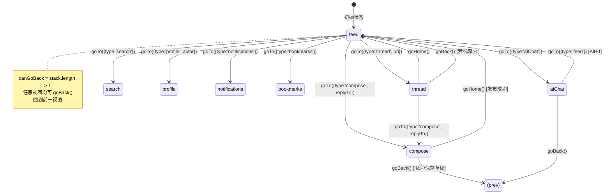

本项目采用一种简洁而统一的导航架构：**基于栈的 AppView 状态机**，配合**单向监听器 Store 模式**，在 TUI（终端）和 PWA（浏览器）两种渲染层之间实现了完全相同的导航语义。TUI 直接消费核心状态机，PWA 则通过 `useHashRouter` 适配层将其映射到浏览器的 URL hash 与 history API，最终暴露与 TUI 完全一致的 `{ currentView, canGoBack, goTo, goBack, goHome }` 接口。核心导航逻辑仅约 66 行代码，却支撑了 9 种视图类型的推入/弹出/跳转。 Sources: [navigation.ts](packages/app/src/state/navigation.ts#L1-L66), [useHashRouter.ts](packages/pwa/src/hooks/useHashRouter.ts#L18-L61)

## AppView：带负载的判别联合类型

整个导航系统的核心数据类型是 `AppView`——一个 TypeScript 判别联合（discriminated union），每个变体代表一种视图，并通过 `type` 字段区分。`feed`、`notifications`、`bookmarks` 三种视图无需额外参数；`thread` 和 `profile` 需要 `uri` 或 `actor` 标识符；`compose` 和 `aiChat` 则携带可选的上下文负载（`replyTo`、`quoteUri`、`contextUri`）。`search` 视图可选地携带 `query` 参数用于预填充搜索框。 Sources: [navigation.ts](packages/app/src/state/navigation.ts#L1-L10)

```typescript
export type AppView =
  | { type: 'feed' }
  | { type: 'detail'; uri: string }
  | { type: 'thread'; uri: string }
  | { type: 'compose'; replyTo?: string; quoteUri?: string }
  | { type: 'profile'; actor: string }
  | { type: 'notifications' }
  | { type: 'search'; query?: string }
  | { type: 'aiChat'; contextUri?: string }
  | { type: 'bookmarks' };
```

这种设计的关键优势在于：**视图切换只需传递一个 AppView 对象**，所有上下文参数（如回复目标 URI、引用的帖子）都嵌入在类型中，由消费方通过 `currentView.type` 分流后解构使用。例如在 TUI 的 App 组件中，`threadUri` 从 `currentView` 中提取的代码是：

```typescript
const threadUri = currentView.type === 'thread' ? (currentView as { uri: string }).uri : undefined;
```

而在 PWA 的 App.tsx 中，`renderView()` 函数通过 `switch (currentView.type)` 分发到不同的页面组件，并将 `uri`、`actor`、`query` 等参数作为 props 传入。 Sources: [App.tsx (TUI)](packages/tui/src/components/App.tsx#L57-L58), [App.tsx (PWA)](packages/pwa/src/App.tsx#L103-L178)

## 栈式状态机：push/pop/reset 三原语

`createNavigation()` 工厂函数实现了最简化的栈式状态机，采用**单向监听器 Store 模式**（与项目内其他 Store 如 auth、timeline 一致）。栈的初始状态为 `[{ type: 'feed' }]`，表示应用启动时默认进入 Feed 视图。 Sources: [navigation.ts](packages/app/src/state/navigation.ts#L21-L63)



**三个操作**构成了完整的导航语义：

- **`goTo(view)`**：将新视图 `push` 到栈顶，`stack = [...stack, view]`。这是一种不可变操作，每次 push 都创建新数组，确保 React 的引用比较能够触发重新渲染。Sources: [navigation.ts](packages/app/src/state/navigation.ts#L45-L48)
- **`goBack()`**：当 `stack.length > 1` 时，`pop` 栈顶元素，`stack = stack.slice(0, -1)`。如果栈中只有 feed（即已在根视图），则不做任何操作。Sources: [navigation.ts](packages/app/src/state/navigation.ts#L50-L55)
- **`goHome()`**：重置栈为 `[{ type: 'feed' }]`，直接回到首页。这在帖子发布成功后使用——`useCompose` 的回调中调用 `goHome()` 以回到 Feed 时间线。Sources: [navigation.ts](packages/app/src/state/navigation.ts#L57-L60), [App.tsx (TUI)](packages/tui/src/components/App.tsx#L61)

`canGoBack` 是一个派生状态：`stack.length > 1`。它同时被 TUI 的指令面板和 PWA 的 Header 用于控制"返回"按钮的显隐。Sources: [navigation.ts](packages/app/src/state/navigation.ts#L28), [Sidebar.tsx (TUI)](packages/tui/src/components/Sidebar.tsx#L84-L86), [Layout.tsx](packages/pwa/src/components/Layout.tsx#L69-L77)

## React 适配层：useNavigation 钩子

`useNavigation()` 钩子将纯状态机桥接到 React 的响应式世界。其实现只有 21 行，遵循固定的三步模式：Sources: [useNavigation.ts](packages/app/src/hooks/useNavigation.ts#L5-L20)

```typescript
export function useNavigation() {
  const [nav] = useState(() => createNavigation());      // 1. 惰性创建 Store 实例
  const [state, setState] = useState(() => nav.getState()); // 2. 从 Store 读取初始状态
  const tick = useCallback(() => setState(nav.getState()), [nav]);
  useEffect(() => nav.subscribe(tick), [nav, tick]);       // 3. 订阅 Store 变更
  return {
    currentView: state.currentView,
    canGoBack: state.canGoBack,
    goTo: (v: AppView) => nav.goTo(v),
    goBack: () => nav.goBack(),
    goHome: () => nav.goHome(),
  };
}
```

这种设计的关键细节在于：**Store 实例用 `useState` 保存一次后永不改变**（`nav` 引用稳定），`tick` 回调通过 `useCallback` 保持稳定引用，`subscribe`/`unsubscribe` 在组件挂载/卸载时只执行一次。每次 `goTo`/`goBack`/`goHome` 调用都会触发 Store 内部的 `notify()`，遍历 `listeners` 数组逐个调用 `tick`，进而 `setState` 更新 React 组件。这是项目内所有单向监听器 Store 的标准使用模式。Sources: [单向监听器 Store 模式](16-dan-xiang-jian-ting-qi-store-mo-shi-chun-dui-xiang-zhuang-tai-guan-li-react-ding-yue)

## PWA 差异：useHashRouter 与 URL hash 同步

PWA 部署在静态托管环境（Cloudflare Pages），无法使用服务端路由。`useHashRouter()` 钩子解决了这一问题——它在核心状态机之上增加了一层 **URL hash ↔ AppView 双向映射**，通过 `window.history.pushState` 和 `popstate` 事件实现浏览器的前进/后退与导航状态同步。Sources: [useHashRouter.ts](packages/pwa/src/hooks/useHashRouter.ts#L1-L17)

**Hash 格式与 AppView 的映射关系**：

| AppView | Hash 格式 | 示例 |
|---------|-----------|------|
| `feed` | `#/feed` | `#/feed` |
| `thread` | `#/thread?uri=at://...` | `#/thread?uri=at%3A%2F%2Fdid%3Aplc%3A...` |
| `profile` | `#/profile?actor=did:plc:...` | `#/profile?actor=did%3Aplc%3Axxx` |
| `compose` | `#/compose[?replyTo=&quoteUri=]` | `#/compose?replyTo=at%3A%2F%2F...` |
| `notifications` | `#/notifications` | `#/notifications` |
| `search` | `#/search[?q=]` | `#/search?q=bluesky` |
| `bookmarks` | `#/bookmarks` | `#/bookmarks` |
| `aiChat` | `#/ai[?context=at://...]` | `#/ai?context=at%3A%2F%2F...` |

核心逻辑在 `parseHash()` 和 `encodeView()` 两个纯函数中实现：`parseHash` 解析 `window.location.hash` 返回 AppView 对象；`encodeView` 将 AppView 对象序列化为 `#/path?params` 字符串。`goTo` 调用 `pushState` 写入新 hash 并更新本地状态；`goBack` 调用 `window.history.back()` 委托给浏览器处理；浏览器前进/后退时 `popstate` 事件触发 `parseHash` 并更新状态。Sources: [useHashRouter.ts](packages/pwa/src/hooks/useHashRouter.ts#L63-L136)

值得注意的是，`useHashRouter` **自己没有内部栈**——它完全依赖浏览器的 history stack。`canGoBack` 的计算也简化了：hash 不是 `#/feed` 且不为空时即为 `true`（而非像核心状态机那样严格按栈深度计算）。PWA 的 App.tsx 中 `useHashRouter()` 代替了 `useNavigation()`，所有页面组件通过 props 接收 `goTo`/`goBack` 等导航函数。Sources: [useHashRouter.ts](packages/pwa/src/hooks/useHashRouter.ts#L19-L22)

```mermaid
flowchart LR
    subgraph TUI
        A[useNavigation] --> B[createNavigation]
        B --> C[内部栈: AppView[]]
        C --> D[goTo/goBack/goHome]
    end

    subgraph PWA
        E[useHashRouter] --> F[浏览器 history stack]
        E --> G[parseHash/encodeView]
        G --> H[goTo: pushState]
        G --> I[goBack: history.back]
        G --> J[goHome: pushState #/feed]
    end

    D --> K[订阅者模式 notify]
    H --> K
    I --> K
    J --> K
    K --> L[React setState]
    L --> M[renderView 根据 currentView.type 分流]
```

## 视图渲染分流：switch on type

两个渲染层都使用 `currentView.type` 的 switch/case 分发到具体的视图组件。在 TUI 中，这一分发隐式地发生在 App.tsx 的 JSX 结构中——通过 `currentView.type` 的条件判断来决定渲染哪个子组件；在 PWA 中则显式地写在 `renderView()` 函数中。Sources: [App.tsx (PWA)](packages/pwa/src/App.tsx#L103-L178)

每个视图组件接收的导航 props 集合略有不同：

| 视图 | 接收的导航 props | 额外参数 |
|------|-----------------|---------|
| FeedTimeline | `goTo` | `posts`, `loading`, `cursor`, `loadMore`, `refresh` |
| ThreadView | `goBack`, `goTo` | `uri`, `aiConfig`, `targetLang`, `translateMode` |
| ComposePage | `goBack`, `goHome` | `replyTo?`, `quoteUri?` |
| ProfilePage | `goBack`, `goTo` | `actor`, `aiConfig`, `targetLang`, `translateMode` |
| AIChatPage | `goBack` | `contextUri?`, `aiConfig` |
| NotifsPage | `goBack`, `goTo` | (无) |
| SearchPage | `goBack`, `goTo` | `initialQuery?` |
| BookmarkPage | `goBack`, `goTo` | (无) |

TUI 中还有一个关键的特殊处理：AI Chat 视图引入了**面板焦点（focusedPanel）**概念。`Tab` 键在 `'main'`（主视图区）和 `'ai'`（AI 对话面板）之间切换焦点；当聚焦在 AI 面板时，键盘输入首先被 AI 对话处理；当聚焦在主视图区时，快捷键 `Ctrl+G` 可以打开 AI Chat。这种双焦点模式在不使用鼠标的终端环境中尤其重要。Sources: [App.tsx (TUI)](packages/tui/src/components/App.tsx#L112-L114)

## 键盘集成：Esc 返回与快捷键导航

TUI 中的键盘导航遵循一套层级化的 Esc 返回逻辑，实现了类似于移动端"返回"的体验：

```text
feed ──Esc──> 无操作（已在根视图）
thread ──Esc──> feed（返回上一级）
compose ──Esc(1)──> 草稿保存提示 ──Esc(2)──> 确认返回
aiChat(焦点在AI) ──Esc──> 焦点切回主区 ──Esc──> 返回上一视图
```

快捷键映射（TUI 侧边栏与全局热键）：

| 快捷键 | 操作 |
|--------|------|
| `t` | 回到 Feed |
| `n` | 通知页面 |
| `s` | 搜索页面 |
| `p` | 个人资料（需要已登录） |
| `b` | 书签页面 |
| `a` 或 `Ctrl+G` | AI 聊天 |
| `c` | 发帖/回复 |
| `Esc` | 返回上一视图 |
| `,` | 设置面板 |

侧边栏（Sidebar）组件在 TUI 中左侧固定显示，用 `▶` 标记当前活跃视图，颜色反转高亮，并在通知有未读数时显示徽章。PWA 的侧边栏则适配了响应式布局：桌面端左侧固定，移动端作为汉堡菜单的抽屉式覆盖层。Sources: [Sidebar.tsx (TUI)](packages/tui/src/components/Sidebar.tsx#L41-L89), [Sidebar.tsx (PWA)](packages/pwa/src/components/Sidebar.tsx#L24-L67), [Layout.tsx](packages/pwa/src/components/Layout.tsx#L115-L136)

## 架构权衡与设计决策

**为什么核心状态机不直接在 PWA 中使用？** 因为 PWA 需要浏览器地址栏同步、前进/后退按钮支持、以及用户在外部直接通过 URL 访问特定视图（如书签链接）。`useHashRouter` 作为适配层，将浏览器的 history API 映射为与 TUI 完全相同的 `{ goTo, goBack, goHome }` 接口，使得所有页面组件无需关心底层是终端还是浏览器。

**为什么选择栈而不是路由表？** 栈天然匹配移动端 App 的导航直觉——用户期望"返回"回到上一个页面，而不是回到某个层级。`goHome()` 作为显式的"回到首页"操作弥补了栈无法直接跳转的不足。这种设计也简化了状态管理：没有路由匹配、没有嵌套路由、没有参数解析，只需维护一个 `AppView[]` 数组。

**`goTo` 为什么不检查重复？** 当前实现允许 push 与栈顶相同的视图（例如连续两次 `goTo({ type: 'feed' })`），这意味着 `goBack()` 可能退回到一个与当前相同的视图。这在实践中影响不大，因为用户通常不会连续按同一个导航键，且 `goHome()` 提供了重置能力。如需优化，可在 `goTo` 中增加 `stack[stack.length-1]` 的去重检查。

**下一步阅读建议**：了解导航状态机所使用的底层状态管理模式的完整设计，请参考 [单向监听器 Store 模式：纯对象状态管理 + React 订阅](16-dan-xiang-jian-ting-qi-store-mo-shi-chun-dui-xiang-zhuang-tai-guan-li-react-ding-yue)；若需查看导航在 PWA 中的完整集成上下文（包括 Layout 布局与 Sidebar），请参考 [PWA 组件全景：页面组件、钩子与服务层清单](24-pwa-zu-jian-quan-jing-ye-mian-zu-jian-gou-zi-yu-fu-wu-ceng-qing-dan) 和 [Hash 路由系统：useHashRouter 与基于 URL hash 的 SPA 导航](25-hash-lu-you-xi-tong-usehashrouter-yu-ji-yu-url-hash-de-spa-dao-hang)。