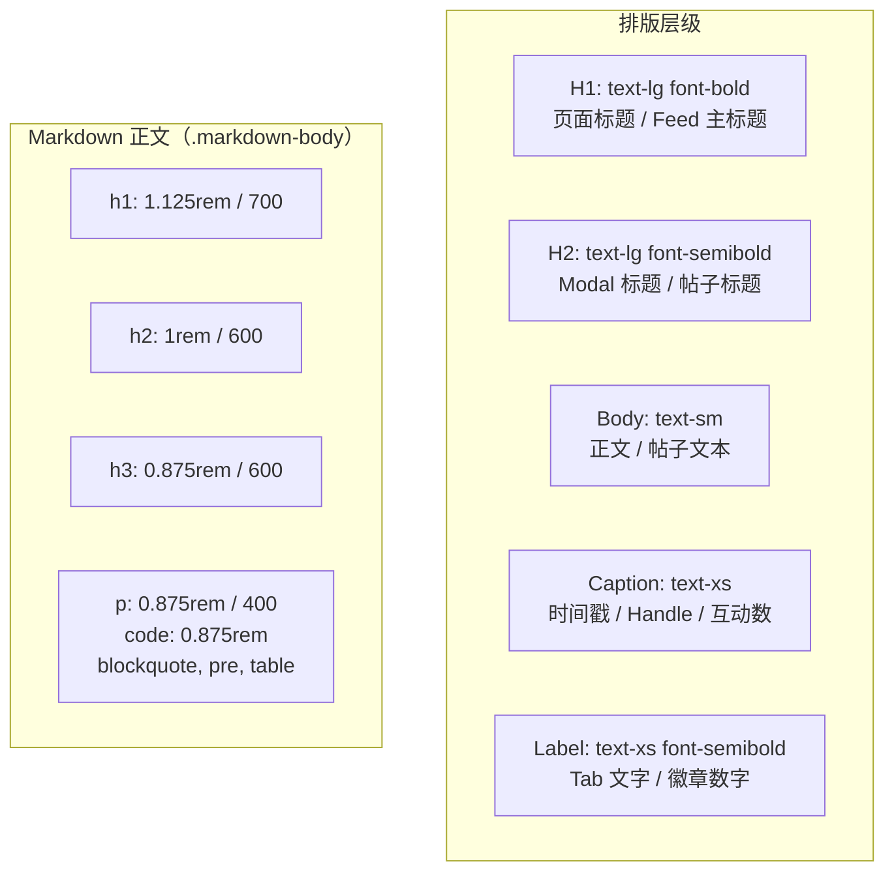
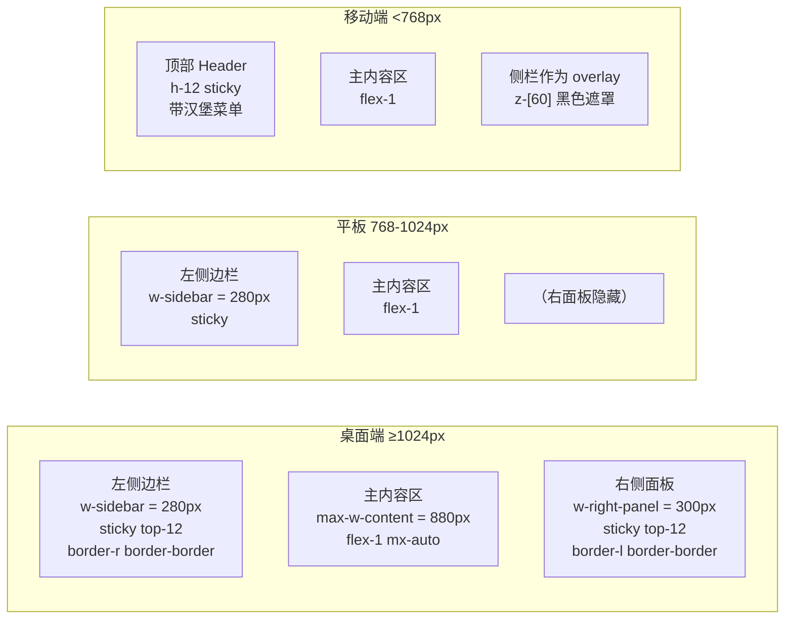

本文档系统化阐述 PWA 客户端的视觉设计体系——从 CSS 变量驱动的语义色板，到 Inter 字体排版层级，再到三栏响应式布局与可复用组件模式。该设计系统以 `docs/DESIGN.md` 为概念总纲，通过 `tailwind.config.ts` 与 `index.css` 落地为可执行的 CSS 变量与 Tailwind 工具类，最终在所有组件文件中得到一致应用。适合中级开发者理解从设计令牌（Design Tokens）到 UI 组件的完整映射链路。

## 语义色板：CSS 变量驱动的 Light/Dark 双模式

整个 PWA 的颜色体系不以硬编码色值工作，而是通过 CSS 自定义属性（Custom Properties）注入 Tailwind 的 `theme.extend.colors`，实现运行时无刷新的主题切换。核心色板定义在 `packages/pwa/src/index.css` 的 `:root` 和 `.dark` 选择器中。

```mermaid
graph TD
    A[DESIGN.md<br>概念色板] -->|编译| B[tailwind.config.ts<br>CSS 变量映射]
    B -->|theme.extend.colors| C[CSS 变量<br>:root / .dark]
    C -->|Tailwind 工具类| D[组件 JSX]
    D -->|className="text-primary"| E[渲染输出]

    subgraph "运行时修改"
        F[SettingsModal<br>toggleDark] -->|classList.toggle('dark')| C
    end
```

**色板变量全表**（来自 `packages/pwa/src/index.css#L5-L24`）：

| 语义变量 | Light 模式 | Dark 模式 | 典型用途 |
|---|---|---|---|
| `--color-primary` | `#00A5E0` | `#00A5E0` | 按钮、链接、活跃 Tab、AI 图标 |
| `--color-primary-hover` | `#0095C9` | `#00B5F0` | 按钮悬停、链接悬停 |
| `--color-surface` | `#F8F9FA` | `#121212` | 卡片、输入框背景、侧栏面板 |
| `--color-border` | `#E5E7EB` | `#27272A` | 分割线、输入框边框、卡片边框 |
| `--color-text-primary` | `#0F172A` | `#F1F5F9` | 主标题、正文 |
| `--color-text-secondary` | `#64748B` | `#A3B4C0` | 次要文字、时间戳、互动数 |

Primary 色在两种模式下保持一致（Bluesky 标志天空蓝 `#00A5E0`），但 Hover 色在 Dark 模式下反向提亮（`#0095C9` → `#00B5F0`），利用 Helmholtz–Kohlrausch 效应抵消深色背景上的感知明度下降。Text 对比度在 Dark 模式下严格满足 WCAG AA 标准（≥4.5:1）。Surface 色的 Light/Dark 反差巨大（`#F8F9FA` vs `#121212`），确保呼吸感与护眼模式共存。

Tailwind 配置中将这些变量注册为具名颜色（`packages/pwa/tailwind.config.ts#L9-L18`）：

```ts
colors: {
  primary: {
    DEFAULT: 'var(--color-primary)',
    hover: 'var(--color-primary-hover)',
  },
  surface: 'var(--color-surface)',
  border: 'var(--color-border)',
  'text-primary': 'var(--color-text-primary)',
  'text-secondary': 'var(--color-text-secondary)',
},
```

这样在 JSX 中可直接写 `className="text-text-primary"`、`className="bg-surface"`、`className="border border-border"`，语义清晰且与设计稿一一对应。Dark 模式的切换逻辑在 `App.tsx#L40-L43` 中初始化，并通过 `Layout.tsx#L51-L53` 的 `toggleDark` 回调暴露给 SettingsModal。

Sources: [index.css](packages/pwa/src/index.css#L1-L24), [tailwind.config.ts](packages/pwa/src/tailwind.config.ts#L1-L31), [DESIGN.md](docs/DESIGN.md#L1-L170), [App.tsx](packages/pwa/src/App.tsx#L40-L43), [Layout.tsx](packages/pwa/src/Layout.tsx#L51-L53)

## 字体排版：Inter 家族与五级文字尺度

字体栈选择 **Inter**（`packages/pwa/index.html#L18-L20` 通过 Google Fonts 预加载）作为主力字体，备选链为 `system-ui, -apple-system, BlinkMacSystemFont, "Segoe UI", Roboto, sans-serif`。Inter 以其优异的屏幕可读性、统一的中英文 x-height 与现代化的数字体风格，成为跨平台 PWA 的理想选择。

实际代码中的排版层级并非全部对应 CSS 中预定义的 h1~h6，而是通过 Tailwind 工具类按需组合。以下是从 11 个组件中归纳出的实际排版模式：



**实际排版对照表**（从组件代码中提取）：

| 用途 | Tailwind 类 | 实际字号 | 示例组件 |
|---|---|---|---|
| 页面主标题 | `text-lg font-bold` | 1.125rem / 18px | `FeedTimeline.tsx#L113` |
| Modal / 帖子标题 | `text-lg font-semibold` | 1.125rem / 18px | `ThreadView.tsx#L218` |
| 设置面板标题 | `text-lg font-semibold` | 1.125rem / 18px | `SettingsModal.tsx#L109` |
| 用户名 | `text-sm font-semibold` | 0.875rem / 14px | `PostCard.tsx#L266-L268` |
| 帖子正文 | `text-sm` | 0.875rem / 14px | `PostCard.tsx#L273` |
| Handle / 时间 | `text-xs` | 0.75rem / 12px | `PostCard.tsx#L270-L272` |
| 互动计数 | `text-xs` | 0.75rem / 12px | `PostCard.tsx#L362-L364` |
| 页脚提示 | `text-xs` | 0.75rem / 12px | `FeedTimeline.tsx#L186` |
| Tab 文字 | `text-sm font-medium` | 0.875rem / 14px | `Sidebar.tsx#L48` |
| 状态连接点 | `text-xs` | 0.75rem / 12px | `Layout.tsx#L83` |

值得一提的是，Markdown 渲染区域（`AIChatPage.tsx` 使用 `react-markdown` 配合 `remark-gfm`）有独立的 `.markdown-body` 样式体系（`index.css#L28-L120`），其字号整体比 UI 组件小一档（h1=1.125rem, p=0.875rem），这是有意为之——AI 聊天内容通常较长，缩小字号能在有限视口中展示更多信息。

Sources: [index.html](packages/pwa/index.html#L18-L20), [index.css](packages/pwa/src/index.css#L28-L120), [DESIGN.md](docs/DESIGN.md#L45-L64)

## 布局体系：三栏响应式 + 粘性定位

PWA 采用经典的三栏布局骨架，但仅在桌面端完整展示，平板与移动端自适应降级。布局容器由 `Layout.tsx` 管理，核心结构如下：



关键布局参数在 `tailwind.config.ts#L20-L24` 中定义：

```ts
maxWidth: {
  content: '880px',
},
spacing: {
  sidebar: '280px',
  'right-panel': '300px',
},
```

**布局容器高度计算逻辑**：

- 顶部 Header：`sticky top-0 z-50 h-12`，固定 48px 高度，带 `bg-white/80` 毛玻璃效果
- 侧边栏与右面板：`h-[calc(100vh-3rem)] sticky top-12`，即 `100vh - 48px`，跟随 Header 下方粘性定位
- 主内容区高度：`min-h-[calc(100vh-3rem)]`，确保内容不足时仍占满视口
- Feed 内部滚动：`h-[calc(100vh-3rem)] overflow-y-auto`，支持虚拟滚动

**移动端侧栏**通过 `sidebarOpen` 状态控制（`Layout.tsx#L92-L110`）：当 `sidebarOpen=true` 时，渲染全屏黑色半透明遮罩（`bg-black/40`），右侧弹出 `w-64` 的侧栏面板。侧栏在 `md:` 断点以上固定显示为左侧栏，在 `md:` 以下隐藏。右侧面板使用 `lg:` 断点（≥1024px）控制显隐。

Sources: [Layout.tsx](packages/pwa/src/components/Layout.tsx#L52-L145), [tailwind.config.ts](packages/pwa/src/tailwind.config.ts#L20-L24), [FeedTimeline.tsx](packages/pwa/src/components/FeedTimeline.tsx#L109-L110)

## 组件规范：可复用模式与变体分析

### 按钮体系

从 11 个组件中归纳出 5 种按钮变体，各自有明确的语义与应用场景：

| 变体 | CSS 类（Tailwind） | 典型场景 | 位置示例 |
|---|---|---|---|
| **Primary** (实色) | `bg-primary hover:bg-primary-hover text-white` | 登录、提交、刷新 | `LoginPage.tsx#L88` |
| **Secondary** (描边) | `border border-[color] text-[color]` | 取消、登出 | `SettingsModal.tsx#L172` |
| **Ghost** (透明) | `text-text-secondary hover:text-text-primary` | 导航返回、设置图标 | `Layout.tsx#L62-L66` |
| **Pill** (药丸) | `rounded-full bg-surface hover:bg-primary/10` | Feed 刷新按钮 | `FeedTimeline.tsx#L116` |
| **Icon-only** (纯图标) | `text-text-secondary hover:text-text-primary p-1` | Header 图标按钮 | `Layout.tsx#L88-L94` |

Primary 按钮统一圆角 `rounded-lg`（8px）或 `rounded-full`（药丸形），登录页使用 `border border-border bg-surface` 描边输入框，获得焦点时显示 `ring-2 ring-primary` 光圈指示。

### PostCard 复合组件

`PostCard.tsx` 是最复杂的组件，需处理两种数据源（`PostView` 原生对象 vs `FlatLine` 扁平化行）和7种子组件：

```
PostCard
├── RepostBy 横幅（可选）
├── Avatar 区（圆形 40×40，显示头像或首字母回退）
│   └── 点击跳转 Profile
├── 内容区
│   ├── 用户信息行：displayName + @handle + · + 时间
│   ├── 正文：whitespace-pre-wrap break-words line-clamp-6
│   ├── ImageGrid（1/2/4列自适应网格 + Lightbox 模态）
│   ├── ExternalLink 卡片
│   ├── mediaTags 标签行（primary/10 背景圆角标签）
│   ├── QuotedPost 嵌入卡片（bg-surface 区分背景）
│   └── 互动栏：💬 ♻ ♥
└── children 插槽（ActionButtons 或空）
```

**ImageGrid** 图片网格逻辑（`PostCard.tsx#L168-L199`）：

```ts
const grid = (() => {
  const n = images.length;
  if (n === 1) return 'grid-cols-1';
  if (n === 2) return 'grid-cols-2 gap-[2px]';
  if (n === 3) return 'grid-cols-2 gap-[2px]'; // 第3张横跨两列
  return 'grid-cols-2 gap-[2px]';
})();
```

图片点击触发 Lightbox（通过 `createPortal` 渲染到 `document.body`），覆盖层使用 `bg-black/90` 与 `z-[9999]` 确保全屏覆盖。图片超过4张时显示 "+N 张图片" 计数提示。

### Layout 骨架与 Sidebar 导航

`Layout.tsx` 采用 **Compound Component** 模式：接收 `children` 在主内容区渲染，同时注入 Sidebar、Header、SettingsModal 等附属元素。Props 接口（`LayoutProps`）携带 `currentView: AppView` 用于高亮当前导航项。

`Sidebar.tsx` 使用常量数组（`SIDEBAR_TABS`）驱动导航项渲染，每个 Tab 包含 emoji 图标、国际化 key、view type 和 `needsHandle` 标记。活跃 Tab 的判定逻辑特殊处理了 `profile` 类型（需匹配 `view.type`），其余类型直接比较：

```tsx
const isActive = tab.type === 'profile'
  ? currentView.type === 'profile'
  : currentView.type === tab.type;
```

活跃状态样式：`bg-primary/10 text-primary font-semibold border-primary`（10% 透明度的背景、主色文字、左侧 2px 实色边框），非活跃状态：`text-text-secondary hover:bg-surface border-transparent`。

### 通知徽章与草稿计数

Sidebar 的通知和草稿 Tab 带有红色和黄色徽章（badge），超过 99 显示 "99+"：

```tsx
{tab.type === 'notifications' && notifCount > 99 && (
  <span className="bg-primary text-white text-xs font-bold rounded-full px-1.5 py-0.5 min-w-[20px] text-center">
    99+
  </span>
)}
```

`min-w-[20px]` 确保单位数徽章不缩成圆形，而是保持药丸形状。

### 发帖编辑器（ComposePage）

编辑器是表单式组件的典型范例，包含以下状态管理：

| 状态 | 类型 | 作用 |
|---|---|---|
| `draft` | string | 正文内容（max 300 字符） |
| `images` | LocalImage[] | 待上传图片（max 4 张，每张 ≤1MB） |
| `submitting` | boolean | 提交中锁 |
| `replyHandle` | string \| null | 被回复用户 Handle |
| `quotePreview` | QuotePreview \| null | 引用帖子预览 |
| `showDrafts` | boolean | 草稿列表展开/收起 |

输入框样式模板：`w-full px-4 py-3 rounded-lg border border-border bg-surface text-text-primary placeholder:text-text-secondary/50 focus:outline-none focus:ring-2 focus:ring-primary`。这是 PWA 中所有文本输入框的统一样式，复用于 `LoginPage`、`SearchPage`、`SettingsModal` 和 `AIChatPage`。

图片上传使用隐藏的 `<input type="file">` 触发，采用 `URL.createObjectURL` 本地预览，上传时显示旋转加载动画，失败时显示红色覆盖层错误信息。

### 线程视图（ThreadView）

ThreadView 将 `flatLines` 分为三个区域：**parentLines**（讨论源，depth < 0）、**focused**（当前帖子，depth = 0）、**replyLines**（回复，depth > 0）。父链使用左侧 2px 边框 + 半透明（`opacity-60 hover:opacity-100`）表示历史关系，焦点帖子使用 4px 左侧主色边框（`border-l-4 border-primary pl-4`）高亮，回复通过 `marginLeft: Math.min((line.depth - 1) * 16, 48)` 实现递进缩进的树形结构。

### AI聊天页面（AIChatPage）

AIChatPage 的布局结构独立于标准三栏布局，它自己管理左侧聊天历史侧栏（`w-[280px] bg-surface border-r`），右侧占据全部剩余空间。侧栏在移动端通过 `fixed` 定位 + `translate-x` 动画实现抽屉效果。聊天消息使用 `react-markdown` + `remark-gfm` 渲染，配合 `.markdown-body` CSS 实现格式化展示。

Sources: [PostCard.tsx](packages/pwa/src/components/PostCard.tsx#L1-L373), [ComposePage.tsx](packages/pwa/src/components/ComposePage.tsx#L1-L318), [Sidebar.tsx](packages/pwa/src/components/Sidebar.tsx#L1-L68), [ThreadView.tsx](packages/pwa/src/components/ThreadView.tsx#L1-L408), [AIChatPage.tsx](packages/pwa/src/components/AIChatPage.tsx#L1-L200)

## 响应式断点与形状系统

**断点策略**完全依赖 Tailwind 的默认断点体系，未自定义：

| 断点 | 最小宽度 | 布局变更 |
|---|---|---|
| `md:` | 768px | 侧栏从 overlay 抽屉变为固定左侧栏 |
| `lg:` | 1024px | 右侧面板显示 |
| `sm:` | 640px | Handle 文字在 Header 中显示 |

**圆角系统**（取自 `docs/DESIGN.md` 与代码实际使用）：

| 名称 | 值 | 应用 |
|---|---|---|
| `rounded-none` | 0px | — |
| `rounded` / `rounded-lg` | 8px | 卡片、输入框、Modal 内容区 |
| `rounded-xl` | 12px | Modal 容器 |
| `rounded-full` | 9999px | 按钮（pill）、Avatar、徽章 |

**阴影与深度**：Light 模式下使用 Tailwind 默认 shadow 系统（`shadow-lg` 用于 Modal），Dark 模式依赖边框色（`border-border`）和背景色对比创造深度层次，而非阴影。毛玻璃效果（`backdrop-blur-md`）应用于 Header 和 Modal 遮罩层。

Sources: [DESIGN.md](docs/DESIGN.md#L68-L80), [index.html](packages/pwa/index.html#L1-L24), [Layout.tsx](packages/pwa/src/components/Layout.tsx#L1-L167)

## 设计令牌的完整链路

从设计概念到渲染像素，一个颜色令牌经历了以下四层映射：

```
DESIGN.md (概念定义)
    ↓ primary: "#00A5E0"
index.css (CSS 变量注册)
    ↓ --color-primary: #00A5E0
tailwind.config.ts (Tailwind 映射)
    ↓ colors: { primary: { DEFAULT: 'var(--color-primary)' } }
组件 JSX (使用)
    ↓ className="bg-primary"
最终渲染
    ↓ background-color: #00A5E0
```

这种架构使得主题切换只需要在 CSS 变量层修改（通过切换 `.dark` 类名），所有 Tailwind 工具类自动响应。用户通过 `SettingsModal` 中的 Dark Mode 复选框调用 `document.documentElement.classList.toggle('dark')`，无任何运行时 CSS 重新编译开销。

Sources: [index.css](packages/pwa/src/index.css#L1-L24), [tailwind.config.ts](packages/pwa/src/tailwind.config.ts#L1-L31), [SettingsModal.tsx](packages/pwa/src/components/SettingsModal.tsx#L128-L130)

## 继续阅读

- **[PWA 组件全景：页面组件、钩子与服务层清单](24-pwa-zu-jian-quan-jing-ye-mian-zu-jian-gou-zi-yu-fu-wu-ceng-qing-dan)**——继设计系统之后，了解每个组件的数据源、Hook 依赖与服务注入关系
- **[PWA 迁移指南：从 TUI 到 Web 的渲染层替换策略](6-pwa-qian-yi-zhi-nan-cong-tui-dao-web-de-xuan-ran-ceng-ti-huan-ce-lue)**——理解为什么选择 Tailwind + CSS 变量作为 Web 渲染方案
- **[核心术语与命名约定](9-he-xin-zhu-yu-yu-ming-ming-yue-ding-tao-lun-chuan-ui-yuan-su-dai-ma-ming-ming-gui-fan)**——掌握 post / thread / line / view 等核心数据模型与 UI 元素对应关系