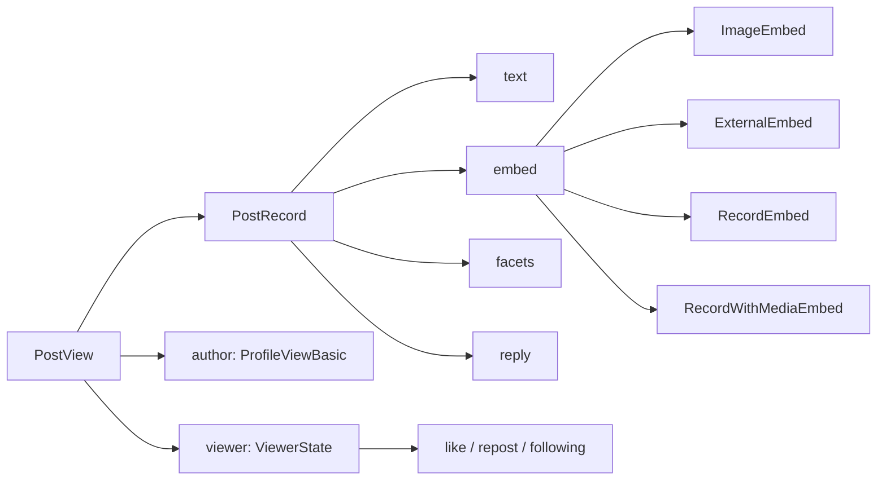

> **文档定位**：贯穿全项目的中英文术语对照表与代码命名规则说明书。本文的核心价值在于建立一套统一的语言框架，让开发者在阅读源码、审查 PR、添加新功能时，能够精准理解每个名称背后的语义含义，避免因命名歧义导致的架构偏离。本文涵盖三个维度：AT 协议域术语、UI 元素术语、代码命名约定（包/文件/类型/函数/国际化键）。

---

## AT 协议领域的术语体系

项目整个业务层建立在 AT Protocol（at://）之上，`@bsky/core` 包封装了所有协议交互。理解以下术语是阅读任何后续文档的前提。

### 核心数据实体

| 术语 | 代码类型 | 语义说明 |
|------|---------|---------|
| **DID** | `string`（如 `did:plc:abc123`） | 去中心化标识符，用户/仓库的永久 ID。与 handle 不同，DID 不会因域名变更而失效 |
| **Handle** | `string`（如 `alice.bsky.social`） | 用户可读的域名式标识，通过 `resolveHandle` 解析为 DID |
| **Record** | `PostRecord` / 泛型 `Record<string, unknown>` | AT Protocol 仓库中的数据记录。每条记录由 `(did, collection, rkey)` 三元组唯一定位 |
| **Collection** | `string`（如 `app.bsky.feed.post`） | NSID（Namespaced Identifier）格式的记录集合名称，相当于数据库的表名 |
| **Rkey** | `string` | 记录键（Record Key），在同一 collection 内唯一。通常是时间戳或 UUID |
| **AT URI** | `string`（格式 `at://did:plc:xxx/app.bsky.feed.post/3lk123`） | 统一资源标识符，组合了 `did` + `collection` + `rkey`。`parseAtUri()` 函数将其解析为结构化对象 |

Sources: [types.ts](packages/core/src/at/types.ts#L1-L15), [client.ts](packages/core/src/at/client.ts#L1-L30)

### 帖子（Post）相关术语



**PostView**（视图层）与 **PostRecord**（数据层）的区别至关重要：`PostView` 是 API 响应中的完整帖子对象，包含聚合数据和作者信息；`PostRecord` 是仓库中存储的原始记录，仅包含用户创建的内容字段。类似区分也适用于 `ProfileView` / `ProfileViewBasic`——后者仅有 `did`、`handle`、`displayName`、`avatar` 四个字段，用于嵌入场景以减少流量。

Sources: [types.ts](packages/core/src/at/types.ts#L19-L55)

### 讨论串（Thread）相关术语

**Thread** 在项目中指代一个帖子的完整讨论树，由 `getPostThread` API 返回的嵌套结构表示：

- **ThreadViewPost** — 讨论树中的节点，包含 `post`（帖子本体）、`parent`（父节点）、`replies`（子节点数组）
- **NotFoundPost** — 占位节点，当帖子被删除或不可见时替代 `ThreadViewPost`
- **FlatLine** — 展平后的讨论串行结构（`packages/app/src/hooks/useThread.ts`），将嵌套树转换为带 `depth` 属性的线性数组，便于 React 渲染和键盘导航
- **Theme URI** — `useThread` 维护的"主题帖子"URI，用于面包屑导航中的"返回讨论源"功能
- **isRoot** — **FlatLine** 的 `depth === 0` 标记，标识讨论串中的根帖子
- **isTruncation** — 截断占位行标记，表示该位置折叠了额外回复

```
展开前（树形）：                展平后（FlatLine[]）：
  - 根帖 (depth=0)             [0] 根帖 (depth=0, isRoot=true)
    ├─ 回复A (depth=1)         [1] 回复A (depth=1)
    │  └─ 子回复 (depth=2)     [2] 子回复 (depth=2)
    └─ 回复B (depth=1)         [3] 回复B (depth=1)
         + 3条更多...          [4] 还有3条回复未显示 (isTruncation=true)
```

Sources: [types.ts](packages/core/src/at/types.ts#L100-L111), [useThread.ts](packages/app/src/hooks/useThread.ts#L1-L60), [UnifiedThreadView.tsx](packages/tui/src/components/UnifiedThreadView.tsx#L1-L60)

### 互动（Interaction）术语

| 互动类型 | 动词（API 方法） | 状态字段 | 标记方式 |
|---------|-----------------|---------|---------|
| **Like**（点赞） | `likePost(uri)` | `post.likeCount` | `viewer.like`（AT URI，存在即已赞） |
| **Repost**（转发） | `repostPost(uri)` | `post.repostCount` | `viewer.repost` |
| **Reply**（回复） | `createRecord(..., 'app.bsky.feed.post')` 含 `reply` 字段 | `post.replyCount` | 由 `PostRecord.reply.root/parent` 标记 |
| **Quote**（引用） | `createRecord` 含 `app.bsky.embed.record` embed | `post.quoteCount` | 嵌入类型为 `RecordEmbed` 或 `RecordWithMediaEmbed` |
| **Follow**（关注） | `follow(did)` / `unfollow(followUri)` | `viewer.following` | AT URI 存在即已关注 |
| **Bookmark**（书签） | `createBookmark(uri, cid)` | — | 客户端 `bookmarkedUris: Set<string>` 维护 |

项目严格区分"互动计数"和"互动状态"两个概念：计数来自 API 返回的整数（如 `likeCount`），状态来自客户端维护的 `Set`（如 `likedUris`、`repostedUris`）和 `viewer` 对象。计数仅用于展示，状态用于 UI 高亮。

Sources: [types.ts](packages/core/src/at/types.ts#L60-L98), [useThread.ts](packages/app/src/hooks/useThread.ts#L55-L80)

---

## UI 元素术语体系

项目同时存在 TUI（终端）和 PWA（浏览器）两套渲染层，但共享核心概念。下表列出每个 UI 概念在两端的实现名称和语义：

### 页面/视图（View）

术语基于 `@bsky/app` 的导航状态机定义，每种视图由 `AppView` 联合类型标识。

```typescript
// packages/app/src/state/navigation.ts
type AppView =
  | { type: 'feed' }              // 时间线
  | { type: 'detail'; uri }       // 帖子详情（PWA 中并入 thread）
  | { type: 'thread'; uri }       // 讨论串
  | { type: 'compose'; replyTo?; quoteUri? }  // 发帖/回复/引用
  | { type: 'profile'; actor }    // 用户主页
  | { type: 'notifications' }     // 通知列表
  | { type: 'search'; query? }    // 搜索
  | { type: 'aiChat'; contextUri? }  // AI 对话
  | { type: 'bookmarks' }         // 书签列表
```

| 术语 | AppView type | TUI 组件 | PWA 组件 | 语义 |
|------|-------------|---------|---------|------|
| **Feed** | `'feed'` | `PostList.tsx` | `FeedTimeline.tsx` | 主页时间线，滚动帖子列表 |
| **Thread** | `'thread'` | `UnifiedThreadView.tsx` | `ThreadView.tsx` | 讨论串视图，含主题帖和回复树 |
| **Post Card / Item** | 内含于 feed/thread | `PostItem.tsx` | `PostCard.tsx` | 单条帖子的渲染组件 |
| **Compose** | `'compose'` | `App.tsx` 内嵌 | `ComposePage.tsx` | 发帖编辑器 |
| **Profile** | `'profile'` | `ProfileView.tsx` | `ProfilePage.tsx` | 用户主页 |
| **Notifications** | `'notifications'` | `NotifView.tsx` | `NotifsPage.tsx` | 通知列表 |
| **Search** | `'search'` | `SearchView.tsx` | `SearchPage.tsx` | 搜索视图 |
| **AI Chat** | `'aiChat'` | `AIChatView.tsx` | `AIChatPage.tsx` | AI 助手对话界面 |
| **Bookmarks** | `'bookmarks'` | `App.tsx` 内嵌 | `BookmarkPage.tsx` | 书签列表 |
| **Settings** | 无（模态层） | `SettingsView.tsx` | `SettingsModal.tsx` | 设置面板 |

Sources: [navigation.ts](packages/app/src/state/navigation.ts#L1-L22), [Sidebar.tsx (PWA)](packages/pwa/src/components/Sidebar.tsx), [Sidebar.tsx (TUI)](packages/tui/src/components/Sidebar.tsx#L1-L60)

### 导航结构术语

| 术语 | 含义 | 代码位置 |
|------|------|---------|
| **Sidebar** | 侧边导航栏，TUI 和 PWA 均有独立实现 | `packages/tui/src/components/Sidebar.tsx` / `packages/pwa/src/components/Sidebar.tsx` |
| **Breadcrumb** | 面包屑导航，TUI 用 emoji + 文字在侧栏显示当前路径 | `Sidebar.tsx` 中 `viewBreadcrumb()` 函数 |
| **Tab** | 侧栏中的导航标签，每个标签有 `key`、`shortcut`（TUI 键盘快捷键）、`emoji` | `TABS` 数组 |
| **Stack** | 导航栈，`AppView[]` 数组，支持 `goTo`（压栈）、`goBack`（弹栈）、`goHome`（重置） | `navigation.ts` |

Sources: [navigation.ts](packages/app/src/state/navigation.ts#L24-L66)

### 互动操作按钮术语

PWA 的 `ActionButtons` 组件和 TUI 的键盘快捷键系统使用同一套操作语义：

| i18n key | 中文显示 | 符号 | TUI 快捷键 | 说明 |
|---------|---------|------|-----------|------|
| `action.like` | 赞/已赞 | ♥ / ❤️ | `l` | 切换点赞 |
| `action.repost` | 转发/已转 | ♺ / ♻️ | `r` | 切换转发。PWA 有子菜单（转发/引用） |
| `action.reply` | 回复 | 💬 | `c` | 打开 compose（`replyTo` 自动填充） |
| `action.bookmark` | 收藏/已收藏 | 🔖 | `v` | 切换书签 |
| `action.translate` | 翻译 | 🌐 | `f` | AI 翻译帖子文本 |
| `action.copyLink` | 复制链接 | 📋 | `y` | 复制 Bluesky 链接到剪贴板 |
| `action.aiAnalyze` | AI 分析 | 🤖 | — | 打开 AI Chat 并传入帖子 URI |

Sources: [ThreadView.tsx](packages/pwa/src/components/ThreadView.tsx#L66-L120), [UnifiedThreadView.tsx](packages/tui/src/components/UnifiedThreadView.tsx#L90-L200)

---

## 代码命名规范

### 包命名（NPM Package）

项目采用单体仓库（Monorepo）结构，四个包遵循 `@bsky/*` 命名空间：

| 包名 | 位置 | 依赖关系 | 设计责任 |
|------|------|---------|---------|
| `@bsky/core` | `packages/core/` | 无 UI 依赖 | AT 协议客户端 + AI 助手纯逻辑 |
| `@bsky/app` | `packages/app/` | 依赖 `@bsky/core` | 共享 React hooks + 状态管理 + i18n |
| `@bsky/tui` | `packages/tui/` | 依赖 `@bsky/app` | Ink 终端渲染层 |
| `@bsky/pwa` | `packages/pwa/` | 依赖 `@bsky/app` | React Web + Vite 渲染层 |

命名原则：`@bsky/core` 不包含任何 `React` 或 UI 引用，因此它可以被 TUI 和 PWA 两个渲染层共享。`@bsky/app` 是唯一承载 React hooks 的包，TUI 和 PWA 通过它消费 core 的功能。

Sources: [package.json (root)](package.json), [core/index.ts](packages/core/src/index.ts), [app/index.ts](packages/app/src/index.ts)

### 文件命名约定

项目采用统一的文件命名模式，区分业务语义和实现层级：

```
[domain]/[concern].[layer].[ext]
```

**观察到的模式**：

| 模式 | 示例 | 说明 |
|------|------|------|
| `use*.[jt]sx?` | `useAuth.ts`, `useThread.ts`, `useAIChat.ts` | React hooks，位于 `packages/app/src/hooks/` |
| `*Store` / `create*Store()` | `AuthStore`, `createAuthStore()` | 纯 JS store 工厂模式，位于 `packages/app/src/stores/` |
| `*View.tsx` (TUI) | `PostItem.tsx`, `ThreadView.tsx` | TUI 终端组件/视图 |
| `*Page.tsx` (PWA) | `ComposePage.tsx`, `ThreadView.tsx` | PWA 页面级组件 |
| `*Card.tsx` (PWA) | `PostCard.tsx` | PWA 卡片式组件 |
| `*.ts` (core) | `client.ts`, `types.ts`, `tools.ts` | 纯逻辑模块 |
| `*.ts` (app) | `chatStorage.ts`, `navigation.ts`, `imageUrl.ts` | 服务/状态/工具模块 |

**关键命名约定**：

1. **Hook 命名**：所有 React 钩子统一以 `use` 前缀开头，文件名与导出函数名一致（`useAuth -> useAuth.ts`）。每种钩子返回一个包含状态和操作的对象，不使用多个 return 值。
2. **Store 命名**：纯函数式 store 使用 `create{Name}Store()` 工厂函数，导出的类型为 `{Name}Store`。store 实例包含 `subscribe` 和 `_notify` 方法，实现单向监听器模式。
3. **组件命名差异**：同一概念的 UI 元素在 TUI 和 PWA 中的后缀不同——TUI 偏好 `*View` 和 `*Item`，PWA 偏好 `*Page` 和 `*Card`。

Sources: [hooks/](packages/app/src/hooks/), [stores/](packages/app/src/stores/), [tui/components](packages/tui/src/components), [pwa/components](packages/pwa/src/components)

### 类型命名规范

项目 TypeScript 类型命名遵循"语义精度优先"原则，同一领域概念通过不同的类型名称区分层级：

| 模式 | 示例 | 说明 |
|------|------|------|
| `{Entity}View` | `PostView`, `ProfileView` | API 返回的完整视图对象（含聚合数据） |
| `{Entity}ViewBasic` | `ProfileViewBasic` | 精简视图对象，仅含核心字段 |
| `{Entity}Record` | `PostRecord` | 仓库原始记录对象 |
| `{Entity}Embed` | `ImageEmbed`, `RecordEmbed` | 嵌入内容类型 |
| `{Entity}Response` | `TimelineResponse`, `PostThreadResponse` | API 端点返回的完整响应结构 |
| `{Flat}Line` | `FlatLine` | 展平后的数据结构，用于渲染 |
| `{Domain}{Role}` | `ToolDescriptor`, `ToolDefinition` | 工具系统的多层描述 |

**接口 vs 类型别名**：项目统一使用 `interface` 定义数据对象的形状，使用 `type` 定义联合类型、元组或工具函数的签名。

Sources: [types.ts](packages/core/src/at/types.ts), [tools.ts](packages/core/src/at/tools.ts#L1-L30), [useThread.ts](packages/app/src/hooks/useThread.ts#L8-L30)

### 国际化键命名规范

i18n 键名遵循 `{domain}.{key}` 层级路径格式，所有键名以小写字母开头：

```
{domain}.{specificKey}[.{subKey}]
```

完整的键域结构如下（来自 `packages/app/src/i18n/locales/*.ts`）：

| 域（Domain） | 示例键 | 用途 |
|-------------|--------|------|
| `nav.**` | `nav.feed`, `nav.aiChat` | 导航/侧栏标签文本 |
| `action.**` | `action.like`, `action.translate` | 操作按钮文本 |
| `status.**` | `status.loading`, `status.noPosts` | 状态提示文本 |
| `compose.**` | `compose.title`, `compose.placeholder` | 发帖编辑器文本 |
| `thread.**` | `thread.rootPost`, `thread.replies` | 讨论串视图文本 |
| `notifications.**` | `notifications.title`, `notifications.reason.like` | 通知页面文本 |
| `search.**` | `search.title`, `search.searching` | 搜索视图文本 |
| `profile.**` | `profile.followers`, `profile.posts` | 用户主页文本 |
| `settings.**` | `settings.logout`, `settings.apiKey` | 设置面板文本 |
| `ai.**` | `ai.toolUsed`, `ai.thinking` | AI 对话界面文本 |
| `common.**` | `common.escBack` | 通用 UI 文本 |
| `post.**` | `post.imageCount`, `post.postsCount` | 帖子渲染相关文本 |
| `bookmark.**` | `bookmark.title` | 书签页面文本 |
| `theme.**` | `theme.switchDark` | 主题切换文本 |
| `breadcrumb.**` | `breadcrumb.thread`, `breadcrumb.feed` | 面包屑导航文本 |
| `layout.**` | `layout.aiSuggestions` | 布局相关文本 |
| `image.**` | `image.cdnHint` | 图片相关文本 |

国际化键不包含数字索引或格式化参数——动态值通过模板参数 `{n}`、`{name}`、`{path}` 等注入。三语言实现（zh/en/ja）都使用完全相同的一组键名，确保翻译完整。

Sources: [zh.ts](packages/app/src/i18n/locales/zh.ts#L1-L100), [en.ts](packages/app/src/i18n/locales/en.ts#L1-L100), [types.ts](packages/app/src/i18n/types.ts#L1-L4)

### AI 工具命名约定

31 个 AI 工具（定义在 `@bsky/core` 的 `createTools` 中）的命名遵循 `snake_case` 风格，与 OpenAI 的 function calling 格式保持一致：

```
{domain}_{action}
```

| 类别 | 命名模式 | 示例 |
|------|---------|------|
| 读操作 | `get_*`, `search_*`, `resolve_*`, `list_*` | `get_timeline`, `search_posts`, `resolve_handle` |
| 写操作 | `create_*`, `delete_*`, `follow_*`, `upload_*` | `create_post`, `delete_post`, `follow_user` |
| 复合工具 | `get_*`（内部调用多个 API） | `get_post_thread_flat`, `get_post_context` |

每个工具由 `ToolDescriptor` 封装，包含三个核心属性：

```typescript
interface ToolDescriptor {
  definition: ToolDefinition;  // name, description, inputSchema
  handler: ToolHandler;         // 执行函数
  requiresWrite: boolean;       // 写操作安全门标记
}
```

工具命名与 Bluesky 的 Lexicon（AT Protocol API 定义）之间有以下映射关系：工具名 `snake_case` ↔ Lexicon `camelCase`（如 `search_posts` ↔ `app.bsky.feed.searchPosts`）。合约定义在 `contracts/tools.json` 中，这是 AI 工具声明与代码实现之间的"真理之源"。

Sources: [tools.ts](packages/core/src/at/tools.ts#L1-L45), [tools.json](contracts/tools.json#L1-L50)

### 导航状态命名

导航状态使用 `AppView` 联合类型，每个视图变体遵循 `{ type: string; [params] }` 格式。`type` 属性使用 `camelCase` 且为单一单词：

| type | 可选参数 | 用途 |
|------|---------|------|
| `feed` | 无 | 主页时间线 |
| `thread` | `uri: string` | 讨论串视图 |
| `detail` | `uri: string` | 帖子详情（仅 TUI 使用） |
| `compose` | `replyTo?: string`, `quoteUri?: string` | 发帖编辑器 |
| `profile` | `actor: string` | 用户主页 |
| `notifications` | 无 | 通知 |
| `search` | `query?: string` | 搜索 |
| `aiChat` | `contextUri?: string` | AI 对话 |
| `bookmarks` | 无 | 书签列表 |

`NavigationState` 接口提供三个导航方法：`goTo`（压栈前进）、`goBack`（弹栈回退）、`goHome`（重置到 feed），以及 `canGoBack` 布尔标识。

Sources: [navigation.ts](packages/app/src/state/navigation.ts#L1-L66)

---

## 术语交叉引用指引

以下是一份快速查表，帮助在不同层次的文档和代码间建立关联：

| 你在找这个概念 | 查看 | 相关文档页面 |
|--------------|------|-------------|
| AT URI 解析 | `parseAtUri()` 函数 | [BskyClient：AT 协议 HTTP 客户端](10-bskyclient-at-xie-yi-http-ke-hu-duan-shuang-duan-dian-jia-gou-yu-jwt-zi-dong-shua-xin) |
| 讨论串展平算法 | `flattenThreadTree()` 函数 | [数据钩子清单：useAuth / useTimeline / useThread](17-shu-ju-gou-zi-qing-dan-useauth-usetimeline-usethread-useprofile-deng) |
| AI 工具的读写安全门 | `ToolDescriptor.requiresWrite` | [31 个 AI 工具系统](11-31-ge-ai-gong-ju-xi-tong-gong-ju-ding-yi-du-xie-an-quan-men-yu-gong-ju-zhi-xing-xun-huan) |
| 导航栈的创建与使用 | `createNavigation()` 工厂 | [导航状态机](7-dao-hang-zhuang-tai-ji-ji-yu-zhan-de-appview-lu-you-yu-shi-tu-qie-huan) |
| 国际化键的加载机制 | `useI18n()` hook | [国际化系统](29-guo-ji-hua-xi-tong-zh-en-ja-san-yu-yan-dan-li-store-yu-ji-shi-qie-huan) |
| store 的订阅模式 | `subscribe()` / `_notify()` | [单向监听器 Store 模式](16-dan-xiang-jian-ting-qi-store-mo-shi-chun-dui-xiang-zhuang-tai-guan-li-react-ding-yue) |
| 嵌入类型层级 | `ImageEmbed` / `RecordEmbed` / `RecordWithMediaEmbed` | [BskyClient 文档](10-bskyclient-at-xie-yi-http-ke-hu-duan-shuang-duan-dian-jia-gou-yu-jwt-zi-dong-shua-xin) |

---

## 术语变更指南

当需要引入新术语或修改现有术语时，遵循以下检查清单：

1. **跨包一致性**：check `@bsky/core` → `@bsky/app` → `@bsky/tui` + `@bsky/pwa` 的引用链，确保所有包同步修改
2. **国际化键同步**：新增 i18n key 必须在 `zh.ts`、`en.ts`、`ja.ts` 三个语言文件同时添加缺失条目
3. **工具合约同步**：如果修改 AI 工具名称，必须同步更新 `contracts/tools.json` 和 `@bsky/core` 中的 `createTools()` 函数
4. **导航类型同步**：如果新增 `AppView` 变体，必须更新导航状态机的 `type` 分支判断和相关组件的路由处理
5. **断代文档标记**：使用 `@deprecated` JSDoc 标记旧术语，保留至下一个大版本后再移除

---

继续阅读建议：理解本页术语后，推荐按以下顺序深入——先阅读 [导航状态机](7-dao-hang-zhuang-tai-ji-ji-yu-zhan-de-appview-lu-you-yu-shi-tu-qie-huan) 理解视图切换机制，然后深入 [BskyClient](10-bskyclient-at-xie-yi-http-ke-hu-duan-shuang-duan-dian-jia-gou-yu-jwt-zi-dong-shua-xin) 看 AT 协议接口的具体实现。如果对数据流感兴趣，[单向监听器 Store 模式](16-dan-xiang-jian-ting-qi-store-mo-shi-chun-dui-xiang-zhuang-tai-guan-li-react-ding-yue) 是理解 `@bsky/app` 状态管理的关键。