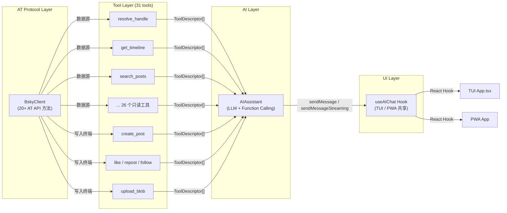
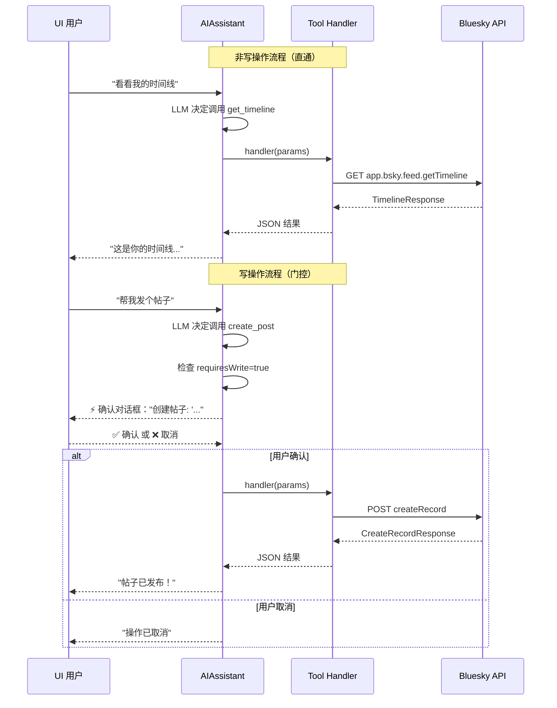

本页面深入解析 `@bsky/core` 核心层中的工具函数系统——一套将 AT 协议 API 封装为 31 个标准化工具函数、并集成写操作确认门控机制的架构设计。这套系统是 AI 助手与 Bluesky 平台之间的桥梁，决定了 AI 能做什么、不能做什么，以及谁有权批准敏感操作。

## 架构定位：从 AT 协议到 AI 可调用的函数

理解这套工具系统，需要先看清它在整个架构中的位置。工具函数层夹在 BskyClient（AT 协议客户端）和 AIAssistant（AI 对话引擎）之间，扮演适配器角色：



工具层的核心价值在于**解耦**：BskyClient 不必知晓 AI 的存在，AIAssistant 不必理解 AT 协议的细节，而 31 个工具函数像翻译器一样，将 AT 协议的底层操作（`com.atproto.repo.createRecord`）转化为 AI 可以理解并调用的语义化函数（`create_post`）。Sources: [tools.ts](packages/core/src/at/tools.ts#L48-L768), [assistant.ts](packages/core/src/ai/assistant.ts#L73-L94)

## 核心数据结构：ToolDescriptor 三要素

每个工具函数由一个统一的 `ToolDescriptor` 接口描述，包含三个关键字段：

```typescript
interface ToolDescriptor {
  definition: ToolDefinition;   // AI 可见的函数签名（name + description + inputSchema）
  handler: ToolHandler;         // 实际执行的异步函数
  requiresWrite: boolean;       // 写操作门控标记
}
```

Sources: [tools.ts](packages/core/src/at/tools.ts#L14-L30)

**`definition`** 遵循 OpenAI Function Calling 的 `tools` 参数格式，直接映射为 LLM API 请求中的 `tools` 数组。**`handler`** 是真正的执行体，接收 `Record<string, unknown>` 参数，返回序列化为 JSON 字符串的结果。**`requiresWrite`** 是最关键的设计决策——它不只是一个标记，而是触发 AIAssistant 中写操作确认门控的开关，下文会详细展开。

## 31 个工具全景：5 大功能域

将这 31 个工具按功能域分类，可以清晰地看出其覆盖范围：

### 帖子与时间线（6 个只读 + 1 个写入）

| 工具名 | 功能 | 底层 API | 主要参数 |
|---|---|---|---|
| `get_timeline` | 获取首页时间线 | `app.bsky.feed.getTimeline` | limit |
| `get_author_feed` | 获取指定用户帖子 | `app.bsky.feed.getAuthorFeed` | actor, limit |
| `get_feed` | 获取自定义订阅源 | `app.bsky.feed.getFeed` | feed, limit |
| `get_feed_generator` | 获取订阅源元信息 | `app.bsky.feed.getFeedGenerator` | feed |
| `get_popular_feed_generators` | 热门订阅源列表 | `app.bsky.unspecced.getPopularFeedGenerators` | limit |
| `search_posts` | 搜索帖子 | `app.bsky.feed.searchPosts` | q, limit, sort |
| `create_post` | **创建/回复帖子** | `com.atproto.repo.createRecord` (feed.post) | text, replyTo, quoteUri |

### 讨论串与上下文（4 个只读）

| 工具名 | 功能 | 特点 |
|---|---|---|
| `get_post_thread` | 原始线程树 | 返回完整 ThreadViewPost 树结构 |
| `get_post_thread_flat` | **扁平化线程** | 可读性强，带深度标记和回复箭头，推荐用于理解对话 |
| `get_post_subtree` | 展开折叠子树 | 与扁平线程使用相同的 `flattenThread` 逻辑 |
| `get_post_context` | 帖子完整上下文 | 父链 + 引用内容 + 媒体摘要的复合工具 |

值得注意的是 `get_post_thread_flat` 和 `get_post_subtree` 共享同一个 `flattenThread` 函数（第 772 行），该函数将嵌套的 `ThreadViewPost` 树递归扁平化为带深度标记的文本行，并设置了 `MAX_SIBLINGS = 5` 的折叠阈值。`get_post_context` 更进一步，在扁平线程基础上增加媒体嵌入分析和引用帖子的提取，是 AI 理解帖子全貌的终极工具。Sources: [tools.ts](packages/core/src/at/tools.ts#L240-L327), [tools.ts](packages/core/src/at/tools.ts#L772-L853)

### 交互数据（4 个只读）

| 工具名 | 功能 | 底层 API |
|---|---|---|
| `get_likes` | 点赞用户列表 | `app.bsky.feed.getLikes` |
| `get_reposted_by` | 转发用户列表 | `app.bsky.feed.getRepostedBy` |
| `get_quotes` | 引用帖子的搜索 | `app.bsky.feed.searchPosts`（复合） |
| `get_record` | 原始记录查询 | `com.atproto.repo.getRecord` |

### 用户与社交图谱（6 个只读 + 1 个写入）

| 工具名 | 功能 | 底层 API |
|---|---|---|
| `resolve_handle` | Handle → DID 解析 | `com.atproto.identity.resolveHandle` |
| `get_profile` | 获取用户资料 | `app.bsky.actor.getProfile` |
| `search_actors` | 搜索用户 | `app.bsky.actor.searchActors` |
| `get_follows` | 关注列表 | `app.bsky.graph.getFollows` |
| `get_followers` | 粉丝列表 | `app.bsky.graph.getFollowers` |
| `get_suggested_follows` | 推荐关注 | `app.bsky.graph.getSuggestedFollowsByActor` |
| `follow` | **关注用户** | `com.atproto.repo.createRecord` (graph.follow) |

### 媒体与外部内容（6 个只读）

| 工具名 | 功能 | 实现方式 |
|---|---|---|
| `list_records` | 列集合记录 | `com.atproto.repo.listRecords` |
| `extract_images_from_post` | 提取图片引用 | 解析 PostRecord embed |
| `download_image` | 下载图片（base64） | `com.atproto.sync.getBlob` + MIME 检测 |
| `extract_external_link` | 提取外部链接 | 解析 PostRecord embed |
| `fetch_web_markdown` | **外部网页转 Markdown** | 通过 `r.jina.ai` 代理抓取 |
| `list_notifications` | 通知列表 | `app.bsky.notification.listNotifications` |

### 写操作（5 个写入）

| 工具名 | 功能 | 底层 Collection |
|---|---|---|
| `create_post` | **创建/回复帖子** | `app.bsky.feed.post` |
| `like` | **点赞** | `app.bsky.feed.like` |
| `repost` | **转发** | `app.bsky.feed.repost` |
| `follow` | **关注** | `app.bsky.graph.follow` |
| `upload_blob` | **上传图片** | `com.atproto.repo.uploadBlob` |

Sources: [tools.ts](packages/core/src/at/tools.ts#L48-L768), [contracts/tools.json](contracts/tools.json#L1-L425)

## 读写分离设计模式：requiresWrite 门控机制

这是整个工具系统最核心的架构决策。每个 `ToolDescriptor` 携带的 `requiresWrite: boolean` 不只是分类标记，而是深度集成到 AI 对话流程中的安全门控。



这个门控在 `AIAssistant.sendMessage()`（第 188-210 行）和 `sendMessageStreaming()`（第 443-458 行）两条执行路径中都有完整的实现。关键逻辑如下：

```typescript
// assistant.ts 第 188-210 行 — 非流式路径的写确认
if (toolDesc.requiresWrite) {
  const approved = await this._waitForConfirmation();
  if (!approved) {
    toolResult = 'User cancelled the operation.';
    // 将取消结果注入对话历史
    this.messages.push({ role: 'tool', content: toolResult, tool_call_id: tc.id });
    continue;
  }
}
```

`_waitForConfirmation()` 使用一个 Promise 挂起整个工具执行循环，等待 UI 层通过 `confirmAction(boolean)` 方法来批准或拒绝。这种设计确保了**异步安全**——写操作不会在未获明确同意的情况下执行，同时保持了 AI 对话的连续性。Sources: [assistant.ts](packages/core/src/ai/assistant.ts#L141-L210), [assistant.ts](packages/core/src/ai/assistant.ts#L443-L458)

## 复合工具的设计智慧

在 31 个工具中，有 6 个是**复合工具**——它们不是单一 AT API 的薄封装，而是组合多个底层调用并增加智能处理的中间层：

**`get_post_thread_flat`** 和 **`get_post_subtree`** 共享 `flattenThread` 辅助函数（第 772 行），将嵌套的 ThreadViewPost 树转换为逐行文本。`flattenThread` 的实现体现了三个设计决策：
1. **祖先链遍历**（第 784-793 行）：从目标帖子向上回溯至根帖子，用负深度标记 `depth:-2, depth:-1, depth:0` 让 AI 理解回答链的上下文
2. **兄弟节点排序**（第 823-827 行）：按 `indexedAt` 时间排序，最新的回复在最下方
3. **折叠阈值**（第 829-831 行）：超过 5 条同级回复时折叠并提示"还有 X 条回复被折叠，可调用 get_post_subtree 展开"

**`fetch_web_markdown`** 则体现了另一种复合模式——外部代理集成。它通过 `https://r.jina.ai/{url}` 代理将任意网页转换为 Markdown，并在返回前截断至 4000 字符（第 612 行），同时通过 `extractTitle` 函数（第 888 行）尝试从 Markdown 首行 <title> 或 H1 提取标题。

**`download_image`** 的 MIME 类型检测（第 37-46 行）基于文件魔数（magic bytes），在前 4 个字节中匹配 PNG（`89 50 4E 47`）、JPEG（`FF D8 FF`）、GIF（`47 49 46`）的特征头，比依赖 Content-Type 头部更可靠。Sources: [tools.ts](packages/core/src/at/tools.ts#L37-L46), [tools.ts](packages/core/src/at/tools.ts#L772-L897)

## ToolDescriptor 与 LLM Function Calling 的映射机制

当 AIAssistant 调用 LLM API 时，工具定义被转换为标准的 `tools` 参数格式：

```typescript
// assistant.ts 第 272-282 行
body.tools = this.tools.map((t) => ({
  type: 'function',
  function: {
    name: t.definition.name,
    description: t.definition.description,
    parameters: t.definition.inputSchema,
  },
}));
body.tool_choice = 'auto';  // 由 LLM 自主决定是否调用
```

这意味着 **ToolDescriptor.definition 的格式直接决定了 LLM 对工具的理解质量**。每个工具的 `description` 字段经过了精心设计——比如 `get_post_thread_flat` 的描述明确标注"推荐优先于 get_post_thread"，引导 LLM 做出更优的工具选择。`create_post` 等写工具的 description 中强制包含"Requires user confirmation."，让 LLM 在回复时知道需要等待用户确认。Sources: [assistant.ts](packages/core/src/ai/assistant.ts#L261-L282)

## 结果精简与安全处理

每个工具的 handler 返回结果都经过了**精简处理**，而非直接透传 AT API 的原始响应。这体现在三个层面：

**数据精简**：`get_timeline`、`get_author_feed`、`search_posts` 等工具的 handler 都手动 `map` 出关键字段（uri、author.handle、text 前 200 字符、likeCount 等），避免将完整的 `PostView`（包含大量不必要字段）交给 LLM，既降低 token 消耗，也提升 LLM 对核心信息的关注度。

**异常安全**：所有 handler 都返回 JSON 字符串而非抛出原生异常。`download_image` 的 MIME 检测失败时返回 `application/octet-stream` 而非崩溃（第 45 行）。`fetch_web_markdown` 在 HTTP 错误时返回结构化错误信息而非原始异常（第 608-609 行）。

**信息门控**：`create_post` 的回复构造逻辑（第 639-668 行）特别值得关注——它使用 `try/catch` 包裹根帖子追踪逻辑，当祖先链查找失败时（如帖子已被删除），仍然可以正常发布回复，只是将目标帖子自身视为根节点。这种"选择性容错"确保了工具在最差情况下仍然可用。Sources: [tools.ts](packages/core/src/at/tools.ts#L116-L135), [tools.ts](packages/core/src/at/tools.ts#L560-L568)

## 合约化设计与跨文档一致性

值得注意的是，`contracts/tools.json` 中维护了一份与 `tools.ts` 完全同步的工具清单。这份 JSON 文件增加了 `endpoint`（底层 AT API 端点名）、`readonly`（与 `requiresWrite` 逻辑等价但命名不同）两个字段，充当了工具系统的**不可执行契约**。其用途包括：
- 作为 AI 系统提示词的参考数据源（见 `contracts/system_prompts.md`）
- 为未来自动生成文档或 API 网关提供元数据
- 作为测试断言的标准基线

两份定义的同步由开发人员手工保证，目前的一致性检查是隐式的——如果在任一文件中遗漏了新工具，AI 功能就会出现偏差。Sources: [contracts/tools.json](contracts/tools.json#L1-L425)

## 与 AIAssistant 的集成入口

工具的初始化发生在 `useAIChat` Hook 中（第 70-96 行）：

```typescript
// useAIChat.ts 第 70-73 行
useEffect(() => {
  if (!client) return;
  const tools = createTools(client);   // 传入 BskyClient 实例
  assistant.setTools(tools);           // 注入 AIAssistant
}, [client, contextUri, assistant]);
```

这体现了**依赖注入**模式：`createTools(client)` 接收一个已认证的 BskyClient 实例，为所有工具提供共享的会话状态（包括 JWT 自动刷新机制）。当 BskyClient 的会话过期或切换用户时，`client` 引用变化会触发 `useEffect` 重新创建工具集，确保工具的认证状态与客户端同步。Sources: [useAIChat.ts](packages/app/src/hooks/useAIChat.ts#L70-L96)

## 设计权衡与演进方向

**为什么是 31 个而不是更少或更多？** 这个数量是 AT 协议能力覆盖面和 AI 工具调用开销之间的平衡点。每个多余的工具都会增加 LLM 在 function calling 阶段的 token 消耗和决策复杂度。26 个只读工具覆盖了 Bluesky 平台的 90% 公开数据查询场景，5 个写入工具覆盖了所有主要的社交交互操作。

**为什么 write tools 只有 5 个？** 这是一个刻意的安全决策。AT 协议理论上可以支持更多写入操作（如 mute、block、moderation 等），但当前设计将这些操作排除在 AI 可调用范围之外，遵循"最小权限原则"——AI 只能做那些有明确用户意图且风险可控的操作。

**为什么 write confirmation 在 AIAssistant 层而非 UI 层实现？** 这是架构上的重要决策。写确认逻辑（`_waitForConfirmation`）实现在核心层的 `AIAssistant` 类中，而非 TUI 或 PWA 的 UI 组件中。这确保了无论前端如何变化（终端、浏览器、未来可能的 API 客户端），写操作安全门控是不可绕过的。UI 层只需要渲染确认对话框并调用 `confirmAction(boolean)`，不需要关心确认逻辑的实现细节。

接下来可以进一步了解这些工具如何被 `[AIAssistant 类](9-aiassistant-lei-duo-lun-dui-hua-gong-ju-diao-yong-yu-sse-liu-shi-shu-chu)` 的多轮对话和 SSE 流式输出消费，或者查看 `[useAIChat Hook](14-suo-you-hook-qian-ming-su-cha-useauth-usetimeline-usethread-useaichat-deng)` 如何在应用层管理工具生命周期。