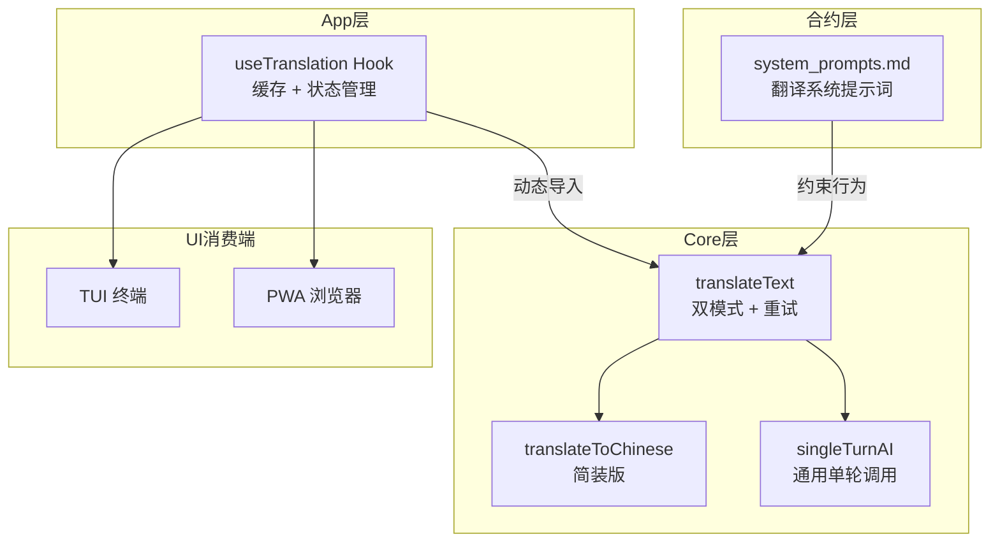
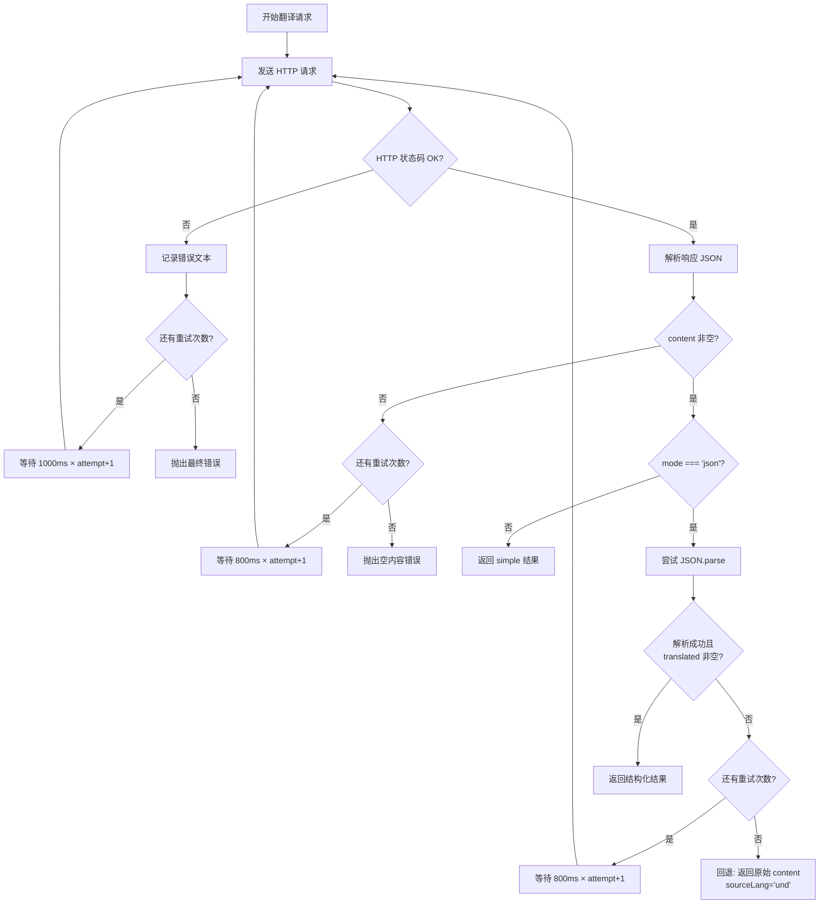

智能翻译系统是 AI Assistant 能力的重要组成部分，它并不作为一个独立的 Bluesky 工具函数暴露给 AI，而是作为一个底层通用接口，供应用层（App & TUI）在需要时将任意文本翻译为目标语言。系统的核心设计围绕**两个正交维度**展开：**响应格式**（simple 纯文本 vs json 结构化）和**容错策略**（指数退避重试）。本文将深入剖析这两个维度的设计原理、实现细节以及它们在 React hook 层的消费方式。

Sources: [packages/core/src/ai/assistant.ts#L524-L610](packages/core/src/ai/assistant.ts#L524-L610), [packages/app/src/hooks/useTranslation.ts](packages/app/src/hooks/useTranslation.ts)

## 架构全景

翻译系统横跨三层架构：

- **Core 层**（`@bsky/core`）：提供 `translateText()`、`translateToChinese()`、`singleTurnAI()` 三个核心函数，以及 `TranslationResult` 接口。这些函数不依赖任何 UI 框架，是纯逻辑层。
- **App 层**（`@bsky/app`）：提供 `useTranslation()` React Hook，封装了状态管理（目标语言、模式切换）和结果缓存。
- **合约层**（`contracts/`）：在 `system_prompts.md` 中定义了翻译系统提示词，作为 AI 行为的契约约束。



Sources: [packages/core/src/index.ts#L17-L18](packages/core/src/index.ts#L17-L18), [packages/app/src/index.ts#L22-L24](packages/app/src/index.ts#L22-L24)

## translateText：双模式设计与重试策略

`translateText()` 是整个翻译系统的枢纽函数。它的函数签名清晰地反映出两个核心设计维度：

```typescript
export async function translateText(
  config: AIConfig,
  text: string,
  targetLang: string,
  mode: 'simple' | 'json' = 'simple',
  maxRetries = 3,
): Promise<TranslationResult>
```

Sources: [packages/core/src/ai/assistant.ts#L524-L537](packages/core/src/ai/assistant.ts#L524-L537)

### simple 模式：纯文本输出

这是最直接的翻译模式，也是 `translateToChinese()` 所使用的向后兼容模式。它的工作原理是向 LLM 发送一个严格约束的系统提示词，要求"仅输出翻译结果，不做解释"。返回结果是一个简单的 `{ translated: string }` 对象。

系统提示词模板：
```
Translate the following text to ${langLabel}. Keep the original meaning, output only the translation, no explanations.
```

**适用场景**：需要快速、干净的翻译结果，不关心源语言识别；对响应延迟敏感的场景（因为纯文本输出通常比 JSON 输出更快）。

Sources: [packages/core/src/ai/assistant.ts#L538-L544](packages/core/src/ai/assistant.ts#L538-L544), [contracts/system_prompts.md#L9-L11](contracts/system_prompts.md#L9-L11)

### json 模式：结构化输出

json 模式在 simple 模式的基础上增加了两个关键特性：**源语言检测** 和 **结构化响应**。系统提示词要求 LLM 输出一个符合特定 schema 的 JSON 对象：

```json
{"source_lang": "<ISO 639-1 code>", "translated": "<the translation>"}
```

系统提示词模板：
```
You are a translator. Translate the user's text to ${langLabel}. Output valid JSON with these keys: {"source_lang": "<ISO 639-1 code, use 'und' if unsure>", "translated": "<the translation>"}. Output ONLY the JSON object. The response must be a valid JSON object containing the word json.
```

需要注意的是，json 模式还额外设置了 `body.response_format = { type: 'json_object' }`，这是一个向 API 发出信号的结构化输出请求——并非所有 LLM 服务都支持该参数，但对于支持的模型（如 GPT-4o 系列），它可以显著提高 JSON 输出的可靠性。

**返回值结构**（`TranslationResult`）：
| 字段 | simple 模式 | json 模式 |
|------|-----------|----------|
| `translated` | ✅ 翻译文本 | ✅ 翻译文本 |
| `sourceLang` | ❌ 始终 undefined | ✅ ISO 639-1 代码或 `'und'` |

**适用场景**：需要自动识别源语言的多语言混排内容，或需要将翻译结果与其他系统集成的场景。

Sources: [packages/core/src/ai/assistant.ts#L539-L544](packages/core/src/ai/assistant.ts#L539-L544), [packages/core/src/ai/assistant.ts#L555-L558](packages/core/src/ai/assistant.ts#L555-L558)

### 指数退避重试机制

翻译系统实现了一个三层级重试策略，每一层应对不同类型的失败模式：



**三层重试的触发条件**：

| 层级 | 触发条件 | 退避策略 | 兜底行为 |
|------|---------|---------|---------|
| 网络/HTTP 层 | `fetch` 抛出异常 或 `res.ok === false` | `1000ms × (attempt + 1)` | 重试耗尽后抛出原始异常 |
| 内容为空 | API 返回但 `content.trim()` 为空 | `800ms × (attempt + 1)` | 重试耗尽后抛出 `'Translation returned empty content after retries'` |
| JSON 解析层 | `JSON.parse` 失败或缺少 `translated` 字段 | `800ms × (attempt + 1)` | 重试耗尽后返回 `{ translated: rawContent, sourceLang: 'und' }` |

第三层（JSON 解析失败）的兜底行为特别值得注意：**尽最大努力恢复**。当 JSON 解析失败时，系统不会让整个翻译失败，而是将原始 LLM 输出作为翻译文本返回，并标记源语言为 `'und'`（unknown）。这是防御性编程的典型实践——宁可返回有噪声的结果，也不让用户看到错误提示。

Sources: [packages/core/src/ai/assistant.ts#L560-L597](packages/core/src/ai/assistant.ts#L560-L597)

## 辅助函数

### translateToChinese：简装便利函数

```typescript
export async function translateToChinese(config: AIConfig, text: string): Promise<string> {
  const result = await translateText(config, text, 'zh', 'simple');
  return result.translated;
}
```

这是一个零配置的便捷入口，固定使用 `simple` 模式和中文目标语言，直接返回纯字符串。它与早期的 `singleTurnAI` 调用方式保持向后兼容。

Sources: [packages/core/src/ai/assistant.ts#L600-L604](packages/core/src/ai/assistant.ts#L600-L604)

### singleTurnAI：通用单轮调用

`singleTurnAI` 是比翻译更通用的基础函数——任何"一次请求、一次响应、无需工具调用"的场景都可以使用它。翻译系统和草稿润色（`polishDraft`）都构建在其之上。它不包含重试逻辑，由调用方自行处理。

Sources: [packages/core/src/ai/assistant.ts#L494-L523](packages/core/src/ai/assistant.ts#L494-L523)

## useTranslation Hook：React 集成层

`useTranslation` Hook 位于 `@bsky/app` 包中，是 Core 层翻译能力到 React 世界的桥梁。它引入了三个关键增强：

### 1. 结果缓存
使用 `useState` 初始化一个 `Map<string, TranslationResult>` 作为内存缓存。缓存键的格式为 `${mode}::${lang}::${text}`，这意味着相同的文本、相同的模式、相同的目标语言在会话期间只会触发一次翻译请求。

### 2. 动态导入（Code Splitting）
```typescript
const { translateText } = await import('@bsky/core');
```
这是一个有意思的设计——`@bsky/core` 的翻译模块是**延迟加载**的。这意味着在应用初始化时，翻译模块不会被加载，只有在用户首次调用 `translate()` 时才会通过动态 `import()` 加载。这减少了初始包体积。

### 3. 状态管理
Hook 暴露了完整的控制接口：
- `lang` / `setLang`：切换目标语言（7种支持的语言）
- `mode` / `setMode`：切换 simple/json 模式
- `loading`：请求状态指示
- `translate(text, overrideLang?)`：翻译方法，支持单次覆盖目标语言

**支持的语言矩阵**：
| 语言 | 代码 | 标签 |
|------|------|------|
| 中文 | `zh` | 中文 |
| 英语 | `en` | English |
| 日语 | `ja` | 日本語 |
| 韩语 | `ko` | 한국어 |
| 法语 | `fr` | Français |
| 德语 | `de` | Deutsch |
| 西班牙语 | `es` | Español |

Sources: [packages/app/src/hooks/useTranslation.ts](packages/app/src/hooks/useTranslation.ts)

## 与 AI Assistant 的对比

理解翻译系统的一个重要视角是它与 `AIAssistant` 类的区别。两者底层都使用相同的 `fetch` 调用和 `AIConfig` 配置，但服务于完全不同的目的：

| 特性 | AIAssistant 类 | translateText / singleTurnAI |
|------|---------------|------------------------------|
| **对话轮次** | 多轮（最多 10 轮工具调用） | 单轮 |
| **工具调用** | ✅ 支持 31 个 Bluesky 工具 | ❌ 无工具 |
| **流式输出** | ✅ sendMessageStreaming | ❌ 非流式 |
| **重试机制** | ❌ 无重试，直接抛出 | ✅ 三层指数退避重试 |
| **输出格式** | 自由文本 | simple: 纯文本 / json: 结构化 |
| **适用场景** | 复杂的多步骤 AI 任务 | 翻译、润色、问题生成等原子操作 |

这个对比清晰地揭示了架构设计中的一个原则：**复杂度分层**。复杂的多轮推理走 `AIAssistant`，简单的原子操作走 `singleTurnAI` / `translateText`。两者互不依赖，各自有独立的错误处理策略。

Sources: [packages/core/src/ai/assistant.ts](packages/core/src/ai/assistant.ts)

## 最佳实践与配置建议

### 选择合适的模式

- **默认使用 simple 模式**：除非你有明确的源语言检测需求，否则 simple 模式更快、更可靠、成本更低。
- **仅在需要时启用 json 模式**：当文本是多语言混排，或你需要自动路由到不同的下游处理流程时开启 json 模式。

### 调整重试参数

默认的 `maxRetries = 3` 和退避基数（800ms / 1000ms）经过了经验测试，适用于大多数场景。如果遇到频繁的 API 限流，可以考虑：
- 增加 `maxRetries` 到 5
- 或者调整退避基数（当前实现中使用硬编码值，可根据需要修改）

### 缓存策略

`useTranslation` 的内存缓存是 session 级别的——刷新页面即丢失。如果需要持久化缓存（例如：用户在 PWA 中频繁翻译同样的帖子），可以考虑在 Hook 外层增加 `localStorage` 持久化层，缓存键可以使用内容哈希。

Sources: [packages/core/src/ai/assistant.ts#L560-L562](packages/core/src/ai/assistant.ts#L560-L562), [packages/app/src/hooks/useTranslation.ts](packages/app/src/hooks/useTranslation.ts)

## 测试覆盖

翻译系统的集成测试位于 `packages/core/tests/ai_integration.test.ts`，覆盖以下场景：

1. **中英翻译**：验证 `translateToChinese` 输出的中文字符占比
2. **草稿润色**：验证 `polishDraft` 在"更正式"和"更幽默"两种要求下的输出
3. **引导问题生成**：通过 `singleTurnAI` 为指定帖子生成上下文相关的问题

需要说明的是，翻译测试**依赖真实的 LLM API**（通过环境变量 `LLM_API_KEY` 配置），这符合整个项目的"无 Mock 集成测试"策略——关于这一点，详见 [基于真实 API 的无 Mock 集成测试策略](29-ji-yu-zhen-shi-api-de-wu-mock-ji-cheng-ce-shi-ce-lue)。

Sources: [packages/core/tests/ai_integration.test.ts#L73-L126](packages/core/tests/ai_integration.test.ts#L73-L126)

## 下一步阅读

完成本文后，建议继续阅读以下相关章节：

- [AIAssistant 类：多轮对话、工具调用与 SSE 流式输出](9-aiassistant-lei-duo-lun-dui-hua-gong-ju-diao-yong-yu-sse-liu-shi-shu-chu)：了解翻译系统底层依赖的 AI 对话引擎
- [系统提示词合约：角色定义、翻译与草稿润色 Prompt](27-xi-tong-ti-shi-ci-he-yue-jiao-se-ding-yi-fan-yi-yu-cao-gao-run-se-prompt)：查看翻译系统提示词的精确定义
- [国际化多语言支持：i18n 系统与语言包结构](16-guo-ji-hua-duo-yu-yan-zhi-chi-i18n-xi-tong-yu-yu-yan-bao-jie-gou)：了解 UI 层的多语言支持如何与翻译系统配合