`@bsky/app` 层采用了一种不依赖外部状态管理库（Redux、Zustand、Jotai 等）的轻量级架构：**纯 Store + React Hook 模式**。核心思想是将状态逻辑封装在独立于 React 生命周期的纯 TypeScript Store 对象中，再通过 React Hook 建立桥接层，实现订阅驱动的视图更新。这种模式既避免了全局状态树的复杂性，也保持了 React 组件的纯净与可测试性。

Sources: [packages/app/src/stores](packages/app/src/stores)

## 架构全景：三层分离

整个状态管理系统围绕三条清晰的职责边界组织：

```mermaid
graph TD
    subgraph "Store Layer（纯 TS）"
        A[createAuthStore] --> A_state[state: client / session / profile]
        A --> A_actions[actions: login / restoreSession]
        A --> A_sub[subscribe / _notify]
        
        T[createTimelineStore] --> T_state[state: posts / cursor / loading]
        T --> T_actions[actions: load / loadMore / refresh]
        T --> T_sub[subscribe / _notify]
        
        P[createPostDetailStore] --> P_state[state: post / flatThread / translations]
        P --> P_actions[actions: load / translate]
        P --> P_sub[subscribe / _notify]
        
        N[createNavigation] --> N_state[state: stack / currentView]
        N --> N_actions[actions: goTo / goBack / goHome]
        N --> N_sub[subscribe（多监听器）]
    end

    subgraph "Hook Layer（React 桥接）"
        H_useAuth -->|创建 Store| A
        H_useAuth -->|订阅| A_sub
        H_useAuth -->|暴露| H_A_ret[client / login / ...]
        
        H_useTimeline -->|创建 Store| T
        H_useTimeline -->|订阅| T_sub
        H_useTimeline -->|暴露| H_T_ret[posts / loadMore / ...]
        
        H_usePostDetail -->|创建 Store| P
        H_usePostDetail -->|订阅| P_sub
        H_usePostDetail -->|暴露| H_P_ret[post / actions / ...]
        
        H_useNavigation -->|创建 Controller| N
        H_useNavigation -->|订阅| N_sub
        H_useNavigation -->|暴露| H_N_ret[currentView / goTo / ...]
    end

    subgraph "Consumer Layer"
        C_TUI[TUI Components - Ink]
        C_PWA[PWA Components - React]
    end

    H_useAuth --> C_TUI
    H_useAuth --> C_PWA
    H_useTimeline --> C_TUI
    H_useTimeline --> C_PWA
    H_usePostDetail --> C_TUI
    H_useNavigation --> C_TUI
    H_useNavigation --> C_PWA
```



三层中，Store layer 是纯 TypeScript，不引用任何 React API，可在 Node.js 环境中独立测试；Hook layer 作为 React 适配器，负责将 Store 的变化转化为 React 组件的重渲染。

Sources: [packages/app/src/stores/auth.ts](packages/app/src/stores/auth.ts#L1-L70), [packages/app/src/stores/timeline.ts](packages/app/src/stores/timeline.ts#L1-L75)

## Store 模式：订阅通知的两种变体

项目中存在两种订阅模式变体，区别在于监听器的容器类型：

### 单监听器模式（stores/ 目录下的数据 Store）

`createAuthStore`、`createTimelineStore`、`createPostDetailStore` 三个工厂函数采用单监听器设计。Store 内部只维护一个 `listener: (() => void) | null` 引用，`subscribe(fn)` 直接赋值，返回的取消函数将其置空。这种设计假设每个 Store 实例在生命周期内只会被一个 Hook 拥有——这正是 `useState(() => createXxxStore())` 延迟初始化所保证的：

```typescript
// stores/auth.ts — 核心模式
export function createAuthStore(): AuthStore {
  const store: AuthStore = {
    client: null,
    session: null,
    profile: null,
    loading: false,
    error: null,
    listener: null,

    async login(handle: string, password: string) {
      store.loading = true;
      store.error = null;
      store._notify();                    // ⚡ 操作前通知（显示 loading）
      try {
        const c = new BskyClient();
        store.session = await c.login(handle, password);
        store.client = c;
        store.profile = await store.client.getProfile(handle);
      } catch (e) {
        store.error = e instanceof Error ? e.message : String(e);
      } finally {
        store.loading = false;
        store._notify();                  // ⚡ 操作完成后通知（更新结果）
      }
    },

    _notify() { if (store.listener) store.listener(); },
    subscribe(fn) {
      store.listener = fn;
      return () => { store.listener = null; };
    },
  };
  return store;
}
```

Sources: [packages/app/src/stores/auth.ts](packages/app/src/stores/auth.ts#L1-L70)

### 多监听器模式（state/ 目录与 i18n Store）

`createNavigation`（位于 `state/navigation.ts`）和 `createI18nStore`（位于 `i18n/store.ts`）使用数组或 `Set` 维护多个监听器。前者服务于导航系统，因为一个 `NavigationController` 实例需要被多个消费者订阅（TUI 的键盘事件处理器、PWA 的路由监听器）；后者作为模块级单例（通过 `getI18nStore()` 获取），天然可能被多个组件同时订阅：

```typescript
// state/navigation.ts — 多监听器变体
export function createNavigation() {
  let stack: AppView[] = [{ type: 'feed' }];
  let listeners: Array<() => void> = [];

  function subscribe(fn: () => void) {
    listeners.push(fn);
    return () => { listeners = listeners.filter(l => l !== fn); };
  }

  function notify() { listeners.forEach(fn => fn()); }
  // ...
}
```

```typescript
// i18n/store.ts — Set 变体
export function createI18nStore(initialLocale: Locale = 'zh'): I18nStore {
  const listeners = new Set<() => void>();
  // ...
  subscribe(fn) {
    listeners.add(fn);
    return () => { listeners.delete(fn); };
  },
}
```

为什么 Navigation 和 I18n 选择多监听器？导航状态控制视图切换、键盘聚焦、返回栈等多处逻辑；国际化状态被语言选择器、消息组件等多处消费。单监听器适合"一个 Store 对唯一 Hook"的1:1关系，多监听器适合"一个状态源对多个消费者"的 1:N 关系。

Sources: [packages/app/src/state/navigation.ts](packages/app/src/state/navigation.ts#L27-L66), [packages/app/src/i18n/store.ts](packages/app/src/i18n/store.ts#L28-L85)

## Hook 桥接层：订阅驱动的渲染触发

React Hook 的职责是将纯 Store 连接到 React 渲染循环。所有 Store-backed Hook 遵循完全一致的模板，这里以 `useAuth` 为例进行拆解：

```typescript
export function useAuth() {
  // [1] 延迟创建 Store 实例 — 组件挂载时执行一次，后续重渲染不复用
  const [store] = useState(() => createAuthStore());

  // [2] Tick counter — 存储一个数字，递增即可触发重渲染
  const [, force] = useState(0);
  const tick = useCallback(() => force(n => n + 1), []);

  // [3] 订阅 Store — 组件挂载时注册 tick，卸载时自动取消
  useEffect(() => store.subscribe(tick), [store, tick]);

  // [4] 解构暴露 — 只暴露读取 API，不暴露 Store 内部引用
  return {
    client: store.client,
    session: store.session,
    profile: store.profile,
    loading: store.loading,
    error: store.error,
    login: (h: string, p: string) => store.login(h, p),
    restoreSession: (s: CreateSessionResponse) => store.restoreSession(s),
  };
}
```

Sources: [packages/app/src/hooks/useAuth.ts](packages/app/src/hooks/useAuth.ts#L1-L23)

这段代码包含四个关键设计决策：

**设计决策 1：`useState(() => createXxxStore())` — 延迟初始化**。传入 `useState` 的是工厂函数而非函数调用结果，确保 Store 只在组件首次渲染时创建一次。后续重渲染中 `store` 引用恒定不变——这保证了 `useEffect` 的依赖稳定，不会重复订阅/取消订阅。

**设计决策 2：Tick counter 作为 React 的强制更新机制**。React 没有内置的"订阅外部数据源后自动重渲染"机制（除了 `useSyncExternalStore`），因此需要手动触发。每次 `store._notify()` 调用 `tick`，`force` 的 setter `force(n => n + 1)` 让 state 值变为不同的数字，React 检测到变化后触发组件重渲染。这个模式比空对象 `({})` 更可靠——数字比较是严格相等，不会出现引用陷阱。

**设计决策 3：`useEffect` 返回取消函数**。`store.subscribe(fn)` 返回的取消函数作为 `useEffect` 的清理函数，组件卸载时自动执行，彻底消除内存泄漏风险。这是 React 18 严格模式下需要特别关注的点——严格模式会双重执行 effect，但因为 subscribe 的返回值正确清理，两次订阅/取消不会累积监听器。

**设计决策 4：解构暴露而非返回 Store 引用**。Hook 的返回值是 plain object 的常量属性与函数，而不是 Store 引用。这样做有两个好处：防止消费者直接修改 Store 内部状态（绕过 `_notify`）；允许 Hook 层做额外的转换或适配（例如 `usePostDetail` 中的 `actions` 对象组合）。

## 两套 Hook 风格：Store-backed vs Self-contained

项目中的 14 个 Hook 分为两种不同风格，这种划分反映了异步状态的复杂度。

| 特征 | Store-backed Hooks | Self-contained Hooks |
|------|-------------------|---------------------|
| 代表 Hook | `useAuth`, `useTimeline`, `usePostDetail` | `useProfile`, `useSearch`, `useNotifications`, `useBookmarks`, `useCompose`, `useThread`, `useDrafts` |
| 状态存储 | 独立的 Store 文件（`stores/`） | Hook 内部的 `useState` |
| 状态复杂度 | 多维度（data + loading + error + 缓存/派生状态） | 简单扁平（通常 2-3 个 state） |
| 跨组件共享 | 否（每个 Hook 实例独立 Store） | 否（完全隔离） |
| 订阅机制 | 显式 `subscribe/_notify` | 隐式（React setter 驱动） |
| 测试方式 | 可单独测试 Store（纯 TS） | 需配合 React Testing Library |

核心判断标准：**当异步操作涉及多个状态变量需要原子性更新（如 loading→data→error 的完整生命周期），且可能存在缓存（如 `postDetail.translations` Map），就值得拆分为独立 Store**。反之，简单的一次性数据获取（如 `useProfile` 一次调用获取 profile/follows/followers）使用 `useState` + `useEffect` 自包含即可。

Sources: [packages/app/src/hooks/useProfile.ts](packages/app/src/hooks/useProfile.ts#L1-L23), [packages/app/src/hooks/useSearch.ts](packages/app/src/hooks/useSearch.ts#L1-L26), [packages/app/src/hooks/useNotifications.ts](packages/app/src/hooks/useNotifications.ts#L1-L28)

## 细粒度状态更新：操作前后的双 _notify 策略

一个值得深入的设计细节是 Store 中 `_notify()` 的调用时机。以 `createTimelineStore` 的 `load` 方法为例：

```typescript
async load(client) {
  store.loading = true;
  store._notify();       // ⚡ 通知①：loading=true，UI 可显示加载指示器

  try {
    const res = await client.getTimeline(20);
    store.posts = res.feed.map(f => f.post);
    store.cursor = res.cursor;
    store.error = null;
  } catch (e) {
    store.error = e instanceof Error ? e.message : String(e);
  } finally {
    store.loading = false;
    store._notify();     // ⚡ 通知②：数据更新完毕，UI 渲染最新结果
  }
}
```

Sources: [packages/app/src/stores/timeline.ts](packages/app/src/stores/timeline.ts#L16-L39)

这种"操作前通知 + 操作后通知"的双 `_notify` 策略（类似 Redux 的 `dispatch(pending)` + `dispatch(fulfilled/rejected)`）确保了 UI 的流畅性。操作前的通知让 `loading=true` 立即生效，操作完成后的通知让数据或错误状态呈现。如果采用数据驱动而非命令式的"设置值即通知"方式（即每个赋值语句后都调用 `_notify`），会导致 React 批量更新失效——所幸 React 18 的自动批处理（Automatic Batching）使得同一个同步代码块内的多次 `setState` 只会触发一次重渲染，前提是 `_notify` 触发的 tick 更新必须足够靠近。

## 与 React 生态的对比

| 维度 | 纯 Store + React Hook | Zustand | Redux Toolkit |
|------|----------------------|---------|---------------|
| 概念复杂度 | 低（2 个概念：Store + Hook） | 低（1 个概念：Store + Hook） | 中（Slice / Store / Dispatch / Selector） |
| 模板代码 | 中（需手写 subscribe/notify） | 低（自动订阅） | 中（createSlice + configureStore） |
| 依赖 | 零（纯 React + TypeScript） | ~2KB | ~12KB + Immer |
| 测试友好度 | 极高（Store 即普通对象） | 高 | 中（需配置 store） |
| 灵活性 | 完全控制订阅时机 | 自动代理式订阅 | selector 浅比较 |
| TypeScript 推导 | 完全手动 | 自动推导 | 自动推导 |

选择纯 Store 模式而非 Zustand 或 Redux Toolkit 的原因可归结为：**零外部依赖 + 完全透明的订阅机制 + 与测试环境的无缝集成**。对于一个 monorepo 中仅服务两个终端（TUI + PWA）的应用层而言，引入第三方状态管理库带来的抽象收益不足以抵消其依赖成本和概念负担。

## 系统内所有 Hook 一览

以下是 `@bsky/app` 导出的全部 14 个公共 Hook 及其分类：

| Hook | 风格 | 核心职责 | 依赖（参数） |
|------|------|---------|-------------|
| `useAuth` | Store-backed | 登录/恢复会话 | 无 |
| `useTimeline` | Store-backed | 时间线分页加载 | `client` |
| `usePostDetail` | Store-backed | 帖子详情 + 翻译缓存 | `client`, `uri`, `goTo`, `aiKey`, `aiBaseUrl` |
| `useNavigation` | Store-backed（多监听器） | 视图路由栈 | 无 |
| `useI18n` | Store-backed（单例） | 国际化翻译 | 无 |
| `useThread` | Self-contained | 讨论线程扁平化 + 展开 | `client`, `uri` |
| `useCompose` | Self-contained | 发帖/回复/引用 | `client`, `goBack` |
| `useDrafts` | Self-contained | 草稿本地管理 | 无 |
| `useProfile` | Self-contained | 用户资料 + 粉丝/关注 | `client`, `actor` |
| `useSearch` | Self-contained | 帖子搜索 | `client` |
| `useNotifications` | Self-contained | 通知列表 + 未读计数 | `client` |
| `useBookmarks` | Self-contained | 书签管理（增删改查） | `client` |
| `useChatHistory` | Self-contained | 聊天记录持久化 | 可选 `storage` |
| `useTranslation` | Self-contained | AI 翻译（带缓存） | `aiKey`, `aiBaseUrl` |

Sources: [packages/app/src/index.ts](packages/app/src/index.ts#L1-L30)

完整签名与详细用法请查看 [所有 Hook 签名速查](14-suo-you-hook-qian-ming-su-cha-useauth-usetimeline-usethread-useaichat-deng)。

## 测试策略

由于 Store 是纯 TypeScript 对象，不依赖 React 渲染环境，其测试可以在 Node.js 中直接进行——无需 `@testing-library/react`、无需 `jsdom`、无需组件挂载：

```typescript
// 示例：直接测试 createTimelineStore（不依赖 React）
import { createTimelineStore } from '../stores/timeline.js';

describe('TimelineStore', () => {
  it('初始状态正确', () => {
    const store = createTimelineStore();
    expect(store.posts).toEqual([]);
    expect(store.loading).toBe(false);
    expect(store.error).toBeNull();
  });

  it('订阅机制触发通知', () => {
    const store = createTimelineStore();
    const listener = vi.fn();
    store.subscribe(listener);
    store.loading = true;
    store._notify();
    expect(listener).toHaveBeenCalledTimes(1);
  });
});
```

依赖于 `BskyClient` 的 Store 方法（如 `load`、`login`）可以注入 mock client 进行单元测试，或在集测中连接真实 API。更详细的集成测试策略请参考 [基于真实 API 的无 Mock 集成测试策略](29-ji-yu-zhen-shi-api-de-wu-mock-ji-cheng-ce-shi-ce-lue)。

Sources: [packages/app/src/stores/timeline.ts](packages/app/src/stores/timeline.ts#L1-L75)

## 总结与下一步

纯 Store + React Hook 模式的本质是：**用最简单的工具（plain object + function + useEffect）实现订阅驱动的状态管理**。它不追求"一次学习，到处使用"的通用框架，而是精准适配 `@bsky/app` 层的实际需求——有状态的 Bluesky 客户端操作、有限的数据流复杂度、双终端（TUI/PWA）共享的 Hook 接口。这个模式将异步操作的生命周期（loading → data/error → 重新加载）建模得足够清晰，同时将测试复杂度降到了最低。

想要理解这一模式在实际组件中如何被消费，推荐继续阅读 [导航系统与 AppView 视图路由设计](13-dao-hang-xi-tong-yu-appview-shi-tu-lu-you-she-ji)，其中展示了 `useNavigation` 如何驱动 TUI 和 PWA 的视图切换。如果你更关心所有 Hook 的输入输出签名，请直接跳转 [所有 Hook 签名速查](14-suo-you-hook-qian-ming-su-cha-useauth-usetimeline-usethread-useaichat-deng)。