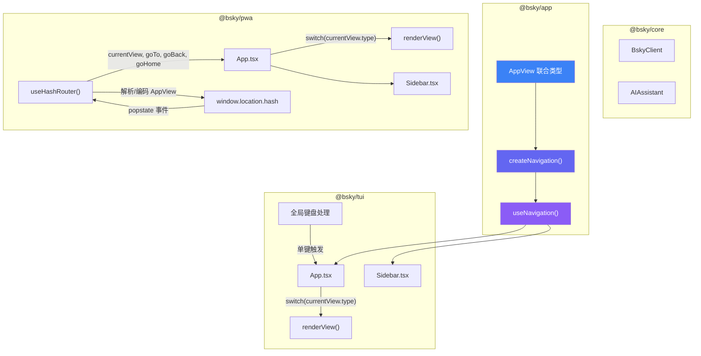

## 问题域：双端共享的视图路由抽象

在双端（TUI + PWA）架构中，导航系统面临一个核心矛盾：**终端模拟器没有浏览器 URL**，而 **PWA 部署在静态托管平台上只支持 hash 路由**。这两端需要对同一组"视图"（时间线、讨论串、发帖、通知、搜索等）做导航切换，且切换逻辑必须是声明式的、可测试的、与渲染层解耦的。解决方案是在 `@bsky/app` 层定义一个抽象的 **AppView 联合类型**，并基于纯 Store + React Hook 模式暴露给两端使用。

## AppView：声明式视图描述符

每个视图都被建模为一个带 type 标签的联合类型。不同视图携带各自所需的参数——讨论串需要 `uri`，搜索可以有 `query`，发帖可以携带 `replyTo` 上下文——所有参数都是纯 JSON 可序列化的。

```typescript
export type AppView =
  | { type: 'feed' }
  | { type: 'detail'; uri: string }
  | { type: 'thread'; uri: string }
  | { type: 'compose'; replyTo?: string; quoteUri?: string }
  | { type: 'profile'; actor: string }
  | { type: 'notifications' }
  | { type: 'search'; query?: string }
  | { type: 'aiChat'; contextUri?: string }
  | { type: 'bookmarks' };
```

这是一个**声明式而非命令式**的设计。调用者只需描述"我要去哪里"（what），无需关心"怎么去"（how）。TUI 和 PWA 两端各自承担从 AppView 到实际渲染的映射职责。`detail` 视图虽然已在类型中定义，但目前主要在 TUI 端通过 `thread` 视图间接使用，未作为独立视图入口暴露。

**Sources**: [state/navigation.ts](packages/app/src/state/navigation.ts#L1-L11)

## createNavigation：栈式导航的纯 Store

导航系统的核心是一个纯函数式 Store `createNavigation()`，它维护一个 `AppView[]` 栈，并提供 `goTo`（入栈）、`goBack`（出栈）、`goHome`（清空栈回到 feed）三个方法。

```typescript
function createNavigation() {
  let stack: AppView[] = [{ type: 'feed' }];
  let listeners: Array<() => void> = [];

  function getState() {
    return {
      currentView: stack[stack.length - 1]!,
      canGoBack: stack.length > 1,
      stack, goTo, goBack, goHome,
    };
  }

  function goTo(view: AppView) {
    stack = [...stack, view];    // 不可变入栈
    notify();
  }

  function goBack() {
    if (stack.length > 1) {
      stack = stack.slice(0, -1);  // 不可变出栈
      notify();
    }
  }

  function goHome() {
    stack = [{ type: 'feed' }];    // 重置
    notify();
  }
  // ...subscribe/notify
}
```

几个值得关注的设计决策：

- **不可变性**：`goTo` 和 `goBack` 都创建新数组而非修改原数组。这并非性能敏感路径（导航栈深度通常不超过 10），但确保了 React 引用比较的可靠性，避免了状态共享带来的副作用。
- **订阅机制**：采用手动 `subscribe/notify` 模式而非 MobX/Zustand 等第三方库。每个方法调用后触发 `notify()`，遍历所有监听器。这个模式与其他 Store（auth、timeline）完全一致，是 `@bsky/app` 层的统一约定。
- **goHome 的确定性**：`goHome()` 直接重置为 `[{ type: 'feed' }]`，而不是从栈底回溯，这保证了"回到首页"的语义始终是回到 feed 视图，无论用户当前在哪一层导航。

**Sources**: [state/navigation.ts](packages/app/src/state/navigation.ts#L13-L66)

## useNavigation：从纯 Store 到 React Hook

`useNavigation()` 是 `createNavigation()` 的 React 封装，基于 `useState` + `useEffect` 实现订阅驱动的状态同步：

```typescript
export function useNavigation() {
  const [nav] = useState(() => createNavigation());
  const [state, setState] = useState(() => nav.getState());
  const tick = useCallback(() => setState(nav.getState()), [nav]);
  useEffect(() => nav.subscribe(tick), [nav, tick]);

  return {
    currentView: state.currentView,
    canGoBack: state.canGoBack,
    goTo: (v: AppView) => nav.goTo(v),
    goBack: () => nav.goBack(),
    goHome: () => nav.goHome(),
  };
}
```

这里有一个故意的模式：**按需解构而非返回整个 state 对象**。Hook 只暴露 `currentView` 和 `canGoBack` 两个状态字段，以及三个操作方法。`stack` 本身被隐藏在 store 内部，消费者不需要知道栈的实现细节。

`canGoBack` 是 TUI 和 PWA 两端共享的状态——当栈深度 > 1 时，表明用户处于非首页视图，两端各自用此状态控制"返回"UI 元素的可见性。

**Sources**: [hooks/useNavigation.ts](packages/app/src/hooks/useNavigation.ts#L1-L21)

## 路由架构对比：TUI 与 PWA

两端共享相同的 `AppView` 类型和 `useNavigation` Hook，但在视图渲染和导航触发的实现方式上存在本质差异。



上图中，核心差异在于导航的**存储位置与触发方式**：

**TUI 端**：`useNavigation()` 直接维护内存中的栈。视图切换通过 `useInput` 全局键盘钩子监听单键快捷键（`t`→feed, `n`→notifications, `p`→profile, `s`→search, `a`→AI Chat, `c`→compose, `b`→bookmarks, `Esc`→goBack），这些快捷键在 `App.tsx` 的 `useInput` 回调中集中处理并调用 `goTo()`。导航状态随 React 组件树生命周期存在，刷新即丢失。

**PWA 端**：PWA 使用 `useHashRouter` 替代 `useNavigation`，两者暴露**完全相同的接口签名**（`{ currentView, canGoBack, goTo, goBack, goHome }`），但内部实现完全不同。`useHashRouter` 将 `AppView` 序列化为 URL hash（如 `#/thread?uri=at://...`），依赖 `popstate` 事件监听浏览器的前进/后退按钮。这使得 PWA 享受了浏览器原生导航能力——用户可以使用浏览器的后退按钮，刷新页面后视图状态保持。

**Sources**: 
- [TUI App.tsx](packages/tui/src/components/App.tsx#L1-L482)
- [PWA useHashRouter](packages/pwa/src/hooks/useHashRouter.ts#L1-L137)
- [PWA App.tsx](packages/pwa/src/components/Layout.tsx#L1-L167)

## 视图渲染：switch 驱动的组件分发

两端都采用**基于 `currentView.type` 的 switch 分发模式**，将视图描述符映射到具体的组件。这种模式与 Redux 的 reducer 思想一脉相承——视图是一个纯函数 `(currentView: AppView) => ReactNode`。

### TUI 视图映射

TUI 的 `renderView()` 函数在 `App.tsx` 中定义，每个 case 对应一个独立组件：

| AppView.type | TUI 组件 | 附加状态 |
|---|---|---|
| `feed` | `PostList` + 内联 head | `feedIdx`（选中索引）, `posts`/`feedLoading`/`cursor` |
| `thread` | `UnifiedThreadView` | `threadKey`（强制刷新 key） |
| `compose` | 内联渲染（`ink-text-input` + 图片上传） | `composeDraft`, `composeImages`, `draftListOpen` 等 |
| `profile` | `ProfileView` | — |
| `notifications` | `NotifView` | — |
| `search` | `SearchView` | — |
| `aiChat` | `AIChatView` | `focusedPanel`（'main'/'ai' 双焦点） |
| `bookmarks` | 内联列表渲染 | `bookmarkIdx` |

TUI 的 renderView 以**内联 + 独立组件混合**的方式实现——feed 和 compose 由于需要大量 TUI 特有的交互状态（选中索引、草稿输入、图片路径输入），直接在 `App.tsx` 中内联渲染；而 thread、profile、notifications、search、aiChat 等视图则封装为独立组件。

**Sources**: [TUI App.tsx](packages/tui/src/components/App.tsx#L264-L424)

### PWA 视图映射

PWA 的 `renderView()` 在 `App.tsx` 中定义，每个 case 对应一个页面级组件：

| AppView.type | PWA 组件 | 传递的参数 |
|---|---|---|
| `feed` | `FeedTimeline` | `posts`, `loading`, `cursor`, `loadMore`, `refresh` + 滚动索引 |
| `thread` | `ThreadView` | `uri`, `goBack`, `goTo`, AI 配置 |
| `compose` | `ComposePage` | `replyTo`, `quoteUri`, `goBack`, `goHome` |
| `profile` | `ProfilePage` | `actor`, `goBack`, `goTo` |
| `notifications` | `NotifsPage` | `goBack`, `goTo` |
| `search` | `SearchPage` | `initialQuery`, `goBack`, `goTo` |
| `aiChat` | `AIChatPage` | `aiConfig`, `contextUri`, `goBack` |
| `bookmarks` | `BookmarkPage` | `goBack`, `goTo` |

PWA 的每个视图都是完全独立的页面组件，接收 `goTo` 和 `goBack` 作为 props 以实现内部导航。这与 TUI 端形成对比——TUI 的键盘快捷键在 `App.tsx` 的 `useInput` 中集中处理，而 PWA 的导航触发分散在各页面组件内，通过 `goTo` prop 传递。

**Sources**: [PWA App.tsx](packages/pwa/src/App.tsx#L76-L164)

## Sidebar：两端导航入口的一致性设计

两端 Sidebar 虽然渲染技术栈不同（TUI 使用 Ink `Box/Text`，PWA 使用 HTML `button`），但共享相同的导航条目集合和激活态判断逻辑。

### TUI Sidebar 的关键特性

TUI Sidebar 固定 7 个标签页（feed → notifications → search → profile → bookmarks → aiChat → compose），每个标签页关联一个单键快捷键（t/n/s/p/b/a/c）。激活态的标签页用 `'▶'` 前缀标识，并应用蓝色背景高亮。当 `currentView.type` 与标签页的 `key` 匹配时，该标签页被标记为激活态。

Sidebar 底部还有一个动态条件渲染的返回提示：当 `canGoBack` 为 true 时，显示 `'← Esc: Back'` 文本，引导用户按键返回。

**面包屑（Breadcrumb）**：Sidebar 顶部根据 `currentView.type` 渲染对应的面包屑标签，使用 `BREADCRUMB_EMOJI` 和 `BREADCRUMB_KEY` 两个映射表。此时 TUI 没有浏览器的 location bar，面包屑承担了"告知用户当前位置"的信息角色。

**Sources**: [TUI Sidebar.tsx](packages/tui/src/components/Sidebar.tsx#L1-L96)

### PWA Sidebar 的关键特性

PWA Sidebar 使用与 TUI 完全相同的 7 个标签页 SIDEBAR_TABS 常量数组（emoji + i18n key + type + needsHandle 四字段结构）。激活态通过 Tailwind CSS 类实现：`bg-primary/10 text-primary font-semibold border-primary`。

PWA Sidebar 特有的两个设计：

1. **profile 标签页的动态 actor**：`needsHandle: true` 标记指示 `profile` 视图的 `actor` 参数需要从已登录用户的 handle 动态获取。当点击 profile 标签时，调用 `goTo({ type: 'profile', actor: handle })`——这个动态 actor 参数在 TUI 端则通过 `config.blueskyHandle` 直接硬编码获取。

2. **通知徽章（Badge）与草稿计数**：通知标签显示来自 `useNotifications` 的 `unreadCount`，compose 标签显示来自 `useDrafts` 的 `drafts.length`。两者都通过圆角 badge 组件展示在标签右侧，数字超过 99 时显示 `'99+'`。

**Sources**: [PWA Sidebar.tsx](packages/pwa/src/components/Sidebar.tsx#L1-L68)

## Hash 路由：AppView 与 URL 的双向映射

`useHashRouter` 是 PWA 端特有的 Hook，它实现了 `AppView ↔ URL hash` 的双向映射。这是整个 PWA 导航的核心——没有它，PWA 将无法支持浏览器刷新恢复、前进后退等基本导航行为。

### 编码/解码协议

`encodeView(view: AppView) → string` 和 `parseHash() → AppView` 构成了编解码的映射函数：

| AppView | Hash 格式 | 示例 |
|---|---|---|
| `feed` | `#/feed` | `#/feed` |
| `thread` | `#/thread?uri=...` | `#/thread?uri=at%3A%2F%2F...` |
| `profile` | `#/profile?actor=...` | `#/profile?actor=did%3Aplc%3A...` |
| `notifications` | `#/notifications` | `#/notifications` |
| `search` | `#/search` 或 `#/search?q=...` | `#/search?q=bluesky` |
| `bookmarks` | `#/bookmarks` | `#/bookmarks` |
| `compose` | `#/compose` 或带参数 | `#/compose?replyTo=...` |
| `aiChat` | `#/ai` 或 `#/ai?context=...` | `#/ai?context=at%3A%2F%2F...` |

注意 `aiChat` 类型被编码为 `#/ai` 而非 `#/aichat`——这是为了 URL 可读性做的有意选择。

### 与浏览器历史的集成

`useHashRouter` 使用 `window.history.pushState` 而非直接赋值 `window.location.hash`。这是关键的设计决策：`pushState` 触发的 hash 变更会创建新的历史条目，允许用户使用浏览器后退按钮逐级返回。同时，通过 `popstate` 事件监听器同步 `AppView` 状态，确保浏览器前进/后退时 React 组件重新渲染。

```typescript
const goTo = useCallback((view: AppView) => {
  const hash = encodeView(view);
  window.history.pushState(null, '', hash);  // 创建历史条目
  setCurrentView(view);                       // 同步 React 状态
  setCanGoBack(true);
}, []);
```

`goBack()` 的实现则直接委托给 `window.history.back()`，让浏览器处理历史栈的弹出——这与 `createNavigation` 的 `goBack()` 形成有趣的对比：前者依赖浏览器能力，后者手动管理内存数组。

**Sources**: [PWA useHashRouter](packages/pwa/src/hooks/useHashRouter.ts#L1-L137)

## AppView 在更大架构中的角色

`AppView` 不仅驱动视图渲染，它还作为跨层导航契约，在 `@bsky/app` 中承担了两个额外职责：

1. **AI 工具上下文**：`@bsky/core` 的 `createTools` 函数使用 `AppView` 类型作为工具调用的导航目标。当 AI 助手通过工具调用请求导航到特定视图时（例如"帮我去看看通知"），工具函数返回一个 `AppView` 对象，由上层路由系统处理。相关代码可在 `@bsky/core` 的 `tools` 配置中找到。

2. **Store 联动**：`auth` 和 `timeline` 等 Store 虽然不直接使用 `AppView`，但它们的生命周期与导航绑定——例如 `TUI App.tsx` 中通过 `useEffect` 监听 `currentView.type` 在进入 bookmarks 视图时触发 `bookmarks.refresh()`，在进入 compose 视图时重置 compose 状态。

**Sources**: 
- [TUI App.tsx](packages/tui/src/components/App.tsx#L71-L76)
- [PWA App.tsx](packages/pwa/src/App.tsx#L25-L36)

## 架构决策模式总结

| 决策维度 | TUI 端 | PWA 端 |
|---|---|---|
| 导航状态存储 | 内存栈（useState） | URL hash + history API |
| 视图触发方式 | 全局键盘快捷键（useInput） | 按钮点击 + 浏览器前进/后退 |
| 返回机制 | 手动栈出栈（slice） | `window.history.back()` |
| 刷新恢复 | 不支持（需重新登录） | 支持（hash 保持 + localStorage 会话） |
| 页面标题指示 | Sidebar 面包屑 + 顶栏 viewLabel | 无（浏览器 tab title 待实现） |
| goHome 实现 | 重置栈为 `[{ type: 'feed' }]` | `pushState('#/feed')` + 状态重置 |
| 渲染粒度 | 内联 + 独立组件混合 | 全部独立页面组件 |

两个端共享 `AppView` 联合类型、`createNavigation` 的栈式逻辑、`useNavigation` 的接口签名。差异主要来自于运行环境对导航能力的不同约束——终端只有键盘事件，浏览器有 URL 和 history API。

---

**下一步阅读建议**：

- 如果希望了解所有 Hook 的完整签名，请查看 [所有 Hook 签名速查](14-suo-you-hook-qian-ming-su-cha-useauth-usetimeline-usethread-useaichat-deng)
- 如果想了解 PWA 端的 hash 路由与 session 持久化如何配合，请查看 [Hash 路由与会话持久化](22-hash-lu-you-yu-hui-hua-chi-jiu-hua-usehashrouter-yu-localstorage)
- 如果想了解 TUI 端的键盘快捷键系统如何处理导航之外的交互，请查看 [键盘快捷键系统与 ANSI 鼠标事件追踪](18-jian-pan-kuai-jie-jian-xi-tong-yu-ansi-shu-biao-shi-jian-zhui-zong)
- 如果对纯 Store + React Hook 模式的整体架构感兴趣，请查看 [纯 Store + React Hook 模式](12-chun-store-react-hook-mo-shi-ding-yue-qu-dong-de-zhuang-tai-guan-li)