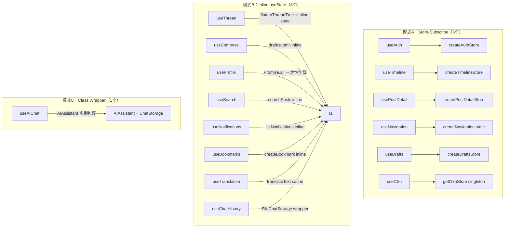

本页提供 `@bsky/app` 包中所有 15 个 React Hook 的完整签名、参数说明与返回值类型速查。所有 Hook 位于 `packages/app/src/hooks/` 目录下，遵循"纯 Store + React Hook"订阅驱动模式（详见[纯 Store + React Hook 模式](12-chun-store-react-hook-mo-shi-ding-yue-qu-dong-de-zhuang-tai-guan-li)）。Sources: [hooks 目录](packages/app/src/hooks)

---

## 架构概览：三种 Hook 模式

从实现方式看，15 个 Hook 可归为三类模式：



**模式A**（Store-Subscribe）：通过 `useState(() => create*Store())` 创建 Store 实例，`useEffect` 订阅 Store 的 `_notify` 变更通知，通过 `force` tick 触发 React 重渲染。Sources: [useAuth](packages/app/src/hooks/useAuth.ts#L1-L23)

**模式B**（Inline useState）：直接在 Hook 内部使用 `useState` / `useCallback` 管理状态，没有独立 Store 层。适用于一次性加载或操作简单的场景。

**模式C**（Class Wrapper）：`useAIChat` 包裹 `AIAssistant` 核心类实例，将类的方法和状态映射为 React 响应式接口。

---

## 完整签名速查表

| Hook | 所属模式 | 参数 | 返回值属性数 | 核心 Store/State |
|------|---------|------|------------|-----------------|
| `useAuth` | A | 无参数 | 6 | `createAuthStore()` |
| `useTimeline` | A | `client: BskyClient \| null` | 6 | `createTimelineStore()` |
| `usePostDetail` | A | `client, uri, goTo, aiKey, aiBaseUrl, targetLang?` | 7 | `createPostDetailStore()` |
| `useNavigation` | A | 无参数 | 5 | `createNavigation()` |
| `useDrafts` | A | 无参数 | 4 | `createDraftsStore()` |
| `useI18n` | A | `initialLocale?: Locale` | 5 | `getI18nStore()` singleton |
| `useThread` | B | `client, uri` | 12 | inline state |
| `useCompose` | B | `client, goBack, onSuccess?` | 9 | inline state |
| `useProfile` | B | `client, actor` | 4 | inline state |
| `useSearch` | B | `client` | 4 | inline state |
| `useNotifications` | B | `client` | 4 | inline state |
| `useBookmarks` | B | `client` | 8 | inline state |
| `useTranslation` | B | `aiKey, aiBaseUrl, aiModel?, targetLang?, initialMode?` | 8 | inline cache Map |
| `useChatHistory` | B | `storage?: ChatStorage` | 6 | `FileChatStorage` |
| `useAIChat` | C | `client, aiConfig, contextUri?, options?` | 10 | `AIAssistant` 实例 |

### 调用频次与性能特征

| 模式 | 重渲染触发机制 | 适用场景 | 注意点 |
|------|--------------|---------|--------|
| A（Store） | `force(n => n+1)` 全局 tick | 频繁异步更新（时间线、帖子详情） | 单 listener 模型，多个 Hook 不会冲突 |
| B（Inline） | `setState` 局部更新 | 一次性加载或低频操作 | 组件卸载时需注意闭包 |
| C（Class） | 手动 `setMessages` | 流式消息、工具调用确认 | 需手动管理 `AIAssistant` 消息历史 |

---

## 第一组：认证与会话（Auth & Session）

### `useAuth()`

```typescript
function useAuth(): {
  client: BskyClient | null;       // AT 协议客户端实例
  session: CreateSessionResponse | null; // 登录会话
  profile: ProfileView | null;     // 当前用户资料
  loading: boolean;                // 登录/恢复中
  error: string | null;            // 登录错误信息
  login: (handle: string, password: string) => Promise<void>;
  restoreSession: (session: CreateSessionResponse) => void; // 恢复持久化会话
}
```

**关键行为**：
- 无参数，零依赖。Store 内部持有 `BskyClient` 实例。
- `login()` 成功后会同时设置 `client`、`session`、`profile` 三个状态。
- `restoreSession()` 用于从 localStorage 或其他持久化介质恢复上次会话；若 token 过期，会自动将 `client` 和 `session` 置为 `null`，`error` 设为 `'session_expired'`。Sources: [useAuth.ts](packages/app/src/hooks/useAuth.ts#L1-L23), [auth.ts store](packages/app/src/stores/auth.ts#L1-L70)

---

## 第二组：时间线与帖子（Timeline & Post）

### `useTimeline(client: BskyClient | null)`

```typescript
function useTimeline(client: BskyClient | null): {
  posts: PostView[];           // 时间线帖子数组
  loading: boolean;            // 加载中
  cursor: string | undefined;  // 分页游标
  error: string | null;        // 加载错误
  loadMore: (() => void) | undefined;  // 加载更多（client 为 null 时为 undefined）
  refresh: (() => void) | undefined;   // 刷新（client 为 null 时为 undefined）
}
```

**关键行为**：
- 使用 `useRef` 标记 `loaded`，确保 `client` 就绪后只自动加载一次。
- `loadMore` 与 `refresh` 在 `client` 为 `null` 时返回 `undefined`，避免无效调用。
- 初始加载 20 条帖子，`loadMore` 每次追加 20 条。Sources: [useTimeline.ts](packages/app/src/hooks/useTimeline.ts#L1-L30), [timeline.ts store](packages/app/src/stores/timeline.ts#L1-L75)

### `usePostDetail(client, uri, goTo, aiKey, aiBaseUrl, targetLang?)`

```typescript
function usePostDetail(
  client: BskyClient | null,
  uri: string | undefined,
  goTo: (v: AppView) => void,     // 导航函数，来自 useNavigation
  aiKey: string,
  aiBaseUrl: string,
  targetLang?: string,             // 默认 'zh'
): {
  post: PostView | null;           // 帖子视图数据
  flatThread: string;              // 扁平化纯文本线程（用于 AI 上下文）
  loading: boolean;
  error: string | null;
  translations: Map<string, string>;  // 翻译缓存 <原文, 译文>
  translate: (text: string) => Promise<string>;  // 翻译函数
  actions: PostDetailActions;      // 操作集
}

// PostDetailActions 接口:
interface PostDetailActions {
  like: () => void;         // 点赞（TUI 需要确认对话框）
  repost: () => void;       // 转发
  reply: () => void;        // 回复 → 导航到 compose 视图
  translate: () => void;    // 翻译当前帖子
  openAI: () => void;       // 打开 AI 聊天（contextUri=当前帖子）
  viewThread: () => void;   // 查看完整线程
}
```

**关键行为**：
- `flatThread` 通过递归 `buildFlatThread()` 生成，格式为缩进树：`"handle (rkey)"↳"text"`，用于作为 AI 的上下文输入。
- `translate()` 直接调用 LLM API（`POST /v1/chat/completions`），非流式，temperature=0.3。
- `actions` 中的 `reply`、`openAI`、`viewThread` 直接调用 `goTo` 导航。Sources: [usePostDetail.ts](packages/app/src/hooks/usePostDetail.ts#L1-L72), [postDetail.ts store](packages/app/src/stores/postDetail.ts#L1-L128)

### `useThread(client: BskyClient | null, uri: string | undefined)`

```typescript
function useThread(client, uri): {
  flatLines: FlatLine[];          // 扁平化线程行数组
  loading: boolean;
  error: string | null;
  focusedIndex: number;           // 当前聚焦索引（0-based）
  focused: FlatLine | undefined;  // 当前聚焦的行
  themeUri: string | undefined;   // 当前讨论串的根 URI
  expandReplies: () => void;      // 展开更多回复（每次+10）
  likePost: (uri: string) => Promise<void>;
  repostPost: (uri: string) => Promise<boolean>;
  isLiked: (uri: string) => boolean;
  isReposted: (uri: string) => boolean;
}
```

**FlatLine 接口**（15 个字段）：

```typescript
interface FlatLine {
  depth: number;                // 缩进层级：负数为父帖，0 为根帖，正数为回复
  uri: string;
  cid: string;
  rkey: string;
  text: string;
  handle: string;
  displayName: string;
  authorAvatar?: string;        // CDN 头像 URL
  hasReplies: boolean;
  mediaTags: string[];          // 例如 ['🖼 图片', '🔗 链接', '📌 引用']
  imageUrls: string[];          // CDN 图片 URL
  externalLink: { uri: string; title: string; description: string } | null;
  quotedPost?: { /* 同层结构 */ };  // 引用帖信息
  isRoot: boolean;
  isTruncation: boolean;        // "还有 X 条回复未显示"占位行
  likeCount: number;
  repostCount: number;
  replyCount: number;
  indexedAt: string;
}
```

**关键行为**：
- 初始加载：`getPostThread(uri, 5, 80)`，最多显示 `INITIAL_SIBLINGS=5` 条同级回复。
- `expandReplies()` 将 `maxSiblings` 增加 10，重新拉取并扁平化线程。
- `likePost` / `repostPost` 使用 `uriToParts()` 解析 URI，调用 `getRecord` 获取 CID 后创建记录。
- `isLiked` / `isReposted` 基于 `Set<string>` 缓存，仅本地判断，不与服务器同步。
- 线程遍历使用 `walk()` 递归 + `visitedUris` 集合防环。Sources: [useThread.ts](packages/app/src/hooks/useThread.ts#L1-L332)

---

## 第三组：发布与草稿（Compose & Drafts）

### `useCompose(client: BskyClient | null, goBack: () => void, onSuccess?: () => void)`

```typescript
function useCompose(client, goBack, onSuccess?): {
  draft: string;
  setDraft: React.Dispatch<React.SetStateAction<string>>;
  submitting: boolean;
  error: string | null;
  replyTo: string | undefined;
  setReplyTo: React.Dispatch<React.SetStateAction<string | undefined>>;
  quoteUri: string | undefined;
  setQuoteUri: React.Dispatch<React.SetStateAction<string | undefined>>;
  submit: (
    text: string,
    replyUri?: string,
    images?: ComposeImage[],
    qUri?: string
  ) => Promise<void>;
}

interface ComposeImage {
  blobRef: { $link: string; mimeType: string; size: number };
  alt: string;
}
```

**关键行为**：
- `submit` 内部处理三种 embed 场景：纯图片、纯引用帖、图片+引用帖组合（`app.bsky.embed.recordWithMedia`）。
- 提交成功后自动调用 `goBack()` 和 `onSuccess?.()`，并清空 `draft` 和 `quoteUri`。Sources: [useCompose.ts](packages/app/src/hooks/useCompose.ts#L1-L109)

### `useDrafts()`

```typescript
function useDrafts(): {
  drafts: Draft[];                   // 草稿列表
  saveDraft: (d: Omit<Draft, 'createdAt' | 'updatedAt'>) => void;
  deleteDraft: (id: string) => void;
  loadDraft: (id: string) => Draft | undefined;
}

interface Draft {
  id: string;
  text: string;
  replyTo?: string;
  quoteUri?: string;
  createdAt: string;
  updatedAt: string;
}
```

**关键行为**：
- 纯内存存储，不持久化到磁盘。刷新页面后草稿丢失。
- `saveDraft` 根据 `id` 匹配更新或新建。Sources: [useDrafts.ts](packages/app/src/hooks/useDrafts.ts#L1-L57)

---

## 第四组：AI 聊天（AI Chat）

### `useAIChat(client, aiConfig, contextUri?, options?)`

最复杂的 Hook，参数最多、返回最丰富：

```typescript
interface UseAIChatOptions {
  chatId?: string;        // 加载已有对话
  storage?: ChatStorage;  // 自动保存存储后端
  stream?: boolean;       // 启用逐 token 流式输出（TUI 默认 false，PWA 推荐 true）
}

function useAIChat(
  client: BskyClient | null,
  aiConfig: AIConfig,              // { apiKey, baseUrl, model }
  contextUri?: string,             // 可选：当前帖子上下文 URI
  options?: UseAIChatOptions,
): {
  messages: AIChatMessage[];       // 完整消息历史
  loading: boolean;                // AI 响应中
  guidingQuestions: string[];      // 建议问题（根据上下文自动生成）
  send: (text: string) => Promise<void>;
  chatId: string;                  // 当前对话 ID（UUID v4）
  pendingConfirmation: {           // 写操作确认（TUI 写操作需用户确认）
    toolName: string;
    description: string;
  } | null;
  confirmAction: () => void;       // 确认写操作
  rejectAction: () => void;        // 拒绝写操作
  undoLastMessage: () => void;     // 撤销最后一次用户消息及 AI 回复
  retry: () => Promise<void>;      // 重新发送上一次用户消息
}

// AIChatMessage 类型：
interface AIChatMessage {
  role: 'user' | 'assistant' | 'tool_call' | 'tool_result';
  content: string;
  toolName?: string;
  isError?: boolean;
}
```

**关键行为**：
- **流式路径**（`stream: true`）：使用 `assistant.sendMessageStreaming()`，逐 token 累加渲染。`tool_call` 和 `tool_result` 作为独立消息插入。
- **非流式路径**（`stream: false`）：使用 `assistant.sendMessage()`，一次性返回 `intermediateSteps` + 最终 `content`。
- **自动保存**：当提供 `storage` 时，每次 `send` 后自动调用 `autoSave()`，将完整消息历史持久化。
- **上下文感知**：`contextUri` 变化时重置 System Prompt 和 `guidingQuestions`（"总结这个讨论" / "查看作者动态" / "分析帖子情绪"）。
- **写操作确认**：`pendingConfirmation` 由 `AIAssistant` 的 `confirmation_needed` 事件触发，TUI 端展示确认对话框。
- **撤销与重试**：`undoLastMessage` 回退到最后一个 `user` 消息之前；`retry` 撤销后自动重新 `send`。Sources: [useAIChat.ts](packages/app/src/hooks/useAIChat.ts#L1-L301)

### `useChatHistory(storage?: ChatStorage)`

```typescript
function useChatHistory(storage?: ChatStorage): {
  conversations: ChatSummary[];    // 对话摘要列表
  loading: boolean;
  loadConversation: (id: string) => Promise<ChatRecord | null>;
  saveConversation: (chat: ChatRecord) => Promise<void>;
  deleteConversation: (id: string) => Promise<void>;
  refresh: () => Promise<void>;
  storage: ChatStorage;            // 实际使用的存储实例
}

interface ChatSummary {
  id: string;
  title: string;           // 第一条用户消息的前80字符
  messageCount: number;    // 仅统计 user + assistant 角色
  updatedAt: string;
}

interface ChatRecord {
  id: string;
  title: string;
  contextUri?: string;
  messages: AIChatMessage[];
  createdAt: string;
  updatedAt: string;
}
```

**关键行为**：
- 默认使用 `FileChatStorage`（TUI 环境存储到 `~/.bsky-tui/chats/*.json`）。
- `getDefaultStorage()` 是模块级单例，确保多个 Hook 实例共享同一存储目录。
- `saveConversation` 和 `deleteConversation` 操作后自动调用 `refresh` 更新列表。Sources: [useChatHistory.ts](packages/app/src/hooks/useChatHistory.ts#L1-L49), [chatStorage.ts](packages/app/src/services/chatStorage.ts#L1-L89)

---

## 第五组：导航（Navigation）

### `useNavigation()`

```typescript
type AppView =
  | { type: 'feed' }
  | { type: 'detail'; uri: string }
  | { type: 'thread'; uri: string }
  | { type: 'compose'; replyTo?: string; quoteUri?: string }
  | { type: 'profile'; actor: string }
  | { type: 'notifications' }
  | { type: 'search'; query?: string }
  | { type: 'aiChat'; contextUri?: string }
  | { type: 'bookmarks' };

function useNavigation(): {
  currentView: AppView;        // 当前视图
  canGoBack: boolean;          // 栈深度 > 1
  goTo: (v: AppView) => void;  // 推入新视图
  goBack: () => void;          // 回到上一视图
  goHome: () => void;          // 重置到 feed
}
```

**关键行为**：
- 内部使用不可变栈（`stack = [...stack, view]`），每次 `goTo` 创建新数组。
- 支持多 listener（不同于 Store 的单 listener 模型）。Sources: [useNavigation.ts](packages/app/src/hooks/useNavigation.ts#L1-L21), [navigation.ts state](packages/app/src/state/navigation.ts#L1-L66)

---

## 第六组：翻译与国际化（Translation & i18n）

### `useTranslation(aiKey, aiBaseUrl, aiModel?, targetLang?, initialMode?)`

```typescript
type TargetLang = 'zh' | 'en' | 'ja' | 'ko' | 'fr' | 'de' | 'es';

const LANG_LABELS: Record<TargetLang, string> = {
  zh: '中文', en: 'English', ja: '日本語', ko: '한국어',
  fr: 'Français', de: 'Deutsch', es: 'Español',
};

function useTranslation(
  aiKey: string,
  aiBaseUrl: string,
  aiModel?: string,              // 默认 'deepseek-v4-flash'
  targetLang?: TargetLang,       // 默认 'zh'
  initialMode?: 'simple' | 'json', // 默认 'simple'
): {
  translate: (text: string, overrideLang?: TargetLang) => Promise<TranslationResult>;
  loading: boolean;
  cache: Map<string, TranslationResult>;  // 缓存键: "mode::lang::text"
  lang: TargetLang;
  setLang: (l: TargetLang) => void;
  mode: 'simple' | 'json';
  setMode: (m: 'simple' | 'json') => void;
  LANG_LABELS: Record<TargetLang, string>;
}

interface TranslationResult {
  translated: string;           // 翻译后的文本
  sourceLang?: string;          // 源语言 ISO 639-1 代码（仅 json 模式）
}
```

**关键行为**：
- **simple 模式**：纯文本翻译输出。
- **json 模式**：使用 `response_format: "json_object"`，返回包含 `translated` 和 `source_lang` 的结构化 JSON。
- **重试机制**（core 层 `translateText`）：空内容、缺失 `translated` 字段或 JSON 解析失败时最多重试 3 次，指数退避 800ms 基准。
- `translate()` 内部动态 `import('@bsky/core')`，懒加载翻译逻辑。Sources: [useTranslation.ts](packages/app/src/hooks/useTranslation.ts#L1-L48)

### `useI18n(initialLocale?: Locale)`

```typescript
type Locale = 'zh' | 'en' | 'ja';

function useI18n(initialLocale?: Locale): {
  t: (key: string, params?: Record<string, string | number>) => string;
  locale: Locale;
  setLocale: (l: Locale) => void;
  availableLocales: string[];
  localeLabels: Record<string, string>;
}
```

**关键行为**：
- 模块级单例 Store（`getI18nStore()`），所有组件共享同一个 i18n 实例。
- `t()` 支持插值：`t('reply_count', { count: 5 })` → `"5 条回复"`。
- 回退链：当前语言 → English → 中文 → 原始 key。Sources: [useI18n.ts](packages/app/src/i18n/useI18n.ts#L1-L23), [i18n store](packages/app/src/i18n/store.ts#L1-L85)

---

## 第七组：用户资料与搜索（Profile & Search）

### `useProfile(client: BskyClient | null, actor: string)`

```typescript
function useProfile(client, actor: string): {
  profile: ProfileView | null;      // 用户资料
  follows: ProfileView[];           // 关注列表（最多20条）
  followers: ProfileView[];         // 粉丝列表（最多20条）
  loading: boolean;
}
```

**关键行为**：
- 使用 `Promise.all` 并行获取 profile、follows (20)、followers (20)。
- `actor` 变更时自动重新加载。Sources: [useProfile.ts](packages/app/src/hooks/useProfile.ts#L1-L23)

### `useSearch(client: BskyClient | null)`

```typescript
function useSearch(client): {
  query: string;                    // 当前搜索词
  results: PostView[];              // 搜索结果帖子
  loading: boolean;
  search: (q: string) => Promise<void>;  // 执行搜索
}
```

**关键行为**：
- 每次搜索限制 25 条结果，按 `latest` 排序。
- `search('')` 空查询直接返回，不发起请求。Sources: [useSearch.ts](packages/app/src/hooks/useSearch.ts#L1-L26)

---

## 第八组：通知与书签（Notifications & Bookmarks）

### `useNotifications(client: BskyClient | null)`

```typescript
function useNotifications(client): {
  notifications: Notification[];    // 通知列表（最多30条）
  loading: boolean;
  unreadCount: number;              // 未读数
  refresh: () => Promise<void>;     // 手动刷新
}
```

**关键行为**：
- 自动在挂载时加载一次。`unreadCount` 基于 `isRead` 字段过滤。Sources: [useNotifications.ts](packages/app/src/hooks/useNotifications.ts#L1-L28)

### `useBookmarks(client: BskyClient | null)`

```typescript
function useBookmarks(client): {
  bookmarks: PostView[];            // 书签帖子列表
  loading: boolean;
  isBookmarked: (uri: string) => boolean;   // 判断是否已收藏
  addBookmark: (uri: string, cid: string) => Promise<void>;
  removeBookmark: (uri: string) => Promise<void>;
  toggleBookmark: (uri: string, cid: string) => Promise<void>;
  refresh: () => Promise<void>;
}
```

**关键行为**：
- `bookmarkedUris` 使用 `Set<string>` 做 O(1) 查找。
- `toggleBookmark` 根据 `bookmarkedUris` 状态自动选择添加或删除。
- 初始加载 50 条书签。Sources: [useBookmarks.ts](packages/app/src/hooks/useBookmarks.ts#L1-L54)

---

## 架构模式总结

### Store-Subscribe 模式（模式A）

```typescript
// 通用模板
function useStore() {
  const [store] = useState(() => createStore());
  const [, force] = useState(0);
  const tick = useCallback(() => force(n => n + 1), []);

  useEffect(() => store.subscribe(tick), [store, tick]);

  return { /* store 的公开属性 */ };
}
```

**使用此模式的6个 Hook**：`useAuth`、`useTimeline`、`usePostDetail`、`useNavigation`、`useDrafts`、`useI18n`。这些 Hook 的状态变化由 Store 内部的 `_notify()` 驱动，Hook 侧通过 `force` tick 触发 React 重渲染。Sources: [HOOKS.md](docs/HOOKS.md#L32-L52)

### 单 Listener 约束

```typescript
// Store 的 subscribe 实现
subscribe(fn: () => void) {
  store.listener = fn;
  return () => { store.listener = null; };
}
```

这是当前架构的一个重要约束：每个 Store 实例只支持一个 listener。这意味着在同一组件的不同位置多次调用同一个 Hook 不会有问题（因为 Store 实例共享），但在同一个 Store 实例上多次调用 `subscribe` 会覆盖前一个 listener。在实际使用中，每个 Store 实例只绑定到一个 Hook 实例，所以不会出现冲突。Sources: [auth.ts store](packages/app/src/stores/auth.ts#L66-L69)

---

## 推荐阅读

- 理解 Store 实现原理：[纯 Store + React Hook 模式](12-chun-store-react-hook-mo-shi-ding-yue-qu-dong-de-zhuang-tai-guan-li)
- 了解导航系统如何与 Hook 联动：[导航系统与 AppView 视图路由设计](13-dao-hang-xi-tong-yu-appview-shi-tu-lu-you-she-ji)
- AI 聊天相关的持久化存储：[聊天记录持久化](15-liao-tian-ji-lu-chi-jiu-hua-filechatstorage-yu-indexeddbchatstorage)
- 国际化语言包结构：[国际化多语言支持](16-guo-ji-hua-duo-yu-yan-zhi-chi-i18n-xi-tong-yu-yan-bao-jie-gou)