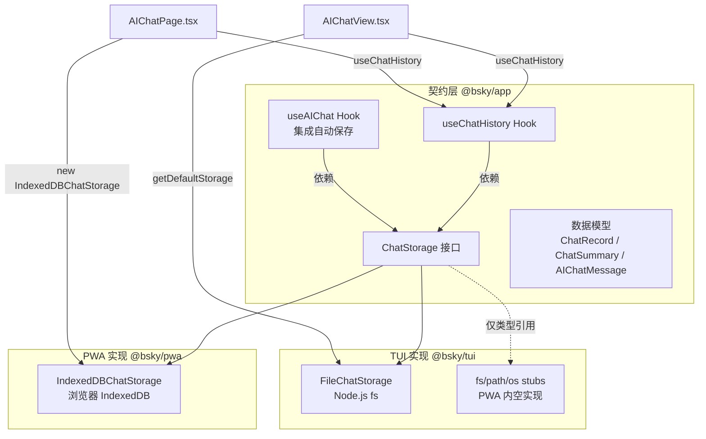
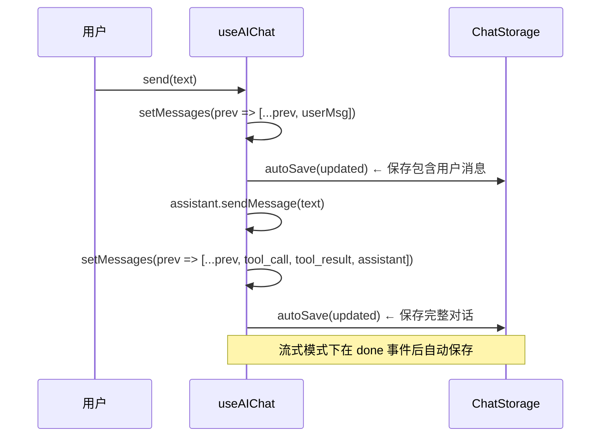

## 为什么需要两个存储实现？

在 Bluesky 双端客户端中，TUI（终端 UI）运行在 Node.js 环境，PWA（浏览器渐进式应用）运行在浏览器环境。两种运行时提供了截然不同的持久化 API：Node.js 有 `fs` 文件系统模块，浏览器有 IndexedDB。核心挑战在于——如何在两种环境下共享同一套聊天记录管理逻辑，而不为每种环境分别编写不同的上层代码？

答案是**接口隔离 + 策略模式**。`@bsky/app` 层定义了 `ChatStorage` 接口，然后分别为 TUI 和 PWA 提供了具体实现：`FileChatStorage`（基于文件系统）和 `IndexedDBChatStorage`（基于 IndexedDB）。上层 Hook（`useChatHistory`、`useAIChat`）只依赖接口，不依赖具体实现——这意味着存储方式可以自由切换，而业务逻辑零改动。

Sources: [chatStorage.ts](packages/app/src/services/chatStorage.ts#L23-L28), [indexeddb-chat-storage.ts](packages/pwa/src/services/indexeddb-chat-storage.ts#L1-L8), [useChatHistory.ts](packages/app/src/hooks/useChatHistory.ts#L1-L49)

---

## 一、架构总览



架构的核心模式是**依赖反转**：`@bsky/app` 定义纯抽象的 TypeScript 接口和纯函数的 React Hook；不同端只需注入各自平台的存储实现，即可获得完整的聊天记录 CRUD 和自动保存能力。这种设计的直接收益是：添加新平台（如 Electron、React Native）时，只需实现 `ChatStorage` 接口的四个方法。

Sources: [chatStorage.ts](packages/app/src/services/chatStorage.ts#L1-L28), [AIChatView.tsx](packages/tui/src/components/AIChatView.tsx#L1-L18), [AIChatPage.tsx](packages/pwa/src/components/AIChatPage.tsx#L1-L18)

---

## 二、ChatStorage 接口契约

接口定义了四个方法，所有实现都必须遵守：

| 方法 | 签名 | 语义 | 错误处理策略 |
|------|------|------|-------------|
| `saveChat` | `(chat: ChatRecord) => Promise<void>` | 保存完整聊天记录（覆盖写） | 静默失败 |
| `loadChat` | `(id: string) => Promise<ChatRecord \| null>` | 按 ID 加载完整记录 | 不存在返回 null |
| `listChats` | `() => Promise<ChatSummary[]>` | 获取所有聊天摘要列表 | 返回空数组 |
| `deleteChat` | `(id: string) => Promise<void>` | 按 ID 删除聊天记录 | 不存在时静默忽略 |

伴随接口的还有三个核心数据模型：

```typescript
interface ChatRecord {
  id: string;                    // UUID v4，唯一标识一次对话
  title: string;                 // 从第一条用户消息截取前 80 字符
  contextUri?: string;           // 关联的 Bluesky 帖子 AT URI
  messages: AIChatMessage[];     // 完整的消息序列
  createdAt: string;             // ISO 8601
  updatedAt: string;             // ISO 8601，每次 saveChat 自动更新
}

interface ChatSummary {
  id: string;
  title: string;
  messageCount: number;          // 仅统计 user + assistant 角色消息
  updatedAt: string;
}

interface AIChatMessage {
  role: 'user' | 'assistant' | 'tool_call' | 'tool_result';
  content: string;
  toolName?: string;              // tool_call 专用
  isError?: boolean;              // assistant 消息标记为错误
}
```

`messageCount` 的统计排除了 `tool_call` 和 `tool_result`——因为这些是 AI 内部工具调用的副产物，对用户而言不构成"消息"。UI 侧在历史列表展示消息数时，只让用户感知到实际的人机对话轮次。

Sources: [chatStorage.ts](packages/app/src/services/chatStorage.ts#L1-L43)

---

## 三、FileChatStorage：Node.js 文件系统实现

### 目录结构与文件命名

每条聊天记录对应 `~/.bsky-tui/chats/` 目录下的一个 JSON 文件：

```
~/.bsky-tui/chats/
├── 550e8400-e29b-41d4-a716-446655440000.json
├── 6ba7b810-9dad-11d1-80b4-00c04fd430c8.json
└── ...
```

文件名 = `{chatId}.json`。每条记录独立存储，天然支持并发读取（无锁竞争，因为写操作是覆盖而非追加）。

### 实现细节

```typescript
export class FileChatStorage implements ChatStorage {
  private dir: string;

  constructor(dir?: string) {
    // 默认路径：~/.bsky-tui/chats/
    this.dir = dir ?? path.join(homedir(), '.bsky-tui', 'chats');
    if (!fs.existsSync(this.dir)) {
      fs.mkdirSync(this.dir, { recursive: true });
    }
  }
  // ...
}
```

构造函数的关键设计决策：
- **可配置目录**：允许测试时注入临时目录，避免污染用户数据
- **自动创建**：目录不存在时递归创建，消除首次启动的初始化步骤
- **同步初始化**：构造函数中使用同步 API 是安全的——只发生在启动时，不影响运行时性能

### 读写策略

`listChats()` 的实现采用了"读所有文件再过滤"的策略，而非维护独立索引文件：

```typescript
async listChats(): Promise<ChatSummary[]> {
  const files = fs.readdirSync(this.dir).filter(f => f.endsWith('.json'));
  const summaries: ChatSummary[] = [];
  for (const file of files) {
    try {
      const data = fs.readFileSync(path.join(this.dir, file), 'utf-8');
      const record = JSON.parse(data) as ChatRecord;
      summaries.push({
        id: record.id,
        title: record.title,
        messageCount: record.messages.filter(m => m.role === 'user' || m.role === 'assistant').length,
        updatedAt: record.updatedAt,
      });
    } catch { /* skip corrupt files */ }
  }
  summaries.sort((a, b) => new Date(b.updatedAt).getTime() - new Date(a.updatedAt).getTime());
  return summaries;
}
```

这里有两个值得注意的设计权衡：
1. **无索引文件**：每次 `listChats` 都扫描全部 JSON 文件。对于聊天记录场景（通常几十条对话），性能完全可接受；如果未来扩展至数百条，可以考虑引入摘要缓存
2. **容错读取**：单个文件损坏（JSON 解析失败、磁盘错误）只会跳过该文件，不会导致整个列表加载失败

`saveChat()` 在执行写入前会自动更新 `updatedAt` 时间戳——这是调用方无需手动维护更新时间的关键设计。

Sources: [chatStorage.ts](packages/app/src/services/chatStorage.ts#L45-L89)

---

## 四、IndexedDBChatStorage：浏览器 IndexedDB 实现

### 数据库结构

IndexedDB 是浏览器内置的 NoSQL 数据库，在这里的使用非常直接：

- **数据库名**：`bsky-chats`
- **版本**：`1`
- **对象仓库**：`chats`
- **键路径**：`id`（ChatRecord.id 自动成为主键）

### 连接管理

```typescript
const DB_NAME = 'bsky-chats';
const DB_VERSION = 1;
const STORE_NAME = 'chats';

function openDB(): Promise<IDBDatabase> {
  return new Promise((resolve, reject) => {
    const req = indexedDB.open(DB_NAME, DB_VERSION);
    req.onupgradeneeded = () => {
      const db = req.result;
      if (!db.objectStoreNames.contains(STORE_NAME)) {
        db.createObjectStore(STORE_NAME, { keyPath: 'id' });
      }
    };
    req.onsuccess = () => resolve(req.result);
    req.onerror = () => reject(req.error);
  });
}
```

IndexedDB 的 API 是基于事件的，需要 Promise 包装才能在 async/await 范式下使用。`withStore` 辅助函数封装了"打开数据库→创建事务→获取对象仓库"的三步流程：

```typescript
function withStore(mode: IDBTransactionMode): Promise<IDBObjectStore> {
  return openDB().then(db => {
    const tx = db.transaction(STORE_NAME, mode);
    return tx.objectStore(STORE_NAME);
  });
}
```

**重要**：每次操作都会打开一次数据库连接。这是有意为之的简化——聊天操作频率低（用户点击发送才触发保存），连接开销可以忽略。对于高频操作的场景，应当复用数据库连接。

### 与 FileChatStorage 的对比

| 维度 | FileChatStorage | IndexedDBChatStorage |
|------|----------------|---------------------|
| 运行时 | Node.js (TUI) | 浏览器 (PWA) |
| 存储介质 | 文件系统 (`~/.bsky-tui/chats/`) | 浏览器 IndexedDB |
| 数据格式 | JSON 文件 | 原生 IDB 对象 |
| 连接方式 | 直接读取文件 | Promise 包装 IDB 事务 |
| 生命周期 | 用户文件系统管理 | 浏览器缓存策略管理（不清除则持久） |
| 并发安全 | 单进程文件锁（TUI 为单用户） | IDB 事务隔离 |
| 备份方式 | 直接复制 JSON 文件 | 无标准备份接口 |

尽管技术和运行时完全不同，两个实现提供了**语义一致的接口**——同样的 `saveChat` 调用在 TUI 中创建 JSON 文件，在 PWA 中写入 IndexedDB，对上层 Hook 完全透明。

Sources: [indexeddb-chat-storage.ts](packages/pwa/src/services/indexeddb-chat-storage.ts#L1-L77)

---

## 五、Hook 集成：useChatHistory 与 useAIChat

### useChatHistory：存储的 CRUD 消费者

```typescript
export function useChatHistory(storage?: ChatStorage) {
  const [conversations, setConversations] = useState<ChatSummary[]>([]);
  const [loading, setLoading] = useState(false);
  const store = storage ?? getDefaultStorage();  // 默认 FileChatStorage

  const refresh = useCallback(async () => {
    setLoading(true);
    try {
      const list = await store.listChats();
      setConversations(list);
    } catch (e) {
      console.error('Chat history load error:', e);
    } finally {
      setLoading(false);
    }
  }, [store]);

  useEffect(() => { void refresh(); }, [refresh]);

  const loadConversation = useCallback(async (id: string) => store.loadChat(id), [store]);
  const saveConversation = useCallback(async (chat: ChatRecord) => {
    await store.saveChat(chat);
    await refresh();
  }, [store, refresh]);
  const deleteConversation = useCallback(async (id: string) => {
    await store.deleteChat(id);
    await refresh();
  }, [store, refresh]);

  return { conversations, loading, loadConversation, saveConversation, deleteConversation, refresh, storage: store };
}
```

关键设计点：
- **可选 storage 参数**：允许外部注入（PWA 传入 IndexedDBChatStorage），默认使用 FileChatStorage（TUI 场景）
- **刷新后自动同步**：`saveConversation` 和 `deleteConversation` 在操作完成后自动调用 `refresh()`，确保 UI 列表始终与存储一致
- **加载状态**：`loading` 状态允许 UI 层在首次加载时显示骨架屏或加载指示器

### useAIChat 中的自动保存链路

自动保存的触发时机是**每次用户发送消息或收到 AI 回复后**，由 `autoSave` 回调函数完成：

```typescript
const autoSave = useCallback(async (msgs: AIChatMessage[]) => {
  if (!storage) return;
  const title = msgs.find(m => m.role === 'user')?.content.slice(0, 80) ?? '新对话';
  try {
    await storage.saveChat({
      id: chatIdRef.current,
      title,
      contextUri,
      messages: msgs,
      createdAt: new Date().toISOString(),
      updatedAt: new Date().toISOString(),
    });
  } catch { /* silently fail */ }
}, [storage, contextUri]);
```

标题从第一条用户消息截取 80 字符——足够提供语义标识，又不会过长破坏 UI 布局。保存操作在 `setMessages` 的 state update 回调中触发（使用 `void autoSave(updated)`），这意味着存储写入不会阻塞 UI 渲染。

自动保存的完整时序如下：



来源：[useChatHistory.ts](packages/app/src/hooks/useChatHistory.ts#L1-L49), [useAIChat.ts](packages/app/src/hooks/useAIChat.ts#L60-L85)

---

## 六、对话恢复流程

当用户从历史列表中选择一条对话时，恢复流程涉及 `useChatHistory` 和 `useAIChat` 的协同：

```mermaid
flowchart LR
    A[用户选择历史对话] --> B[setChatId(record.id)]
    B --> C{useAIChat 检测 chatId 变化}
    C --> D[storage.loadChat(id)]
    D --> E{记录是否存在？}
    E -->|存在| F[setMessages(record.messages)]
    E -->|不存在| G[setMessages([]) 开始新对话]
    F --> H[用户继续输入]
    G --> H
```

在 PWA 的 `AIChatPage.tsx` 中，`chatId` 通过 prop `options.chatId` 传递给 `useAIChat`。当 `chatId` 改变时，`useAIChat` 内部的 `useEffect` 会：

1. 调用 `assistant.clearMessages()` 清空 AIAssistant 内部上下文
2. 调用 `setMessages([])` 清空 UI 消息
3. 通过 `storage.loadChat(options.chatId)` 加载存储记录
4. 如果存在记录，调用 `setMessages(record.messages)` 恢复 UI
5. 如果关联了 `contextUri`，重新注入系统提示词

**一个已知局限**：恢复时仅恢复 UI 消息显示，不会将工具调用结果和历史系统提示词重新注入 AIAssistant 的 `messages[]` 数组。这意味着 LLM 无法"回忆"之前工具调用的结果——但用户的对话上下文在 UI 层是完整的，下一条消息发送时会携带整个对话历史（通过 AIAssistant 的 `addSystemMessage` 重新注入上下文）。

来源：[useAIChat.ts](packages/app/src/hooks/useAIChat.ts#L87-L110), [AIChatPage.tsx](packages/pwa/src/components/AIChatPage.tsx#L35-L55)

---

## 七、两端的注入差异

### TUI 端：默认存储 + stubs 防护

```typescript
// packages/tui/src/components/AIChatView.tsx
const storage = getDefaultStorage();  // 返回 FileChatStorage 单例
const { conversations, deleteConversation } = useChatHistory(storage);
```

`getDefaultStorage()` 是 `@bsky/app` 导出的便利函数，使用延迟初始化模式创建 `FileChatStorage` 单例。这个函数在 TUI 环境可以正常工作，因为 Node.js 提供了 `fs` 模块。

但注意：`@bsky/app` 包本身在 `tsconfig.json` 中声明了 `types: ["node"]`——这意味着如果在浏览器中直接调用 `getDefaultStorage()`，构建时会报 `fs` 模块缺失的错误。PWA 通过 Vite 的 **stub 文件**（`packages/pwa/src/stubs/`）来规避此问题：

```typescript
// packages/pwa/src/stubs/fs.ts
export const existsSync = () => false;
export const mkdirSync = () => {};
export const writeFileSync = () => {};
export const readFileSync = () => '';
export const readdirSync = () => [];
export const unlinkSync = () => {};
```

这些 stub 在 Vite 构建时通过别名替换真实的 Node.js 模块，确保 `@bsky/app` 包的导入不会在浏览器端崩溃。

### PWA 端：显式注入 IndexedDBChatStorage

```typescript
// packages/pwa/src/components/AIChatPage.tsx
const storage = useMemo(() => new IndexedDBChatStorage(), []);
const { conversations, deleteConversation } = useChatHistory(storage);
```

PWA 端使用 `useMemo` 创建 `IndexedDBChatStorage` 实例，避免组件重渲染时反复创建。同时，`useAIChat` 的选项中也传入同一个 storage 实例，确保历史列表和活跃对话共享相同的存储后端。

来源：[AIChatView.tsx](packages/tui/src/components/AIChatView.tsx#L1-L18), [AIChatPage.tsx](packages/pwa/src/components/AIChatPage.tsx#L26-L44), [stubs/fs.ts](packages/pwa/src/stubs/fs.ts#L1-L8)

---

## 八、设计决策回顾

1. **接口优先**：`ChatStorage` 接口在 `@bsky/app` 层定义，而非在 `@bsky/core` 层——因为存储逻辑是应用层关注的问题，与核心业务逻辑（AT 协议、AI 对话引擎）分离

2. **同步操作的 Promise 包装**：`FileChatStorage` 内部使用 `fs.readFileSync` 等同步 API，但对外暴露 `Promise<void>` 签名。这保持了接口的一致性，同时避免了 TUI 场景中不必要的异步复杂性（读取本地文件几乎不阻塞）

3. **无迁移策略**：当前版本没有版本升级或数据迁移机制。IndexedDB 设置了 `DB_VERSION = 1`，未来如果需要 schema 变更，可以在 `onupgradeneeded` 中处理

4. **无加密存储**：聊天记录以明文存储。如果在未来需要隐私保护，可以在 `saveChat`/`loadChat` 中插入加密/解密层——接口隔离保证了这种改动不需要触及上层代码

---

## 延伸阅读

- 理解 `useChatHistory` 的上层使用者：前往 [AI 聊天面板：会话历史、写操作确认对话框与撤销功能](20-ai-liao-tian-mian-ban-hui-hua-li-shi-xie-cao-zuo-que-ren-dui-hua-kuang-yu-che-xiao-gong-neng) 了解 TUI 端的聊天历史交互
- 深入 `useAIChat` 的完整消息流：前往 [AI 聊天流式页面：SSE 实时令牌渲染与 react-markdown](24-ai-liao-tian-liu-shi-ye-mian-sse-shi-shi-ling-pai-xuan-ran-yu-react-markdown) 了解 PWA 端的流式渲染
- 了解应用层的整体状态管理模式：前往 [纯 Store + React Hook 模式：订阅驱动的状态管理](12-chun-store-react-hook-mo-shi-ding-yue-qu-dong-de-zhuang-tai-guan-li)