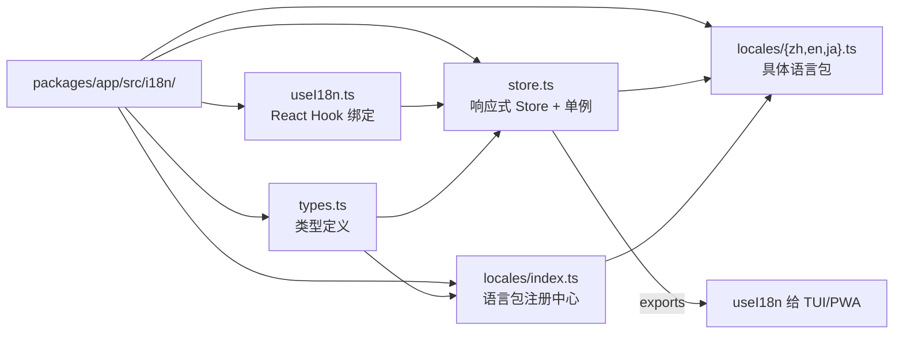

i18n（国际化）系统是 `@bsky/app` 层中一个轻量但完整的多语言解决方案，覆盖了 TUI 终端界面与 PWA 浏览器界面两个前端。该系统不依赖任何第三方 i18n 库，完全基于纯 TypeScript 实现——包含类型系统、响应式 Store、React Hook 绑定与三级语言包回退机制。其设计目标清晰：**UI 界面多语言化**（与 `core` 层的 AI 智能翻译功能相互独立，后者解决的是**用户内容的跨语言理解**问题）。

## 架构概览：四文件模块

整个 i18n 系统集中位于 `packages/app/src/i18n/` 目录下，由四个核心文件和一个 `locales/` 子目录构成：



Source: [packages/app/src/i18n/](packages/app/src/i18n/)

## 第一步：类型系统——三语言联合类型

类型定义是整个系统的基石，位于 `types.ts` 中。它只定义了两个核心类型：

- **`Locale`** —— 联合类型 `'zh' | 'en' | 'ja'`，严格限定只支持三种语言。这一设计意味着添加新语言需要同时更新类型定义，这是一种"编译时约束（compile-time constraint）"策略，确保所有使用方在编码时就知道可用的语言选项
- **`LocaleMessages`** —— `Record<string, string>`，即键值对映射。translation key（翻译键）全部是带命名空间的字符串（如 `'nav.feed'`、`'compose.placeholder'`），这种方式无需复杂的嵌套对象结构，查找效率高，且在 TS 类型推断下足够安全

Source: [types.ts](packages/app/src/i18n/types.ts#L1-L4)

## 语言包结构：三层命名空间与 200+ 条翻译

每个语言包是一个纯对象，以点分隔的 key 进行分层组织。以中文包（zh.ts，256 行）为例，其命名空间结构如下：

| 命名空间 | 用途 | 示例条目数 | 示例 key |
|---------|------|-----------|---------|
| `nav.*` | 导航/侧边栏文字 | ~11 | `nav.feed` → `'时间线'` |
| `action.*` | 操作按钮文字 | ~27 | `action.translate` → `'翻译'` |
| `status.*` | 状态提示文字 | ~10 | `status.loading` → `'加载中…'` |
| `compose.*` | 发帖页专用文字 | ~18 | `compose.charCount` → `'{current}/{max}'` |
| `thread.*` | 帖子详情页文字 | ~16 | `thread.replyCount` → `'回复 ({n})'` |
| `notifications.*` | 通知页文字 + 通知原因 | ~10 | `notifications.reason.like` → `'赞了你的帖子'` |
| `search.*` | 搜索页文字 | ~6 | `search.placeholder` → `'搜索 Bluesky 帖子…'` |
| `profile.*` | 用户资料页文字 | ~7 | `profile.posts` → `'帖子'` |
| `bookmarks.*` | 书签页文字 | ~2 | `bookmarks.empty` → `'暂无书签。…'` |
| `ai.*` | AI 聊天面板文字 | ~19 | `ai.thinking` → `'AI 思考中…'` |
| `login.*` | 登录页文字 | ~11 | `login.title` → `'登录你的 Bluesky 账号'` |
| `settings.*` | 设置页文字 | ~19 | `settings.targetLang` → `'翻译目标语言'` |
| `theme.*` | 主题切换文字 | ~4 | `theme.dark` → `'深色模式'` |
| `breadcrumb.*` | TUI 面包屑导航文字 | ~9 | `breadcrumb.thread` → `'讨论'` |
| `keys.*` | TUI 键盘快捷键提示 | ~13 | `keys.feed` → `'↑↓/jk:导航 …'` |
| `setup.*` | TUI 初次设置向导文字 | ~12 | `setup.blueskyHandle` → `'Bluesky 账号 (handle.bsky.social)'` |
| `layout.*` | PWA 布局文字 | ~1 | `layout.aiSuggestions` → `'AI 建议'` |
| `post.*` | 帖子卡片文字 | ~3 | `post.imageCount` → `'{n} 张'` |
| `common.*` | 通用文字 | ~4 | `common.rawModeWarning` → `'当前终端不支持 …'` |

三种语言包的翻译 key **必须完全一致**，这是系统正常工作隐含的前提——如果一个 key 在某语言包缺失，系统会走回退机制（详见下文）。三者之间的翻译覆盖度对比如下：

| 覆盖范围 | 中文 (zh.ts) | 英文 (en.ts) | 日文 (ja.ts) |
|---------|:-----------:|:-----------:|:-----------:|
| 总行数 | ~256 | ~236 | ~236 |
| 核心 UI key | ✅ 完整 | ✅ 完整 | ✅ 完整 |
| 键盘快捷键提示 | ✅ 完整 | ✅ 完整 | ✅ 完整 |
| 设置向导 | ✅ 完整 | ✅ 完整 | ✅ 完整 |
| PWA 布局 | ✅ 完整 | ✅ 完整 | ✅ 完整 |

英文包比中文少约20行，主要是 `breadcrumb.*`、`layout.*`、`setup.*` 等部分 key 在英文包中未单独定义——但这不会导致空白 UI，因为系统会走三级回退（见下文）。

Source: [zh.ts](packages/app/src/i18n/locales/zh.ts), [en.ts](packages/app/src/i18n/locales/en.ts), [ja.ts](packages/app/src/i18n/locales/ja.ts)

## 语言包注册中心：locales/index.ts 的桥梁角色

`locales/index.ts` 是连接具体语言包与 Store 之间的注册中心。它导出三个东西：

- **`messages`** —— `Record<Locale, LocaleMessages>` 对象，将三种语言包合并为一个可直接按 locale 键值索引的映射表
- **`availableLocales`** —— `Locale[]` 数组，即 `['zh', 'en', 'ja']`，供 UI 组件循环渲染语言选择器
- **`localeLabels`** —— `Record<Locale, string>`，每种语言的自描述名称（如 `zh: '中文'`、`en: 'English'`、`ja: '日本語'`），用于在下拉菜单中展示

这种设计将"语言包导入"与"语言包消费"解耦：添加新语言时只需在此注册中心新增一条导入导出，无需修改 Store 或 Hook 的核心逻辑。

Source: [locales/index.ts](packages/app/src/i18n/locales/index.ts#L1-L15)

## 核心引擎：Store 模式与三级回退

`store.ts` 是整个 i18n 系统的运行时引擎。它实现了 **Publisher-Subscriber（发布-订阅）** 模式，不依赖任何 React 生态，因此可以在非 React 环境（如纯 Node.js 脚本）中独立使用。其实现包含三个关键设计：

### 1. 响应式 Store 结构

`I18nStore` 接口定义了完整的 API 表面：
- **状态**：`locale`（当前语言）和 `messages`（当前语言的翻译对象）
- **方法**：`getLocale()`、`setLocale(locale)`、`t(key, params?)`（翻译核心方法）
- **订阅机制**：`subscribe(fn)` 返回取消订阅函数、`unsubscribe(fn)`、"`_notify()`"（内部触发更新）

### 2. 三级回退翻译链

`t()` 方法是整个系统最关键的函数。当请求一个 translation key 时，它遵循以下优先级链：

```
① 当前语言包 → 找到则返回（含参数插值）
② 英文包 (en)  → 找到则返回（含参数插值）
③ 中文包 (zh)  → 找到则返回（含参数插值）
④ 返回 key 原文（兜底，不抛异常）
```

这意味着：**中文包是最终的兜底语言（fallback language）**。当一个 key 在日文包和英文包中都缺失时，系统会尝试中文翻译；连中文都没有时，直接显示 key 本身作为"自我描述"的标识符。这种设计避免了 UI 中出现空白的占位符，也使得不完全翻译的语言包不会破坏用户体验。

### 3. 参数插值（interpolation）

翻译字符串支持 `{param}` 占位符语法。`interpolate()` 函数用正则 `/\{(\w+)\}/g` 匹配所有占位符，从传入的 `params` 对象中提取对应值替换：

```typescript
// 源字符串: '{current}/{max}'
// 调用: t('compose.charCount', { current: 42, max: 300 })
// 结果: '42/300'
```

若某个占位符在 params 中不存在，则保留 `{key}` 原文，不会崩溃。

### 4. 模块级单例

`getI18nStore(initialLocale?)` 函数维护一个模块级别的 `_instance` 单例。这意味着无论 TUI 的 `App.tsx` 还是 PWA 的 `Layout.tsx` 调用 `useI18n()`，它们访问的都是同一个 Store 实例——当用户在设置页面切换语言时，两端的 UI 组件都会通过订阅机制自动重渲染。

`resetI18nStore()` 用于测试场景，清空单例以便重新创建。

Source: [store.ts](packages/app/src/i18n/store.ts#L1-L85)

## React 集成：useI18n Hook

`useI18n.ts` 将纯 Store 包装为 React Hook，使用 `useState(0)` + `force` 增量更新的模式来实现响应式重渲染——这是一种"廉价版"的订阅驱动状态管理（与 `@bsky/app` 层的其他 Hook 如 `useAuth`、`useTimeline` 采用相同模式）：

```typescript
// 关键机制：
const [, force] = useState(0);          // state 值无关紧要
const tick = useCallback(() => force(n => n + 1), []);  // 每次 +1 触发重渲染
useEffect(() => store.subscribe(tick), [store, tick]);   // Store 变化时通知
```

Hook 返回的 API 包含：
- **`t(key, params?)`** —— 翻译函数，使用 `useCallback` 缓存，依赖 `store` 实例
- **`locale`** —— 当前语言（直接读取 store 的同步值）
- **`setLocale(locale)`** —— 切换语言，内部调用 `store.setLocale()` 并通过 `_notify()` 通知所有订阅者
- **`availableLocales`** —— 可用语言列表（`['zh', 'en', 'ja']`）
- **`localeLabels`** —— 语言名称映射（`{ zh: '中文', en: 'English', ja: '日本語' }`）

所有的 setter/getter 都用 `useCallback` 缓存，避免子组件因引用变化而无效重渲染。

Source: [useI18n.ts](packages/app/src/i18n/useI18n.ts#L1-L23)

## 消费端：TUI 与 PWA 的集成模式

### TUI 终端（Ink）

在 `App.tsx` 中，`useI18n()` 从配置中获取初始语言：

```typescript
const { t, locale } = useI18n(config.targetLang as Locale);
const dateLocale = locale === 'zh' ? 'zh-CN' : locale === 'ja' ? 'ja-JP' : 'en-US';
```

`locale` 还用于确定日期格式化用的 BCP 47 locale tag（`zh-CN` / `ja-JP` / `en-US`）。`t()` 函数在 Sidebar 中用于导航标签文字和面包屑导航，在 SetupWizard 中用于表单标签和提示文字。TUI 的设置项 `I18N_LOCALE` 保存在 `.env` 文件中，首次启动时通过 SetupWizard 设置。

### PWA 浏览器（React DOM）

在 `App.tsx` 中：

```typescript
const { t } = useI18n();
```

在 `Layout.tsx` 中，`t()` 用于 header 的 aria-label、状态连接指示器的 tooltip、主题切换按钮的文字标签等。在 `SettingsModal.tsx` 中，`useI18n()` 还额外使用了 `locale`、`setLocale`、`localeLabels` 和 `availableLocales` 来渲染语言选择 UI。

PWA 的语言偏好存储在 `AppConfig` 中，通过 `updateAppConfig()` 持久化到 localStorage。

Source: [App.tsx (TUI)](packages/tui/src/components/App.tsx#L34-L36), [Layout.tsx (PWA)](packages/pwa/src/components/Layout.tsx#L37), [SettingsModal.tsx (PWA)](packages/pwa/src/components/SettingsModal.tsx#L18)

## 使用示例与最佳实践

### 在组件中使用翻译

```tsx
// ✅ 正确用法
const { t } = useI18n();
return <Text>{t('nav.feed')}</Text>;

// ✅ 带参数插值
<Text>{t('compose.charCount', { current: chars.length, max: 300 })}</Text>;

// ✅ 使用 setLocale 切换语言
<select value={locale} onChange={e => setLocale(e.target.value as Locale)}>
  {availableLocales.map(locale => (
    <option key={locale} value={locale}>{localeLabels[locale]}</option>
  ))}
</select>
```

### 在新语言包中新增 key

```typescript
// 1. 在 zh.ts 中添加中文翻译
'myFeature.title': '我的新功能',

// 2. 在 en.ts 中添加英文翻译（不添加则自动回退到中文）
'myFeature.title': 'My New Feature',

// 3. 在 ja.ts 中添加日文翻译（不添加则自动回退到英文或中文）
'myFeature.title': 'マイ新機能',
```

### 当前已知的缺失 key

英文包和日文包在以下 key 上存在缺失（会回退到中文或显示 key 原文）：
- `breadcrumb.feed`、`breadcrumb.detail` 等所有 breadcrumb key 在英文/日文包中均不存在
- `layout.aiSuggestions` 在英文/日文包中不存在
- `setup.*` 系列 key 在英文/日文包中不存在
- `common.escBack` 在英文/日文包中不存在
- `post.imageCount`、`post.imageAlt`、`post.postsCount` 在英文/日文包中不存在

这些缺失不构成 bug（因为三级回退机制保证了不会出现空 UI），但可以作为社区贡献者添加翻译的切入点。

## 与 AI 翻译功能的区别

需要区分两个"翻译"概念：

| 维度 | i18n 系统（本文） | AI 翻译（useTranslation / translateText） |
|-----|----------------|----------------------------------------|
| 翻译对象 | **UI 界面文字**（按钮、标签、提示） | **用户内容**（帖子、回复） |
| 技术实现 | 预编译的语言包 + key 查找 | 调用 LLM API 动态翻译 |
| 覆盖语言 | zh / en / ja（三种） | zh / en / ja / ko / fr / de / es（七种） |
| 响应速度 | 即时（内存查找） | 数百毫秒（API 调用 + 指数退避重试） |
| 所属模块 | `@bsky/app/i18n` | `@bsky/core`（translateText）+ `@bsky/app`（useTranslation） |
| 配置方式 | `.env` 中 `I18N_LOCALE` / 设置页面选择 | 设置页面配置目标语言和翻译模式 |

Source: [useTranslation.ts](packages/app/src/hooks/useTranslation.ts#L1-L48), [双模式智能翻译文档](11-shuang-mo-shi-zhi-neng-fan-yi-simple-json-mo-shi-yu-zhi-shu-tui-bi-zhong-shi)

## 小结

这个 i18n 系统是一个"最小可行"但"正确完善"的国际化解决方案。它不追求穷举所有 UI 字符串（三个语言包约 200+ 条翻译），也不试图支持 50+ 种语言，而是在"轻量无依赖"和"完整功能"之间取得了精确的平衡。三级回退机制和响应式 Store 的设计使其在 TUI 和 PWA 两个完全不同的渲染环境中都能可靠工作。其扩展路径也很清晰：添加新语言只需新建语言包文件、更新类型定义、并在注册中心注册即可。

下一步建议阅读 [纯 Store + React Hook 模式：订阅驱动的状态管理](12-chun-store-react-hook-mo-shi-ding-yue-qu-dong-de-zhuang-tai-guan-li) 以深入理解 `@bsky/app` 层统一的状态管理模式，或浏览 [术语体系](28-zhu-yu-ti-xi-zhu-ti-tie-tao-lun-chuan-tao-lun-yuan-de-ming-ming-gui-fan) 了解项目中所有关键术语的命名规范。