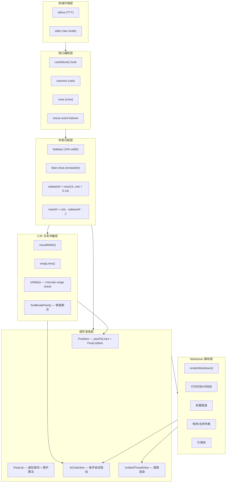

## 渲染管线架构概览

`@bsky/tui` 的终端渲染体系建立在 React + Ink 框架之上，采用分层管线架构将原始数据流式转换为终端像素级布局。整个渲染管线贯穿四个层级：**终端视口层**负责捕获容器尺寸与响应式更新，**文本测量层**负责 CJK 感知的字符宽度计算与断行，**标记解析层**将 Markdown 语法树扁平化为 Ink 组件树，**虚拟视口层**处理大列表的内容裁剪与滚动状态管理。



这条管线解决了终端渲染的核心矛盾：**纵坐标无限的内容空间**与**固定大小的终端视口**之间的冲突。PWA 端利用浏览器的 CSS 引擎自动处理这些约束，而 TUI 端必须在应用层逐一实现。

Sources: [App.tsx](packages/tui/src/components/App.tsx#L1-L100), [TUI_UTILS.md](docs/TUI_UTILS.md#L1-L139)

---

## 视口捕获与传播机制

### 初始化与响应式更新

视口尺寸的获取以 Ink 的 `useStdout()` 钩子为起点。第一次渲染时，`stdout.columns` 和 `stdout.rows` 分别提供终端的字符宽度和行高度（单位为字符数，而非像素）。与 Web 开发中 `window.innerWidth` 不同，终端尺寸是离散的整数——每列只能放置一个字符，每行只能显示一行文本。

```typescript
const { stdout } = useStdout();
const [cols, setCols] = useState(() => stdout?.columns ?? 80);
const [rows, setRows] = useState(() => stdout?.rows ?? 24);
```

响应式更新的关键在 `resize` 事件监听。用户调整终端窗口大小时，`stdout` 发射 `resize` 事件，驱动状态更新并触发 React 重新渲染。清理函数确保组件卸载时移除监听器，避免内存泄漏。回退值 `80×24` 是 VT100 终端的经典默认尺寸，在非 TTY 环境（如管道重定向或 IDE 内嵌终端）中兜底。

```typescript
useEffect(() => {
  const onResize = () => { setCols(stdout?.columns ?? 80); setRows(stdout?.rows ?? 24); };
  stdout?.on('resize', onResize);
  return () => { stdout?.off('resize', onResize); };
}, [stdout]);
```

Sources: [App.tsx](packages/tui/src/components/App.tsx#L69-L77)

### 从视口到子组件布局

`cols` 和 `rows` 不是直接传递给子组件的——它们经过一层**布局分配**。侧边栏和主内容区的宽度比例通过计算表达式 `Math.max(16, Math.floor(cols * 0.14))` 得到，确保侧边栏在窄终端中不会缩小到无法阅读，同时相对比例自适应。

```typescript
const sidebarW = Math.max(16, Math.floor(cols * 0.14));
const mainW = cols - sidebarW - 2;  // -2 给边框
```

每种视图对 `mainW` 和 `rows` 的消耗方式不同：

| 视图组件 | 宽度使用 | 高度使用 | 渲染策略 |
|---------|---------|---------|---------|
| `PostList` | `width = mainW - 4`（内边距） | `height = rows - 5`（头部+边框） | 虚拟滚动，居中选中项 |
| `UnifiedThreadView` | `width = cols`（全宽） | 动态增长，无裁剪 | 直接渲染，Ink 原生滚动 |
| `AIChatView` | `maxCols = cols - 6`（内边距+边框） | `maxVisible = rows - 6`（头部+输入框） | 条件自动滚动，PgUp/PgDn |
| `ProfileView` | `width = mainW` | 动态增长 | 直接渲染 |

Sources: [App.tsx](packages/tui/src/components/App.tsx#L223-L231), [PostList.tsx](packages/tui/src/components/PostList.tsx#L29-L44), [AIChatView.tsx](packages/tui/src/components/AIChatView.tsx#L83-L100)

---

## CJK 文本换行系统

### 为什么需要自建换行引擎

PWA 端依赖 CSS 的 `word-wrap: break-word` 自动处理，但终端（TTY）环境有以下根本差异：

1. **字符宽度不均**：ASCII 字符占 1 列，CJK 表意文字和 emoji 占 2 列。`"Hello"` 宽度为 5，`"你好"` 宽度为 4，但在 JavaScript `String.length` 中两者都是 2。
2. **终端无自动换行引擎**：Ink 本身不提供跨平台一致的断行机制。终端仅支持 `\n` 硬换行，软换行需要应用层手动插入。
3. **断点语义**：英文在词边界（空格）断行，CJK 文字在字符边界断行，混合文本需要智能判断。

### visualWidth() — 终端视觉宽度计算

`visualWidth()` 以码点为单位迭代字符串，利用 `isWide()` 函数判断每个字符的视觉宽度。CJK 统一表意文字（U+4E00–U+9FFF）未在 `isWide()` 显式列出，因其属于 `isWide()` 中的 `0x2e80 <= cp <= 0xa4cf` 或 `0x20000 <= cp <= 0x2ffff` 范围。

`isWide()` 覆盖的 Unicode 范围经过精心裁剪：

| Unicode 范围 | 覆盖内容 | 典型码点 |
|-------------|---------|---------|
| U+1100–U+115F | 韩文 Jamo 初始辅音 | ᄀ(U+1100) |
| U+2E80–U+A4CF | CJK 部首 + 表意文字 + Yi 文 | 一(U+4E00), ⼀(U+2F00) |
| U+AC00–U+D7A3 | 韩文音节 | 가(U+AC00) |
| U+F900–U+FAFF | CJK 兼容表意文字 | 豈(U+F900) |
| U+FE30–U+FE6F | CJK 兼容形式 | ︰(U+FE30) |
| U+FF01–U+FF60 | 全宽 ASCII 变体 | Ａ(U+FF21) |
| U+FFE0–U+FFE6 | 全宽符号 | ￠(U+FFE0) |
| U+1F300–U+1F9FF | Emoji + 杂项符号 | 😀(U+1F600) |
| U+1FA00–U+1FA6F | 国际象棋符号 | 🨀(U+1FA00) |
| U+20000–U+2FFFF | CJK 扩展 B+ | 𠀀(U+20000) |

零宽字符（U+0000、U+200B ZERO WIDTH SPACE）被显式跳过，不计入宽度总和。这确保了包含隐式零宽字符的文本（如某些 emoji 序列）能正确计算。

```typescript
export function visualWidth(str: string): number {
  let w = 0;
  for (const ch of str) {
    const cp = ch.codePointAt(0)!;
    if (isWide(cp)) w += 2;
    else if (cp === 0 || cp === 0x200b) { /* zero-width, skip */ }
    else w += 1;
  }
  return w;
}
```

Sources: [text.ts](packages/tui/src/utils/text.ts#L1-L32)

### wrapLines() — 智能断行算法

`wrapLines()` 的输入是一个完整的文本段落（保留原 `\n` 作为段落分隔），输出是按视觉宽度裁切的字符串数组。算法分三层：

**第一层：段落切分**。以 `\n` 为界将输入切分成段落。空段落保留为 `''` 行，确保 Markdown 中空行分隔的语义正确传递。

**第二层：逐行测量**。对每个段落，从剩余文本的开头开始测量。首行使用 `maxCols` 全宽，后续行使用 `maxCols - indent`（即悬挂缩进）。通过 `visualWidth(remaining) <= lineMax` 快速判断剩余内容是否一行能容纳，避免不必要的断点搜索。

**第三层：智能断点定位**。`findBreakPoint()` 从左到右逐字符累加视觉宽度，记录遇到空格的位置（将空格视为可断点）。当累积宽度超过 `maxVisual` 时：

1. **优先空格断点**：如果之前遇到过空格（`lastSpace > 0`），退回到该空格位置。这保证了英文词组的完整性——"Hello World" 不会在 "Hello Wor" 处截断。
2. **退化为硬断点**：如果没有合适的空格位置，在当前字符位置硬性截断。这在纯 CJK 文本或长 URL 中是常见的兜底路径。

```typescript
function findBreakPoint(text: string, maxVisual: number): number {
  const chars = [...text];
  let vis = 0;
  let lastSpace = -1;
  for (let i = 0; i < chars.length; i++) {
    const cp = chars[i]!.codePointAt(0)!;
    const w = isWide(cp) ? 2 : 1;
    if (vis + w > maxVisual) {
      if (lastSpace > 0) return lastSpace;
      return i; // hard break
    }
    if (chars[i] === ' ') lastSpace = i + 1;
    vis += w;
  }
  return chars.length;
}
```

Sources: [text.ts](packages/tui/src/utils/text.ts#L34-L82)

### 悬挂缩进与使用场景

`wrapLines` 的 `indent` 参数在不同组件中的差异化使用，反映了各自的渲染语义：

| 使用场景 | indent 值 | 效果 | 语义 |
|---------|-----------|------|------|
| PostItem 正文 | 0 | 无缩进 | 帖子正文需要从最左列开始，符合社交应用阅读习惯 |
| AIChatView 用户消息 | 2 | 缩进2格 | 消息气泡的前缀符号 `▸` 对齐 |
| AIChatView 工具结果 | 4 | 缩进4格 | 工具调用的返回结果视觉上嵌套在工具调用之下 |

在 `PostItem` 中，`maxCols` 进一步做了安全边界保护：`Math.max(20, cols - 4)`，确保即使终端宽度被极端缩小，文本也不会丢失可读性。`20` 列是最小可读宽度——大约 10 个 CJK 字符。

Sources: [PostItem.tsx](packages/tui/src/components/PostItem.tsx#L25-L28), [AIChatView.tsx](packages/tui/src/components/AIChatView.tsx#L64-L68)

---

## Markdown 零依赖渲染引擎

### 设计决策：无外部解析库

`renderMarkdown()` 选择**零外部依赖**的路线，与业界常见的 `marked` + `react-markdown` 方案形成对比。这个决策基于几个认知：

1. **性能敏感度**：终端每毫秒的延迟都直接影响交互体验。Ink 的渲染循环是同步的——在顶层组件中添加额外的 AST 解析层会线性增加每次渲染的耗时。
2. **语法子集**：AI 助手的 Markdown 输出通常限于有限子集（标题、列表、代码块、引用、分隔线）。完整 Markdown 规范中的表格、脚注、定义列表等语法几乎不会出现。
3. **输出格式约束**：终端的渲染能力有限——没有 CSS 选择器、没有字体缩放、没有颜色渐变。支持 `### Heading` 与 `**加粗**` 之间的差异，在终端中只是 `<Text>` 组件属性的变化。

### 逐行解析状态机

`renderMarkdown()` 采用**单遍线性扫描** + **状态标志**的架构，不使用递归下降或 AST 构建：

```typescript
let inCodeBlock = false;
let codeLines: string[] = [];

for (let i = 0; i < lines.length; i++) {
  const line = lines[i]!;
  if (line.startsWith('```')) {
    if (inCodeBlock) { /* 结束代码块 */ }
    else { inCodeBlock = true; }
    continue;  // 标记行本身不输出
  }
  if (inCodeBlock) { codeLines.push(line); continue; }
  // ... 其他语法模式匹配
}
```

| 语法模式 | 正则匹配 | Ink 输出 | 样式处理 |
|---------|---------|---------|---------|
| 空行 | `!line.trim()` | `<Text>{' '}</Text>` | 空白间距占位 |
| 分隔线 | `/^---+$/` | `<Text dimColor>───...───</Text>` | 36 个 `─` 字符 |
| 一级标题 | `/^# (.+)/` | `<Text bold color="cyanBright">` | 最高亮度青色 |
| 二级/三级标题 | `/^#{2,3} (.+)/` | `<Text bold color="cyan">` | 标准青色 |
| 引用块 | `/^> /` | `<Text dimColor>│ {text}</Text>` | 竖线前缀 + 灰色 |
| 无序列表 | `/^[-*] /` | `• {text}` | 缩进 + 圆点符号 |
| 有序列表 | `/^\d+\. /` | `{n}. {text}` | 数字编号 + 缩进 |
| 代码块 | `` ``` `` 包围 | `<Text dimColor>  {line}</Text>` | 每行缩进 2 格 + 灰色 |
| 普通段落 | 默认匹配 | `<Text>{line}</Text>` | 纯文本输出 |

代码块的状态管理通过 `inCodeBlock` 布尔标志实现。当遇到开启的 ` ``` ` 时进入代码块模式，后续行被收集到 `codeLines` 数组中；遇到关闭的 ` ``` ` 时批量输出所有已收集的行，然后退出代码块模式。这种设计保证了多行代码块在终端中的视觉连续性。

Sources: [markdown.tsx](packages/tui/src/utils/markdown.tsx#L1-L94)

### 在 AIChatView 中的集成

`AIChatView` 中的消息渲染区分**角色**：用户消息（`role: 'user'`）使用 `wrapLines` 做纯文本换行，助手消息（`role: 'assistant'`）使用 `renderMarkdown` 做丰富格式渲染。工具调用消息（`role: 'tool_call'` 和 `role: 'tool_result'`）同样使用 `wrapLines`，但增加不同的缩进前缀以示嵌套层级。

```typescript
const allMessageLines = useMemo(() => {
  const lines: Array<string | React.ReactNode> = [];
  for (const msg of messages) {
    if (msg.role === 'user') {
      for (const l of wrapLines(msg.content, maxCols, 2)) {
        lines.push('▸ ' + l);
      }
    } else if (msg.role === 'assistant') {
      lines.push(<Text color="cyan">🤖</Text>);
      const elements = renderMarkdown(msg.content);
      for (const el of elements) lines.push(el);
    }
    // ...
  }
  return lines;
}, [messages, loading, maxCols, t]);
```

这里有一个值得注意的混合类型设计：`allMessageLines` 数组同时持有 `string` 和 `React.ReactNode` 两种类型。字符串元素（来自 `wrapLines` 的输出）在渲染时直接作为 `<Text>` 子节点输出；`ReactNode` 元素（来自 `renderMarkdown` 的输出）则直接嵌入渲染树。这种设计避免了在数组层面再做一次类型包装。

Sources: [AIChatView.tsx](packages/tui/src/components/AIChatView.tsx#L60-L82)

---

## 虚拟视口管理

### PostList — 居中选中项的裁剪算法

`PostList` 实现了基于**选中项居中**的裁剪算法。所有帖子的行数据被预计算为扁平数组 `allLines`，然后根据选中索引找出选中行的起始位置，将视口定位到使选中行大约在视口上 1/3 处（而非正中央）。这种偏移设计让用户在浏览时自然能看到更多后续内容。

```typescript
const visibleLines = height - 4;  // 头部 + 边框占 4 行
const selectedLineStart = allLines.findIndex(
  l => l.text.includes(`[${selectedIndex}]`) && l.isName
);
const viewStart = Math.max(0, Math.min(
  allLines.length - visibleLines,
  (selectedLineStart >= 0 ? selectedLineStart : 0) - Math.floor(visibleLines / 3)
));
```

滚动指示器通过两个 `<Text>` 元素实现：`▲ X%` 提示上方内容，`▼ Y%` 提示下方内容。百分比值基于当前 `viewStart` 在总可滚动空间中的位置计算。CJK 友好的方向符号（▲▼）比传统 `↑↓` 在窄终端中更易辨识。

```typescript
const scrollPct = allLines.length > 0
  ? Math.round((viewStart / Math.max(1, allLines.length - visibleLines)) * 100)
  : 0;
```

Source: [PostList.tsx](packages/tui/src/components/PostList.tsx#L22-L50)

### AIChatView — 条件自动滚动

AI 聊天的滚动逻辑引入了**读者意图感知**的自动滚动：只有当用户先前在视口底部（`scrollOffset === 0`）时，新消息到来才自动滚动到最新内容。如果用户已经向上滚动查看历史，新消息不会强制抢回视口焦点。

```typescript
useEffect(() => {
  if (totalMsgCount > prevMsgCount.current) {
    if (wasAtBottom.current) setScrollOffset(0);
  }
  prevMsgCount.current = totalMsgCount;
}, [totalMsgCount]);

useEffect(() => {
  wasAtBottom.current = scrollOffset === 0;
}, [scrollOffset]);
```

翻页键（PageUp/PageDn）的步长计算为 `Math.floor(maxVisible * 0.7)`，即每次翻页滚动 70% 视口高度。这为读者保留了 30% 的上下文重叠，避免翻页后的空间迷失感。方向键（↑↓）步长为 3 行，提供精细的逐行滚动控制。

```typescript
const page = Math.floor(maxVisible * 0.7);
if (key.pageUp) { setScrollOffset(s => Math.min(allMessageLines.length - maxVisible, s + page)); return; }
if (key.pageDown) { setScrollOffset(s => Math.max(0, s - page)); return; }
if (!focused) {
  if (key.upArrow) { setScrollOffset(s => Math.min(allMessageLines.length - maxVisible, s + 3)); return; }
  if (key.downArrow) { setScrollOffset(s => Math.max(0, s - 3)); return; }
}
```

Sources: [AIChatView.tsx](packages/tui/src/components/AIChatView.tsx#L84-L118)

### UnifiedThreadView — 惰性渲染的折衷

`UnifiedThreadView` 没有实现显式的虚拟滚动。它依赖 Ink 内置的终端滚动——所有帖子内容作为 `<Box flexDirection="column">` 的子元素一次性渲染，超出终端高度的部分由终端本身的回滚缓冲区（scrollback buffer）处理。这种设计的代价是当讨论串很长时（超过 100+ 条回复），终端的回滚性能会下降；好处是实现复杂度最低，用户也能使用终端原生搜索/复制功能查看历史内容。

```typescript
<Box flexDirection="column" width={cols} borderStyle="single" borderColor="gray" paddingX={1}>
  {themeLines.map(/* ...直接渲染... */)}
  {focused && renderPostBody(focused, '#0e4a6e')}
  {replyLines.map(/* ...直接渲染... */)}
</Box>
```

Source: [UnifiedThreadView.tsx](packages/tui/src/components/UnifiedThreadView.tsx#L170-L200)

---

## 鼠标滚轮与终端滚动桥接

TUI 端通过 xterm 的 `\x1b[?1000h` 转义序列启用**鼠标事件追踪**（SGR mouse mode）。`mouse.ts` 模块封装了启用/禁用追踪（`enableMouseTracking` / `disableMouseTracking`）和解析原始字节流（`parseMouseEvent`）的逻辑。

```typescript
export function enableMouseTracking(stdout: WriteStream): void {
  try { stdout.write('\x1b[?1000h'); } catch {}
}
```

鼠标事件的原始格式是 `\x1b[M<button><col+32><row+32>`，其中 `button` 字节 64（0x60）表示向上滚动、65（0x61）表示向下滚动。`parseMouseEvent` 维护一个 `mouseBuf` 缓冲区，持续累积 stdin 输入直到收集完整的 6 字节序列。

```typescript
function parseMouseEvent(data: Buffer): MouseEvent | null {
  for (const ch of str) {
    mouseBuf += ch;
    if (mouseBuf.startsWith('\x1b[M') && mouseBuf.length >= 6) {
      const button = mouseBuf.charCodeAt(3);
      if (button === 64) return { type: 'scrollUp', col, row };
      if (button === 65) return { type: 'scrollDown', col, row };
    }
  }
}
```

在 `App.tsx` 中，鼠标滚轮事件被转换为与键盘上下箭头相同的状态更新逻辑——`feedIdx` 的增减。这种**统一抽象**确保了键盘（JK 键/方向键）和鼠标操作在语义上等价，不会出现"按键盘滚动到第 5 条，滚鼠标跳到第 3 条"的状态分裂。

```typescript
useEffect(() => {
  enableMouseTracking(stdout);
  const onData = (data: Buffer) => {
    const evt = parseMouseEvent(data);
    if (!evt) return;
    if (evt.type === 'scrollUp') setFeedIdx(i => Math.max(0, i - 1));
    else if (evt.type === 'scrollDown') setFeedIdx(i => Math.min(posts.length - 1, i + 1));
  };
  process.stdin.on('data', onData);
  return () => { process.stdin.off('data', onData); disableMouseTracking(stdout); };
}, [stdout, currentView.type, posts.length]);
```

Sources: [mouse.ts](packages/tui/src/utils/mouse.ts#L1-L53), [App.tsx](packages/tui/src/components/App.tsx#L210-L222)

---

## 设计决策与局限

### 与 PWA 端的刻意分歧

TUI 的渲染体系与 PWA 端采用了截然不同的技术方案，这不是因为能力不足，而是**环境约束驱动的刻意分歧**：

| 能力维度 | TUI（@bsky/tui） | PWA（@bsky/pwa） |
|---------|-----------------|-----------------|
| 文本换行 | `wrapLines()` 手动测量 | CSS `word-wrap: break-word` |
| 虚拟滚动 | 自实现居中裁剪算法 | `@tanstack/react-virtual` |
| Markdown 渲染 | `renderMarkdown()` 零依赖 | `react-markdown` 完整解析 |
| 图片展示 | OSC 8 可点击超链接 | `` + CDN 直链 |
| 鼠标支持 | ANSI 转义序列解析 | 浏览器原生 DOM 事件 |
| 持久化 | Node.js `fs` 文件写入 | IndexedDB / localStorage |

这种分歧的核心原则是：**PWA 端优先利用浏览器引擎的能力，TUI 端优先保持最小依赖体积与最大终端兼容性**。

Sources: [TUI_UTILS.md](docs/TUI_UTILS.md#L1-L139)

### 已知局限

**Markdown 渲染器的语法支持限制**。`renderMarkdown()` 不解析行内格式（如 `**加粗**`、`*斜体*`、`` `行内代码` ``）。所有行内标记符号会作为文字直接输出。这在 AI 助手的回复中偶有误读——当模型输出包含行内格式化时，用户会看到原始的 `**` 符号。解决此问题需要引入行内标记的正则解析器，但会增加遍历文本的额外复杂度。

**CJK 宽度的 emoji 序列误判**。ZWI（Zero-Width Joiner）序列和肤色修饰符（如 `👨‍👩‍👧‍👦` 家庭 emoji、`👍🏻` 肤色变体）的每个子码点被独立判定为宽字符，导致这些 emoji 序列的视觉宽度被高估约 2–4 列。这是 `isWide()` 逐码点判断的固有局限，完整的修复需要解析 ZWI 序列的 Unicode 规范。

**渲染性能与消息量的线性关系**。`AIChatView` 的 `allMessageLines` 在每次 `messages` 变化时完全重建，这会触发生成完整的 `renderMarkdown()` 调用链。在超过 200 条消息的长对话中，每次新消息到来都会导致 O(n) 的重计算。优化方向是将 `renderMarkdown` 的结果缓存（`React.useMemo` 配合消息哈希值），仅在内容变更时重新计算。

Sources: [AIChatView.tsx](packages/tui/src/components/AIChatView.tsx#L60-L82)

---

## 总结

Ink 终端渲染体系的核心抽象可以归纳为三个层次：**视口作为输入**（stdout 尺寸驱动布局决策）、**文本作为可测量介质**（CJK 感知的宽度计算替代浏览器自动排布）、**内容作为可裁剪集合**（虚拟视口将无限内容映射到有限终端）。这三层抽象的组合，使得一个基于 React 的终端应用能够在不依赖任何原生终端特性的情况下，提供接近桌面应用的交互体验。

下一步的阅读建议：
- 继续深入 [键盘快捷键系统与 ANSI 鼠标事件追踪](18-jian-pan-kuai-jie-jian-xi-tong-yu-ansi-shu-biao-shi-jian-zhui-zong)，了解键盘与鼠标事件在 TUI 中的完整处理链路
- 探索 [虚拟滚动与平铺线程视图：Cursor/Focused 双焦点设计](19-xu-ni-gun-dong-yu-ping-pu-xian-cheng-shi-tu-cursor-focused-shuang-jiao-dian-she-ji)，深入了解更复杂的滚动架构
- 回到上层架构文档 [四层架构设计：Core → App → TUI/PWA 分层原则](7-si-ceng-jia-gou-she-ji-core-app-tui-pwa-fen-ceng-yuan-ze)，将渲染体系放入全局架构中理解