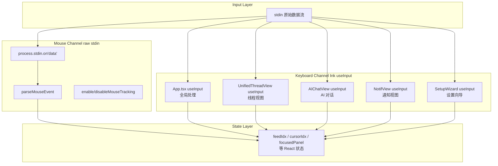

TUI 终端的交互层由两套并行的输入通道构成：键盘快捷键系统（基于 Ink 的 `useInput` 钩子链）和 ANSI 鼠标事件追踪（基于原始 `stdin` 数据流）。前者管理所有按键驱动的导航、操作和焦点控制；后者仅服务于鼠标滚轮事件，映射为光标移动。两者最终汇聚到同一状态变量（如 `feedIdx`），形成统一的用户交互体验。

本文档覆盖这两套系统的架构设计、事件路由机制、冲突解决策略，以及鼠标事件解析的底层协议细节。

---

## 一、系统架构总览

### 双通道输入模型



键盘事件由 Ink 框架统一调度：每次按键触发所有已注册的 `useInput` 回调（按注册顺序执行）。鼠标事件则绕过 Ink，以原始 `process.stdin.on('data')` 监听器直接解析 ANSI 转义序列。两条通道各自独立运作，互不阻塞。

Sources: [App.tsx](packages/tui/src/components/App.tsx#L84-L127), [mouse.ts](packages/tui/src/utils/mouse.ts#L1-L53)

### 五个 useInput 处理器的注册顺序与职责

| 处理器 | 所在文件 | 激活条件 | 主要职责 |
|---------|----------|----------|----------|
| App.tsx | `components/App.tsx:84` | 始终激活 | Tab/Esc/Ctrl+G、全局导航、Feed/书签/Compose |
| UnifiedThreadView | `components/UnifiedThreadView.tsx:48` | `currentView.type === 'thread'` | 帖子线程交互 |
| AIChatView (聊天) | `components/AIChatView.tsx:89` | `!showHistory` | 滚动控制、撤销/重试 |
| AIChatView (历史) | `components/AIChatView.tsx:101` | `showHistory` | 对话历史导航 |
| NotifView | `components/NotifView.tsx:20` | `currentView.type === 'notifications'` | 通知列表导航 |
| SetupWizard | `components/SetupWizard.tsx:93` | 首次运行 | 字段切换与提交 |

每个处理器都必须通过条件守卫避免冲突。App.tsx 的全局处理器使用 `currentView.type` 判断当前视图，视图专用处理器则依赖该组件在 DOM 树中的存在状态。

Sources: [KEYBOARD.md](docs/KEYBOARD.md#L1-L34), [App.tsx](packages/tui/src/components/App.tsx#L84-L127)

---

## 二、键盘快捷键系统

### 2.1 全局快捷键（所有视图通用）

App.tsx 中的 `useInput` 处理以下全局按键，按优先级顺序执行，每个匹配后立即 `return`：

```mermaid
flowchart LR
    subgraph "优先判定链"
        P1["Tab（AI 焦点切换）"]
        P2["Esc（场景感知返回）"]
        P3["Ctrl+G（启动 AI 对话）"]
        P4[",""（打开设置）"]
        P5["t / n / p / s / a / c / b<br/>全局导航"]
    end

    P1 --> P2 --> P3 --> P4 --> P5
```

**Tab**：仅在 `aiChat` 视图中有效，在 `focusedPanel` 的 `'main'` 与 `'ai'` 之间切换。

**Esc**：根据当前视图和上下文产生不同行为，分为两阶段：

| 视图 | 首次 Esc | 再次 Esc |
|------|----------|----------|
| aiChat + `focusedPanel === 'ai'` | 取消 AI 聚焦 → `focusedPanel = 'main'` | `goBack()` |
| compose + `imagePathInput !== null` | 取消图片输入 | `goBack()` |
| compose + 无图片输入 | `goBack()`（若有内容则先弹出保存草稿提示） | — |
| compose + `draftSavePrompt === true` | 关闭保存提示 | — |
| compose + `draftListOpen === true` | 关闭草稿列表 | — |
| feed | 无操作 | — |
| thread / profile / notifications / search / bookmarks | `goBack()` | — |

**Ctrl+G**（`\x07`）：从任意视图启动 AI 对话，附带当前线程 URI 作为上下文。

**逗号 `,`**：打开设置视图（`.env` 编辑器）。

**全局导航键**（在非 compose 视图中激活）：

| 按键 | 导航目标 | 对应 i18n 键 |
|------|----------|-------------|
| `t` | `goHome()` — 时间线 | `nav.feed` |
| `n` | 通知 | `nav.notifications` |
| `p` | 个人资料 | `nav.profile` |
| `s` | 搜索 | `nav.search` |
| `a` | AI 对话 | `nav.aiChat` |
| `c` | 发帖（无回复上下文） | `nav.compose` |
| `b` | 书签 | `nav.bookmarks` |

Sources: [App.tsx](packages/tui/src/components/App.tsx#L84-L166), [KEYBOARD.md](docs/KEYBOARD.md#L36-L98)

### 2.2 全局键保留规则

以下键在所有视图中永久保留，不得用于视图特定操作：

| 按键 | 保留原因 |
|------|---------|
| `t`, `n`, `p`, `s`, `a`, `c`, `b` | 全局导航 |
| `Esc` | 通用返回 |
| `Tab` | AI 焦点切换 |
| `Ctrl+G` | AI 对话启动器 |

新增视图特定快捷键时，建议从以下键中选择（需确认目标视图中未被占用）：`f`, `z`, `x`, `w`, `u`, `o`, `g`, `q`, `e`，及部分视图中的 `d`, `l`, `h`, `y`, `i`。

Sources: [KEYBOARD.md](docs/KEYBOARD.md#L99-L112)

### 2.3 视图特定快捷键

#### Feed 视图

| 按键 | 动作 | 实现细节 |
|------|------|---------|
| `j` / `↓` | 光标下移 | `setFeedIdx(i => Math.min(posts.length - 1, i + 1))` |
| `k` / `↑` | 光标上移 | `setFeedIdx(i => Math.max(0, i - 1))` |
| `PgUp` | 上翻 5 行 | `\x1b[5~` 序列，`setFeedIdx(i => Math.max(0, i - 5))` |
| `PgDn` | 下翻 5 行 | `\x1b[6~` 序列，`setFeedIdx(i => Math.min(…, i + 5))` |
| `Enter` | 查看选中帖子 | `goTo({ type: 'thread', uri: posts[feedIdx].uri })` |
| `m` | 加载更早帖子 | `loadMore?.()` |
| `r` | 刷新时间线 | `refresh?.()` |
| `v` | 切换书签 | `bookmarks.toggleBookmark(p.uri, p.cid)` |
| 鼠标滚轮上 | 光标上移 1 | 见第三节 |

底部提示栏（footer hint）：`↑↓/jk:导航 Enter:查看 m:更多 r:刷新`

#### Thread 视图

| 按键 | 动作 | 说明 |
|------|------|------|
| `j` / `↓` | 光标下移 | 仅移动高亮，**不改变**聚焦帖子 |
| `k` / `↑` | 光标上移 | |
| `Enter` | 聚焦光标所在行 | 将光标行设为新的聚焦帖子（完整重聚焦） |
| `h` / `H` | 返回主题帖 | 回到根帖子 |
| `l` / `L` | 点赞 | 已赞则无操作 |
| `r` | 转发（带确认对话框） | 两阶段：选择 转发/引用 → 确认 |
| `c` / `C` | 回复 | 使用 `goTo({ type: 'compose', replyTo: uri })` |
| `v` | 切换书签 | |
| `y` | 复制 URI | 输出 `@handle uri bsky.app/...` 到 stderr，显示 5s |
| `f` / `F` | AI 翻译 | 对光标所在行文本调用翻译 |

确认对话框激活时，仅接受 `y/Y`（确认）、`n/N`（取消）、`Esc`（取消）。

底部提示栏：`h:主题帖 ↑↓/jk:移动 Enter:聚焦 c:回复 l:赞 r:转发 v:收藏 f:翻译`

Sources: [App.tsx](packages/tui/src/components/App.tsx#L130-L189), [UnifiedThreadView.tsx](packages/tui/src/components/UnifiedThreadView.tsx#L48-L80)

#### Bookmarks 视图

| 按键 | 动作 |
|------|------|
| `j` / `↓` | 光标下移 |
| `k` / `↑` | 光标上移 |
| `Enter` | 查看选中书签 |
| `d` | 删除选中书签 |
| `r` | 刷新书签列表 |

底部提示栏：`↑↓/jk:导航 Enter:查看 d:删除 r:刷新`

#### Notifications 视图

| 按键 | 动作 |
|------|------|
| `j` / `↓` | 光标下移 |
| `k` / `↑` | 光标上移 |
| `Enter` | 查看引用帖子（若 `reasonSubject` 存在） |
| `r` / `R` | 刷新通知列表 |

底部提示栏：`↑↓/jk:导航 Enter:查看帖子 R:刷新`

Sources: [NotifView.tsx](packages/tui/src/components/NotifView.tsx#L20-L33)

#### Compose 视图

键盘输入委托给 `TextInput` 组件（通过 `onSubmit`）。全局导航按键在此视图中被阻断：

| 按键 | 动作 |
|------|------|
| `Enter` | 提交帖子（TextInput onSubmit） |
| `Esc` | 返回（若有内容则先询问「保存草稿？」） |
| `i` / `I` | 进入图片路径输入模式（最多 4 张） |
| `D` | 打开草稿列表 |

图片输入模式下：
| 按键 | 动作 |
|------|------|
| `Enter` | 验证 + 上传图片（检查存在、< 1MB、< 4 张） |
| `Esc` | 取消图片输入 |

草稿保存提示（`draftSavePrompt === true`）下：
| 按键 | 动作 |
|------|------|
| `y` / `Y` | 保存草稿并返回 |
| `n` / `N` | 不保存直接返回 |
| `Esc` | 关闭提示，留在编辑 |

底部提示栏：`Enter:发送 · Esc:取消 · i:图片 · D:草稿`

Sources: [App.tsx](packages/tui/src/components/App.tsx#L166-L210)

#### AI Chat 视图

双模式键盘处理：**对话模式**（`!showHistory`）和**历史模式**（`showHistory`）。

**对话模式**（聊天活跃）：

| 按键 | 动作 | 条件 |
|------|------|------|
| `PgUp` | 上滚 ~70% 可视高度 | 始终可用 |
| `PgDn` | 下滚 ~70% 可视高度 | 始终可用 |
| `↑` | 上滚 3 行 | `focused === false` |
| `↓` | 下滚 3 行 | `focused === false` |
| `u` / `U` | 撤销最后一对消息 | `!loading && !focused` |
| `r` / `R` | 重试上一条 | `!loading && !focused` |

写操作确认对话框激活时，仅接受 `y/Y/Enter`（确认）和 `n/N/Esc`（取消）。

AI 面板获得焦点时（`focused === true`），箭头键传递给 `TextInput` 用于文本编辑。

**历史模式**（对话列表打开）：

| 按键 | 动作 |
|------|------|
| `Esc` | 返回 |
| `↑` / `↓` | 在对话列表中移动 |
| `n` / `N` | 新建对话 |
| `l` / `L` | 加载选中对话 |
| `d` / `D` | 删除选中对话 |

底部提示栏：`Tab:切换 Esc:返回 PgUp/PgDn:滚动 u:撤销`

Sources: [AIChatView.tsx](packages/tui/src/components/AIChatView.tsx#L89-L130)

### 2.4 键冲突表

同一按键在不同视图中含义不同——这是多 `useInput` 架构的必然结果。以下为完整冲突矩阵：

| 按键 | Feed | Thread | Bookmarks | Notifications | AI Chat | Compose |
|------|------|--------|-----------|---------------|---------|---------|
| `t` | goHome | goHome | goHome | goHome | 返回 feed | 阻断 |
| `a` | 启动 AI | 启动 AI | 启动 AI | 启动 AI | 返回 feed | 阻断 |
| `c` | 启动 compose | 回复 | 启动 compose | 启动 compose | 启动 compose | 阻断 |
| `b` | 启动书签 | 启动书签 | 全局（冲突） | 启动书签 | 启动书签 | 阻断 |
| `r` | 刷新 | 转发确认 | — | 刷新通知 | — | 阻断 |
| `l` | — | 点赞 | — | — | 加载对话（历史） | 阻断 |
| `d` | — | — | 删除书签 | — | 删除对话（历史） | 阻断 |
| `h` | — | 回到主题帖 | — | — | — | 阻断 |
| `y` | — | 复制 URI | — | — | — | 阻断 |
| `f` | — | AI 翻译 | — | — | — | 阻断 |
| `i` | — | — | — | — | — | 添加图片 |
| `,` | 设置 | 设置 | 设置 | 设置 | 设置 | 设置 |
| `Enter` | 查看线程 | 重聚焦 | 查看线程 | 查看帖子 | TextInput | 提交 |

注：Thread 视图中的 `c` 键经过守卫处理——全局处理器在 `currentView.type === 'thread'` 时跳过，确保只有线程本地 `c`（带 replyTo）触发。

Sources: [KEYBOARD.md](docs/KEYBOARD.md#L233-L267)

---

## 三、ANSI 鼠标事件追踪

### 3.1 协议层：XTerm 鼠标追踪

终端鼠标事件追踪基于 DEC 标准的 ANSI 转义序列，通过 STDOUT 发送控制码启用/禁用一个独立的编码通道：

| 操作 | ANSI 转义序列 | 描述 |
|------|---------------|------|
| 启用追踪 | `\x1b[?1000h` | X10 鼠标模式——仅报告按钮按下/释放事件 |
| 禁用追踪 | `\x1b[?1000l` | 恢复终端默认鼠标行为 |

启用后，终端不再将鼠标滚轮事件转换为键盘输入（如 `↑`/`↓`），而是通过原始 stdin 发送结构化的转义序列。

Sources: [mouse.ts](packages/tui/src/utils/mouse.ts#L13-L19)

### 3.2 事件格式与解析

鼠标事件以 `\x1b[M` 前缀开头，后跟 3 个参数字节：

```
\x1b[M<button><col+32><row+32>
```

| 字节偏移 | 含义 | 编码方式 |
|----------|------|----------|
| 3（button） | 按钮标识 | `64` = 滚轮上 `(0x60)`, `65` = 滚轮下 `(0x61)` |
| 4（col） | 列号 | `col + 32` |
| 5（row） | 行号 | `row + 32` |

### 3.3 有状态缓冲区解析器

由于 stdin 是流式接口，转义序列可能在两次 `data` 事件中被截断。解析器维护一个累积缓冲区 `mouseBuf`：

```typescript
let mouseBuf = '';

export function parseMouseEvent(data: Buffer): MouseEvent | null {
  const str = data.toString();
  for (const ch of str) {
    mouseBuf += ch;
    // 寻找完整的鼠标序列：\x1b[M + 3 字节
    if (mouseBuf.startsWith('\x1b[M') && mouseBuf.length >= 6) {
      const button = mouseBuf.charCodeAt(3);
      const col = mouseBuf.charCodeAt(4) - 32;
      const row = mouseBuf.charCodeAt(5) - 32;
      mouseBuf = '';
      if (button === 64) return { type: 'scrollUp', col, row };
      if (button === 65) return { type: 'scrollDown', col, row };
    }
    // 防止缓冲区失控
    if (mouseBuf.length > 20 && !mouseBuf.startsWith('\x1b[M')) {
      mouseBuf = '';
    }
  }
  return null;
}
```

**核心设计决策**：
- 每个 `data` 事件遍历所有字符，而非假定单次完整送达
- 确认收到 6 字节（`\x1b[M` + 3 参数）后再解析
- 参数字节需减去 32 还原实际行列号（终端编码约定）
- 20 字节的溢出保护防止无头序列无限膨胀
- 仅解析滚轮事件（按钮 64/65），忽略其他按钮事件

Sources: [mouse.ts](packages/tui/src/utils/mouse.ts#L22-L53)

### 3.4 生命周期管理

鼠标追踪的生命周期绑定到 App 组件的 mount/unmount：

```typescript
useEffect(() => {
  if (!stdout) return;
  enableMouseTracking(stdout);              // 挂载时启用
  const onData = (data: Buffer) => {
    const evt = parseMouseEvent(data);
    if (!evt) return;
    if (evt.type === 'scrollUp') {
      if (currentView.type === 'feed') setFeedIdx(i => Math.max(0, i - 1));
    } else if (evt.type === 'scrollDown') {
      if (currentView.type === 'feed') setFeedIdx(i => Math.min(…, i + 1));
    }
  };
  process.stdin.on('data', onData);         // 注册监听
  return () => {
    process.stdin.off('data', onData);       // 清理监听
    disableMouseTracking(stdout);           // 禁用追踪
  };
}, [stdout, currentView.type, posts.length]);
```

关键依赖链：`[stdout, currentView.type, posts.length]`——这意味着每次视图切换或帖子列表变化时，鼠标监听器会重新注册。这种设计确保了 `currentView.type` 和 `posts.length` 在闭包中始终最新。

Sources: [App.tsx](packages/tui/src/components/App.tsx#L240-L257)

### 3.5 与 PWA 端的对比

| 特性 | TUI 端 | PWA 端 |
|------|--------|--------|
| 事件源 | ANSI 转义序列（stdin） | DOM MouseEvent / WheelEvent |
| 处理方式 | `process.stdin.on('data')` | `@tanstack/react-virtual` 内置滚动 |
| 触发范围 | 仅 Feed 视图 | 所有可滚动容器 |
| 平台依赖 | 终端支持 `\x1b[?1000h` | 浏览器原生支持 |

Sources: [mouse.ts](packages/tui/src/utils/mouse.ts#L3-L4)

### 3.6 终端兼容性

| 终端 | 支持状态 | 说明 |
|------|---------|------|
| Windows Terminal | ✅ 完全支持 | XTerm 鼠标序列标准实现 |
| iTerm2 | ✅ 完全支持 | |
| Kitty | ✅ 完全支持 | |
| WezTerm | ✅ 完全支持 | |
| tmux 3.3+ | ✅ 完全支持 | 需要配置 `mouse on` |
| ConEmu | ❌ 不支持 | 无害——追踪写入被忽略 |
| 传统 cmd.exe | ❌ 不支持 | 同样无害 |

当终端不支持 raw mode 时，App 底部会显示黄色警告条：`⚠ 当前终端不支持 raw mode。请在 Windows Terminal / iTerm2 中运行。`

Sources: [App.tsx](packages/tui/src/components/App.tsx#L440-L442), [KEYBOARD.md](docs/KEYBOARD.md#L214-L226)

---

## 四、键盘快捷键的 i18n 集成

所有底部提示栏文本通过 i18n 系统管理，对应 `keys.*` 命名空间：

| i18n 键 | 英文 (en) | 中文 (zh) |
|----------|-----------|-----------|
| `keys.feed` | `↑↓/jk:Navigate Enter:View m:More r:Refresh` | `↑↓/jk:导航 Enter:查看 m:更多 r:刷新` |
| `keys.bookmarks` | `↑↓/jk:Navigate Enter:View d:Delete r:Refresh` | `↑↓/jk:导航 Enter:查看 d:删除 r:刷新` |
| `keys.thread` | `h:Root ↑↓/jk:Move Enter:Focus c:Reply l:Like r:Repost v:Bookmark f:Translate` | `h:主题帖 ↑↓/jk:移动 Enter:聚焦 c:回复 l:赞 r:转发 v:收藏 f:翻译` |
| `keys.compose` | `Enter:Send · Esc:Cancel · i:Image · D:Drafts` | `Enter:发送 · Esc:取消 · i:图片 · D:草稿` |
| `keys.notifications` | `↑↓/jk:Navigate Enter:View R:Refresh` | `↑↓/jk:导航 Enter:查看帖子 R:刷新` |
| `keys.aiMain` | `a:Copy t:Transcript Tab:Switch` | `a:复制 t:完整对话 Tab:切换面板` |
| `keys.aiChat` | `Tab:Switch Esc:Back PgUp/PgDn:Scroll` | `Tab:切换面板 Esc:返回 PgUp/PgDn:滚动` |
| `keys.aiHistory` | `Esc:Back ↑↓:Select N:New L:Load D:Delete` | `Esc 返回 ↑↓:选 N:新建 L:加载 D:删除` |

底部提示栏通过 `footerHint()` 函数动态生成，该函数读取当前视图类型和聚焦状态，从 i18n 查找对应提示文本。当 `canGoBack === true` 时，在提示前追加 `Esc:返回`。

Sources: [App.tsx](packages/tui/src/components/App.tsx#L460-L481), [en.ts](packages/app/src/i18n/locales/en.ts#L179-L194), [zh.ts](packages/app/src/i18n/locales/zh.ts#L200-L215)

---

## 五、新增快捷键的标准流程

新增一个键盘快捷键时，必须按以下步骤执行：

1. **检查全局键保留表**（见 2.2 节）——不要复用 `t`, `n`, `p`, `s`, `a`, `c`, `b`, `Esc`, `Tab`, `Ctrl+G`
2. **检查键冲突表**（见 2.4 节）——避免与目标视图中现有含义冲突
3. **在对应的组件中添加 `useInput` 或 switch case**——注意 Ink 会按注册顺序触发所有处理器，需用条件守卫隔离
4. **更新对应视图的 i18n 提示键**（`keys.*` 命名空间）——确保所有语言包同步更新
5. **更新本文档**和 `docs/KEYBOARD.md`

参见 `AGENTS.md` 中的强制审查步骤。

Sources: [KEYBOARD.md](docs/KEYBOARD.md#L269-L278)

---

## 下一步阅读

- 深入了解双焦点设计如何与键盘/鼠标输入协同：[[虚拟滚动与平铺线程视图：Cursor/Focused 双焦点设计]](19-xu-ni-gun-dong-yu-ping-pu-xian-cheng-shi-tu-cursor-focused-shuang-jiao-dian-she-ji)
- 查看视图路由系统如何定义 `currentView.type`：[[导航系统与 AppView 视图路由设计]](13-dao-hang-xi-tong-yu-appview-shi-tu-lu-you-she-ji)
- 了解 Ink 终端渲染如何计算视口以确保滚轮事件的目标区域正确：[[Ink 终端渲染：视口计算、CJK 文本换行与 Markdown 渲染]](17-ink-zhong-duan-xuan-ran-shi-kou-ji-suan-cjk-wen-ben-huan-xing-yu-markdown-xuan-ran)