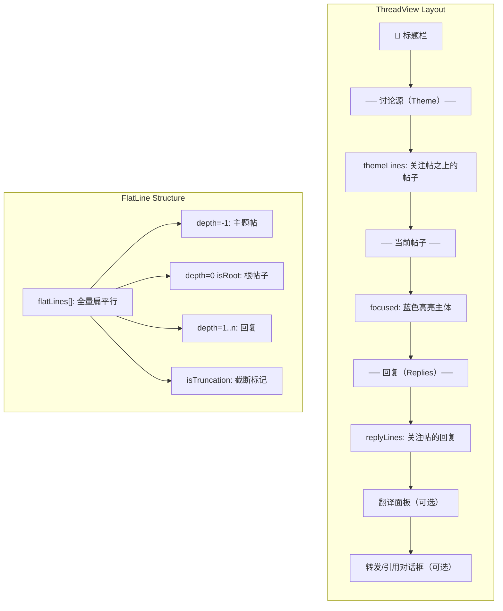

本页深入分析 TUI 终端客户端中两个核心交互模式：时间线的**虚拟滚动（Virtual Scrolling）**实现，以及讨论串视图的**Cursor/Focused 双焦点平铺设计**。这两者共同构成了用户在主信息流和深度阅读场景下的导航骨架，其设计哲学可概括为：**用行级预计算替代 DOM 虚拟化，用双指针解耦浏览与定位**。

区别于浏览器端依赖 `@tanstack/react-virtual` 的 PWA 实现（参见 [虚拟滚动时间线](23-xu-ni-gun-dong-shi-jian-xian-attanstack-react-virtual-intersectionobserver-zi-dong-jia-zai)），TUI 终端受限于 Ink 的渲染模型和终端的字符网格特性，选择了更接近"切片引擎"的架构：所有内容预先转换为等宽行（line），然后基于视口高度和用户焦点位置计算可见切片。这种方式避免了动态高度测量、DOM 回收等复杂问题，直接利用终端的天然网格特性。

## 时间线虚拟滚动：基于行级预计算的切片引擎

时间线视图的虚拟滚动承载在 `PostList` 组件中。其核心数据结构是 `PostLine[]` —— 一个扁平的、由多篇帖子拼接而成的**行数组**。每篇帖子通过 `postToLines()` 函数被拆分为若干行：作者行（含索引号）、正文行（CJK 感知换行）、媒体行（图片/引用链接）和统计行（点赞/转发/回复数）。

```typescript
// PostList.tsx —— 行预计算与可见切片
const allLines = useMemo(() => {
  const lines: PostLine[] = [];
  for (let i = 0; i < posts.length; i++) {
    const postLines = postToLines(posts[i], i, i === selectedIndex, width, t, locale);
    for (const l of postLines) lines.push(l);
  }
  return lines;
}, [posts, selectedIndex, width, t, locale]);
```

这段代码的架构含义值得细究：`allLines` 的 `useMemo` 依赖包含了 `posts`、`selectedIndex`、`width` 等全部渲染相关变量。这意味着**选中索引的变化本身就会触发全量重算**——这并非性能缺陷，而是一种有意为之的简化。在终端环境中，帖子数量通常在数十到数百量级，行级预计算的开销远低于维护一个可变长虚拟列表的复杂度。每次 `selectedIndex` 变化时，整条作者行会用 `cyanBright` 高亮标记，而其余帖子为默认颜色，这种"全量更新 + 条件高亮"模式让渲染逻辑保持纯函数式，易于推理。

切片计算则使用了一个启发式定位策略：先在 `allLines` 中找到包含 `[selectedIndex]` 标记的作者行（`isName: true`），然后将该行定位到视口的上三分之一处，而非居中：

```typescript
// PostList.tsx —— 视口定位：焦点在视口上 1/3 处
const viewStart = Math.max(0, Math.min(
  allLines.length - visibleLines,
  (selectedLineStart >= 0 ? selectedLineStart : 0) - Math.floor(visibleLines / 3)
));
```

选择上三分之一而非居中的原因是：终端阅读是一个**自上而下的连续流**，将当前选中帖子置于视口偏上位置，可以给下方内容留出更多空间，让用户预见即将进入视野的帖子。这与 PWA 中 `IntersectionObserver` 的"即将进入视口即预加载"策略（[虚拟滚动时间线](23-xu-ni-gun-dong-shi-jian-xian-attanstack-react-virtual-intersectionobserver-zi-dong-jia-zai)）异曲同工，只不过终端环境下这种"预视"是通过垂直布局空间预留来实现的。

滚动指示器也内置在组件中：`▲ scrollPct%` 和 `▼ restPct%` 分别显示在视口上方和下方，指示当前位置在整个列表中的进度百分比。这是一种极其轻量的"滚动条"替代方案，无需计算每个帖子高度，仅需 `viewStart / (allLines.length - visibleLines)` 即可。

Sources: [packages/tui/src/components/PostList.tsx](packages/tui/src/components/PostList.tsx#L1-L69), [packages/tui/src/components/PostItem.tsx](packages/tui/src/components/PostItem.tsx#L1-L99)

## CJK 换行引擎：终端的视觉宽度挑战

TUI 终端处理中日韩（CJK）文本的换行是一个被广泛低估的工程挑战。与浏览器的 CSS `word-wrap` 不同，终端中每个字符占据的列数取决于字符的 Unicode 属性：ASCII 字符占 1 列，CJK 字符、全角符号和 emoji 占 2 列，零宽字符（如零宽空格 U+200B）占 0 列。

`text.ts` 中的 `visualWidth()` 函数实现了这一计算，其核心是一个覆盖了 7 个 Unicode 区间的 `isWide()` 判定：

```
Hangul Jamo     (0x1100 - 0x115f)
CJK + Yi        (0x2e80 - 0xa4cf)
Hangul Syllables(0xac00 - 0xd7a3)
CJK Compatibility(0xf900 - 0xfaff)
CJK Forms       (0xfe30 - 0xfe6f)
Fullwidth Forms (0xff01 - 0xff60, 0xffe0 - 0xffe6)
Emoji/Misc      (0x1f300 - 0x1f9ff, 0x1fa00 - 0x1fa6f)
CJK Ext B+      (0x20000 - 0x2ffff)
```

这个区间覆盖的完整性直接决定了换行的正确性。例如，缺失 emoji 区间会导致 `😀你好` 这样的混合文本换行错位，因为 emoji 的视觉宽度被计为 1 而非 2。

`wrapLines()` 函数在此基础上实现了三段式断点策略：**首选空格断点**（保持单词完整性）→ **次选 CJK 字符边界**（中文字符间天然可断）→ **强制断点**（在 `maxCols` 处硬切）。`findBreakPoint()` 函数在遍历字符时累积视觉宽度，当超过 `maxCols` 时，如果之前遇到空格则回退到最近空格位置，否则在当前位置硬切：

```
输入: "你好 world! 这是一段测试文本"
maxCols=10
输出: ["你好", " world!", " 这是一段", "测试文本"]
```

注意第一行 `"你好"` 实际占用 4 列（2个 CJK 字符各占 2 列），`" world!"` 占 7 列（空格 + 6个ASCII），这种混合宽度的正确分割正是 `visualWidth` 的功劳。

Sources: [packages/tui/src/utils/text.ts](packages/tui/src/utils/text.ts#L1-L82)

## 讨论串平铺视图：三区段布局

如果说 `PostList` 是时间线的"线性滚动"，那么 `UnifiedThreadView` 则是讨论串的**结构化解构**。它将一条 AT Protocol 的嵌套线程树（`ThreadViewPost`）展开为三个视觉区段：



这种三区段布局的工程动机是：相比于传统社交客户端将讨论串作为"自上而下的时间线"渲染，该设计将**当前关注帖子**始终固定在视口的中间区段，使其成为视觉锚点。上方是"讨论源"（theme posts——该讨论串的根帖子及以上层级的帖子），下方是"回复"（replies——直接或间接回复当前帖子的内容），形成了一个"上下文 — 焦点 — 延伸"的信息层级结构。

区段划分逻辑在 `UnifiedThreadView` 组件中通过两个 `filter()` 实现：

```typescript
// 主题帖：depth <= 0，排除 focused 自身
const themeLines = flatLines.filter(l => l.depth < 0 || (l.depth === 0 && l.isRoot && l.uri !== focusedUri));
// 回复帖：depth > 0 且 depth <= focusedDepth + 1，排除 focused 自身
const replyLines = flatLines.filter(l => (l.uri || l.isTruncation) && l.depth > 0 && l.depth <= focusedDepth + 1 && l.uri !== focusedUri);
```

这里的 `focusedDepth` 动态变化：当用户沿回复链深入（Enter 到某个回复）时，新帖子的 `depth` 成为新的 `focusedDepth`，`replyLines` 的筛选范围随之调整。这种递归变焦式的设计保证用户在任何层级都能看到**当前帖子的直接上下文和直接回复**，而非整个线程树的全部内容。

Sources: [packages/tui/src/components/UnifiedThreadView.tsx](packages/tui/src/components/UnifiedThreadView.tsx#L1-L292)

## 双焦点（Cursor/Focused）设计模式

这是本架构中最深刻的设计决策。大多数列表/线程视图采用**单焦点模型**：用户通过方向键移动高亮，按 Enter 触发操作，高亮位置即操作位置。但 `UnifiedThreadView` 引入了**两个独立的状态变量**：

```
cursorIndex:  方向键移动的目标（高亮可见位置）
focusedIndex: 当前查看的帖子（仅通过 Enter/h 改变）
```

这两个索引的解耦带来了几个关键交互特性：

**一、浏览不改变阅读上下文**。当用户在回复列表中上下移动 `cursorIndex` 时，`focusedIndex` 保持不变，因此 `themeLines` 和 `replyLines` 的筛选不发生变化。用户可以在不丢失上下文的前提下预览不同回复的内容。

**二、Enter 执行"重新聚焦"**。当按下 Enter 且当前 `cursorLine` 的 `uri` 不等于当前帖子 `uri` 时，触发 `refreshThread()` 重新加载整个线程，以新帖子为根。这一操作的代价是重新发起 API 调用（`client.getPostThread()`），因此通过 `setThreadKey(k => k + 1)` 触发 `UnifiedThreadView` 的完整卸载与挂载，确保状态完全重置：

```typescript
// App.tsx —— 重新聚焦时强制卸载/挂载
refreshThread={(newUri) => { 
  goTo({ type: 'thread', uri: newUri }); 
  setThreadKey(k => k + 1); 
}}
```

**三、`h` 键返回"讨论源"**。`themeUri` 是首次加载线程时的 URI（通常为根帖子），按下 `h` 或 `H` 时通过 `refreshThread(themeUri)` 跳回根帖。这提供了一个快速的"返祖"导航，避免用户在一个深嵌套回复链中迷失。

**四、截断行（Truncation）作为交互元素**。当一层级的回复数量超过 `maxSiblings`（初始为 5）时，`flattenThreadTree()` 插入一条 `isTruncation: true` 的占位行，其文本为"（还有 N 条回复未显示）"。按 Enter 在此行上时调用 `expandReplies()`，将 `maxSiblings` 增加 10 后重新扁平化。这是一种"按需加载"策略，避免一次性加载大量回复导致终端刷屏。

```typescript
// useThread.ts —— 渐进式加载回复
const expandReplies = useCallback(() => {
  if (!client || !uri) return;
  setMaxSiblings(prev => prev + 10);
}, [client, uri]);
```

Sources: [packages/tui/src/components/App.tsx](packages/tui/src/components/App.tsx#L90-L95), [packages/app/src/hooks/useThread.ts](packages/app/src/hooks/useThread.ts#L75-L82)

## 线程树的扁平化算法

`flattenThreadTree()` 是将 AT Protocol 的嵌套线程结构转换为 `FlatLine[]` 的关键算法。其核心是一个递归的 DFS（深度优先遍历），但有两个关键设计：

**深度偏移（depth offset）**。当算法从根帖子（depth=0）向上遍历父链时（`walk(node.parent, d - 1)`），父帖子的 `depth` 变为负数（-1, -2...）。这在下游的 `themeLines` 筛选中被用作"主题帖"的标识：

```typescript
// flattenThreadTree —— 递归遍历 + 深度偏移
function walk(node: ThreadViewPost | NFP, d: number) {
  // ...向上遍历父链
  if (node.parent && node.parent.$type === 'app.bsky.feed.defs#threadViewPost') {
    walk(node.parent, d - 1); // 父帖子的 depth 变为负数
  }
  // ...记录当前帖子，depth = d
  // ...向下遍历子回复，d + 1
}
```

**去重保护**。AT Protocol 的线程树中，同一个帖子可能出现在多个分支的父链中（如：多个回复都包含对同一父帖的引用）。`visitedUris` 集合确保每个 URI 只在 `flatLines` 中出现一次，避免视觉重复。

**回复排序**。同级回复按创建时间升序排列（`sort((a, b) => ...indexedAt)`），确保线程的阅读顺序是时间线性的。

```typescript
// useThread.ts —— 回复按时间排序
const sortedReplies = [...node.replies]
  .filter((r): r is ThreadViewPost => r.$type === 'app.bsky.feed.defs#threadViewPost')
  .sort((a, b) => new Date(a.post.indexedAt).getTime() - new Date(b.post.indexedAt).getTime());
```

Sources: [packages/app/src/hooks/useThread.ts](packages/app/src/hooks/useThread.ts#L1-L332)

## 三种虚拟滚动策略的对比分析

整个 TUI 客户端中存在三种不同的滚动/导航策略，分别对应不同的交互场景：

| 组件 | 策略 | 数据模型 | 视口计算 | 核心权衡 |
|------|------|----------|----------|----------|
| **PostList** | 行预计算 + 焦点偏移 | `PostLine[]`（预拼接） | 焦点行在视口 1/3 处 + 上下指示器 | 简单直接；全量重算限制列表规模 |
| **UnifiedThreadView** | 三区段静态渲染（无虚拟滚动） | `FlatLine[]` + `themeLines/replyLines` 过滤 | 无切片，全部渲染（线程通常 < 200 行） | 双焦点解耦浏览/定位；全部渲染可接受 |
| **AIChatView** | 手动 scrollOffset + 自动滚底 | `(string \| ReactNode)[]` | `viewStart = allLines.length - maxVisible - scrollOffset` | 自动滚底策略；可回溯历史消息 |

`AIChatView` 额外引入了一个"自动滚底"的增强体验：当用户位于视口底部（`scrollOffset === 0`）时，新消息自动将视口推至最新内容；如果用户回滚查看历史消息，`wasAtBottom.current` 标记为 `false`，新消息出现时不触发滚动——这是一种"不打扰用户阅读历史"的设计，常见于聊天应用中：

```typescript
// AIChatView.tsx —— 智能自动滚底
useEffect(() => {
  if (totalMsgCount > prevMsgCount.current) {
    if (wasAtBottom.current) setScrollOffset(0);
  }
  prevMsgCount.current = totalMsgCount;
}, [totalMsgCount]);

useEffect(() => {
  wasAtBottom.current = scrollOffset === 0;
}, [scrollOffset]);
```

Sources: [packages/tui/src/components/AIChatView.tsx](packages/tui/src/components/AIChatView.tsx#L59-L76)

## 设计启示

这套 TUI 虚拟滚动与线程视图体系虽然没有采用标准的 DOM 虚拟化方案，但其设计在面对终端环境的约束时展现出了独特的优雅性。对于需要构建类似终端界面的开发者，以下几点值得借鉴：

**行级预计算替代运行时虚拟化**。终端的字符网格让"帖子 → 行"的映射变得可预测且廉价。`postToLines()` 是一个纯函数，接收帖子数据和屏幕宽度，输出固定宽度的行数组。这使得视口切片（`array.slice(viewStart, viewStart + visibleLines)`）成为一个 O(1) 操作。相比之下，PWA 端需要使用 `@tanstack/react-virtual` 的动态高度测量和 DOM 回收（[PWA 虚拟滚动时间线](23-xu-ni-gun-dong-shi-jian-xian-attanstack-react-virtual-intersectionobserver-zi-dong-jia-zai)），因为在浏览器环境中每篇帖子的高度取决于 CSS 渲染结果，无法预计算。

**双焦点解耦浏览与操作意图**。`cursorIndex` 和 `focusedIndex` 的分离是一个可泛化的交互模式：它让"看"（方向键移动）和"定"（Enter 确认）成为两个语义不同的操作，允许用户在确认之前自由探索而不产生副作用。这在帖子很长或信息密集的场景下尤为有价值。

**区段化渲染作为信息架构手段**。将线程拆分为 theme/focused/replies 三区段，本质上是一种**信息过滤**：用户永远不必在数百条回复中寻找当前帖子的直接上下文。这种"按深度过滤"的策略可以看作是一种自动化的信息层级划分，替代了手动"展开/折叠"交互。

Sources: [packages/tui/src/components/UnifiedThreadView.tsx](packages/tui/src/components/UnifiedThreadView.tsx#L1-L292), [packages/tui/src/components/PostList.tsx](packages/tui/src/components/PostList.tsx#L1-L69), [packages/tui/src/components/AIChatView.tsx](packages/tui/src/components/AIChatView.tsx#L1-L192)

---

**继续阅读**：
- 下一站: [AI 聊天面板：会话历史、写操作确认对话框与撤销功能](20-ai-liao-tian-mian-ban-hui-hua-li-shi-xie-cao-zuo-que-ren-dui-hua-kuang-yu-che-xiao-gong-neng) —— 深入了解 AI 聊天面板如何处理会话状态、确认对话框和撤销操作
- 并行阅读: [虚拟滚动时间线：@tanstack/react-virtual + IntersectionObserver 自动加载](23-xu-ni-gun-dong-shi-jian-xian-attanstack-react-virtual-intersectionobserver-zi-dong-jia-zai) —— 对比 PWA 端的虚拟滚动实现，理解终端与浏览器的差异