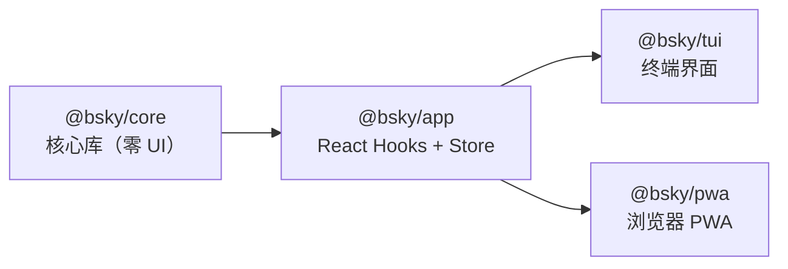
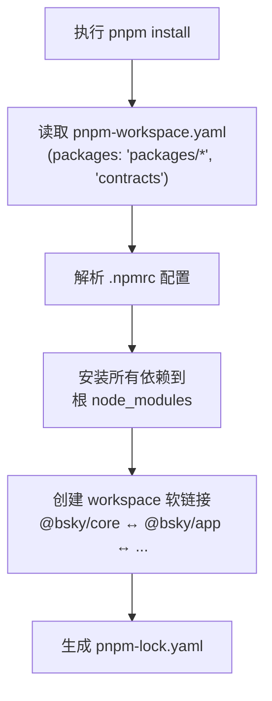
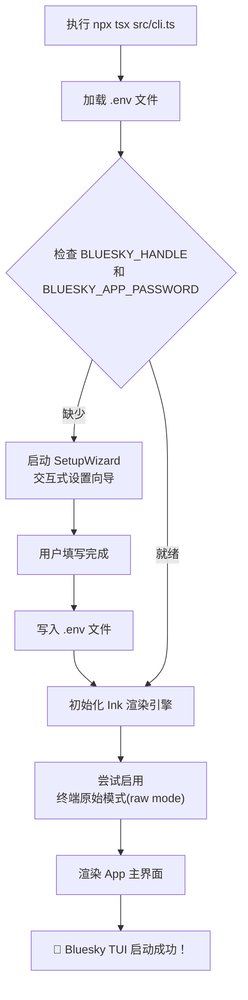

本指南将引导你完成从零搭建 Bluesky 双端 AI 社交客户端的全过程。你将学会：配置开发环境、安装依赖、配置 Bluesky 和 AI 凭证、以及分别以终端（TUI）和浏览器（PWA）两种模式启动客户端。预计完成时间约 15 分钟。

---

## 前提条件：检查你的工具箱

开始之前，请确保你的系统已安装以下基础工具。本项目的所有依赖管理基于 **pnpm** 工作空间（workspace）机制，而非 npm 或 yarn，这是最重要的前提条件。

| 工具 | 最低版本 | 用途 | 验证命令 |
|------|---------|------|---------|
| **Node.js** | ≥ 18（推荐 20+） | JavaScript 运行时 | `node --version` |
| **pnpm** | ≥ 9（推荐 10+） | 包管理与 monorepo 编排 | `pnpm --version` |
| **Git**（可选） | 任意 | 克隆仓库与版本管理 | `git --version` |

**安装指引**：如果你还没有 pnpm，可通过 `npm install -g pnpm` 全局安装。Node.js 可从 [nodejs.org](https://nodejs.org) 下载，或使用 nvm（Windows 上推荐 [nvm-windows](https://github.com/coreybutler/nvm-windows)）进行版本管理。

> **注意**：项目的 Node.js 引擎约束定义在根 `package.json` 的 `"engines": { "node": ">=18" }` 字段中 —— 低于 18 版本将无法运行。当前开发环境已验证 Node.js v24.14.0 + pnpm 10.32.1 完全兼容。Sources: [package.json](package.json#L8-L10)

---

## 获取代码：克隆仓库并理解结构

### 克隆仓库

```bash
git clone https://github.com/epheiamoe/bsky.git
cd bsky
```

如果你不打算使用 Git，也可直接下载 ZIP 压缩包并解压。

### 一览项目骨架

克隆完成后，你会看到以下顶层结构（省略了 `node_modules` 和 `dist` 等构建产物）：

```
bsky/
├── .env.example          # 环境变量模板（TUI 使用）
├── .npmrc                # pnpm 配置（shamefully-hoist 等）
├── package.json          # 根工作空间定义
├── pnpm-workspace.yaml   # workspace 包声明
├── tsconfig.base.json    # 共享 TypeScript 配置
├── contracts/            # 系统提示词与工具 JSON Schema
├── packages/
│   ├── core/             # Layer 0: 零 UI 依赖的核心库
│   ├── app/              # Layer 1: React Hooks + 纯 Store
│   ├── tui/              # Layer 2: 终端界面（Ink/React）
│   └── pwa/              # Layer 2: 浏览器 PWA（React DOM）
├── docs/                 # 全部技术文档
└── public/icons/         # PWA 安装图标
```

### 理解分层设计（高屋建瓴）

项目采用**严格单向依赖**的四层架构。关于各层的职责边界，[四层架构设计：Core → App → TUI/PWA 分层原则](7-si-ceng-jia-gou-she-ji-core-app-tui-pwa-fen-ceng-yuan-ze) 一文有详细阐述，但作为快速开始，你只需理解以下依赖流向：



- **`@bsky/core`**：封装 AT 协议客户端（BskyClient）、AI 助手（AIAssistant）、31 个 Bluesky 工具函数。纯 TypeScript，无任何 UI 依赖。
- **`@bsky/app`**：基于 React 的状态管理层，提供 `useAuth`、`useTimeline`、`useAIChat` 等 Hook。TUI 和 PWA 共用同一套 Hook 签名。
- **`@bsky/tui`**（终端）：基于 Ink（React 的终端渲染引擎）的命令行界面，适合开发者和终端爱好者。
- **`@bsky/pwa`**（浏览器）：基于 React DOM + Tailwind CSS 的渐进式 Web 应用，可安装到桌面或手机。

在开发流程中，**业务逻辑只写一次**在 core+app 层，TUI 和 PWA 只编写渲染组件的代码。Sources: [docs/ARCHITECTURE.md](docs/ARCHITECTURE.md#L1-L48), [docs/PACKAGES.md](docs/PACKAGES.md#L1-L10)

---

## 安装依赖：pnpm 一键搞定

工作空间中的四个包（`core`、`app`、`tui`、`pwa`）以及 `contracts` 目录共享同一个 `pnpm-lock.yaml` 锁文件。安装方式极其简单：

```bash
pnpm install
```

这一条命令会做三件事：

1. 解析 `pnpm-workspace.yaml` 中声明的所有包（`packages/*` 和 `contracts`）
2. 按照 `.npmrc` 的配置规则（`shamefully-hoist=true` —— 将依赖提升到顶层，`strict-peer-dependencies=false` —— 宽松处理 peer 依赖）安装全部依赖
3. 建立 workspace 内部包之间的软链接（`@bsky/core` ← `@bsky/app` ← `@bsky/tui` / `@bsky/pwa`）



> **验证安装**：安装完成后，检查根目录下是否生成了 `pnpm-lock.yaml` 文件，以及 `node_modules` 目录中是否包含 `@bsky/core`、`@bsky/app` 等 workspace 包的符号链接。Sources: [pnpm-workspace.yaml](pnpm-workspace.yaml#L1-L3), [.npmrc](.npmrc#L1-L4)

---

## 构建项目：编译核心代码

安装依赖后，需要先构建 `core` 和 `app` 两个基础层，这样 `tui` 和 `pwa` 才能引用它们编译后的 JS 文件：

```bash
pnpm -r build
```

该命令会递归（`-r` 标志）执行各个包 `package.json` 中定义的 `build` 脚本。构建顺序由 pnpm 根据 workspace 依赖关系自动决定：

1. 先构建 **`@bsky/core`**（`tsc` 编译 `src/` → `dist/`，输出 `.js` + `.d.ts` + `.d.ts.map`）
2. 再构建 **`@bsky/app`**（同样 `tsc` 编译，依赖 `@bsky/core` 的类型定义）
3. 最后构建 **`@bsky/tui`** 和 **`@bsky/pwa`**（两者都依赖 `@bsky/app`）

> **⚠️ 新手常见问题**：如果跳过 `pnpm -r build` 直接运行 TUI 或 PWA，TypeScript 运行时（如 `tsx`）会自动编译，但初次启动速度会显著变慢。建议始终先构建完整项目。Sources: [package.json](package.json#L5-L7)

---

## 配置环境：TUI 与 PWA 的两种模式

本项目的凭证管理采用**双轨制**：TUI 模式使用 `.env` 文件从本地读取凭据；PWA 模式则通过浏览器登录表单输入，凭据保存在浏览器的 `localStorage` 中。关于两种模式的详细对比，请参阅 [TUI 终端环境：.env 配置与凭证管理](3-tui-zhong-duan-huan-jing-env-pei-zhi-yu-ping-zheng-guan-li) 和 [PWA 浏览器环境：无需 .env，登录即用](4-pwa-liu-lan-qi-huan-jing-wu-xu-env-deng-lu-ji-yong)。

### 方式一：TUI 模式——配置 .env 文件

想要通过终端启动，你需要在项目根目录创建 `.env` 文件。最简单的方式是复制模板：

```bash
# Windows CMD
copy .env.example .env

# 或者手动创建 .env 文件，填入以下内容
```

最终 `.env` 文件的内容如下：

```env
# === Bluesky 账号（必填）===
BLUESKY_HANDLE=your-handle.bsky.social
BLUESKY_APP_PASSWORD=your-app-password

# === AI/LLM 配置（必填）===
LLM_API_KEY=sk-your-api-key
LLM_BASE_URL=https://api.deepseek.com
LLM_MODEL=deepseek-v4-flash

# === 翻译目标语言（可选，默认 zh）===
TRANSLATE_TARGET_LANG=zh
```

各字段的详细说明：

| 环境变量 | 是否必填 | 说明 | 获取方式 |
|---------|---------|------|---------|
| `BLUESKY_HANDLE` | ✅ 必填 | 你的 Bluesky 用户名，格式如 `user.bsky.social` | 注册 Bluesky 账号即可获得 |
| `BLUESKY_APP_PASSWORD` | ✅ 必填 | 应用专用密码（非登录密码） | 进入 Bluesky 设置 → App Passwords → 创建新密码（格式如 `xxxx-xxxx-xxxx-xxxx`） |
| `LLM_API_KEY` | ✅ 必填 | AI 对话使用的 API 密钥 | 前往 DeepSeek（推荐）或 OpenAI 等平台创建 |
| `LLM_BASE_URL` | ❌ 可选 | API 基础地址 | 默认 `https://api.deepseek.com`，兼容任何 OpenAI 风格接口 |
| `LLM_MODEL` | ❌ 可选 | 模型名称 | 默认 `deepseek-v4-flash`，可根据服务商调整 |
| `TRANSLATE_TARGET_LANG` | ❌ 可选 | 翻译目标语言代码 | 支持 `zh` `en` `ja` `ko` `fr` `de` `es` 七种语言，默认中文 |

> **⚠️ 重要安全提示**：`.env` 文件已在 `.gitignore` 中声明忽略，不会被误提交到 Git 仓库。但你仍需妥善保管其中的敏感信息，尤其是 `BLUESKY_APP_PASSWORD` 和 `LLM_API_KEY`。Sources: [.env.example](.env.example#L1-L12), [docs/ENV.md](docs/ENV.md#L1-L51), [.gitignore](.gitignore#L1-L10)

### 方式二：PWA 模式——无需 .env，浏览器中配置

PWA 模式完全不需要 `.env` 文件，所有配置都通过浏览器界面完成：

1. **登录**：首次打开 PWA 时，页面显示登录表单，输入 Bluesky Handle + App Password
2. **AI 配置**：登录后进入设置页（⚙️ 图标），填入 API Key、Base URL 和 Model
3. **持久化**：所有凭证保存在浏览器 `localStorage` 中，下次打开页面自动恢复会话

这意味着 PWA 模式下，用户数据**永远不会离开你的浏览器**——凭据不会发送到任何第三方服务器，Bluesky API 调用直接从浏览器发出（CORS 由 Bluesky 服务端支持）。Sources: [docs/PWA_GUIDE.md](docs/PWA_GUIDE.md#L1-L30)

---

## 启动运行：TUI 与 PWA

完成上述配置后，你可以选择以下任意一种方式启动客户端。详细启动步骤可参考 [启动 TUI 终端客户端](5-qi-dong-tui-zhong-duan-ke-hu-duan) 和 [启动 PWA 浏览器客户端](6-qi-dong-pwa-liu-lan-qi-ke-hu-duan)。

### 选项 A：启动 TUI（终端客户端）

```bash
cd packages/tui
npx tsx src/cli.ts
```

启动后会发生什么：

1. `cli.ts` 会尝试加载项目根目录的 `.env` 文件（从 `process.cwd()` 和 `__dirname` 向上搜索两级目录）
2. 检查 `BLUESKY_HANDLE` 和 `BLUESKY_APP_PASSWORD` 是否已配置
3. **首次运行**：如果缺少凭据，自动启动**设置向导**（SetupWizard），交互式引导你逐一填写所有配置项，并在完成后自动写入 `.env` 文件
4. 凭据就绪后，初始化 Ink 渲染引擎（将 React 组件渲染到终端），呈现主界面
5. 终端需支持**原始模式**（raw mode）—— Windows Terminal、iTerm2、Kitty 均可正常使用



> **💡 提示**：启动时如果终端不支持 raw mode（如某些 IDE 内置终端），`cli.ts` 会降级为普通模式，仍可正常操作，但键盘事件处理体验会稍差。Sources: [packages/tui/src/cli.ts](packages/tui/src/cli.ts#L1-L128)

### 选项 B：启动 PWA（浏览器客户端）

```bash
cd packages/pwa
pnpm dev
```

Vite 开发服务器将在 `http://localhost:5173` 启动并自动打开浏览器。登录后即可开始使用，无需任何 `.env` 配置。

| 场景 | 命令 | 监听地址 |
|------|------|---------|
| **开发模式** | `pnpm dev` | `http://localhost:5173`（热更新） |
| **生产构建** | `pnpm build` | 输出到 `dist/` 目录 |
| **预览构建** | `pnpm preview` | `http://localhost:4173`（模拟生产环境） |

> **💡 提示**：PWA 的 Vite 配置（`vite.config.ts`）中包含 `base: './'` 和 `os/fs/path` 的 stub 别名映射，确保 AT 协议相关的 Node.js 模块在浏览器环境中正常运行。Sources: [packages/pwa/vite.config.ts](packages/pwa/vite.config.ts#L1-L24)

---

## 验证是否成功

启动后，你可以通过以下指标判断环境准备是否成功：

| 检查项 | TUI 验证方式 | PWA 验证方式 |
|-------|-------------|-------------|
| **登录状态** | 终端显示主时间线，可看到关注者的帖子 | 登录后进入 Feed 时间线，帖子正常加载 |
| **AI 对话** | 按 `A` 键打开 AI 面板，发送消息 | 点击 AI 聊天图标，输入消息获得回复 |
| **帖子操作** | 选择帖子后按 `l` 点赞、按 `r` 转发 | 点击帖子下方的 ❤️ 或 🔄 按钮 |
| **翻译功能** | 选中帖子按 `T` 键 | 帖子右上角点击翻译按钮 |

---

## 常见问题排查

| 问题 | 可能原因 | 解决方案 |
|------|---------|---------|
| `pnpm install` 报错 `ERR_PNPM_INVALID_WORKSPACE_CONFIGURATION` | pnpm 版本过低 | 更新 pnpm：`npm install -g pnpm@latest` |
| **运行 TUI 时出现 `Cannot find module '@bsky/app'`** | 未先构建 workspace 包 | 先回到根目录执行 `pnpm -r build` |
| **TUI 启动后看到 "SetupWizard" 向导** | `.env` 文件缺失或无有效凭据 | 按向导提示依次填写，或手动复制并修改 `.env.example` |
| **PWA 登录时提示 "Invalid handle or password"** | App Password 格式错误 | 确认使用 Bluesky 设置中生成的专用密码（含连字符），而非登录密码 |
| **AI 对话始终无响应** | API Key 无效或 base URL 错误 | 检查 `LLM_API_KEY` 是否正确，或前往 DeepSeek 控制台确认余额 |
| **终端显示错乱、文字重叠** | CJK 字符宽度计算异常 | 确认终端编码为 UTF-8，推荐使用 Windows Terminal（非 cmd.exe） |
| **pnpm dev 无法启动，端口被占用** | 5173 端口已被其他进程使用 | 修改 `vite.config.ts` 中的 `server.port` 或使用 `--port` 参数 |
| **克隆后运行报错 "git not found"** | 当前不关心 Git 版本管理 | 忽略此错误，继续执行命令即可 |

---

## 接下来做什么？

环境准备就绪后，建议按以下顺序阅读文档，逐步深入：

**环境配置类**（了解完整配置选项）：
- [TUI 终端环境：.env 配置与凭证管理](3-tui-zhong-duan-huan-jing-env-pei-zhi-yu-ping-zheng-guan-li) —— 深入了解所有环境变量的含义与高级用法
- [PWA 浏览器环境：无需 .env，登录即用](4-pwa-liu-lan-qi-huan-jing-wu-xu-env-deng-lu-ji-yong) —— 了解 PWA 的会话持久化机制

**运行方式类**（两种客户端的详细操作）：
- [启动 TUI 终端客户端](5-qi-dong-tui-zhong-duan-ke-hu-duan) —— TUI 的各项快捷键与视图切换
- [启动 PWA 浏览器客户端](6-qi-dong-pwa-liu-lan-qi-ke-hu-duan) —— PWA 的路由体系与功能导航

**架构深入类**（理解设计哲学）：
- [四层架构设计：Core → App → TUI/PWA 分层原则](7-si-ceng-jia-gou-she-ji-core-app-tui-pwa-fen-ceng-yuan-ze) —— 为什么这样分层、各层的关注点分离

如果你遇到任何本指南未覆盖的问题，欢迎查阅 `docs/USER_ISSUSES.md` 中的已知问题记录，或前往 [GitHub Issues](https://github.com/epheiamoe/bsky/issues) 提交反馈。