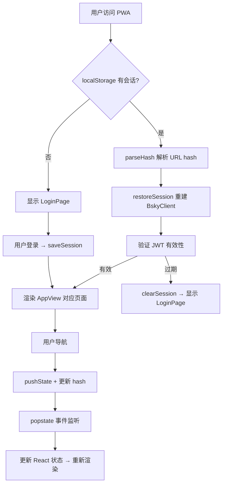
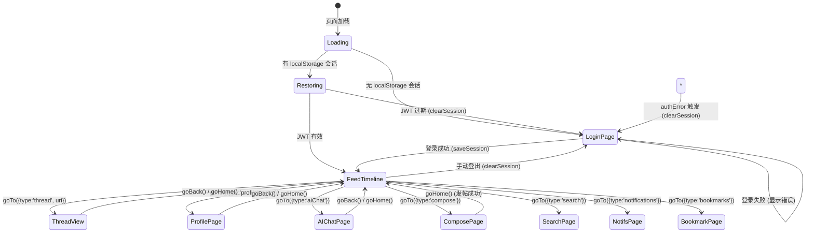

不同于 TUI 端的内存栈式导航，PWA 端必须解决两个独特挑战：**静态托管的 URL 路由**（无服务端重写）和 **浏览器刷新后的会话恢复**。本章深入 `@bsky/pwa` 中 `useHashRouter` 和 `useSessionPersistence` 这两个核心 Hook，揭示它们如何分别解决上述问题，以及如何在 `App.tsx` 中协同运作。理解这套机制，你将对 PWA 架构中的状态持久化与导航恢复策略形成完整的认知。

---

## 设计动机：为什么是 Hash 路由 + localStorage？

PWA 的部署目标包括 Cloudflare Pages、Netlify、Vercel 等静态托管平台。这些平台不支持任意的服务端 URL 重写规则（或配置成本较高），而 `window.location.hash` 之后的部分不会被发送到服务器——这意味着 `https://example.com/#/thread?uri=...` 始终只请求 `index.html`，路由解析完全由前端 JavaScript 控制。这是 Hash 路由的核心优势：**零服务端配置，部署即用**。

与此同时，PWA 面临浏览器刷新、标签页关闭、睡眠唤醒等场景。一旦页面重新加载，内存中的所有状态（包括用户的 JWT 会话）都会丢失。`localStorage` 提供了同步、轻量的键值存储，适合持久化短生命周期的敏感凭证（accessJwt / refreshJwt），结合 `restoreSession` 机制实现"刷新后自动恢复登录"。



Sources: [useHashRouter.ts](packages/pwa/src/hooks/useHashRouter.ts#L1-L30), [useSessionPersistence.ts](packages/pwa/src/hooks/useSessionPersistence.ts#L1-L27)

---

## useHashRouter：基于 hash 的声明式导航

`useHashRouter` 是整个 PWA 导航系统的核心。它使用浏览器的 `hashchange` / `popstate` 事件，将 URL hash 字符串解析为类型安全的 `AppView` 对象，并提供 `goTo` / `goBack` / `goHome` 三个导航动作。

### 路由到 AppView 的双向编解码

解析与编码是 Hash 路由的基石。`parseHash()` 函数从 `window.location.hash` 中提取路径和查询参数，映射到 `AppView` 联合类型；`encodeView()` 则反向将 `AppView` 序列化为 hash 字符串。

| Hash 格式 | AppView 类型 | 示例 |
|---|---|---|
| `#/feed` | `{ type: 'feed' }` | 默认首页 |
| `#/thread?uri=at://...` | `{ type: 'thread', uri: string }` | 讨论串详情 |
| `#/profile?actor=did:plc:...` | `{ type: 'profile', actor: string }` | 用户主页 |
| `#/search?q=bluesky` | `{ type: 'search', query?: string }` | 搜索（可无参数） |
| `#/compose?replyTo=...&quoteUri=...` | `{ type: 'compose', replyTo?, quoteUri? }` | 发帖（可带上下文） |
| `#/ai?context=at://...` | `{ type: 'aiChat', contextUri?: string }` | AI 聊天（可带上下文） |
| `#/notifications` | `{ type: 'notifications' }` | 通知列表 |
| `#/bookmarks` | `{ type: 'bookmarks' }` | 书签页面 |

每个编码步骤都使用 `encodeURIComponent` / `decodeURIComponent` 对参数值进行百分号编码，确保 `at://` 这类 URI 中的特殊字符（`:`, `//`, 非 ASCII）在 URL 中安全传输。值得注意的是，`parseHash` 对无法识别或参数缺失的情况做了**安全降级**：如果 `#/thread` 缺少 `uri` 参数，不会抛出异常，而是静默回退到 `{ type: 'feed' }`。

Sources: [useHashRouter.ts](packages/pwa/src/hooks/useHashRouter.ts#L72-L137)

### 历史栈管理：pushState + popstate

与 `hashchange` 事件不同，`useHashRouter` 选择使用 `history.pushState` + `popstate` 组合——这有两个关键原因：

1. **可靠的后退检测**：`popstate` 能准确响应浏览器的前进/后退按钮、鼠标手势等系统级导航。而 `hashchange` 在面对 `goBack()` 调用的 `window.history.back()` 时，行为存在浏览器兼容性差异。
2. **语义分离**：`pushState` 明确表示"导航到一个新页面"，而非仅仅修改 hash。这使得 `window.history.length` 能够如实反映导航栈深度，`canGoBack` 的判断（`hash !== '#/feed'`）也因此可靠。

导航的三种动作的实现策略如下：

| 动作 | 实现方式 | 对 history 栈的影响 | 副作用 |
|---|---|---|---|
| `goTo(view)` | `pushState(null, '', hash)` | 压入新条目 | 更新 currentView，设置 canGoBack=true |
| `goBack()` | `window.history.back()` | 弹出当前条目（若不在 feed） | popstate 事件触发 → parseHash → setCurrentView |
| `goHome()` | `pushState(null, '', '#/feed')` | 重置为 feed | 覆盖当前条目，canGoBack=false |

初始化时，`useHashRouter` 会做一项隐式修复：如果当前 hash 为空、`#/` 或 `#/feed`，用 `replaceState` 统一设置为 `#/feed`，确保初始状态一致且可预测。

Sources: [useHashRouter.ts](packages/pwa/src/hooks/useHashRouter.ts#L32-L70)

### 与 @bsky/app 层的解耦

值得注意的设计决策是：`@bsky/app` 层（`state/navigation.ts`）已经定义了一个独立的内存栈式导航系统（`createNavigation`），包含自己的 `goTo` / `goBack` / `goHome` 和 `canGoBack`。但 **PWA 端完全绕过了这一层**，直接使用 `useHashRouter` 替代。

原因在于：内存栈在页面刷新后会丢失状态，导致用户无法回到刷新前的页面。而 Hash 路由将导航状态编码到 URL 中，天然具备持久化能力。两条路径共享相同的 `AppView` 类型定义，只是驱动方式不同——TUI 端使用内存栈，PWA 端使用 URL hash。这种"同一个类型定义，不同驱动引擎"的设计体现了四层架构中**同构类型、异构实现**的原则。

Sources: [navigation.ts](packages/app/src/state/navigation.ts#L1-L66)

---

## useSessionPersistence：localStorage 会话持久化

`useSessionPersistence` 不是 React Hook（它不调用 `useState` 或 `useEffect`），而是一组纯函数工具，封装了 `localStorage` 的读写操作。三个函数的职责清晰分离：

```typescript
// 存储结构
interface StoredSession {
  accessJwt: string;   // 访问令牌（2小时过期）
  refreshJwt: string;  // 刷新令牌（用于自动续期）
  handle: string;      // 用户句柄（如 alice.bsky.social）
  did: string;         // 去中心化标识符（如 did:plc:...）
}
```

| 函数 | 行为 | 异常处理 |
|---|---|---|
| `getSession()` | 从 `localStorage` 读取 `bsky_session` 键，JSON 反序列化 | 解析失败或键不存在时返回 `null`，从不抛出 |
| `saveSession(session)` | 将会话对象 JSON 序列化后写入 `localStorage` | 无显式处理——写入失败时静默失败（由浏览器存储配额控制） |
| `clearSession()` | 移除 `localStorage` 中的 `bsky_session` 键 | 无异常路径 |

这里的选择是**显式的**：`accessJwt` 和 `refreshJwt` 属于敏感凭据，存储在 `localStorage` 中意味着同一源下的任何 JavaScript 代码都能读取它们。这对于纯前端应用来说是一个不可避免的权衡——由于没有后端协助进行安全的 HTTP-only Cookie 设置，`localStorage` 是唯一可用的持久化方案。作为补偿，应用在身份验证失败（`authError` 触发）时立即调用 `clearSession()` 清除凭据，最小化泄露窗口。

此外，`bsky_app_config` 键也存储在 `localStorage` 中，用于持久化用户的 AI 配置、语言偏好和深色模式设置。配置的读写通过 `useAppConfig.ts` 中的 `getAppConfig` / `saveAppConfig` / `updateAppConfig` 完成，与 `useSessionPersistence` 共享相同的本地存储介质但使用不同的键名隔离。

Sources: [useSessionPersistence.ts](packages/pwa/src/hooks/useSessionPersistence.ts#L1-L27), [useAppConfig.ts](packages/pwa/src/hooks/useAppConfig.ts#L1-L43)

---

## App.tsx 中的整合：三阶段生命周期

`App.tsx` 是 Hash 路由与会话持久化的汇合点。它通过三个精心排序的 `useEffect` 管理整个会话生命周期：

### 阶段一：挂载时恢复（Session Restore on Mount）

```typescript
useEffect(() => {
  const saved = getSession();
  if (saved && !client) {
    restoreSession({
      accessJwt: saved.accessJwt,
      refreshJwt: saved.refreshJwt,
      handle: saved.handle,
      did: saved.did,
    });
    setIsLoggedIn(true);
  }
}, []);
```

这个 `useEffect` 的依赖数组为 `[]`，只在组件挂载时执行一次。`restoreSession` 来自 `@bsky/app` 的 `useAuth` Hook，它创建一个新的 `BskyClient` 实例，调用 `c.restoreSession(session)` 设置 JWT 令牌，然后异步获取用户资料以验证凭证有效性。如果刷新令牌已过期，`getProfile` 调用会在 JWT 自动刷新失败后抛错，`catch` 分支中清除 `client` 和 `session`，并将 `error` 设置为 `'session_expired'`，最终触发第三阶段的清除逻辑。

### 阶段二：登录成功时保存（Session Save on Login）

```typescript
useEffect(() => {
  if (session && client?.isAuthenticated()) {
    saveSession({
      accessJwt: session.accessJwt,
      refreshJwt: session.refreshJwt,
      handle: session.handle,
      did: session.did,
    });
    setIsLoggedIn(true);
  }
}, [session, client]);
```

当用户通过 `LoginPage` 提交表单、`login()` 调用成功返回后，`session` 和 `client` 状态从 `null` 变为有效值。这个 `useEffect` 检测到变化，将最新凭据持久化到 `localStorage`。这里的关键细节是：**只在 `client.isAuthenticated()` 确认后才写入**，避免在登录请求尚未完成的中间状态错误地保存无效凭据。

### 阶段三：认证错误时清除（Session Clear on Expiry)

```typescript
useEffect(() => {
  if (authError && isLoggedIn) {
    clearSession();
    setIsLoggedIn(false);
  }
}, [authError, isLoggedIn]);
```

这个 `useEffect` 是安全兜底机制。当 `BskyClient` 的 JWT 自动刷新失败（例如设备长时间休眠后令牌已过期）、或 `restoreSession` 中的 `getProfile` 调用失败时，`authError` 被设置为 `'session_expired'`。此时应用**立即清除本地存储中的会话**，并将 `isLoggedIn` 置为 `false`，强制用户重新登录。这种"宁愿要求重新登录，也不让用户看到破损状态"的策略，体现了**安全优先于便利**的设计哲学。

Sources: [App.tsx](packages/pwa/src/App.tsx#L1-L85), [auth.ts](packages/app/src/stores/auth.ts#L38-L58)

---

## 完整的导航 + 认证状态机

将上述所有组件整合后，可以得到 PWA 完整的导航与认证状态转换图：



---

## 边界情况与异常恢复策略

Hash 路由与会话持久化联合运作时，有四种边界情况需要特别注意：

| 场景 | 行为 | 理由 |
|---|---|---|
| 用户直接访问 `#/invalid-hash` | 兜底返回 `{ type: 'feed' }` | 避免白屏，保证总是有可渲染的视图 |
| `localStorage` 数据损坏（非 JSON） | `getSession` 返回 `null`，走登录流程 | `try/catch` 捕获所有异常，永不抛出 |
| 恢复会话后 JWT 已过期 | `restoreSession` → `getProfile` 失败 → `error = 'session_expired'` → `clearSession` | 让用户重新登录，而非展示空白或错误状态 |
| 同时打开多个标签页 | 每个标签页独立运行自己的 `useHashRouter` 和 `useAuth` | 无跨标签页状态同步——各标签页各自管理自己的会话（localStorage 共享，但内存状态独立） |

最后一种情况尤其有趣。如果用户在标签页 A 登出（`clearSession`），标签页 B 不会立即感知。但标签页 B 下一次发起 API 请求时，`BskyClient` 的 JWT 自动刷新将发现凭据无效，`authError` 被触发，最终也进入 `clearSession` + 登出流程。这是一种**懒同步**策略——不主动监听 `storage` 事件，而是让 API 错误自然传播到认证状态。

Sources: [App.tsx](packages/pwa/src/App.tsx#L40-L55), [auth.ts](packages/app/src/stores/auth.ts#L38-L58)

---

## 总结与深层设计原则

`useHashRouter` + `useSessionPersistence` 的组合构成了 PWA 端的导航与持久化双支柱。回顾其设计，可以提炼出三条贯穿始终的原则：

1. **静态优先（Static-first）**：选择 Hash 路由而非 History 路由，优先保证在所有静态托管平台上的零配置部署，而非追求 URL 美观性。这是 PWA 端与 TUI 端在导航实现上的根本分歧点。
2. **凭据先行写回（Credential-first Persistence）**：会话持久化的核心不是恢复 UI 状态，而是恢复 API 认证凭据。一旦 `BskyClient` 重建成功，所有数据（时间线、通知、AI 聊天历史）自然会通过 API 重新获取。这种"先认证，后数据"的优先级排序简化了持久化的 scope。
3. **崩溃安全（Crash-safe）**：无论是 `parseHash` 的参数缺失降级、`getSession` 的 JSON 解析异常兜底，还是 `restoreSession` 的异步验证失败清除，每个环节都有明确的失败路径。这些路径的终点始终是同一个安全状态——显示 `LoginPage`，而不是白屏或卡死。

理解这套机制后，你可以沿着两个方向继续深入：一是查看 `Sidebar.tsx` 如何通过 `goTo` 实现七种视图的无缝切换，二是探索 `FeedTimeline` 组件如何与 `@tanstack/react-virtual` 协同，在 Hash 导航驱动下实现高性能虚拟滚动时间线。