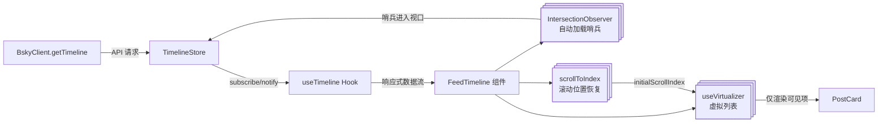

时间线（Feed Timeline）是社交客户端最核心的 UI 界面之一。在 PWA 端，FeedTimeline 组件需要处理数百甚至上千条帖子的高效渲染、滚动位置保持（用户在浏览帖子详情后返回时恢复到原位置）、以及到底部时自动加载更多。该组件将 `@tanstack/react-virtual` 的虚拟滚动与原生 `IntersectionObserver` 哨兵机制相结合，实现了仅在视口范围内渲染元素的同时、在用户接近底部时自动触发 `loadMore` 调用，整个过程零冗余 DOM 节点、零手动事件管理。

## 架构概览

整个时间线功能由三个层次协作完成：**Store（纯状态管理）** → **React Hook（桥接层）** → **PWA UI 组件（渲染层）**。这四个模块之间的关系可以用以下图示表达：



数据流向是单向的：`TimelineStore` 从核心层的 `BskyClient` 获取数据，通过订阅/通知模式推送给 `useTimeline` Hook，Hook 再以响应式数据流的形式将 `posts`、`loading`、`cursor`、`error` 传递给 `FeedTimeline`。组件内部则使用 `useVirtualizer` 管理 DOM 节点的创建与销毁、使用 `IntersectionObserver` 监听底部哨兵自动触发数据加载、使用 `scrollToIndex` 在导航返回时恢复滚动位置。

Sources: [timeline store](packages/app/src/stores/timeline.ts#L1-L75), [useTimeline](packages/app/src/hooks/useTimeline.ts#L1-L30), [FeedTimeline](packages/pwa/src/components/FeedTimeline.tsx#L1-L188)

## 第一层：TimelineStore — 纯状态的订阅驱动容器

`TimelineStore` 是一个纯 TypeScript 对象，不依赖任何 React 概念。它通过简单的 `subscribe` / `_notify` 回调模式实现观察者模式。

Store 核心字段包括 `posts: PostView[]`、`loading: boolean`、`cursor: string | undefined` 和 `error: string | null`。`cursor` 是 Bluesky API 的分页标记——只要 API 返回了 `cursor`，就说明还有更多数据可加载。

三个操作方法各有明确职责：

- **`load(client)`**：调用 `client.getTimeline(20)` 获取前 20 条帖子，用 `res.feed.map(f => f.post)` 提取 `PostView` 数组，保存返回的 `cursor`。这是初始加载路径。
- **`loadMore(client)`**：检查 `cursor` 存在且未处于加载中，然后调用 `client.getTimeline(20, store.cursor)` 传入现有游标。关键逻辑是 `store.posts = [...store.posts, ...res.feed.map(f => f.post)]`——新数据追加到现有数组尾部，而不是替换。
- **`refresh(client)`**：先将 `cursor` 清空、`posts` 置空，然后重新调用 `load(client)`。本质上是一次"重置后重新加载"。

每个方法都在开始和结束时调用 `_notify()` 触发订阅者回调，确保 UI 层能及时响应 loading 状态的变化。

Sources: [timeline store](packages/app/src/stores/timeline.ts#L20-L75)

## 第二层：useTimeline Hook — React 到 Store 的桥接

```typescript
export function useTimeline(client: BskyClient | null) {
  const [store] = useState(() => createTimelineStore());
  const [, force] = useState(0);
  const tick = useCallback(() => force(n => n + 1), []);
  const loaded = useRef(false);

  useEffect(() => {
    if (client && !loaded.current) {
      loaded.current = true;
      store.load(client);
    }
  }, [client, store]);

  useEffect(() => store.subscribe(tick), [store, tick]);
  // ...返回 { posts, loading, cursor, error, loadMore, refresh }
}
```

这个 Hook 的设计遵循了一个精妙的模式：**Store 实例通过 `useState` 的初始化函数创建，确保在整个组件生命周期内只创建一次**。`subscribe(tick)` 在 Store 每次 `_notify()` 时调用 `tick`（一个递增数字的 `useState` setter），从而触发 React 重新渲染。渲染时从 `store.posts` 等处直接读取最新值。

`loaded` ref 确保 `store.load(client)` 只在首次获得有效 `client` 时执行一次，避免 `useEffect` 重新执行导致重复请求。

返回的 `loadMore` 和 `refresh` 方法被包装为箭头函数 `() => store.loadMore(client)`，只有在 `client` 存在时才返回有效函数，否则返回 `undefined`。这在下层组件中可以直接用 `if (!loadMore) return` 来判断是否需要渲染加载控制。

Sources: [useTimeline](packages/app/src/hooks/useTimeline.ts#L1-L30)

## 第三层：FeedTimeline — 虚拟滚动 + 哨兵自动加载 + 位置保持

FeedTimeline 组件将三个核心机制编织在一起，构成了 PWA 端时间线的完整交互体验。

### 虚拟滚动引擎：useVirtualizer

```typescript
const virtualizer = useVirtualizer({
  count: loading && posts.length === 0 ? 5 : posts.length,
  getScrollElement: () => scrollRef.current,
  estimateSize: () => ESTIMATED_POST_HEIGHT,  // 120px
  overscan: 5,
});
```

`@tanstack/react-virtual` 的 `useVirtualizer` 接收四个关键参数：

- **`count`**：总数据项数。初始加载时为 `5`（配合骨架屏占位），数据到达后使用 `posts.length`。
- **`getScrollElement`**：返回滚动容器的 DOM 引用。
- **`estimateSize`**：每项预估高度（120px）。这是纯估计值，因为 `measureElement` 会在元素实际渲染后动态测量实际高度。
- **`overscan: 5`**：在可见区域外额外渲染 5 个帖子，保证快速滚动时不会出现空白闪烁。

虚拟列表的渲染采用绝对定位布局：

```typescript
{virtualizer.getVirtualItems().map((virtualItem) => {
  return (
    <div
      key={post.uri}
      style={{
        position: 'absolute',
        top: 0,
        left: 0,
        width: '100%',
        transform: `translateY(${virtualItem.start}px)`,
      }}
      ref={virtualizer.measureElement}  // ← 动态高度测量
      data-index={virtualItem.index}
    >
      <PostCard ... />
    </div>
  );
})}
```

每个虚拟项使用 `translateY` 定位在滚动容器内，外层容器高度为 `virtualizer.getTotalSize()`（所有项的预估高度总和），使得浏览器的滚动条感知到完整的内容长度。`measureElement` ref 会在组件渲染后自动测量并修正实际高度。

### IntersectionObserver 哨兵自动加载

```typescript
useEffect(() => {
  const el = sentinelRef.current;
  if (!el || !loadMore || !cursor) return;
  const obs = new IntersectionObserver(
    ([entry]) => { if (entry?.isIntersecting) loadMore(); },
    { root: scrollRef.current, rootMargin: '200px' },
  );
  obs.observe(el);
  return () => obs.disconnect();
}, [loadMore, cursor, posts.length]);
```

底部哨兵是一个 `ref={sentinelRef}` 的 `div`（`h-px`），放置在虚拟列表容器之后。`IntersectionObserver` 配置了 `rootMargin: '200px'`，意味着当哨兵距离可视区域底部还有 200px 时就触发 `loadMore()`——这为用户提供了提前加载的缓冲时间，避免用户滚动到底部时等待网络请求。

三个依赖项触发哨兵重建：`loadMore` 函数变更、`cursor` 变化（每次加载后 cursor 更新）、`posts.length` 变化（新数据追加后重新挂载哨兵）。当 `cursor` 为 `undefined`（没有更多数据）时，哨兵不激活。

Sources: [FeedTimeline - virtualizer + sentinel](packages/pwa/src/components/FeedTimeline.tsx#L50-L95)

### 滚动位置保持：initialScrollIndex + onFirstVisibleIndexChange

这是用户体验的关键设计。当用户从时间线点击一条帖子进入详情页，再返回时间线时，应该恢复到之前浏览的位置。

```typescript
// App.tsx 中用一个 ref 保存上次可见索引
const feedScrollIndexRef = useRef(0);

// 传入 FeedTimeline
<FeedTimeline
  initialScrollIndex={feedScrollIndexRef.current}
  onFirstVisibleIndexChange={(idx) => { feedScrollIndexRef.current = idx; }}
  ...
/>
```

组件内部通过 `reportVisibleIndex` 回调，在每次滚动时通过 `virtualizer.getVirtualItems()[0].index` 获取当前第一个可见项的索引，仅在变化时通过 `onFirstVisibleIndexChange` 通知父组件。

当组件挂载时（从详情页返回），检查 `initialScrollIndex` 是否为正数且 `posts.length > 0`，通过 `requestAnimationFrame` 调用 `virtualizer.scrollToIndex(target, { align: 'start' })` 将滚动位置恢复到之前保存的索引位置。

这种方法利用了 `useRef` 的可变性——ref 的变化不会触发重新渲染，但在组件卸载和重新挂载之间保持了值的连续性。`feedScrollIndexRef` 在 App 的整个生命周期内跨视图切换存活。

Sources: [FeedTimeline - scroll restoration](packages/pwa/src/components/FeedTimeline.tsx#L57-L87), [App integration](packages/pwa/src/App.tsx#L31-L122)

### 综合状态视图

FeedTimeline 的渲染逻辑覆盖了全部五种状态：

| 状态 | 判定条件 | 渲染内容 |
|------|----------|----------|
| **初始加载** | `loading && posts.length === 0` | 5 个 `SkeletonCard`（脉冲动画骨架屏） |
| **空数据** | `!loading && !error && posts.length === 0` | 🕊️ 空状态提示（来自 `t('status.noPosts')`） |
| **错误** | `error` 不为 null | 红色错误提示条（支持 dark mode） |
| **正常显示** | `posts.length > 0` | 虚拟滚动列表 + PostCard |
| **加载更多中** | `cursor` 存在 + loading | 按钮显示 "加载中..." 并禁用 |

底部额外显示「加载更多」按钮（作为哨兵的降级方案）和帖子总数统计。组件整体高度通过 `h-[calc(100vh-3rem)]` 撑满视口减去顶部栏高度，确保滚动容器正确计算。

Sources: [FeedTimeline - render](packages/pwa/src/components/FeedTimeline.tsx#L97-L188)

## PostCard 组件设计

PostCard 是时间线的单个帖子卡片，支持两种数据源：`PostView`（来自 API 的原始数据）和 `FlatLine`（来自线程视图的扁平数据结构）。组件提取了帖子作者头像、显示名、句柄、发布时间、文本内容、嵌入媒体（图片/外部链接）、引用帖子等所有信息，并以一致的视觉风格渲染。

图片支持网格布局（1/2/3/4+ 四种模式），点击后通过 `createPortal` 将 `ImageLightbox` 全屏灯箱渲染到 `document.body`。外部链接、媒体标签、引用帖子都以独立的视觉区域呈现。底部显示回复数、转发数和点赞数的统计。

Sources: [PostCard](packages/pwa/src/components/PostCard.tsx#L1-L359)

## 在 App.tsx 中的集成

FeedTimeline 在 App.tsx 中通过 `currentView.type === 'feed'` 条件渲染：

```typescript
case 'feed':
  return (
    <FeedTimeline
      goTo={goTo}
      posts={timeline.posts}
      loading={timeline.loading}
      cursor={timeline.cursor}
      error={timeline.error}
      loadMore={timeline.loadMore}
      refresh={timeline.refresh}
      initialScrollIndex={feedScrollIndexRef.current}
      onFirstVisibleIndexChange={(idx) => { feedScrollIndexRef.current = idx; }}
    />
  );
```

`timeline` 是由 `useTimeline(client)` 返回的对象，当 `client`（BskyClient 实例）因会话过期变为 `null` 时，`timeline.loadMore` 和 `timeline.refresh` 都会变为 `undefined`，哨兵自动停用。这体现了依赖注入式架构的一个优势——数据流的生命周期与认证状态天然同步。

Sources: [App.tsx feed case](packages/pwa/src/App.tsx#L100-L122)

## 性能特征与设计取舍

整个实现有几个值得注意的性能权衡：

**预估高度 vs 动态测量**：`estimateSize: () => 120` 是一个粗略估计值。实际 PostCard 的内容高度差异很大——纯文本帖子约 100px，带多张图片的帖子可达 400px。`measureElement` ref 会在首次渲染后修正实际高度，但在此之前滚动条位置会有微小偏差。选择保守的 120px 作为基准，避免了预估过高导致的底部空白过多。

**被动滚动监听**：`reportVisibleIndex` 使用了 `{ passive: true }` 选项，告知浏览器滚动监听不会调用 `preventDefault()`，从而允许浏览器进行滚动优化。这是为了尽可能减少滚动卡顿。

**200px rootMargin**：自动加载的提前量设为 200px，这个数值经过权衡——太小的提前量会导致用户在滚动到底部时等待加载；太大的提前量（如 500px+）会在用户尚未关注到底部时触发不必要的网络请求，消耗移动端流量。

**IntersectionObserver vs scroll 事件监听**：选择 IntersectionObserver 而非 `scroll` 事件监听负载更多，是因为 IntersectionObserver 由浏览器原生优化，不会在主线程繁忙时产生积压的回调，在低端设备上表现更稳定。

## 延伸阅读

如果你对这个话题感兴趣，以下页面提供了相关的实现细节：

- [纯 Store + React Hook 模式：订阅驱动的状态管理](12-chun-store-react-hook-mo-shi-ding-yue-qu-dong-de-zhuang-tai-guan-li) — 解释了 TimelineStore 所使用的 subscribe/notify 模式的完整设计哲学
- [BskyClient：AT 协议客户端与 JWT 自动刷新机制](8-bskyclient-at-xie-yi-ke-hu-duan-yu-jwt-zi-dong-shua-xin-ji-zhi) — `getTimeline()` 的底层 API 调用与令牌生命周期管理
- [所有 Hook 签名速查](14-suo-you-hook-qian-ming-su-cha-useauth-usetimeline-usethread-useaichat-deng) — useTimeline 的完整类型签名及与其他 Hook 的关系
- [TUI 端的虚拟滚动与平铺线程视图](19-xu-ni-gun-dong-yu-ping-pu-xian-cheng-shi-tu-cursor-focused-shuang-jiao-dian-she-ji) — TUI 端使用不同虚拟滚动策略的时间线实现对比