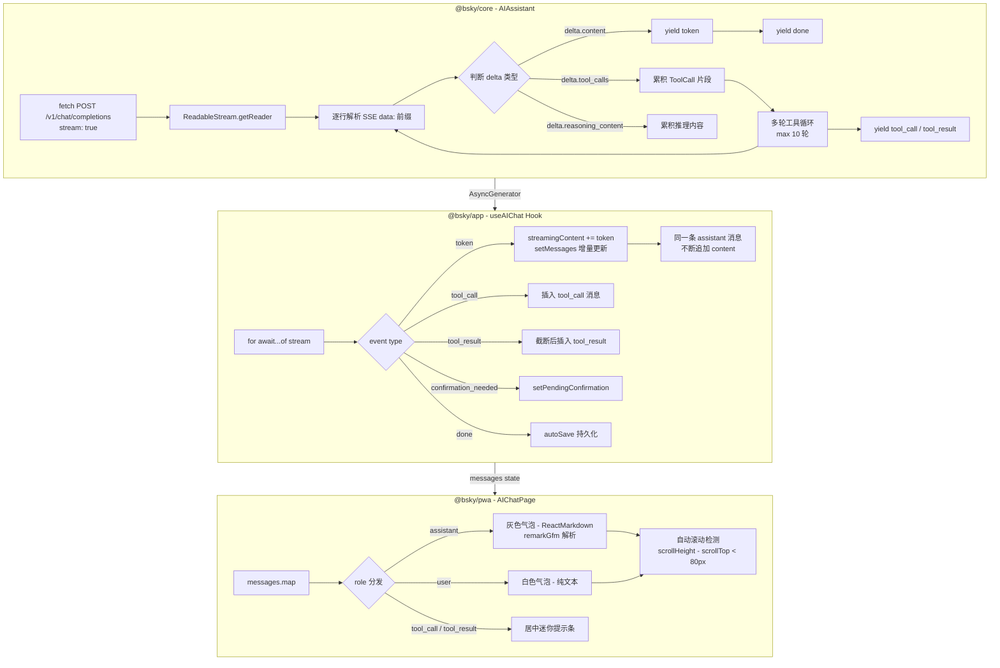

本文档深入解析 PWA 端 AI 聊天页面的流式渲染架构，涵盖从 `@bsky/core` 层的 SSE 流式请求、到 `@bsky/app` 层的 React Hook 桥接、再到 `@bsky/pwa` 层的 react-markdown 实时渲染的完整链路。读者将理解：一个 LLM token 从服务器发出到屏幕上显示为格式化 Markdown 的全过程。

---

## 架构总览：三层流式数据管道

AI 聊天流式页面是典型的三层架构协作案例。SSE 数据从核心层生成，经由 Hook 层转化为 React 状态，最后由 PWA 组件消费渲染。以下是数据流的全景图：



**架构关键洞察**：与一次性请求的阻塞模型（`sendMessage`）不同，流式模型（`sendMessageStreaming`）使用 `AsyncGenerator` 逐事件生产数据，Hook 层在每个事件到达时立即调用 `setMessages` 触发 React 重渲染——这意味着 LLM 还在生成下一个 token 时，上一个 token 已经渲染在屏幕上了。

Sources: [AIAssistant.sendMessageStreaming](packages/core/src/ai/assistant.ts#L300-L400), [useAIChat hook](packages/app/src/hooks/useAIChat.ts#L1-L200), [AIChatPage component](packages/pwa/src/components/AIChatPage.tsx#L1-L335)

---

## SSE 流的底层构建：ReadableStream 逐行解析

`AIAssistant.sendMessageStreaming()` 方法在 `@bsky/core` 层实现，是整个流式能力的基石。它的设计遵循一个关键原则：**在工具调用多轮循环的语境中支持流式**，这意味着它必须同时处理文本令牌和工具调用片段的交错到达。

### 请求构造

流式请求与普通请求使用同一套 `ChatCompletionRequest` 结构，唯一差别在于将 `stream: true` 写入请求体：

```typescript
// packages/core/src/ai/assistant.ts#L333-L348
const body: ChatCompletionRequest = {
  model: this.config.model,
  messages: this.messages,
  temperature: 0.7,
  max_tokens: 4096,
  stream: true,  // ← 关键开关
};
```

请求头包含标准 Bearer 认证，URL 指向 `${baseUrl}/v1/chat/completions`（默认为 DeepSeek API）。

### SSE 解析引擎

响应通过 `res.body!.getReader()` 获取 `ReadableStreamDefaultReader`，以 `TextDecoder` 逐块解码：

```typescript
// packages/core/src/ai/assistant.ts#L367-L398
const reader = res.body!.getReader();
const decoder = new TextDecoder();
let fullContent = '';
let toolCallAccum: Map<number, { id: string; name: string; arguments: string }> = new Map();

while (true) {
  const { done, value } = await reader.read();
  if (done) break;
  const text = decoder.decode(value, { stream: true });
  const lines = text.split('\n');
  for (const line of lines) {
    if (!line.startsWith('data: ')) continue;
    const data = line.slice(6);
    if (data === '[DONE]') continue;
    // 解析 JSON chunk
    const chunk = JSON.parse(data);
    const delta = chunk.choices?.[0]?.delta;
    // 按 delta 类型分发...
  }
}
```

解析器处理三种 delta 类型：

| Delta 字段 | 含义 | 处理方式 |
|---|---|---|
| `delta.content` | 文本令牌 | 追加到 `fullContent`，立即 `yield { type: 'token', content }` |
| `delta.tool_calls` | 工具调用片段 | 按 `index` 分组累积（SSE 中工具调用的 name/arguments 可能分片到达） |
| `delta.reasoning_content` | 推理过程（DeepSeek 特有） | 累积但不向前端暴露 token 级别事件 |

工具调用片段的累积策略尤为精妙：由于 SSE 流中同一个工具调用的 `name` 和 `arguments` 可能在多个 chunk 中分片发送，解析器使用 `Map<number, Accumulator>` 按 `tc.index`（工具调用在数组中的索引）分组，在流结束后组装成完整的 `ToolCall` 数组。

Sources: [SSE 解析逻辑](packages/core/src/ai/assistant.ts#L333-L400), [ToolCall 累积](packages/core/src/ai/assistant.ts#L400-L420)

---

## 多轮工具循环与写确认门控

流式版本的多轮工具循环与同步版本共享同一核心逻辑，但在事件生产上做了适配：

### 工具循环流程

```
SSE 流结束 → 检查 toolCallAccum 是否非空
  ├── 空 → yield { type: 'done', content: fullContent } → 结束
  └── 非空 → 组装 ToolCall 数组
       ├── yield { type: 'tool_call', content, toolName }
       ├── 读操作 → 直接执行 handler
       ├── 写操作 → yield { type: 'confirmation_needed' } → 等待 Promise
       │   └── 用户确认 → 执行 / 用户取消 → yield 取消结果
       ├── yield { type: 'tool_result', content, toolName }
       ├── 结果追加到 messages
       └── 回到循环开始 → 发起新一轮 SSE 请求
```

写确认门控机制在流式与同步模式中完全共享：`_waitForConfirmation()` 返回一个 `Promise<boolean>`，该 Promise 在 `confirmAction(true/false)` 被调用时 resolve。这本质上是一种**Promise 桥接模式**——UI 组件持有 `resolve` 函数的控制权，而业务逻辑等待这个 Promise 的决定。

```typescript
// packages/core/src/ai/assistant.ts#L100-L110 (简化)
private async _waitForConfirmation(): Promise<boolean> {
  this._confirmPromise = new Promise<boolean>((resolve) => {
    this._confirmResolve = resolve;
  });
  return this._confirmPromise;
}
```

在 `useAIChat` Hook 中，`confirmation_needed` 事件被转换为 `setPendingConfirmation(...)`，触发 React 状态更新，弹出确认对话框。

Sources: [多轮循环逻辑](packages/core/src/ai/assistant.ts#L420-L480), [写确认门控](packages/core/src/ai/assistant.ts#L95-L115), [Hook 侧确认处理](packages/app/src/hooks/useAIChat.ts#L130-L140)

---

## useAIChat Hook：异步生成器与 React 状态的桥梁

`useAIChat` Hook 是整个流式渲染架构的核心适配层，它负责将 `AsyncGenerator` 产生的事件序列转化为 React 可消费的状态数组。

### 核心机制：增量累积消息

流式路径（`options.stream === true`）的关键在于**同一条 assistant 消息的 content 字段被渐进式填充**：

```typescript
// packages/app/src/hooks/useAIChat.ts#L100-L118
if (event.type === 'token') {
  streamingContent += event.content;
  setMessages(prev => {
    const last = prev[prev.length - 1];
    if (last?.role === 'assistant') {
      // 追加到已有 assistant 消息
      const updated = [...prev];
      updated[updated.length - 1] = { ...last, content: streamingContent };
      return updated;
    }
    // 第一个 token — 创建新消息
    return [...prev, { role: 'assistant', content: streamingContent }];
  });
}
```

这个模式与其他实现（每次追加新消息）不同：它**复用最后一条 assistant 消息对象**，不断更新其 `content` 属性。这意味着 React 会对同一个组件实例反复触发重渲染，而不是创建新消息卡片——避免了 DOM 节点的反复挂载/卸载。

### 四种事件到状态的映射

| AsyncGenerator 事件 | Hook 中的处理 | 最终消息形态 |
|---|---|---|
| `{ type: 'token', content }` | 累积到 `streamingContent`，更新最后一条 assistant 消息 | 单条 `{ role: 'assistant', content: '渐进填充的文本' }` |
| `{ type: 'tool_call', content, toolName }` | 重置 `streamingContent`，插入 tool_call 消息 | `{ role: 'tool_call', content: '🔧 createPost(...)', toolName }` |
| `{ type: 'tool_result', content, toolName }` | 截断结果（最长 300 字符），插入 tool_result 消息 | `{ role: 'tool_result', content: '结果摘要...', toolName }` |
| `{ type: 'confirmation_needed', content, toolName }` | 设置 `pendingConfirmation` 状态 | 不插入消息，触发模态框 |
| `{ type: 'done', content }` | 触发 `autoSave` 持久化（见下文） | 沿用已累积的最后一条 assistant 消息 |

### 错误处理

流式请求中的错误（网络断开、API 返回错误状态码等）被捕获后转换为 `{ role: 'assistant', isError: true }` 消息，在 UI 中以红色样式展示。同时 `loading` 状态被重置为 `false`。

Sources: [useAIChat 流式发送](packages/app/src/hooks/useAIChat.ts#L85-L145), [错误处理](packages/app/src/hooks/useAIChat.ts#L145-L155)

---

## react-markdown 实时渲染：每次重渲染都是完整解析

PWA 端 `AIChatPage` 利用 `react-markdown` 库渲染 assistant 消息，这是实现"实时 Markdown 渲染"的关键点。

### 渲染链路

```typescript
// packages/pwa/src/components/AIChatPage.tsx#L160-L170
{messages.map((msg, i) => {
  // ... 其他角色分支 ...
  if (msg.role === 'assistant') {
    return (
      <div className="bg-surface border border-border rounded-lg px-3 py-2 max-w-[85%]">
        <div className="text-sm text-text-primary markdown-body">
          <ReactMarkdown remarkPlugins={[remarkGfm]}>
            {msg.content}
          </ReactMarkdown>
        </div>
      </div>
    );
  }
})}
```

由于 assistant 消息的 `content` 属性在流式过程中被反复更新（每收到一个 token 就触发一次 `setMessages`），`ReactMarkdown` 组件在每个 tick 都会用最新的、可能不完整的文本重新解析渲染。

### remark-gfm 的支持能力

`remark-gfm` 插件为 Markdown 渲染添加了 GitHub Flavored Markdown 扩展，包括：

- **表格**：`| col1 | col2 |` 语法
- **任务列表**：`- [x] done` / `- [ ] todo`
- **删除线**：`~~text~~`
- **自动链接**：URL 自动转为可点击链接
- **脚注**：`[^1]` 语法

LLM 输出中常见的代码块、列表、标题、链接等基础 Markdown 语法由 react-markdown 原生支持，无需额外插件。

### 样式覆盖

`index.css` 中定义了完整的 `.markdown-body` 样式表，为代码块、引用、表格、标题等元素提供了适配明暗两种主题的样式：

```css
/* packages/pwa/src/index.css#L25-L120 */
.markdown-body code {
  background-color: color-mix(in srgb, var(--color-border) 50%, transparent);
  font-size: 0.875rem;
  padding: 0.125rem 0.25rem;
  border-radius: 0.25rem;
}
.markdown-body pre {
  background-color: color-mix(in srgb, var(--color-border) 30%, transparent);
  border-radius: 0.5rem;
  padding: 0.75rem;
}
```

所有颜色值使用 CSS 变量（`--color-border`, `--color-text-primary` 等），在 `.dark` 选择器中切换，使得 Markdown 渲染随系统主题自动适配。

### 性能考量

react-markdown 是同步解析库，每次渲染都会完整解析整个 `msg.content` 字符串。在流式场景下，这意味着：
- 前几个 token 时解析负担极轻（几十字符）
- 完整回答时解析负担取决于 LLM 输出长度（数百到数千字符）
- 每次重渲染解析的是当前已累积的全部内容，而非仅增量部分

对于典型 LLM 输出长度（< 4000 字符），react-markdown 的单次解析耗时通常在 1-5ms 范围内，远低于 16ms 的帧预算。但在极端输出（长表格或超大代码块）时，考虑使用 `react-markdown` 的 `rehypePlugins` 与缓存策略会有帮助。

Sources: [react-markdown 渲染](packages/pwa/src/components/AIChatPage.tsx#L160-L170), [Markdown CSS 样式](packages/pwa/src/index.css#L25-L120), [package.json 依赖](packages/pwa/package.json#L15-L20)

---

## 智能自动滚动实现

聊天界面需要一种"智能"的自动滚动策略：默认跟随新内容，但当用户向上翻阅历史时停止跟随，用户滚动到底部附近时恢复跟随。

### 实现方式

```typescript
// packages/pwa/src/components/AIChatPage.tsx#L40-L50
const [autoScroll, setAutoScroll] = useState(true);
const messagesEndRef = useRef<HTMLDivElement>(null);
const scrollContainerRef = useRef<HTMLDivElement>(null);

useEffect(() => {
  if (autoScroll && messagesEndRef.current) {
    messagesEndRef.current.scrollIntoView({ behavior: 'smooth' });
  }
}, [messages, loading, autoScroll]);

const handleScroll = useCallback(() => {
  const el = scrollContainerRef.current;
  if (!el) return;
  setAutoScroll(el.scrollHeight - el.scrollTop - el.clientHeight < 80);
}, []);
```

关键设计点：

1. **80px 阈值**：不使用精确的 `=== 0` 判断，而是用 80px 的容忍区间。用户大致滚动到底部时即恢复自动滚动，避免因微小偏差导致"差一点点但不动了"的不良体验。
2. **依赖数组**：`useEffect` 的依赖包含 `[messages, loading, autoScroll]`，确保新消息到达、加载状态变化、自动滚动开关变化时都会触发检查。
3. **`onScroll` 事件**：在滚动容器上绑定 `handleScroll`，每次用户触发滚动时重新计算 `autoScroll` 值。

Sources: [自动滚动实现](packages/pwa/src/components/AIChatPage.tsx#L38-L53)

---

## 对话持久化：流式写入 IndexedDB

PWA 端使用 `IndexedDBChatStorage` 实现聊天记录的浏览器本地持久化，与 TUI 端（`FileChatStorage`，文件系统）形成对照。

### IndexedDBChatStorage 的实现要点

```typescript
// packages/pwa/src/services/indexeddb-chat-storage.ts
const DB_NAME = 'bsky-chats';
const DB_VERSION = 1;
const STORE_NAME = 'chats';
```

使用 IndexedDB 的优势：异步 API 不阻塞主线程、无大小限制（相比 localStorage 的 5-10MB）、支持结构化 JSON 存储。

```typescript
function openDB(): Promise<IDBDatabase> {
  return new Promise((resolve, reject) => {
    const req = indexedDB.open(DB_NAME, DB_VERSION);
    req.onupgradeneeded = () => {
      const db = req.result;
      if (!db.objectStoreNames.contains(STORE_NAME)) {
        db.createObjectStore(STORE_NAME, { keyPath: 'id' });
      }
    };
    // ...
  });
}
```

存储架构：单一 object store `chats`，以 `chatId` 为 key。每条记录是一个完整的 `ChatRecord` 对象，包含整个消息数组。

### 写入时机

流式对话的持久化写入只在**流完成时**（接收到 `done` 事件）触发一次，而非每次 token 都写：

```typescript
// useAIChat.ts#L145-L150
// Auto-save after streaming complete
setMessages(prev => {
  void autoSave(prev);
  return prev;
});
```

这种设计平衡了数据安全（流结束时保存完整对话）与写入性能（避免频繁 IndexedDB 事务）。对话历史也通过 `useEffect` 在 `chatId` 变化时从 IndexedDB 恢复。

Sources: [IndexedDBChatStorage](packages/pwa/src/services/indexeddb-chat-storage.ts#L1-L77), [自动保存时机](packages/app/src/hooks/useAIChat.ts#L145-L150), [恢复对话](packages/app/src/hooks/useAIChat.ts#L55-L70)

---

## 消息气泡的完整分类

`AIChatPage` 中的消息渲染包含五种状态，每种状态对应不同的视觉呈现：

| 消息角色 | 对齐方式 | 背景样式 | 渲染方式 | 交互装饰 |
|---|---|---|---|---|
| `user` | 右对齐 | 蓝色实底（`bg-primary text-white`） | 纯文本 `whitespace-pre-wrap` | 最后一条 user 消息显示重试↻和撤销↩按钮 |
| `assistant` | 左对齐 | 浅灰背景 + 边框（`bg-surface border-border`） | **ReactMarkdown + remarkGfm** | 无 |
| `assistant`（错误） | 左对齐 | 红色背景 + 红色边框（`bg-red-50 dark:bg-red-900/20`） | ReactMarkdown | 红色文字 |
| `tool_call` | 居中 | 透明、极小字号 | 纯文本 `font-mono` | 显示工具名称 |
| `tool_result` | 居中 | 透明、极小字号 | 纯文本，最长 300 字符 | 超长截断加 `...` |

工具调用消息采用居中迷你提示条的视觉风格，区别于用户和 AI 的气泡布局，为用户提供工具执行过程的清晰可见性。

Sources: [消息渲染分支](packages/pwa/src/components/AIChatPage.tsx#L100-L200)

---

## 页面状态全景

`AIChatPage` 在完整生命周期中呈现以下状态序列：

```
初始状态（空对话）→ 快速提问按钮 → 用户输入 → 加载态（AI 思考动画）
→ 流式渲染（token 逐个显示）→ 工具调用提示（可选，可能多轮）
→ 完成态（完整回答）→ 等待下一次输入

异常路径：加载态 → API 错误 → 红色错误消息
```

### 快速提问系统

当 `guidingQuestions` 数组非空时（由 `useAIChat` 根据是否附带 `contextUri` 决定），页面在空对话状态展示一组快捷按钮：

```typescript
// 带 contextUri 时：
setGuidingQuestions(['总结这个讨论', '查看作者动态', '分析帖子情绪']);

// 无 contextUri 时：
setGuidingQuestions([]);  // 显示默认空提示
```

这些引导问题在用户发送第一条消息后消失，设计理念是降低首次使用门槛。

### 侧边栏历史

侧边栏展示从 IndexedDB 加载的所有对话摘要，包含：

- **标题**：首条用户消息的前 80 字符
- **消息数**：`user` 和 `assistant` 角色的消息计数
- **更新时间**：通过 `formatTime` 函数转为相对时间（"3分钟前"、"2小时前"等）

每条历史记录支持点击切换对话、hover 显示删除按钮、新建对话按钮立即生成 `crypto.randomUUID()` 作为新 `chatId`。

Sources: [引导问题](packages/app/src/hooks/useAIChat.ts#L80-L90), [formatTime 相对时间](packages/pwa/src/utils/format.ts#L1-L12), [历史列表渲染](packages/pwa/src/components/AIChatPage.tsx#L80-L130)

---

## 总结与进阶指引

AI 聊天流式页面实现了从底层 SSE 字节流到上层 React 组件实时渲染的完整管道。三个架构层的职责边界清晰：

- **`@bsky/core` 层**：关注协议——SSE 解析、多轮工具循环、Promise 桥接的门控机制
- **`@bsky/app` 层**：关注适配——AsyncGenerator 到 React 状态的映射、自动持久化、撤销重试
- **`@bsky/pwa` 层**：关注体验——react-markdown 实时渲染、智能自动滚动、模态确认对话框

理解这一管道后，建议进一步阅读：

- [所有 Hook 签名速查：useAuth / useTimeline / useThread / useAIChat 等](14-suo-you-hook-qian-ming-su-cha-useauth-usetimeline-usethread-useaichat-deng) —— 了解 `useAIChat` 的完整 API 签名与选项
- [聊天记录持久化：FileChatStorage 与 IndexedDBChatStorage](15-liao-tian-ji-lu-chi-jiu-hua-filechatstorage-yu-indexeddbchatstorage) —— 深入两种存储实现的异同
- [系统提示词合约：角色定义、翻译与草稿润色 Prompt](27-xi-tong-ti-shi-ci-he-yue-jiao-se-ding-yi-fan-yi-yu-cao-gao-run-se-prompt) —— 了解 AI 助手的系统提示词模板
- [四层架构设计：Core → App → TUI/PWA 分层原则](7-si-ceng-jia-gou-she-ji-core-app-tui-pwa-fen-ceng-yuan-ze) —— 回顾整体架构分层哲学