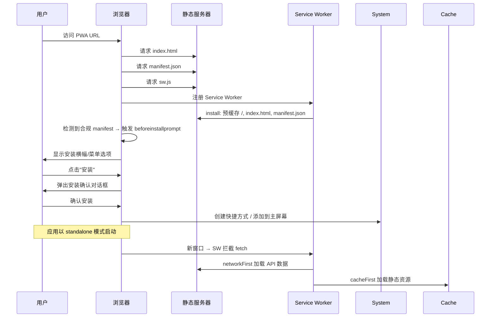

**本节定位**：解释 `@bsky/pwa` 如何通过 Service Worker 实现离线缓存、资源预加载，以及如何满足 PWA 安装条件。你将理解从浏览器地址栏到"可安装的桌面应用"之间的技术桥梁。面向初学者，不需要任何 Service Worker 前置知识。

---

## 一、PWA 的本质：网页为何能"安装"到桌面？

Progressive Web App（渐进式 Web 应用）的核心能力源于两个技术支柱：**Web App Manifest**（清单文件）和 **Service Worker**（服务工作线程）。二者缺一不可：Manifest 告诉浏览器"这是一个可安装的应用"，Service Worker 则提供离线运行的能力。在 `@bsky/pwa` 中，这两份文件分别位于 `packages/pwa/public/manifest.json` 和 `packages/pwa/public/sw.js`，在构建时被原样复制到输出目录 `dist/` 的根路径下。

用户第一次访问 PWA 时，浏览器会像加载普通网页一样加载全部资源。但当浏览器检测到 manifest.json 中声明了合法的图标、名称和 `display: standalone` 模式时，就会在地址栏或浏览器菜单中弹出"安装"提示。用户安装后，PWA 会像原生应用一样拥有独立的窗口、任务栏图标，甚至可以在离线状态下启动。这一切的背后，Service Worker 充当着网络代理的角色——它拦截所有网络请求，根据预设策略决定从网络获取还是从缓存返回。

Sources: [manifest.json](packages/pwa/public/manifest.json#L1-L31), [sw.js](packages/pwa/public/sw.js#L1-L80)

---

## 二、Web App Manifest：告诉浏览器"我是一个应用"

Manifest 是一个 JSON 文件，它定义了 PWA 安装后的外观和行为。`@bsky/pwa` 的 manifest 配置如下：

```json
{
  "name": "Bluesky Client",
  "short_name": "Bluesky",
  "description": "Bluesky social client with AI integration",
  "start_url": "./",
  "display": "standalone",
  "background_color": "#FFFFFF",
  "theme_color": "#00A5E0",
  "orientation": "any",
  "categories": ["social", "utilities"],
  "icons": [...]
}
```

关键字段的含义：

| 字段 | 值 | 作用 |
|------|-----|------|
| `name` | "Bluesky Client" | 安装提示和应用启动器显示的全名 |
| `short_name` | "Bluesky" | 空间受限时（如桌面图标下方）的简写 |
| `start_url` | `"./"` | 用户点击图标后加载的起始页面，相对路径确保在各种部署环境下正常工作 |
| `display` | `"standalone"` | 隐藏浏览器地址栏和工具栏，像原生应用一样全屏运行 |
| `theme_color` | `"#00A5E0"` | 影响任务栏颜色和浏览器 UI 色调，匹配 Bluesky 标志性天空蓝 |
| `background_color` | `"#FFFFFF"` | 应用启动时的背景色，在 CSS 加载前显示，避免白屏闪烁 |
| `icons` | 三个尺寸 PNG | 64×64（favicon）、192×192（Android 启动屏）、512×512（应用图标），192 和 512 均标记为 `maskable` 以适配自适应图标 |

`maskable` 是一个非常实用的属性：不同操作系统的图标裁剪形状不同（圆形、圆角矩形等），标记为 `maskable` 后，系统会自动将图标安全区域（中心 80% 区域）适配到各种形状，避免图标边缘被裁剪。这意味着你的 512×512 图标最好将核心图案放在中心，四周留出足够的 padding。

Manifest 通过 `index.html` 中的 `<link rel="manifest" href="./manifest.json" />` 被浏览器发现。注意路径使用相对路径 `./`，这确保了在 Cloudflare Pages、Netlify 或 Vercel 等不同静态托管上都能正常解析。

Sources: [manifest.json](packages/pwa/public/manifest.json#L1-L31), [index.html](packages/pwa/public/index.html#L1-L24)

---

## 三、Service Worker 生命周期：安装 → 激活 → 拦截

Service Worker 是一个独立于网页主线程的 JavaScript 工作线程，它无法访问 DOM，但可以拦截网络请求、管理缓存、接收推送通知。它的生命周期由三个事件驱动：**install**（安装）、**activate**（激活）、**fetch**（请求拦截）。每次用户访问 PWA 时，浏览器都会检查服务器上的 `sw.js` 是否有字节级别的变化——任何修改都会触发新版本 Service Worker 的安装流程。

### 3.1 Install 事件：预缓存静态资源

浏览器下载 `sw.js` 后，会触发 `install` 事件。这是 Service Worker 第一次获得控制权的时机，也是预缓存关键静态资源的黄金窗口。`@bsky/pwa` 的安装逻辑如下：

```javascript
const CACHE_NAME = 'bsky-v2';
const STATIC_ASSETS = ['./', './index.html', './manifest.json'];

self.addEventListener('install', (event) => {
  event.waitUntil(
    caches.open(CACHE_NAME).then((cache) =>
      cache.addAll(STATIC_ASSETS).catch(() => {})
    )
  );
  self.skipWaiting();
});
```

这段代码做了两件事：第一，打开名为 `bsky-v2` 的缓存存储，将入口页面、HTML 文件和 manifest 加入缓存——这样即使用户完全离线，也能看到应用界面。第二，调用 `self.skipWaiting()`，强制当前等待中的 Service Worker 立即激活，而不是等待所有页面关闭后再接管。这意味着用户刷新页面后，新版本的 Service Worker 会立刻生效。

为什么要缓存 `'./'`？因为这是 manifest 中声明的 `start_url`，当用户从桌面图标启动 PWA 时，浏览器请求的正是这个路径。如果它没有被预缓存，在离线状态下启动将无法加载任何内容。

### 3.2 Activate 事件：清理旧缓存

Service Worker 的 `activate` 事件在安装完成后触发，是清理旧版本缓存的理想时机：

```javascript
self.addEventListener('activate', (event) => {
  event.waitUntil(
    caches.keys().then((keys) =>
      Promise.all(
        keys.filter((k) => k !== CACHE_NAME).map((k) => caches.delete(k))
      )
    )
  );
  self.clients.claim();
});
```

逻辑很简单：获取所有缓存名称，删除所有不是 `bsky-v2` 的旧缓存。这确保当代码更新后，用户不会因为旧缓存而看到过时的界面。`self.clients.claim()` 则让新激活的 Service Worker 立即接管所有已打开的页面，无需等待页面导航刷新。

缓存命名策略 `bsky-v2` 中的版本号 `v2` 是手动维护的——当你修改了静态资源或缓存策略时，应该更新这个版本号，触发旧缓存的清理。如果你只有 Service Worker 逻辑变化但 `CACHE_NAME` 不变，浏览器虽然会重新安装，但 `activate` 阶段的清理条件 `k !== CACHE_NAME` 不会触发删除，旧的预缓存资源会被保留。

Sources: [sw.js](packages/pwa/public/sw.js#L1-L31)

---

## 四、缓存策略核心：Cache-First vs Network-First

`@bsky/pwa` 采用了一种混合缓存策略——不同类型的请求走不同的路径。这是 Service Worker 设计中最核心的决策点，也是它优于浏览器默认缓存的关键所在。

### 4.1 策略分派（Fetch 事件入口）

```javascript
self.addEventListener('fetch', (event) => {
  const { request } = event;
  const url = new URL(request.url);

  if (
    url.hostname === 'bsky.social' ||
    url.hostname === 'public.api.bsky.app' ||
    url.hostname === 'api.deepseek.com' ||
    url.hostname.includes('api.')
  ) {
    event.respondWith(networkFirst(request));  // API 请求：网络优先
    return;
  }

  event.respondWith(cacheFirst(request));       // 静态资源：缓存优先
});
```

分派逻辑基于请求的域名（`hostname`）：所有与 Bluesky API、DeepSeek AI API 或包含 `api.` 的请求走网络优先策略；其他所有请求（JS 模块、CSS、图片、字体等 Vite 构建产物）走缓存优先策略。

### 4.2 Cache-First（缓存优先）策略

```javascript
async function cacheFirst(request) {
  const cached = await caches.match(request);
  if (cached) return cached;
  try {
    const response = await fetch(request);
    if (response.ok) {
      const cache = await caches.open(CACHE_NAME);
      cache.put(request, response.clone());
    }
    return response;
  } catch {
    return new Response('Offline', { status: 503 });
  }
}
```

**工作流程**：先从缓存中查找 → 如果命中直接返回 → 如果未命中才发起网络请求 → 请求成功后把响应克隆一份存入缓存 → 如果网络也失败（离线），返回 503 状态码的 "Offline" 响应。

**适用场景**：`@bsky/pwa` 使用 Vite 构建，产物文件名包含哈希值（如 `assets/index-abc123.js`），每个版本的文件内容不可变。一旦缓存，永远不会过时。这种策略对 JS/CSS/字体/图片等静态资源极为高效——第二次访问时零网络延迟，瞬间加载。

**风险点**：如果用户在资源更新前访问了页面，旧版文件会一直留在缓存中，直到新 Service Worker 激活并清理旧缓存 `bsky-v1`。但由于 Vite 的哈希文件名机制，新旧文件的 URL 不同，所以不会造成缓存污染。

### 4.3 Network-First（网络优先）策略

```javascript
async function networkFirst(request) {
  try {
    const response = await fetch(request);
    if (response.ok) {
      const cache = await caches.open(CACHE_NAME);
      cache.put(request, response.clone());
    }
    return response;
  } catch {
    const cached = await caches.match(request);
    return cached || new Response(JSON.stringify({ error: 'Network offline' }), {
      status: 503,
      headers: { 'Content-Type': 'application/json' },
    });
  }
}
```

**工作流程**：先尝试网络请求 → 网络成功则将响应存入缓存并返回 → 网络失败则回退到缓存 → 连缓存都没有则返回 503 JSON 错误。

**适用场景**：Bluesky 时间线数据、AI 聊天响应等动态内容。用户永远期望看到最新数据，因此网络优先是最佳选择。离线时回退到缓存虽然可能显示过时数据，但总比白屏要好——例如用户可以查看之前加载过的时间线内容。

**两个策略的关键区别**：

| 维度 | Cache-First | Network-First |
|------|-------------|---------------|
| 离线可用性 | ✅ 始终可用（已缓存后） | ⚠️ 仅当之前访问过该资源 |
| 数据新鲜度 | 可能过时（不可变资源不影响） | ✅ 始终最新 |
| 网络请求 | 仅缓存未命中时 | ✅ 每次请求 |
| 适用资源 | JS/CSS/字体/图标/HTML | API 响应/动态内容 |

两个函数都使用了 `response.clone()`，这是因为 `Response` 对象是流式读取的，只能被消费一次。存入缓存流式读取一次，返回给浏览器消费另一次，所以必须 `clone()`。

Sources: [sw.js](packages/pwa/public/sw.js#L33-L80)

---

## 五、Service Worker 注册：在 PWA 入口处启动

Service Worker 的注册发生在 `packages/pwa/src/main.tsx`，这是整个 PWA 应用的 JavaScript 入口文件：

```typescript
if ('serviceWorker' in navigator) {
  window.addEventListener('load', () => {
    navigator.serviceWorker.register('./sw.js', { scope: './' }).then(
      (reg) => console.log('[PWA] SW registered:', reg.scope),
      (err) => console.warn('[PWA] SW registration failed:', err),
    );
  });
}
```

这段代码的关键设计意图：

**特性检测**：`if ('serviceWorker' in navigator)` 确保只在支持 Service Worker 的现代浏览器中执行注册。旧的浏览器或隐私模式可能不支持，此时应静默跳过而非报错。

**延迟加载**：`window.addEventListener('load', ...)` 将注册延迟到页面所有资源加载完毕后进行。这是因为 Service Worker 的注册本身不会阻塞页面渲染，但注册过程中的网络请求可能与页面资源加载竞争带宽。延迟注册可以优先保障用户看到界面。

**相对路径**：`'./sw.js'` 和 `{ scope: './' }` 使用的都是相对路径，这有两个好处：一是适配子路径部署（如 `example.com/app/`），二是确保 Service Worker 的作用域覆盖整个应用目录。

**作用域（Scope）限制**：Service Worker 只能拦截其作用域范围内的请求。`scope: './'` 意味着这个 Service Worker 可以拦截以 PWA 根路径开头的所有请求。如果尝试注册 `scope: '/'` 而文件在 `/app/` 下，浏览器会拒绝注册。

**错误处理**：注册失败时使用 `console.warn` 而非 `console.error`，因为注册失败（如 HTTPS 或 localhost 环境要求不满足）并不意味着应用无法运行——只是无法享受离线体验而已。

Sources: [main.tsx](packages/pwa/src/main.tsx#L1-L22)

---

## 六、PWA 安装流程：从浏览器标签到桌面应用

当上述所有条件都满足后，PWA 安装过程如下：



安装的实际触发条件由浏览器综合评估，但 `@bsky/pwa` 已满足所有硬性要求：

| 条件 | 检查项 | 实现方式 |
|------|--------|----------|
| ✅ HTTPS 或 localhost | 安全上下文 | 开发环境 `localhost:5173`，生产环境 Cloudflare Pages 强制 HTTPS |
| ✅ Web App Manifest | manifest.json 存在且合法 | `packages/pwa/public/manifest.json` 包含所有必填字段 |
| ✅ Service Worker | sw.js 可注册且 install 事件成功 | `main.tsx` 中注册，`sw.js` 的 install 事件预缓存资源 |
| ✅ 图标 | 至少 192×192 和 512×512 | `public/icons/icon-192.png` 和 `icon-512.png` 均存在 |
| ✅ `start_url` | 加载成功后返回 200 | `"./"` 指向应用根路径 |
| ✅ `display` | 取值 `standalone` 或 `fullscreen` | `"standalone"` 模式 |

需要注意的是，`@bsky/pwa` 没有手动监听 `beforeinstallprompt` 事件来实现自定义安装按钮——这意味着安装完全依赖浏览器的原生提示（Chrome 地址栏右侧的安装图标、或菜单中的"安装应用"选项）。如果需要更积极的安装引导，可以在 `Layout.tsx` 中添加安装按钮。

Sources: [manifest.json](packages/pwa/public/manifest.json#L1-L31), [sw.js](packages/pwa/public/sw.js#L1-L10), [main.tsx](packages/pwa/src/main.tsx#L6-L12)

---

## 七、离线行为全景：什么能用，什么不能用

安装 PWA 后，用户在离线状态下（如飞机模式）打开应用时，不同功能的表现如下：

| 功能 | 离线行为 | 技术原因 |
|------|----------|----------|
| 应用启动 | ✅ 正常加载界面 | `index.html` 被 cache-first 预缓存 |
| 查看已加载的时间线 | ✅ 可查看（如果之前已加载） | network-first 回退到缓存 |
| 查看从未加载过的时间线 | ❌ 显示空状态 | 缓存中无数据 |
| AI 聊天历史（已加载的） | ✅ 可查看 | IndexedDB 是浏览器本地存储，离线可用 |
| AI 发送新消息 | ❌ 请求失败 | 需要网络调用 DeepSeek API |
| 发帖/回复 | ❌ 请求失败 | 需要网络调用 Bluesky API |
| 切换话题标签 | ⚠️ 显示缓存中的帖子 | 具体取决于是否曾访问过该标签 |
| 设置页面 | ✅ 正常使用 | 配置存储在 localStorage，离线可用 |

总体来说，**阅读已有数据完全可用，写操作和新数据加载不可用**。这与原生社交应用（如 Twitter/X 的离线模式）的行为一致。如果需要提升离线体验，可以考虑扩展 Service Worker：例如使用 Background Sync API 缓存用户的发帖操作，在网络恢复后自动提交。

Sources: [sw.js](packages/pwa/public/sw.js#L33-L80), [indexeddb-chat-storage.ts](packages/pwa/src/services/indexeddb-chat-storage.ts)

---

## 八、开发与构建注意事项

### 8.1 开发环境中的 Service Worker

在本地开发时（`pnpm dev`，Vite 开发服务器 `localhost:5173`），Service Worker 同样会被注册并生效。但需要注意，Vite 开发服务器的模块热替换（HMR）与 Service Worker 的缓存逻辑可能产生冲突。具体来说：

- Vite 通过 WebSocket 推送模块更新，这些请求不会被 Service Worker 拦截（因为它们指向 `localhost:5173` 的 WebSocket 端点）
- 但如果你修改了 `sw.js`，浏览器会自动检测到变化并安装新版本
- 开发调试时，可以在 Chrome DevTools 的 Application → Service Workers 面板中手动取消注册，或勾选 "Update on reload" 确保每次刷新都获得最新版本

### 8.2 构建产物的缓存策略

`@bsky/pwa` 使用 Vite 构建，产物输出到 `dist/` 目录：

```typescript
// vite.config.ts
build: {
  outDir: 'dist',
  assetsDir: 'assets',
}
```

Vite 会自动为静态资源生成哈希文件名（如 `index-abc123.js`），这意味着：

- 每次构建后，旧版本的静态资源文件不会被新版本覆盖
- 新 Service Worker 安装时，新的哈希文件被 cache-first 缓存
- 旧 Service Worker 的 `activate` 阶段清理旧缓存 `bsky-v1`（如果版本号变化）时，旧哈希文件也随之被删除
- 如果只改代码不更新 `CACHE_NAME`，activate 阶段不会删除缓存，但新的 fetch 请求会缓存新文件，旧文件因无引用而最终被浏览器自动清理

### 8.3 部署时的文件路径

Service Worker 的作用域规则有一个关键约束：**`sw.js` 必须放在它要控制的路径下**。`@bsky/pwa` 将 `sw.js` 放在 `public/` 目录，Vite 构建时原样复制到 `dist/sw.js`。部署后，如果应用部署在 `https://example.com/app/` 路径下，那么 `sw.js` 的 URL 是 `https://example.com/app/sw.js`，其作用域 `./` 解析为 `/app/`，恰好覆盖整个应用。如果部署在根路径，则不影响。

Sources: [vite.config.ts](packages/pwa/vite.config.ts#L1-L24), [sw.js](packages/pwa/public/sw.js#L1-L80)

---

## 九、与整体架构的关系

Service Worker 位于整个架构的最外层（PWA 的传输层），它与 `@bsky/app` 层和 `@bsky/core` 层的交互是完全解耦的：

```
用户 → 浏览器 → Service Worker（网络代理）→ 静态资源（cache-first）→ 渲染 HTML
                                            → API 请求（network-first）→ @bsky/core BskyClient
                                                                       → @bsky/app React Hooks
```

关键解耦设计：Service Worker 只关心请求的域名和响应内容，完全不理解业务逻辑。它不知道什么是"时间线"或"AI 聊天"，只知道哪些域名需要网络优先、哪些资源可以缓存优先。这种分层使得修改缓存策略不会影响任何业务代码，反之亦然。

Sources: [ARCHITECTURE.md](docs/ARCHITECTURE.md#L1-L114), [sw.js](packages/pwa/public/sw.js#L33-L42)

---

## 下一步阅读

你现在已经理解了 `@bsky/pwa` 如何通过 Service Worker 实现离线能力和 PWA 安装。如果你对前端构建和部署感兴趣，接下来建议阅读：

- **[PWA 构建部署：Cloudflare Pages / Netlify / Vercel](30-pwa-gou-jian-bu-shu-cloudflare-pages-netlify-vercel)** — 了解如何将构建产物部署到不同的静态托管平台
- **[设计系统：语义色板、字体比例与 Tailwind CSS 变量](25-she-ji-xi-tong-yu-yi-se-ban-zi-ti-bi-li-yu-tailwind-css-bian-liang)** — 了解 PWA 界面的视觉设计决策
- **[四层架构设计：Core → App → TUI/PWA 分层原则](7-si-ceng-jia-gou-she-ji-core-app-tui-pwa-fen-ceng-yuan-ze)** — 回顾 Service Worker 在整个架构中的位置