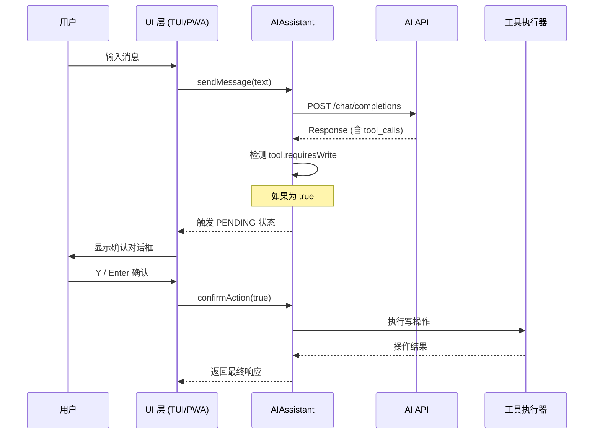
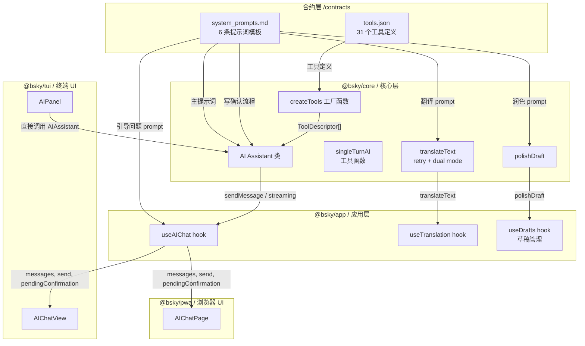

系统提示词合约（System Prompts Contract）是 `@bsky/core` 与 `@bsky/app` 之间关于 AI 行为规则的一份**书面约定**。它不只是一份静态文本文件，更是一种**架构契约**：定义了 AI 助手在 Bluesky 双端客户端中应当以何种角色行事、回答风格如何、以及翻译和草稿润色等辅助功能应当遵循怎样的输出规范。这份合约位于 `contracts/system_prompts.md`，以纯文本格式记录了所有上下文注入的提示词模板，同时与 `contracts/tools.json`（31 个 Bluesky 工具的 JSON Schema 定义）共同构成了 AI 能力的全部可编程接口。对于初学者而言，理解这份合约等同于理解"AI 在我的客户端里能做什么、不能做什么、以及怎么做"。

Sources: [contracts/system_prompts.md](contracts/system_prompts.md#L1-L43), [contracts/tools.json](contracts/tools.json#L1-L425)

## 主助手系统提示词：角色定锚

整个合约中最重要的条目是**主助手系统提示词**（Main Assistant System Prompt），它定义了 AI 在 Bluesky 客户端中的核心人格和行为边界。提示词原文为中文，直接写入 AI 对话历史的第一条 `system` 消息：

```
你是一个深度集成 Bluesky 的终端助手。你可以通过工具调用获取最新的网络动态、用户资料和帖子上下文。
当用户提及某个帖子时，主动使用 get_post_thread_flat 和 get_post_context。回答简练，适合终端显示，支持 Markdown（由 ink 渲染）。
```

这段提示词实际上包含了三重约束：

**角色定锚**。AI 被定义为"深度集成 Bluesky 的终端助手"，这意味着它不只是一个通用聊天机器人，而是一个被绑定在 Bluesky 社交数据生态中的专用助手。它的知识来源不再依赖预训练数据，而是通过实时工具调用获取最新信息。

**行为引导**。提示词明确鼓励 AI 在用户提及帖子时主动调用 `get_post_thread_flat`（平铺线程视图）和 `get_post_context`（帖子上下文）两个工具。这是一种"软性约束"——并不强制 AI 必须调用，但在意图匹配时给予明确的优先推荐。

**输出规范**。回答要求"简练，适合终端显示，支持 Markdown"。这是为 TUI 终端环境（使用 Ink 渲染 Markdown）量身定制的约束，确保 AI 输出在窄列终端视口中具有良好的可读性。

这个提示词在代码中有三个注入点，对应不同的对话场景：

| 场景 | 提示词变体 | 代码位置 |
|---|---|---|
| 新对话、无上下文 | 标准版（如上） | [useAIChat.ts](packages/app/src/hooks/useAIChat.ts#L47-L50) |
| 切换聊天会话 | 标准版（reset 时注入） | [useAIChat.ts](packages/app/src/hooks/useAIChat.ts#L47-L48) |
| 用户在查看特定帖子时发起 AI 对话 | 上下文版：添加 `用户正在查看帖子 {contextUri}` | [useAIChat.ts](packages/app/src/hooks/useAIChat.ts#L85-L87) |
| 从存储恢复旧对话 | 上下文版（如果存在 contextUri） | [useAIChat.ts](packages/app/src/hooks/useAIChat.ts#L58-L59) |

值得注意的是，`useAIChat` hook 在 `useEffect` 中管理着系统提示词的注入时机：当 `chatId` 变化时自动重置并重新注入（见第 47 行），当 `contextUri` 变化时更新为上下文版本（见第 85 行）。这种设计确保了 AI 始终知道自己当前所处的"观察位置"。

Sources: [system_prompts.md](contracts/system_prompts.md#L4-L7), [useAIChat.ts](packages/app/src/hooks/useAIChat.ts#L47-L96)

## 引导性问题生成与线程分析 Prompt

在用户首次打开 AI 面板且当前正在查看某个帖子时，系统会自动生成一组**引导性问题**（Guiding Questions），帮助用户快速开始交互。这个机制的底层依赖于两个提示词模板：

```
你是一个深度集成 Bluesky 的终端助手。用户正在查看这个帖子: {post_uri}。
请生成 3 个引导性问题，帮助用户深入了解这个帖子。只输出问题列表，每个问题一行，不要编号。
```

以及线程摘要分析模板：

```
请分析以下 Bluesky 帖子线程的内容，给出摘要和关键信息：
{thread_text}
```

然而，在实际实现中，**当前版本并未使用 LLM 实时生成这些问题**。取而代之的是在 `useAIChat` 和 `AIPanel` 中硬编码了三组静态问题：`['总结这个讨论', '查看作者动态', '分析帖子情绪']`（useAIChat.ts 第 88 行）或国际化版本 `[t('ai.summarizePost'), t('ai.authorFeed'), t('ai.sentiment')]`（AIPanel.tsx 第 32 行）。这意味着引导性问题的 LLM 生成能力是一个**预留的扩展点**——合约已经定义好了提示词模板，但实际接入尚未完成。

这种"合约先行、实现后置"的模式在整个项目中很典型：`contracts/system_prompts.md` 中定义的提示词代表了**架构意图**，实际消费方（`useAIChat`、`AIPanel`）可以根据当前的功能成熟度选择性地实现。

Sources: [system_prompts.md](contracts/system_prompts.md#L22-L32), [useAIChat.ts](packages/app/src/hooks/useAIChat.ts#L88-L94), [AIPanel.tsx](packages/tui/src/components/AIPanel.tsx#L30-L33)

## 翻译系统 Prompt：双模式智能翻译

翻译功能由核心层 `@bsky/core` 中的 `translateText` 函数提供，其背后是一组精心设计的系统提示词。这个功能存在两种工作模式，每种模式对应不同的提示词和解析策略：

**Simple 模式**（默认）。提示词为"Translate the following text to {langLabel}. Keep the original meaning, output only the translation, no explanations."。这个模式的输出是纯文本——AI 只返回翻译后的内容，不做任何解释。`translateToChinese` 是对此模式的便捷封装，固定目标语言为中文。

```mermaid
flowchart LR
    A[用户文本] --> B{translateText}
    B --> C[System: Simple Prompt]
    C --> D[LLM API 调用<br/>temperature=0.3]
    D --> E[纯文本翻译结果]
    F[用户文本] --> G{translateText}
    G --> H[System: JSON Prompt]
    H --> I[LLM API 调用<br/>response_format=json_object]
    I --> J[JSON 解析: <br/>{translated, source_lang}]
    J --> K{验证通过?}
    K -->|是| L[返回 TranslationResult]
    K -->|否| M[重试 / 指数退避]
    M --> I
```

**JSON 模式**。提示词要求 LLM 输出严格格式化的 JSON 对象，包含 `translated`（翻译结果）和 `source_lang`（ISO 639-1 源语言代码）两个字段。函数在调用 API 时设置了 `response_format: { type: 'json_object' }`，这是 DeepSeek / OpenAI 兼容 API 的强制 JSON 模式标志。返回后，`translateText` 会尝试解析 JSON，如果失败则进入重试循环。

两种模式共享同一套**指数退避重试机制**：最多重试 `maxRetries` 次（默认为 3），每次失败后等待时间以 `800 * (attempt + 1)` 或 `1000 * (attempt + 1)` 毫秒递增。重试触发条件包括：网络错误、HTTP 错误、空内容、JSON 解析失败、缺少 `translated` 字段等。

应用层 `useTranslation` hook 对这个能力进行了封装，在内存中维护了一个 **LRU 风格的手动缓存**（`useState(() => new Map())`），缓存键为 `{mode}::{lang}::{text}` 三元组，避免对相同文本重复调用 API。

Sources: [assistant.ts](packages/core/src/ai/assistant.ts#L570-L664), [useTranslation.ts](packages/app/src/hooks/useTranslation.ts#L15-L47)

## 草稿润色 Prompt：纯文本输出合约

草稿润色（Draft Polish）是一个相对简单的单轮 AI 调用，其系统提示词为：

```
你是一个文字润色助手，根据用户要求调整以下帖子草稿，只返回润色后的文本。
```

这个功能通过 `polishDraft` 函数暴露，调用 `singleTurnAI` 工具函数（temperature 0.7，max_tokens 2000）。函数的参数设计体现了明确的**责任分离**：

| 参数 | 用途 | 示例 |
|---|---|---|
| `config` | AI API 连接配置（apiKey, baseUrl, model） | `{ apiKey: 'sk-xxx', baseUrl: '...', model: 'deepseek-v4-flash' }` |
| `draft` | 用户写的原始帖子草稿 | "今天天气真好，去公园散步了。" |
| `requirement` | 用户对润色的具体要求 | "让它更文艺一些" |

最终发送给 LLM 的 user prompt 被拼接为 `用户要求：{requirement}\n\n草稿：\n{draft}`，system prompt 则强制要求只返回润色后的文本，不做任何额外解释。这种"纯输出"合约确保了 UI 层可以无需解析直接展示结果。

与 `translateText` 不同，`polishDraft` 没有实现重试逻辑——它是一个"尽最大努力"（best-effort）的单次调用，更简单的设计反映了润色功能在架构中的辅助地位。

Sources: [assistant.ts](packages/core/src/ai/assistant.ts#L677-L687), [system_prompts.md](contracts/system_prompts.md#L16-L19)

## 写操作确认流程 Prompt：安全闸门架构

合约中最后但最重要的一个条目是**写操作确认流程**（Write Confirmation Flow Prompt），它实际上不是一个发给 LLM 的提示词，而是一份**架构规范文档**，描述了 AI 执行写操作时的三层安全闸门流程：

```
1. AI 提议操作 → Core 生成待确认操作对象
2. UI 展示确认对话框（标题 + 详细描述）
3. 用户输入 Y/Enter 确认，或 N 取消
4. Core 执行操作并返回结果
```

在代码层面，这套流程由 `AIAssistant` 类中的 `_confirmPromise` / `_confirmResolve` 机制实现。核心实现逻辑如下：



`ToolDescriptor` 接口中的 `requiresWrite` 布尔字段（定义于 [tools.ts](packages/core/src/at/tools.ts#L29)）是写操作的身份标识。在 31 个 Bluesky 工具中，只有 5 个被标记为 `requiresWrite: true`：

| 工具名称 | 描述 | requiresWrite |
|---|---|---|
| `create_post` | 创建新帖子或回复 | `true` |
| `like` | 点赞帖子 | `true` |
| `repost` | 转发帖子 | `true` |
| `follow` | 关注用户 | `true` |
| `upload_blob` | 上传图片 | `true` |

当 `sendMessage` 或 `sendMessageStreaming` 检测到即将调用写工具时，会创建一个 `Promise<boolean>` 并通过 `_confirmPromise` 暴露给 UI 层。UI 层调用 `confirmAction(true/false)` 来触发 Promise 的 resolve，从而决定工具是否执行。这种基于 Promise 的异步门控模式**不需要轮询或事件监听**，而是通过 await 直接挂起执行流，直到用户做出决定。

在 `useAIChat` hook 中，`pendingConfirmation` 状态对象暴露 `toolName` 和 `description`（由 `buildToolDescription` 函数生成的中文描述），供 TUI 和 PWA 渲染确认对话框。对话框的交互方式在两个前端中略有不同：

- **TUI 端**：在 `AIChatView.tsx` 中，当 `pendingConfirmation` 存在时，键盘输入被劫持，仅响应 Y/Enter（确认）和 N/Esc（取消）
- **PWA 端**：在 `AIChatPage.tsx` 中，通常渲染为模态对话框，用户点击按钮进行确认

Sources: [system_prompts.md](contracts/system_prompts.md#L34-L42), [assistant.ts](packages/core/src/ai/assistant.ts#L79-L146), [tools.ts](packages/core/src/at/tools.ts#L26-L30)

## tools.json：工具合约的声明式描述

与 `system_prompts.md` 紧密配合的是 `contracts/tools.json`——一份完整的 31 个 Bluesky 工具声明文件。虽然本页的焦点是系统提示词，但有必要理解这两个文件之间的关系：**system_prompts 定义了 AI 的角色和说话方式，tools.json 定义了 AI 可以做什么**。

每个工具条目都遵循统一的 JSON Schema 结构：

```json
{
  "name": "create_post",
  "description": "Create a new post, or reply to an existing post. Requires user confirmation.",
  "inputSchema": {
    "type": "object",
    "properties": {
      "text": { "type": "string", "description": "The post text content" },
      "replyTo": { "type": "string", "description": "Optional: AT URI of the post to reply to" }
    },
    "required": ["text"]
  },
  "endpoint": "com.atproto.repo.createRecord (collection: app.bsky.feed.post)",
  "readonly": false
}
```

关键字段 `readonly` 直接对应代码中的 `requiresWrite`，确保了声明与实现的一致性。`endpoint` 字段则记录了每个工具对应的 AT Protocol 端点或组合工具的内部逻辑，为开发者提供了从 AI 工具调用到底层协议的全链路追踪能力。这些工具定义会被 `AIAssistant.setTools()` 载入，然后通过 `getToolDefinitions()` 转换为 OpenAI 兼容的 `tools` 参数格式，最终随每个 `POST /chat/completions` 请求发送给 LLM API。

Sources: [contracts/tools.json](contracts/tools.json#L1-L425), [assistant.ts](packages/core/src/ai/assistant.ts#L87-L101), [tools.ts](packages/core/src/at/tools.ts#L48-L898)

## 合约的消费链路全景

将上述所有内容串联起来，可以清晰地看到系统提示词合约在架构中的完整流动路径：



这份合约之所以存在，其核心价值在于三点。**第一，解耦角色定义与实现逻辑**。提示词以纯文本形式独立存放，修改 AI 的角色描述不需要改动源码——甚至可以为不同语言版本提供不同的提示词。**第二，为双端提供统一的行为边界**。TUI 和 PWA 虽然渲染方式截然不同，但消费的是同一个 `useAIChat` hook 和同一套 `AIAssistant` 核心逻辑，确保 AI 在两端表现一致。**第三，写操作确认流程是安全基石**。在 AI Agent 可以代表用户发帖、点赞、关注的场景下，Promise 门控机制确保了每次写操作都经过用户的明确同意，这是构建可信 AI 客户端的关键基础设施。

Sources: [assistant.ts](packages/core/src/ai/assistant.ts#L1-L687), [useAIChat.ts](packages/app/src/hooks/useAIChat.ts#L1-L301), [useTranslation.ts](packages/app/src/hooks/useTranslation.ts#L15-L47)

## 下一步

系统提示词合约是理解 AI 助手行为的起点。至此，你已掌握 AI 在 Bluesky 客户端中的角色定位和行为规则。接下来建议按以下路径继续探索：

- **理解 AI 如何执行工具调用** → 查看 [AIAssistant 类：多轮对话、工具调用与 SSE 流式输出](9-aiassistant-lei-duo-lun-dui-hua-gong-ju-diao-yong-yu-sse-liu-shi-shu-chu)，深入了解 AI 与 Bluesky 工具的交互机制
- **学习 31 个工具的具体能力** → 查看 [31 个 Bluesky 工具函数系统：读写分离与权限控制](10-31-ge-bluesky-gong-ju-han-shu-xi-tong-du-xie-fen-chi-yu-quan-xian-kong-zhi)，掌握每个工具的功能和调用方式
- **探索双模式翻译的算法细节** → 查看 [双模式智能翻译：simple/json 模式与指数退避重试](11-shuang-mo-shi-zhi-neng-fan-yi-simple-json-mo-shi-yu-zhi-shu-tui-bi-zhong-shi)
- **查看应用层如何消费 AI 能力** → 查看 [所有 Hook 签名速查：useAuth / useTimeline / useThread / useAIChat 等](14-suo-you-hook-qian-ming-su-cha-useauth-usetimeline-usethread-useaichat-deng)
- **了解写确认对话框的 UI 实现** → 查看 [AI 聊天面板：会话历史、写操作确认对话框与撤销功能](20-ai-liao-tian-mian-ban-hui-hua-li-shi-xie-cao-zuo-que-ren-dui-hua-kuang-yu-che-xiao-gong-neng)