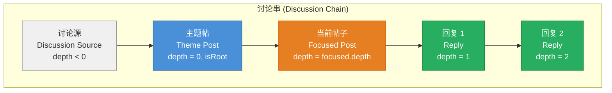
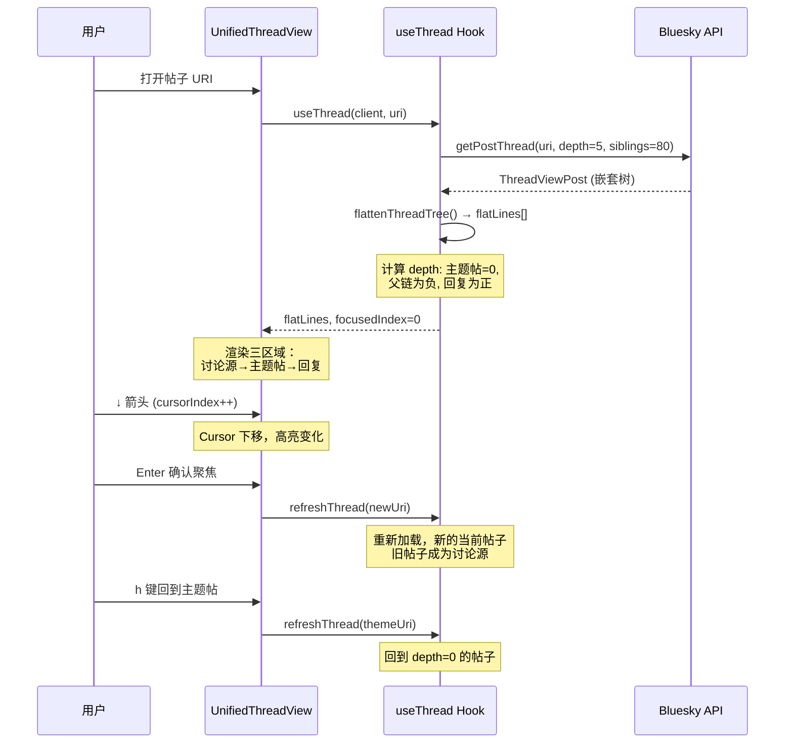

## 为什么需要一套严格的术语体系

Bluesky 的社交数据结构本质上是**树形结构**：一个帖子（post）可以回复另一个帖子，从而形成嵌套的讨论树。在这个树中，每个节点承担的角色不同——有的在最顶端发起讨论，有的在中间承接，有的在枝末回应。如果没有清晰的术语体系，代码和文档中就会出现"父帖/子帖"这类带有不当意涵的称呼，或者在讨论**当前查看的帖子**与**它上方的上下文**时产生歧义。

这套术语体系的设计目标有三个：**扁平化权力暗示**（避免家族隐喻）、**精确区分位置关系**（主题/当前/上下文）、**跨端统一**（TUI 终端与 PWA 浏览器使用同一套概念）。

Sources: [docs/TERMINOLOGY.md](docs/TERMINOLOGY.md#L1-L10), [packages/app/src/hooks/useThread.ts](packages/app/src/hooks/useThread.ts#L1-L35)

---

## 五个核心术语

整个项目的讨论视图围绕五个互斥的概念展开：



| 中文术语 | English | 定义 | 代码标识 |
|----------|---------|------|----------|
| **主题帖** | Theme Post / Root Post | 讨论线程的起始帖子。其记录中不包含 `reply` 字段，即它不是任何帖子的回复。 | `isRoot === true`, `depth === 0` |
| **回复** | Reply | 针对另一篇帖子的回复。其记录中包含 `reply.parent` 指向被回复的帖子。 | `depth > 0` |
| **当前帖子** | Current Post / Focused Post | 用户当前正在查看或交互的帖子。在 UI 中以高亮样式（蓝色背景/左边框）突出显示。 | `focused`, `focusedLine` |
| **讨论串** | Discussion Chain | 从当前帖子回溯到主题帖的完整链条，**包含**当前帖子本身。是整个视图的内容全集。 | `flatLines[]` 完整数组 |
| **讨论源** | Discussion Source | 讨论串中**排除**当前帖子的部分，即当前帖子上方的上下文内容。在 UI 中渲染在"当前帖子"区域之上。 | `depth < 0` 的条目 |

讨论源的概念非常关键：它是在扁平化的帖子列表中，所有 `depth` 值为负数（小于 0）的条目。当你在讨论视图中按上下箭头移动 Cursor，然后按 Enter 将某个帖子设为新的"当前帖子"时，原来的帖子会"下沉"成为讨论源的一部分，新帖子的上方就会出现它的上下文链条。

Sources: [packages/app/src/hooks/useThread.ts](packages/app/src/hooks/useThread.ts#L67-L84), [packages/tui/src/components/UnifiedThreadView.tsx](packages/tui/src/components/UnifiedThreadView.tsx#L51-L58), [docs/TERMINOLOGY.md](docs/TERMINOLOGY.md#L6-L17)

---

## 深度约定：depth 的正负含义

代码中 `FlatLine.depth` 字段是整个术语体系在数据结构上的载体。它不是简单的树深度计数，而是有方向性的相对坐标：

```
深度坐标轴

  负半轴 (讨论源)        │   正半轴 (回复)
                        │
  讨论源 post (depth=-2) │
  讨论源 post (depth=-1) │
  ───────────────────────┼────────────────────────
    主题帖 (depth=0)     │
    当前帖子 (depth=1)   │
                        │   回复 A (depth=2)
                        │   回复 B (depth=3)
                        │   回复 B-1 (depth=4)
```

- **`depth === 0`**：主题帖（root post）。只有一个帖子满足此条件。
- **`depth < 0`**（负数）：讨论源。当前帖子上方的父链。数值越小（如 -2）表示离当前帖子越远。
- **`depth > 0`**（正数）：回复。当前帖子下方的子链。数值越大嵌套越深。

这个约定的设计灵感来自**坐标轴方向性**：讨论源视线向上（负方向），回复视线向下（正方向），主题帖恰好在原点。代码中实现此约定的核心函数是 `flattenThreadTree()`，它递归遍历 `ThreadViewPost` 树结构，将嵌套树压平为一维数组时通过 `depth` 参数传递相对位置。

Sources: [packages/app/src/hooks/useThread.ts](packages/app/src/hooks/useThread.ts#L150-L195), [docs/TERMINOLOGY.md](docs/TERMINOLOGY.md#L36-L40)

---

## 从 Bluesky 协议到代码命名

### AT 协议中的帖子关系

Bluesky 的 AT 协议定义了帖子的回复关系，使用 `PostRecord.reply` 字段：

```typescript
// AT 协议原生定义
interface PostRecord {
  text: string;
  createdAt: string;
  reply?: {
    root: { uri: string; cid: string };   // 指向整个讨论的根（首个帖子）
    parent: { uri: string; cid: string }; // 指向被直接回复的帖子
  };
}
```

| 字段 | 语义 | 对应术语 |
|------|------|----------|
| `reply.root` | 始终指向讨论线程的起始帖子 | 主题帖 |
| `reply.parent` | 指向当前帖子直接回复的对象 | 父节点（只在代码内部使用，不对外显示） |

API 返回的 `ThreadViewPost` 使用 `parent` 和 `replies` 构建嵌套树：

```typescript
interface ThreadViewPost {
  post: PostView;
  parent?: ThreadViewPost | NotFoundPost;   // 树上的父节点
  replies?: Array<ThreadViewPost | NotFoundPost>; // 树上的子节点列表
}
```

**重要**：`ThreadViewPost.parent` 是代码内部的树遍历引用，不等同于被禁止的"父帖"概念。终端用户界面上不会出现"父帖"这一称呼。

Sources: [packages/core/src/at/types.ts](packages/core/src/at/types.ts#L14-L20), [packages/core/src/at/types.ts](packages/core/src/at/types.ts#L62-L66)

### 展平后的 FlatLine 接口

`flattenThreadTree()` 函数将 `ThreadViewPost` 树转换为一维数组 `FlatLine[]`，每个元素携带关键术语标识：

```typescript
interface FlatLine {
  depth: number;     // 0=主题帖, <0=讨论源, >0=回复
  uri: string;
  isRoot: boolean;   // 仅当 depth===0 时为 true
  isTruncation: boolean; // 是否为折叠提示行（"还有 N 条回复"）
  // ... 其他展示字段
}
```

UI 层通过这三个条件区分帖子角色：
| 条件 | 所属区域 |
|------|----------|
| `depth < 0` | 讨论源（parentLines / themeLines） |
| `depth === 0 && isRoot` | 主题帖 |
| `depth > 0 && uri !== focused.uri` | 回复（replyLines） |

Sources: [packages/app/src/hooks/useThread.ts](packages/app/src/hooks/useThread.ts#L14-L47), [packages/tui/src/components/UnifiedThreadView.tsx](packages/tui/src/components/UnifiedThreadView.tsx#L47-L51)

---

## 三语对照：i18n 中的术语翻译

| i18n Key | 中文 (zh) | English (en) | 日本語 (ja) |
|----------|-----------|--------------|-------------|
| `thread.rootPost` | 主题帖 | Root Post | 元の投稿 |
| `thread.currentPost` | 当前帖子 | Current Post | 現在の投稿 |
| `thread.discussionSource` | 讨论源 | Discussion Source | 議論の元 |
| `thread.replies` | 回复 | Replies | 返信 |
| `thread.title` | 帖子 | Post | 投稿 |

这些 key 在 UI 的三个区域中使用：
- 讨论源区域顶部：`t('thread.discussionSource')` → "── 讨论源 ──"
- 当前帖子区域顶部：`t('thread.currentPost')` 或 `t('thread.rootPost')`（取决于是否是主题帖）
- 回复列表区域顶部：`t('thread.replies')` → "── 回复 ──"

判断使用 `rootPost` 还是 `currentPost` 的逻辑是 `isTheme = focused?.isRoot && focused?.depth === 0`。

Sources: [packages/app/src/i18n/locales/zh.ts](packages/app/src/i18n/locales/zh.ts#L67-L70), [packages/app/src/i18n/locales/en.ts](packages/app/src/i18n/locales/en.ts#L67-L70), [packages/app/src/i18n/locales/ja.ts](packages/app/src/i18n/locales/ja.ts#L67-L70), [packages/tui/src/components/UnifiedThreadView.tsx](packages/tui/src/components/UnifiedThreadView.tsx#L206-L208)

---

## UI 视图的命名规范

全局导航中的七个主要视图，每个对应一个 `AppView.type` 值：

| 中文名 | 代码中的 type | 英文名 | 组件文件 |
|--------|--------------|--------|----------|
| 时间线 | `feed` | Timeline / Feed | `PostList.tsx` + `FeedTimeline.tsx` |
| 讨论 | `thread` | Thread / Discussion | `UnifiedThreadView.tsx` + `ThreadView.tsx` |
| 通知 | `notifications` | Notifications | `NotifView.tsx` + `NotifsPage.tsx` |
| 资料 | `profile` | Profile | `ProfileView.tsx` + `ProfilePage.tsx` |
| 搜索 | `search` | Search | `SearchView.tsx` + `SearchPage.tsx` |
| 发帖 | `compose` | Compose | `Dialogs.tsx` + `ComposePage.tsx` |
| AI 对话 | `aiChat` | AI Chat | `AIChatView.tsx` + `AIChatPage.tsx` |

`AppView` 的 type 命名和导航系统的绑定关系见 [[13-导航系统与 AppView 视图路由设计]]。

Sources: [docs/TERMINOLOGY.md](docs/TERMINOLOGY.md#L25-L33), [packages/app/src/state/navigation.ts](packages/app/src/state/navigation.ts)

---

## AI 工具函数中的术语

在 AI Assistant 可调用的 31 个工具中，与术语体系相关的有四个：

| 工具名 | 作用 | 返回数据结构 |
|--------|------|-------------|
| `get_post_thread` | 获取原始嵌套树 | `ThreadViewPost`（树形） |
| `get_post_thread_flat` | **首选**获取扁平化可读版本 | 带 depth 标记和 ↳ 箭头的纯文本 |
| `get_post_subtree` | 展开折叠的回复子树 | 同上（从指定帖子展开） |
| `get_post_context` | 获取完整上下文：父链+引用+媒体摘要 | 结构化 JSON |

AI 与用户交互时，同样遵循"主题帖/回复/讨论串"的术语体系。当 AI 返回分析结果时，会使用 `get_post_thread_flat` 预读讨论串内容，然后用自然语言描述帖子关系——但不会出现"父帖"或"子帖"。

Sources: [packages/core/src/at/tools.ts](packages/core/src/at/tools.ts#L220-L260), [contracts/system_prompts.md](contracts/system_prompts.md#L1-L4)

---

## 禁止使用的术语

设计这套术语体系的主要动机之一，就是消除不当的家族隐喻：

| ❌ 禁止使用 | 原因 | ✅ 替代方案 |
|------------|------|------------|
| 父帖 / 母帖 | paternalistic、带有家长制暗示 | 主题帖、回复 |
| 子帖 | patronizing、矮化性质 | 回复 |
| 父节点（在 UI 中） | 同上 | 讨论源中的帖子 |

**唯一允许使用 "parent" 的上下文**：`ThreadViewPost.parent` 作为树遍历的属性名，以及 `PostRecord.reply.parent` 作为 AT 协议的字段名。这些是协议层的技术引用，不会暴露到用户可见的 UI 文本中。

Sources: [docs/TERMINOLOGY.md](docs/TERMINOLOGY.md#L19-L23)

---

## 深度解读：一个完整的用户操作流程

为了帮助你理解这些术语在实际运行中的关系，下面是 TUI 端 `UnifiedThreadView` 中一次典型的交互流程：



这个流程揭示了"讨论源"的动态本质：它不是固定的帖子集合，而是随当前帖子的变化而变化的**相对参考系**。当 Enter 切换焦点时，被聚焦的帖子成为"当前帖子"，而之前在其上方的帖子链就自动变为"讨论源"。

Sources: [packages/tui/src/components/UnifiedThreadView.tsx](packages/tui/src/components/UnifiedThreadView.tsx#L70-L100), [packages/app/src/hooks/useThread.ts](packages/app/src/hooks/useThread.ts#L55-L80)

---

## 命名规范检查清单

在代码审查或文档编写时，可以用以下清单确保术语使用一致：

```
□ 所有新帖子的 role 判断使用 depth 和 isRoot，而非手动比较 URI
□ UI 字符串中使用 i18n key（thread.rootPost / thread.currentPost / thread.discussionSource），而非硬编码
□ depth 的含义：0=主题帖，负=讨论源，正=回复
□ 禁止在用户可见文本中使用"父帖""子帖""父节点"
□ Cursor（高亮）和 Focused（当前帖子）是两个独立的概念
□ 讨论源（themeLines/parentLines）按 depth 升序排列，回复（replyLines）按时间升序排列
□ flatLines 数组分三区渲染：讨论源 → 当前帖子 → 回复
```

Sources: [packages/tui/src/components/UnifiedThreadView.tsx](packages/tui/src/components/UnifiedThreadView.tsx#L43-L58), [packages/pwa/src/components/ThreadView.tsx](packages/pwa/src/components/ThreadView.tsx#L129-L153)

---

## 延伸阅读

理解这套术语体系后，建议进一步阅读：

- [[19-虚拟滚动与平铺线程视图：Cursor/Focused 双焦点设计]] — Cursor 与 Focused 的双焦点设计如何与 depth 系统配合
- [[8-bskyclient-at-xie-yi-ke-hu-duan-yu-jwt-zi-dong-shua-xin-ji-zhi]] — AT 协议客户端如何处理 PostRecord.reply 字段
- [[10-31-ge-bluesky-gong-ju-han-shu-xi-tong-du-xie-fen-chi-yu-quan-xian-kong-zhi]] — `get_post_thread_flat` 等工具的完整实现
- [[14-suo-you-hook-qian-ming-su-cha-useauth-usethread-useaichat-deng]] — `useThread` Hook 的完整签名与返回值