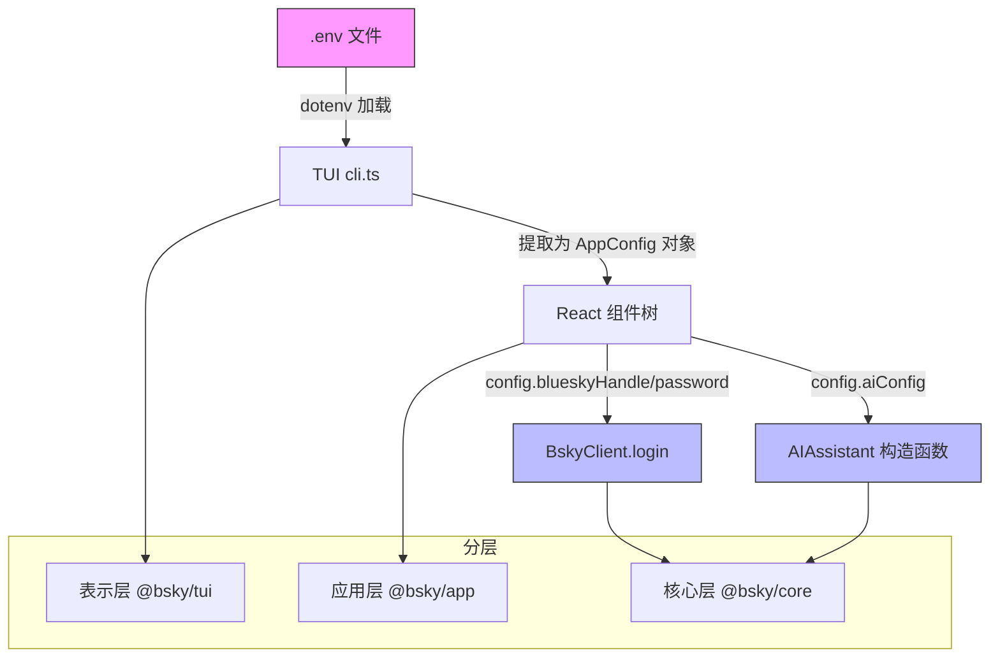

## 概述

对于 TUI（终端 UI）客户端而言，配置文件 `.env` 是管理所有凭证和偏好的唯一真相来源。Bluesky 账号凭证、AI 大语言模型的 API 密钥、以及翻译目标语言，都通过一个纯文本的 `.env` 文件统一管理。本文将深入剖析 `.env` 文件的结构、TUI 启动时的加载机制、首次运行的交互式配置向导、以及运行时设置修改的实现细节——帮助初学者理解这个"一次配置、随处生效"的凭证生命周期。

## 凭证架构：分层隔离的设计哲学

在我们深入 `.env` 的格式之前，先理解一条关键的设计原则：**凭证的读取与使用是分层隔离的**。



核心层 `@bsky/core` 不感知 `.env` 的存在——它不包含任何 `dotenv` 调用或 `process.env` 引用。核心层的 `BskyClient` 通过显式的 `login(handle, password)` 方法接收凭证，`AIAssistant` 通过构造函数参数 `AIConfig` 接收 API 配置。这种设计使得核心逻辑可以完全脱离运行环境进行测试和复用。Sources: [packages/core/src/at/client.ts](packages/core/src/at/client.ts#L31-L35), [packages/core/src/ai/assistant.ts](packages/core/src/ai/assistant.ts#L74-L82)

TUI 层 `@bsky/tui` 是唯一与 `.env` 直接交互的层，它在启动入口 `cli.ts` 中使用 `dotenv` 将文件内容加载到 `process.env`，然后提取为类型安全的 `AppConfig` 接口对象，通过 React props 向下传递。Sources: [packages/tui/src/cli.ts](packages/tui/src/cli.ts#L1-L37)

## .env 文件格式详解

项目的 `.env.example` 模板定义了所有可配置的环境变量：

| 变量名 | 是否必须 | 默认值 | 用途 |
|--------|---------|--------|------|
| `BLUESKY_HANDLE` | **必须** | — | Bluesky 用户名（如 `user.bsky.social`） |
| `BLUESKY_APP_PASSWORD` | **必须** | — | Bluesky 应用密码（设置 → 应用密码中生成） |
| `LLM_API_KEY` | 可选 | — | AI API 的密钥（OpenAI 兼容格式） |
| `LLM_BASE_URL` | 可选 | `https://api.deepseek.com` | AI API 的基地址 |
| `LLM_MODEL` | 可选 | `deepseek-v4-flash` | AI 模型名称 |
| `TRANSLATE_TARGET_LANG` | 可选 | `zh` | 翻译目标语言（`zh`/`en`/`ja`/`ko`/`fr`/`de`/`es`） |

Sources: [.env.example](.env.example#L1-L12), [docs/ENV.md](docs/ENV.md#L1-L28)

其中 `BLUESKY_HANDLE` 和 `BLUESKY_APP_PASSWORD` 是最低运行要求——没有这两项，客户端无法登录 Bluesky，只能看到一个空的设置界面。`LLM_API_KEY` 虽然在技术上可选，但如果不提供，AI 聊天面板和翻译功能将无法使用。

## 启动加载：两种路径的自动发现

当用户在终端运行 `pnpm dev:tui`（内部执行 `tsx src/cli.ts`）时，`cli.ts` 会主动搜索 `.env` 文件。它检查两个路径：

```mermaid
flowchart LR
    A[启动 cli.ts] --> B{搜索 .env}
    B --> C[路径 1: 项目根目录<br>__dirname/../../.env]
    B --> D[路径 2: 当前工作目录<br>process.cwd()/.env]
    C --> E{文件存在?}
    D --> E
    E -->|是| F[dotenv.config 加载<br>注入 process.env]
    E -->|否| G[跳过该路径]
    F --> H[提取关键变量]
    G --> H
    H --> I{存在 handle 和 password?}
    I -->|是| J[生成 AppConfig]
    I -->|否| K[返回 null<br>触发设置向导]
```

搜索路径一：相对于 `cli.ts` 脚本所在位置的 `../../.env`，这对应 monorepo 根目录下的 `.env` 文件。搜索路径二：当前工作目录 `process.cwd()` 下的 `.env`。两个路径都会被尝试，后加载的不会覆盖已有的值（除非设置 `override: true`）。Sources: [packages/tui/src/cli.ts](packages/tui/src/cli.ts#L25-L31)

加载完成后，`getConfigFromEnv()` 函数将 `process.env` 中的值转换为 `AppConfig` 接口：

```typescript
interface AppConfig {
  blueskyHandle: string;
  blueskyPassword: string;
  aiConfig: {
    apiKey: string;
    baseUrl: string;
    model: string;
  };
  targetLang?: string;
}
```

如果 `BLUESKY_HANDLE` 或 `BLUESKY_APP_PASSWORD` 缺失，函数返回 `null`，这标志着首次运行状态。Sources: [packages/tui/src/cli.ts](packages/tui/src/cli.ts#L39-L53)

## 首次运行：交互式设置向导

当检测到 `.env` 文件不存在或缺少关键凭证时，客户端不会崩溃——它优雅地回退到 `SetupWizard` 组件，这是一个基于 Ink 的交互式表单：

```mermaid
flowchart TD
    A[getConfigFromEnv 返回 null] --> B[渲染 SetupWizard]
    B --> C[字段 1: Bluesky Handle<br>验证: 非空]
    C --> D[字段 2: Bluesky App Password<br>验证: 非空, 显示为 ****]
    D --> E[字段 3: LLM API Key<br>可选, 显示为 ****]
    E --> F[字段 4: LLM Base URL<br>默认: https://api.deepseek.com]
    F --> G[字段 5: LLM Model<br>默认: deepseek-v4-flash]
    G --> H[字段 6: 语言<br>默认: zh, 验证: zh/en/ja]
    H --> I[用户确认完成]
    I --> J[writeEnvFile 写入 .env]
    J --> K[重新加载配置]
    K --> L{配置有效?}
    L -->|是| M[进入主界面 App]
    L -->|否| N[process.exit(1)]
```

向导包含 6 个字段，使用 `Tab` 和方向键导航，`Enter` 确认每个字段。密码字段（`blueskyPassword` 和 `llmApiKey`）在输入时自动遮蔽为 `****`，并通过 `isPassword: true` 标记在界面上不显示明文值。Sources: [packages/tui/src/components/SetupWizard.tsx](packages/tui/src/components/SetupWizard.tsx#L1-L156)

当用户完成所有字段的输入后，`writeEnvFile()` 函数将配置写入磁盘上的 `.env` 文件：

```typescript
function writeEnvFile(config: SetupConfig): string {
  const envPath = path.resolve(process.cwd(), '.env');
  const lines = [
    `BLUESKY_HANDLE=${config.blueskyHandle}`,
    `BLUESKY_APP_PASSWORD=${config.blueskyPassword}`,
    `LLM_API_KEY=${config.llmApiKey}`,
    `LLM_BASE_URL=${config.llmBaseUrl || 'https://api.deepseek.com'}`,
    `LLM_MODEL=${config.llmModel || 'deepseek-v4-flash'}`,
    config.locale ? `TRANSLATE_TARGET_LANG=${config.locale}` : '',
  ].filter(Boolean);
  writeFileSync(envPath, lines.join('\n') + '\n', 'utf-8');
  return envPath;
}
```

写入完成后，代码调用 `dotenv.config({ path: envPath, override: true })` 强制重新加载新写入的 `.env`，然后重新获取配置。如果仍然失败（理论上不应发生），则打印错误并以退出码 1 终止。Sources: [packages/tui/src/cli.ts](packages/tui/src/cli.ts#L55-L77)

## 运行时修改：设置面板的增量编辑

用户也可以在运行过程中修改配置。在任意界面按下 `,`（逗号键）即可打开设置面板 `SettingsView`。这个面板允许修改四个 LLM 相关的配置项：API Key、Base URL、Model 和 UI 语言。

设置面板的编辑逻辑与向导不同——它不是覆盖写入，而是**增量编辑**：

1. 先读取已有的 `.env` 文件内容，按行分割
2. 遍历每一行，找到匹配的键名（`LLM_API_KEY`、`LLM_BASE_URL`、`LLM_MODEL`、`I18N_LOCALE`）并替换为新值
3. 如果文件中没有某个键，在末尾追加
4. 所有不匹配的行原样保留（包括 `BLUESKY_HANDLE` 和 `BLUESKY_APP_PASSWORD`）

这意味着修改 LLM 配置时不会误删 Bluesky 凭证。保存成功后，面板显示 "Saved! Restart needed for changes to take effect."，因为目前的设计是配置仅在启动时加载，运行中的修改需要重启客户端才能生效。Sources: [packages/tui/src/components/SettingsView.tsx](packages/tui/src/components/SettingsView.tsx#L1-L94)

## 安全注意事项

`.env` 文件包含 Bluesky 应用密码和 AI API 密钥，属于敏感信息。项目在其 `.gitignore` 中明确排除了 `.env`、`.env.local` 和 `.env.production`，确保这些文件不会被提交到 Git 仓库。Sources: [.gitignore](.gitignore#L1-L10)

对于 Bluesky 账号，强烈建议使用**应用密码**而非主密码。应用密码可以在 Bluesky 设置页面中的"应用密码"（App Passwords）部分生成，具有可撤销性——如果凭证泄露，可以单独撤销某个应用密码而不影响主账号安全。

## 配置文件位置速查

| 文件 | 用途 | 安全 |
|------|------|------|
| `.env.example` | 模板，提交到仓库 | 公共信息 |
| `.env` | 实际配置，本地生成 | 包含密钥，**永不提交** |
| `.env.local` | 本地覆盖（预留） | 包含密钥，**永不提交** |
| `.env.production` | 生产环境（预留） | 包含密钥，**永不提交** |

## 下一步学习路径

理解 `.env` 配置后，您已经具备启动 TUI 客户端的基础。建议按以下顺序继续探索：

- [启动 TUI 终端客户端](5-qi-dong-tui-zhong-duan-ke-hu-duan)：从命令行启动客户端的完整步骤
- [BskyClient：AT 协议客户端与 JWT 自动刷新机制](8-bskyclient-at-xie-yi-ke-hu-duan-yu-jwt-zi-dong-shua-xin-ji-zhi)：了解凭证如何被用于 Bluesky 协议认证
- [AI 聊天面板：会话历史、写操作确认对话框与撤销功能](20-ai-liao-tian-mian-ban-hui-hua-li-shi-xie-cao-zuo-que-ren-dui-hua-kuang-yu-che-xiao-gong-neng)：配置好 LLM 后，体验 AI 功能
- [设置向导：首次运行的交互式配置流程](21-she-zhi-xiang-dao-shou-ci-yun-xing-de-jiao-hu-shi-pei-zhi-liu-cheng)：深入了解 SetupWizard 的实现