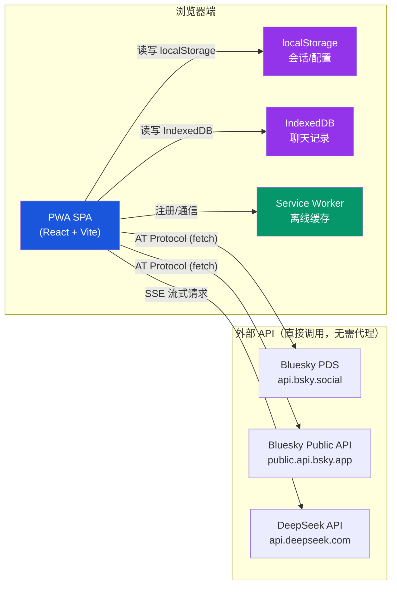

作为一款**纯静态前端应用**，`@bsky/pwa` 的部署哲学极为简洁：**无需后端服务器、无需数据库、无需环境变量**。所有 Bluesky API 调用直接由浏览器发出，用户凭证通过登录表单获取并持久化在 `localStorage`，AI API Key 通过设置页面配置。这意味着你可以将构建产物 `dist/` 目录部署到任何静态托管平台——Cloudflare Pages、Netlify 或 Vercel 均可开箱即用。目前项目的线上演示地址为 `https://ai-bsky.pages.dev`，即运行在 Cloudflare Pages 之上。

Sources: [docs/PWA_GUIDE.md](docs/PWA_GUIDE.md#L17-L20), [packages/pwa/src/App.tsx](packages/pwa/src/App.tsx#L1-L195)

## 构建产物分析

`pnpm build` 命令在 `packages/pwa/` 下执行后，产出 `dist/` 目录。该目录结构极其标准：

```text
dist/
├── index.html          # 入口 HTML，引用所有资源
├── manifest.json       # Web App Manifest（PWA 安装清单）
├── sw.js               # Service Worker（离线缓存策略）
├── icons/              # PWA 图标（64/192/512 px）
│   ├── icon-64.png
│   ├── icon-192.png
│   └── icon-512.png
└── assets/             # Vite 构建的 JS/CSS 哈希包
    ├── index-xxxx.js
    └── index-xxxx.css
```

关键配置在于 `vite.config.ts` 中设定了 `base: './'`。这一行代码保证了所有资源引用路径为**相对路径**，使得 PWA 无论部署在根域名、子路径（如 `example.com/app/`）还是 Cloudflare Pages 的预览分支中，都能正确加载。没有这一配置，Vite 默认的绝对路径 `/assets/xxx.js` 会在子路径部署时导致 404。

Sources: [packages/pwa/vite.config.ts](packages/pwa/vite.config.ts#L1-L14), [packages/pwa/package.json](packages/pwa/package.json#L11)

## 部署的核心前提：无需服务器端配置

与需要 SSR（服务端渲染）或 API 代理的现代应用不同，`@bsky/pwa` 的架构决定了对托管平台的要求极低。理解这一点需要先看清其**无后端架构**的三层设计：



图中清晰体现：PWA 完全运行在浏览器端，所有 API 调用直接发往 `bsky.social`、`public.api.bsky.app` 和 `api.deepseek.com`，无需经过自己的后端代理。这也是部署时**不需要服务端环境变量**的根本原因——TUI 端通过 `.env` 文件配置凭证，而 PWA 端则通过登录表单和设置页面将数据写入 `localStorage`。部署平台只需静态文件托管能力。

Sources: [packages/pwa/src/main.tsx](packages/pwa/src/main.tsx#L1-L22), [packages/pwa/src/hooks/useSessionPersistence.ts](packages/pwa/src/hooks/useSessionPersistence.ts#L1-L27), [packages/pwa/src/hooks/useAppConfig.ts](packages/pwa/src/hooks/useAppConfig.ts#L1-L43)

## 三大平台的部署步骤

三个平台（Cloudflare Pages、Netlify、Vercel）都支持两种部署方式：**CLI 命令行部署**和**Git 仓库自动部署**。下面是针对本项目的具体操作。

### Cloudflare Pages（推荐，当前生产环境）

这是项目当前使用的平台，线上地址 `ai-bsky.pages.dev`。Cloudflare Pages 对 PWA 有原生支持，且提供全球 CDN 加速。

**方式一：Wrangler CLI 部署**

```bash
# 1. 构建 PWA
cd packages/pwa
pnpm build

# 2. 使用 wrangler 部署 dist/ 目录
npx wrangler pages deploy dist --project-name ai-bsky --commit-dirty=true
```

`--commit-dirty=true` 允许在有未提交更改时部署，适合快速迭代。首次运行会提示进行 Cloudflare 账号认证。

**方式二：Cloudflare Dashboard 手动上传**

1. 登录 [Cloudflare Dashboard](https://dash.cloudflare.com/) → Workers & Pages → Pages
2. 点击 "Create application" → "Pages" → "Direct Upload"
3. 将本地 `packages/pwa/dist/` 文件夹拖拽上传
4. 设置项目名称（如 `ai-bsky`），点击 "Deploy"

**Git 自动部署（推荐团队协作）**：

将项目推送到 GitHub/GitLab，在 Cloudflare Pages 控制台中选择对应仓库：

| 配置项 | 值 |
|--------|-----|
| Build command | `cd packages/pwa && pnpm build` |
| Build output | `/packages/pwa/dist` |
| Root directory | `/`（monorepo 根目录） |
| Framework preset | Vite |

由于 `base: './'` 是相对路径，Cloudflare 的预览分支（Preview URL）也能正常工作。

### Netlify 部署

Netlify 同样支持 CLI 和 Git 两种方式。

**方式一：Netlify CLI**

```bash
# 安装 Netlify CLI
npm install -g netlify-cli

# 构建并部署
cd packages/pwa
pnpm build
netlify deploy --prod --dir=dist
```

**方式二：Git 自动部署**

在项目根目录创建 `netlify.toml` 配置文件（如果尚未创建）：

```toml
[build]
  base = "packages/pwa"
  command = "pnpm build"
  publish = "dist"

[build.environment]
  NODE_VERSION = "18"
```

然后在 Netlify Dashboard 中选择该仓库，Netlify 会自动识别配置并执行构建部署。

### Vercel 部署

Vercel 对 monorepo 有良好的内置支持。

```bash
# 安装 Vercel CLI
npm install -g vercel

# 在 packages/pwa 目录下部署
cd packages/pwa
pnpm build
vercel --prod --cwd ./
```

**Git 自动部署**：在 Vercel Dashboard 中导入仓库时：

| 配置项 | 值 |
|--------|-----|
| Framework preset | Vite |
| Root Directory | `packages/pwa` |
| Build Command | `pnpm build` |
| Output Directory | `dist` |
| Node.js Version | 18.x |

Sources: [docs/PWA_GUIDE.md](docs/PWA_GUIDE.md#L12-L22)

## 平台对比速查

| 维度 | Cloudflare Pages | Netlify | Vercel |
|------|-------------------|---------|--------|
| 免费版限制 | 500 构建/月, 无限带宽 | 100 GB 带宽/月, 300 构建分钟/月 | 100 GB 带宽/月, 6000 构建分钟/月 |
| PWA 支持 | ✅ 原生 | ✅ 原生 | ✅ 原生 |
| 全球 CDN | ✅ 330+ 节点 | ✅ 全球 Edge | ✅ 全球 Edge |
| `base: './'` 兼容性 | ✅ 完美（子路径/预览分支） | ✅ 完美 | ✅ 完美 |
| CLI 工具 | `wrangler` | `netlify-cli` | `vercel` |
| 自定义域名 | ✅ 免费 | ✅ 免费（需绑定信用卡） | ✅ 免费（需绑定信用卡） |
| monorepo 支持 | ✅ 需自定义构建命令 | ✅ 需 `netlify.toml` | ✅ 原生支持 |
| 当前使用 | ✅ **是**（生产环境） | ❌ | ❌ |

对于本项目的特定场景——纯静态 SPA、无需后端、需要 PWA 离线能力——三个平台均能胜任。选择 Cloudflare Pages 作为当前生产环境的原因在于：免费的无限带宽、无需绑定信用卡即可使用自定义域名，以及 Wrangler CLI 针对 Pages 的极简部署体验。

Sources: [packages/pwa/public/sw.js](packages/pwa/public/sw.js#L1-L80), [packages/pwa/src/main.tsx](packages/pwa/src/main.tsx#L10-L16)

## 部署后的关键验证清单

部署完成后，建议按以下顺序验证 PWA 功能：

1. **构建产物完整性**：确认 `dist/` 目录包含 `index.html`、`manifest.json`、`sw.js` 及 `icons/` 下的所有图标
2. **路由功能**：访问 `#/feed`、`#/thread?uri=...`、`#/ai` 等 Hash 路由，确认页面正常渲染——因为所有路由都是 Hash 模式，不需要服务端做 URL 重写
3. **Service Worker 注册**：打开浏览器开发者工具 → Application → Service Workers，确认 `sw.js` 已激活
4. **PWA 安装提示**：在支持 PWA 的浏览器（Chrome/Edge/Safari）中，应出现"添加到主屏幕"提示
5. **登录流程**：输入 Bluesky Handle 和 App Password，确认 `localStorage` 中写入 `bsky_session` 键
6. **离线访问**：在 DevTools Network 选项卡中切换至 Offline，刷新页面，应看到缓存的界面骨架（API 数据部分返回离线提示）
7. **CORS 无阻塞**：确认 Bluesky API 和 DeepSeek API 的跨域请求正常——这两个 API 均支持浏览器端直接调用

Sources: [packages/pwa/public/manifest.json](packages/pwa/public/manifest.json#L1-L31), [packages/pwa/public/sw.js](packages/pwa/public/sw.js#L29-L56)

## 浏览器兼容性与限制

`@bsky/pwa` 的浏览器兼容性取决于其使用的三个核心技术：

| 技术 | 最低浏览器要求 | 说明 |
|------|---------------|------|
| Service Worker | Chrome 45+, Firefox 44+, Safari 11.1+, Edge 79+ | 无 SW 仍可正常使用，但失去离线缓存能力 |
| IndexedDB | IE 10+, 所有现代浏览器 | 用于聊天记录持久化 |
| CSS Custom Properties | Chrome 49+, Firefox 31+, Safari 9.1+ | 用于设计系统的语义色板 |
| `import` 语法 | 所有现代浏览器 | Vite 构建产物已转译 |

对于此项目，**非现代浏览器（如 IE 11）不在支持范围内**，这一点由 TypeScript 的 `lib: ["ES2022", "DOM", "DOM.Iterable"]` 和 Vite 的默认目标（modern browsers）共同保证。

Sources: [packages/pwa/tsconfig.json](packages/pwa/tsconfig.json#L1-L24)

## 故障排查指南

| 症状 | 可能原因 | 解决方案 |
|------|---------|---------|
| 部署后页面白屏，控制台显示资源 404 | `base` 配置缺失 | 确认 `vite.config.ts` 中 `base: './'`，重新构建部署 |
| Service Worker 未注册 | 部署平台不支持 SW scope | 确认 `sw.js` 在 `dist/` 根目录且 `scope: './'` |
| 登录后刷新丢失会话 | `localStorage` 写入失败 | 检查浏览器隐私模式（部分浏览器限制 localStorage） |
| AI 聊天无响应 | CORS 或 API Key | 确认 DeepSeek API 可访问，检查设置中的 API Key |
| 路由刷新后 404 | 平台试图服务端渲染 Hash 路由 | 本项目使用 Hash 路由，无需服务端 URL 重写，但若未来切换至 History 路由，需在平台配置 `_redirects`（Netlify）或 `rewrites`（Vercel） |
| 图标在移动端不显示 | manifest 图标路径错误 | 确认 `manifest.json` 中 `icons.src` 路径为 `./icons/xxx.png`（相对路径） |

Sources: [packages/pwa/public/sw.js](packages/pwa/public/sw.js#L1-L80), [packages/pwa/vite.config.ts](packages/pwa/vite.config.ts#L5)

## 进阶：自定义域名与 HTTPS

三个平台均提供自动 HTTPS 和自定义域名绑定：

- **Cloudflare Pages**：设置 → 域名，添加自定义域名，Cloudflare 自动签发 SSL 证书
- **Netlify**：Domain settings → Add custom domain，自动处理 DNS 和 HTTPS
- **Vercel**：Domains → Add，自动配置

由于本项目使用 `base: './'`（相对路径），域名切换后**无需修改任何代码或构建配置**——这也是相对路径策略的核心优势之一。

## 下一步阅读

你已经了解了 PWA 的完整构建部署流程。作为对比，可以深入阅读以下相关页面：

- [PWA 浏览器环境：无需 .env，登录即用](4-pwa-liu-lan-qi-huan-jing-wu-xu-env-deng-lu-ji-yong) — 理解为什么 PWA 不需要 `.env` 文件
- [Service Worker 离线缓存策略与 PWA 安装](26-service-worker-chi-xian-huan-ce-lue-yu-pwa-an-zhuang) — 深入理解 Service Worker 的缓存逻辑
- [Hash 路由与会话持久化：useHashRouter 与 localStorage](22-hash-lu-you-yu-hui-hua-chi-jiu-hua-usehashrouter-yu-localstorage) — 路由系统的实现细节
- [启动 PWA 浏览器客户端](6-qi-dong-pwa-liu-lan-qi-ke-hu-duan) — 本地开发环境的启动方式