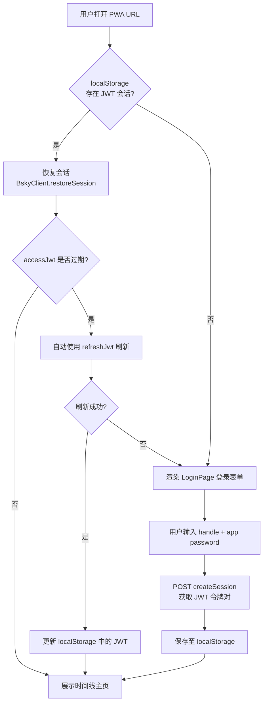

PWA 浏览器环境与 TUI 终端环境的根本差异在于：**一切配置通过 UI 表单完成，不需要 `.env` 文件**。Bluesky 凭证通过登录页面输入，AI API Key 通过设置页面配置，所有持久化数据（JWT 会话、AI 配置、聊天记录）全部存储在浏览器的 `localStorage` 和 `IndexedDB` 中。这意味着用户只需打开浏览器，输入账号密码即可开始使用，无需接触任何命令行或环境变量文件。

## 架构总览：浏览器如何零配置完成认证

下图展示了 PWA 启动时的认证流程——从页面加载到恢复会话或跳转登录页面的完整路径：



整个流程中，**没有任何服务器端参与认证**。浏览器直接向 `bsky.social` 的 AT Protocol API 发送请求，CORS 由 Bluesky 官方端点原生支持。这使得 PWA 可以部署在任何静态托管平台（Cloudflare Pages、Netlify、Vercel）上，无需后端代理或 API 网关。

Sources: [App.tsx](packages/pwa/src/App.tsx#L33-L113), [LoginPage.tsx](packages/pwa/src/components/LoginPage.tsx#L1-L99)

## localStorage 双轨持久化机制

PWA 浏览器环境使用两个独立的 localStorage 键来存储不同类型的配置数据，形成清晰的关注点分离：

| localStorage 键 | 存储内容 | 对应模块 | 生命周期 |
|:---|:---|:---|:---|
| `bsky_session` | Bluesky JWT 令牌对（accessJwt + refreshJwt）+ handle + DID | `useSessionPersistence.ts` | 随登录/登出自动管理 |
| `bsky_app_config` | AI 配置（API Key、Base URL、Model）+ 翻译语种 + 明暗主题 | `useAppConfig.ts` | 通过设置界面持久化 |

**`bsky_session` 的数据结构**——严格匹配 `CreateSessionResponse` 子集，确保 `restoreSession()` 方法能够正确恢复：

```typescript
interface StoredSession {
  accessJwt: string;   // 访问令牌，有效期约 2 小时
  refreshJwt: string;  // 刷新令牌，用于自动续期
  handle: string;      // 用户句柄，例如 "user.bsky.social"
  did: string;         // 去中心化标识符
}
```

**`bsky_app_config` 的默认值**——新用户的配置在首次打开时自动填充以下内容，无需手动干预即可进入 AI 聊天（仅在使用 AI 功能时才需要配置 API Key）：

```typescript
const DEFAULT_CONFIG = {
  aiConfig: {
    apiKey: '',                                     // 无默认值，由用户输入
    baseUrl: 'https://api.deepseek.com',            // 默认 DeepSeek API
    model: 'deepseek-v4-flash',                     // 默认模型
  },
  targetLang: 'zh',                                 // 翻译目标语言
  translateMode: 'simple',                          // 翻译模式
  darkMode: false,                                  // 亮色主题
};
```

Sources: [useSessionPersistence.ts](packages/pwa/src/hooks/useSessionPersistence.ts#L1-L27), [useAppConfig.ts](packages/pwa/src/hooks/useAppConfig.ts#L1-L43)

## 登录表单：浏览器端认证的核心入口

`LoginPage` 是 PWA 用户首次使用时的唯一入口界面。它提供了以下几个关键设计：

**表单字段与验证逻辑**

```typescript
// LoginPage.tsx 核心交互流程
const handleSubmit = async (e: React.FormEvent) => {
  e.preventDefault();
  if (!handle.trim() || !password.trim()) return;  // 空值保护
  setSubmitting(true);
  setLocalError(null);
  try {
    await onLogin(handle.trim(), password);         // 调用 BskyClient.login()
  } catch (err) {
    setLocalError(err instanceof Error ? err.message : '登录失败');
  } finally {
    setSubmitting(false);
  }
};
```

**密码安全提示**——表单中明确建议用户使用 **Bluesky 应用密码（App Password）** 而非主账号密码。页面上提供了指向 `https://bsky.app/settings/app-passwords` 的链接，引导用户在 Bluesky 官方设置页面创建专用密码。这一设计遵循了 OAuth 安全最佳实践——即使浏览器存储泄露，用户的主账号密码也不会暴露。

**多语言适配**——所有文本标签通过 `useI18n()` 的 `t()` 函数渲染，支持全量国际化。`login.title`、`login.handle`、`login.password`、`login.submit`、`login.privacyNote` 等键名覆盖了认证流程的完整 UI 文本。

Sources: [LoginPage.tsx](packages/pwa/src/components/LoginPage.tsx#L1-L99)

## 会话恢复与自动刷新：无缝重连体验

当用户关闭浏览器再次打开时，PWA 不会让用户重新输入密码。取而代之的是会话恢复机制，包含三个关键阶段：

**阶段一：挂载时尝试恢复会话**

```typescript
// App.tsx 挂载时从 localStorage 读取并恢复
useEffect(() => {
  const saved = getSession();             // 从 localStorage 读取 JWT
  if (saved && !client) {                 // 存在且尚未认证
    restoreSession({                       // 调用 BskyClient.restoreSession()
      accessJwt: saved.accessJwt,
      refreshJwt: saved.refreshJwt,
      handle: saved.handle,
      did: saved.did,
    });
    setIsLoggedIn(true);                   // 直接显示主界面
  }
}, []);
```

**阶段二：登录成功后自动持久化**

```typescript
// 当 useAuth 返回 session 时，自动保存到 localStorage
useEffect(() => {
  if (session && client?.isAuthenticated()) {
    saveSession({
      accessJwt: session.accessJwt,
      refreshJwt: session.refreshJwt,
      handle: session.handle,
      did: session.did,
    });
    setIsLoggedIn(true);
  }
}, [session, client]);
```

**阶段三：JWT 过期自动刷新**——`BskyClient` 内部通过 `ky` 的 `afterResponse` 钩子监控所有 API 请求的响应。当检测到 `400` 状态码且错误类型为 `ExpiredToken` 或 `InvalidToken` 时，自动使用 `refreshJwt` 调用 `com.atproto.server.refreshSession` 端点获取新的令牌对。刷新成功后，新的 accessJwt 自动注入后续请求，并更新 localStorage 中的存储值。这一过程对用户完全透明。

**意外登出保护**——当认证错误（如设备休眠后令牌过期）导致 `authError` 非空时，App 会自动清除 localStorage 并回到登录页面，避免用户看到卡死的空白界面：

```typescript
useEffect(() => {
  if (authError && isLoggedIn) {
    clearSession();
    setIsLoggedIn(false);
  }
}, [authError, isLoggedIn]);
```

Sources: [App.tsx](packages/pwa/src/App.tsx#L33-L113), [client.ts](packages/core/src/at/client.ts#L22-L60)

## AI 配置：通过设置界面管理，无需环境变量

PWA 的 AI 配置通过 `SettingsModal` 组件管理，覆盖了三个配置维度：

| 配置项 | 输入类型 | 说明 | 默认值 |
|:---|:---|:---|:---|
| API Key | `<input type="password">` | OpenAI 兼容的 API Key | 空字符串 |
| Base URL | `<input type="text">` | API 基础地址 | `https://api.deepseek.com` |
| Model | `<input type="text">` | 模型名称 | `deepseek-v4-flash` |
| 翻译目标语言 | `<select>` | 支持 7 种语言 | `zh` |
| 翻译模式 | `<select>` | `simple` / `json` 模式 | `simple` |
| 明暗主题 | `<input type="checkbox">` | 切换 dark/light | `false` |

设置页的每个 tab（🦋 Bluesky / 🤖 AI / ⚙️ General）都提供独立的保存按钮，只有用户主动点击保存时才写入 localStorage。这种设计避免了意外修改配置：

```typescript
const saveAi = () => {
  const updated = { ...config, aiConfig: { apiKey, baseUrl, model } };
  updateAppConfig(updated);       // 写入 localStorage
  onConfigChange(updated);        // 通知 React 状态更新
};
```

UI 语言切换（简体中文 / English / 日本語 等）通过 `useI18n().setLocale()` 实现，无需刷新页面即可即时切换全部界面文本。

Sources: [SettingsModal.tsx](packages/pwa/src/components/SettingsModal.tsx#L1-L230)

## Node.js 模块桩代码：浏览器中消除依赖冲突

PWA 的核心挑战之一是如何处理在浏览器中引用了 Node.js 原生模块的第三方依赖。`@bsky/core` 中的某些路径处理逻辑可能会引用 `fs`、`os`、`path` 等 Node 模块，而这些模块在浏览器中不存在。

解决方案是通过 **Vite 别名** 将所有 Node 模块重定向到空操作的桩代码（stub）：

```typescript
// vite.config.ts
resolve: {
  alias: {
    os: resolve(__dirname, 'src/stubs/os.ts'),   // → 返回空路径
    fs: resolve(__dirname, 'src/stubs/fs.ts'),   // → 所有方法返回空值
    path: resolve(__dirname, 'src/stubs/path.ts'),// → 简单的字符串拼接
  },
}
```

各桩代码的职责如下：

| 桩代码 | 核心行为 | 设计意图 |
|:---|:---|:---|
| `os.ts` | `homedir()` 返回 `'/'` | 防止配置路径计算失败 |
| `fs.ts` | `existsSync()` 返回 `false`，所有写入操作静默忽略 | 防止文件系统调用抛出异常 |
| `path.ts` | `join()` 用 `/` 拼接参数 | 提供基础路径拼接能力 |

这些桩代码确保 `@bsky/core` 中任何依赖 Node 模块的代码路径在浏览器中都能优雅降级，而不会阻止页面渲染。

Sources: [vite.config.ts](packages/pwa/vite.config.ts#L1-L24), [stubs/fs.ts](packages/pwa/src/stubs/fs.ts#L1-L8), [stubs/os.ts](packages/pwa/src/stubs/os.ts#L1-L3), [stubs/path.ts](packages/pwa/src/stubs/path.ts#L1-L3)

## 聊天记录持久化：IndexedDB 存储

与 TUI 使用 `FileChatStorage`（文件系统存储）不同，PWA 使用 **IndexedDB** 作为 AI 聊天记录的持久化方案，实现类为 `IndexedDBChatStorage`。

IndexedDB 的优势在于：
- **容量限制远大于 localStorage**（通常 50MB+ vs 5MB）
- **支持结构化查询**（通过对象存储的主键索引）
- **异步 API**，不会阻塞主线程

```typescript
// IndexedDBChatStorage 的核心实现
const DB_NAME = 'bsky-chats';
const STORE_NAME = 'chats';

// 数据库自动初始化（首次使用时创建）
function openDB(): Promise<IDBDatabase> {
  return new Promise((resolve, reject) => {
    const req = indexedDB.open(DB_NAME, DB_VERSION);
    req.onupgradeneeded = () => {
      const db = req.result;
      if (!db.objectStoreNames.contains(STORE_NAME)) {
        db.createObjectStore(STORE_NAME, { keyPath: 'id' });
      }
    };
    // ...
  });
}
```

存储的 `ChatRecord` 结构中包含 `updatedAt` 时间戳字段，`listChats()` 方法按更新时间降序排列，确保最近聊过的对话排在最前面。

Sources: [indexeddb-chat-storage.ts](packages/pwa/src/services/indexeddb-chat-storage.ts#L1-L77)

## Hash 路由：无需服务端配置的导航

PWA 使用 `useHashRouter` 实现基于 URL hash 的客户端路由。路由格式遵循 `#/viewType?params=value` 的模式：

| 视图 | Hash 格式 | 示例 |
|:---|:---|:---|
| 时间线 | `#/feed` | `#/feed` |
| 讨论串 | `#/thread?uri=...` | `#/thread?uri=at%3A%2F%2F...` |
| 用户主页 | `#/profile?actor=...` | `#/profile?actor=did%3Aplc%3A...` |
| 通知 | `#/notifications` | `#/notifications` |
| 搜索 | `#/search?q=...` | `#/search?q=bluesky` |
| 发帖 | `#/compose?replyTo=...` | `#/compose?replyTo=at%3A%2F%2F...` |
| AI 聊天 | `#/ai?context=...` | `#/ai?context=at%3A%2F%2F...` |
| 书签 | `#/bookmarks` | `#/bookmarks` |

Hash 路由的核心优势是：**不需要服务端配置 URL 重写规则**，部署到任何静态托管平台都能直接工作，`useHashRouter` 基于 `pushState` + `popstate` 实现可靠的前进后退导航。

Sources: [useHashRouter.ts](packages/pwa/src/hooks/useHashRouter.ts#L1-L137)

## Service Worker 与离线策略

主入口 `main.tsx` 在页面加载后注册 Service Worker（`public/sw.js`），遵循两层缓存策略：

```
浏览器请求
    │
    ├── API 请求 (bsky.social / public.api.bsky.app / api.deepseek.com)
    │   └── network-first: 优先获取最新数据，失败时 fallback 到缓存
    │
    └── 静态资源 (index.html / manifest.json / CSS/JS 打包)
        └── cache-first: 优先从缓存加载，无缓存时网络获取
```

Manifest 文件定义了 PWA 安装所需的元数据：应用名称 `"Bluesky Client"`、显示模式 `"standalone"`（全屏无浏览器 Chrome）、主题色 `#00A5E0`（Bluesky 品牌蓝色）、以及 64/192/512 三种尺寸的应用图标。

Sources: [main.tsx](packages/pwa/src/main.tsx#L6-L12), [sw.js](packages/pwa/public/sw.js#L1-L80), [manifest.json](packages/pwa/public/manifest.json#L1-L31)

## 启动命令速查

PWA 的本地开发和构建命令极为简洁，不需要任何环境变量前置准备：

| 命令 | 用途 | 说明 |
|:---|:---|:---|
| `pnpm dev` | 开发服务器 | 默认 `http://localhost:5173`，自动打开浏览器 |
| `pnpm build` | 生产构建 | 输出到 `packages/pwa/dist/` 目录 |
| `pnpm preview` | 预览生产构建 | 本地验证构建结果 |

**启动后用户只需三步即可使用**：① 在登录表单输入 Bluesky Handle → ② 输入 App Password → ③ 点击登录进入时间线。无需 `.env`、无需命令行配置、无需 API Key 即可浏览 Bluesky 内容。

Sources: [package.json](packages/pwa/package.json#L1-L34)

## 下一步

通过本文你应该已经理解了 PWA 浏览器环境如何在不使用 `.env` 文件的情况下实现完整的用户认证和配置管理。接下来的阅读路径建议：

- **[启动 PWA 浏览器客户端](6-qi-dong-pwa-liu-lan-qi-ke-hu-duan)**：手把手指导如何启动开发服务器并进行首次登录
- **[四层架构设计：Core → App → TUI/PWA 分层原则](7-si-ceng-jia-gou-she-ji-core-app-tui-pwa-fen-ceng-yuan-ze)**：理解 PWA 与 TUI 共享的业务逻辑层
- **[Hash 路由与会话持久化：useHashRouter 与 localStorage](22-hash-lu-you-yu-hui-hua-chi-jiu-hua-usehashrouter-yu-localstorage)**：深入 PWA 特有的路由与会话管理细节
- **[PWA 构建部署：Cloudflare Pages / Netlify / Vercel](30-pwa-gou-jian-bu-shu-cloudflare-pages-netlify-vercel)**：将 PWA 部署到生产环境

> **TUI 用户对照**：如果你熟悉 TUI 的 `.env` 配置方式，可以将本页视为"浏览器版对照参考"。PWA 用 localStorage 替代了 `.env` 文件，用 LoginPage 表单替代了 `BLUESKY_HANDLE` 和 `BLUESKY_APP_PASSWORD` 环境变量，用 SettingsModal 替代了 `LLM_API_KEY` 等 AI 配置。核心业务逻辑 `@bsky/core` 和状态管理钩子 `@bsky/app` 完全一致。详情请参考 [TUI 终端环境：.env 配置与凭证管理](3-tui-zhong-duan-huan-jing-env-pei-zhi-yu-ping-zheng-guan-li)。