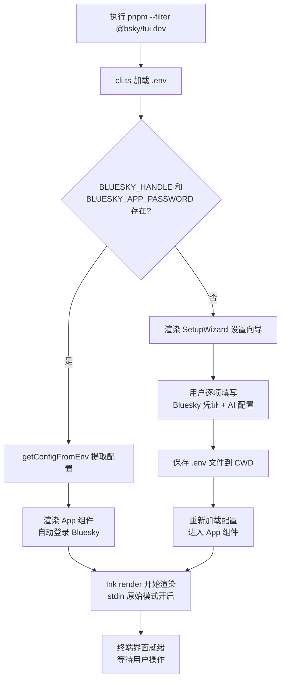
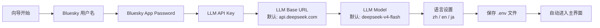

本文档详细说明如何启动 `@bsky/tui` 终端客户端，包括两种启动模式（**有环境变量** vs **首次运行向导**）、底层 Ink 渲染器的初始化过程、权限管理和故障排查。本文面向**初学者开发者**，假设你已完成环境准备（如 `pnpm install`）和 `.env` 配置文件的创建。如果你尚未完成这些准备工作，建议先阅读 [快速开始：环境准备与项目启动](2-kuai-su-kai-shi-huan-jing-zhun-bei-yu-xiang-mu-qi-dong) 和 [TUI 终端环境：.env 配置与凭证管理](3-tui-zhong-duan-huan-jing-env-pei-zhi-yu-ping-zheng-guan-li)。

Sources: [packages/tui/src/cli.ts](packages/tui/src/cli.ts#L1-L128)

---

## 1. 启动方式概览

TUI 客户端有两种启动路径，取决于你的 `.env` 文件是否已配置 `BLUESKY_HANDLE` 和 `BLUESKY_APP_PASSWORD`。



如果环境中已有凭证（即有 `.env` 文件且配置正确），启动过程约 1-2 秒即可完成，直接进入时间线（Feed）视图。如果凭证缺失，则会自动进入交互式设置向导，用户依次填写六项配置后启动应用。

Sources: [packages/tui/src/cli.ts](packages/tui/src/cli.ts#L26-L57), [packages/tui/src/components/SetupWizard.tsx](packages/tui/src/components/SetupWizard.tsx#L1-L156)

---

## 2. 命令行启动命令

TUI 客户端使用 `tsx`（TypeScript 执行器）直接运行 TypeScript 源文件，无需预先构建。所有启动命令在 `packages/tui/package.json` 的 `scripts` 区域中定义。

| 命令 | 用途 | 说明 |
|------|------|------|
| `pnpm --filter @bsky/tui dev` | **开发启动**（推荐） | 使用 `tsx` 直接运行 `src/cli.ts`，支持热重载 |
| `pnpm --filter @bsky/tui build` | 构建编译 | 将 TypeScript 编译到 `dist/` 目录 |
| `pnpm --filter @bsky/tui typecheck` | 类型检查 | 运行 `tsc --noEmit` 仅做类型校验 |

`pnpm --filter @bsky/tui dev` 命令是最常用的启动方式。它通过 `tsx src/cli.ts` 直接执行，跳过编译步骤，修改源码后会自动生效（如果你使用的是支持热更新的终端环境）。该命令的等效手动执行方式为：

```bash
# 在项目根目录下执行
npx tsx packages/tui/src/cli.ts
```

> **注意**：如果你在 `packages/tui/` 目录内直接运行 `tsx src/cli.ts`，也能正常工作。但推荐在项目根目录使用 `pnpm --filter` 语法，以确保 monorepo 中其他包的依赖被正确解析。

Sources: [packages/tui/package.json](packages/tui/package.json#L15-L19), [packages/tui/src/cli.ts](packages/tui/src/cli.ts#L1-L128)

---

## 3. 启动流程详解（cli.ts）

`packages/tui/src/cli.ts` 是整个 TUI 客户端的唯一入口文件。它按以下顺序完成初始化工作。

### 3.1 环境变量加载

```typescript
const envPaths = [
  path.resolve(__dirname, '..', '..', '..', '.env'),
  path.resolve(process.cwd(), '.env'),
];
for (const envPath of envPaths) {
  dotenv.config({ path: envPath });
}
```

代码会尝试在两个位置查找 `.env` 文件：项目根目录的 `.env`（相对于 `cli.ts` 路径回溯三层）和当前工作目录的 `.env`。这意味着你可以在项目根目录放置 `.env` 文件，也可以在任何其他目录运行命令时通过 CWD 方式指定。如果两个文件都存在，后面的加载会覆盖前面的同名变量（`dotenv` 的默认行为是**不覆盖**已存在的环境变量，因此首次加载的优先级更高）。

Sources: [packages/tui/src/cli.ts](packages/tui/src/cli.ts#L11-L16)

### 3.2 配置提取与分支决策

加载环境变量后，`getConfigFromEnv()` 函数会提取配置：

| 环境变量 | 配置字段 | 类型 | 是否必填 |
|---------|---------|------|---------|
| `BLUESKY_HANDLE` | `blueskyHandle` | `string` | 是（启动条件） |
| `BLUESKY_APP_PASSWORD` | `blueskyPassword` | `string` | 是（启动条件） |
| `LLM_API_KEY` | `aiConfig.apiKey` | `string` | 否（AI 功能需要） |
| `LLM_BASE_URL` | `aiConfig.baseUrl` | `string` | 默认 `https://api.deepseek.com` |
| `LLM_MODEL` | `aiConfig.model` | `string` | 默认 `deepseek-v4-flash` |
| `TRANSLATE_TARGET_LANG` | `targetLang` | `string` | 默认 `zh` |

如果 `BLUESKY_HANDLE` 或 `BLUESKY_APP_PASSWORD` 缺失，`getConfigFromEnv()` 返回 `null`，程序进入**设置向导路径**。否则直接进入 **App 渲染路径**。

Sources: [packages/tui/src/cli.ts](packages/tui/src/cli.ts#L26-L42)

### 3.3 stdin 原始模式设置

```typescript
let isRawMode = false;
try {
  const stdin = process.stdin as ReadStream;
  if (stdin.isTTY) {
    stdin.setRawMode(true);
    isRawMode = true;
  }
} catch {}
```

TUI 客户端依赖 Ink 框架的键盘捕获能力，这需要将标准输入设置为**原始模式**（raw mode）。原始模式关闭了终端的行缓冲和回显，使程序能逐键捕获输入。如果当前终端不支持原始模式（例如通过管道运行或在某些 IDE 内置终端中），代码会创建一个**回退的可读流**（passthrough stream），将 `process.stdin` 的数据转发给 Ink，同时仍然尝试从原始 stdin 读取。这种情况下，右下角状态栏会显示一个警告横幅。

```typescript
const { waitUntilExit } = render(React.createElement(Root, { isRawModeSupported: isRawMode }), {
  stdin: inputStream,
  stdout: process.stdout,
  stderr: process.stderr,
  exitOnCtrlC: true,
});
waitUntilExit().catch(console.error);
```

`render()` 是 Ink 的核心函数，参数包括：
- `stdin`：输入流（原始模式或回退流）
- `stdout`：输出流（默认 `process.stdout`）
- `stderr`：错误流
- `exitOnCtrlC`：设置为 `true`，允许用户按 Ctrl+C 退出

`waitUntilExit()` 返回一个 Promise，当 Ink 退出时（例如用户按 Ctrl+C 或 `process.exit()` 被调用）解析。

Sources: [packages/tui/src/cli.ts](packages/tui/src/cli.ts#L77-L128)

### 3.4 Root 组件：双模式路由

`Root` 组件是整个应用的根组件，根据配置状态决定渲染内容：

```typescript
function Root({ isRawModeSupported }: { isRawModeSupported: boolean }) {
  const [appConfig, setAppConfig] = React.useState<AppConfig | null>(getConfigFromEnv);

  if (!appConfig) {
    return React.createElement(SetupWizard, {
      onComplete: (config: SetupConfig) => {
        const envPath = writeEnvFile(config);
        dotenv.config({ path: envPath, override: true });
        const newConfig = getConfigFromEnv();
        if (newConfig) {
          setAppConfig(newConfig);
        } else {
          console.error('Failed to load config after setup');
          process.exit(1);
        }
      },
    });
  }

  return React.createElement(App, { config: appConfig, isRawModeSupported });
}
```

- **有配置** → 直接渲染 `App` 组件，传入配置和原始模式状态
- **无配置** → 渲染 `SetupWizard` 组件，用户填写完成后调用 `writeEnvFile()` 将配置写入 `.env` 文件，然后通过 `dotenv.config({ override: true })` 重新加载环境变量并获取配置，最后调用 `setAppConfig()` 切换到 App 视图

Sources: [packages/tui/src/cli.ts](packages/tui/src/cli.ts#L56-L76)

---

## 4. 首次运行设置向导（SetupWizard）

当环境变量缺失时，用户会看到一个交互式设置界面。该向导由 `SetupWizard` 组件实现，引导用户依次填写 **6 个配置项**：



每个字段的支持行为：

| 字段 | 是否密码输入 | 默认值 | 验证规则 |
|------|------------|--------|---------|
| Bluesky 用户名 | 否 | 无 | 不能为空 |
| App Password | **是（***** 显示）** | 无 | 不能为空 |
| LLM API Key | **是（***** 显示）** | 无 | 无（可选填） |
| LLM Base URL | 否 | `https://api.deepseek.com` | 无 |
| LLM Model | 否 | `deepseek-v4-flash` | 无 |
| 语言设置 | 否 | `zh` | 只能为 `zh`、`en`、`ja` 之一 |

用户可以使用 `Tab` / `↑` / `↓` 在字段之间导航。每个字段输入完成后按 `Enter` 确认。如果验证失败（如用户名为空），屏幕会显示红色错误提示。最后一个字段（语言）提交后，向导会调用 `writeEnvFile()` 将配置写入 `.env` 文件，然后自动进入主应用界面。

**注意**：App Password 不是你的登录密码。你需要在 Bluesky 设置 → "App Passwords" 中创建一个应用专用密码（App Password），格式类似于 `xxxx-xxxx-xxxx-xxxx`。

Sources: [packages/tui/src/components/SetupWizard.tsx](packages/tui/src/components/SetupWizard.tsx#L1-L156)

---

## 5. App 组件启动过程

`App` 组件（`packages/tui/src/components/App.tsx`）是 TUI 的主视图路由器，负责初始化以下核心子系统。

### 5.1 终端尺寸检测

首次渲染时，App 组件通过 `useStdout()` 获取终端的列数和行数，并监控 `resize` 事件：

```typescript
const { stdout } = useStdout();
const [cols, setCols] = useState(() => stdout?.columns ?? 80);
const [rows, setRows] = useState(() => stdout?.rows ?? 24);
useEffect(() => {
  const onResize = () => { setCols(stdout?.columns ?? 80); setRows(stdout?.rows ?? 24); };
  stdout?.on('resize', onResize);
  return () => { stdout?.off('resize', onResize); };
}, [stdout]);
```

终端的列数（`cols`）和行数（`rows`）被传递给所有子组件，用于 CJK 文本换行计算、虚拟滚动视口高度和布局分割。

Sources: [packages/tui/src/components/App.tsx](packages/tui/src/components/App.tsx#L37-L44)

### 5.2 自动登录与会话恢复

```typescript
useEffect(() => {
  if (!authLoading) login(config.blueskyHandle, config.blueskyPassword);
}, []);

useEffect(() => {
  if (client?.isAuthenticated()) {
    setWasAuthenticated(true);
  } else if (wasAuthenticated) {
    setWasAuthenticated(false);
    login(config.blueskyHandle, config.blueskyPassword);
  }
}, [client]);
```

App 组件使用 `useAuth` Hook 执行自动登录。第一个 `useEffect` 在 `authLoading` 状态变为 `false` 后调用 `login()`。第二个 `useEffect` 监控认证状态变化——如果会话过期（例如系统休眠后 JWT 令牌失效），会自动重新登录。登录过程中，侧边栏区域显示 "连接中..." 提示。

Sources: [packages/tui/src/components/App.tsx](packages/tui/src/components/App.tsx#L80-L88)

### 5.3 键盘系统注册

```typescript
useInput((input, key) => {
  // Tab / Esc — always processed
  if (key.tab) { ... }
  if (key.escape) { ... }
  // ... 全局导航快捷键
  if (k === 't') { goHome(); return; }
  if (k === 'n') { goTo({ type: 'notifications' }); return; }
  // ...
});
```

App 组件使用 Ink 提供的 `useInput` Hook 注册主键盘处理器。该处理器处理：
- **全局快捷键**：`t`（时间线）、`n`（通知）、`p`（个人资料）、`s`（搜索）、`a`（AI 聊天）、`c`（发帖）、`b`（书签）
- **视图内导航**：`j`/`k` 在列表间上下移动、`Enter` 进入帖子详情
- **Ctrl+G**：从任意视图启动 AI 聊天（携带当前帖子上下文）
- `,`（逗号）：打开设置面板

此外，App 组件还通过 `process.stdin.on('data')` 监听**鼠标滚动事件**，在 Feed 视图中支持鼠标滚轮上下翻页。

Sources: [packages/tui/src/components/App.tsx](packages/tui/src/components/App.tsx#L93-L99)

### 5.4 视图路由

App 组件通过 `useNavigation` Hook 获得当前视图状态，并根据 `currentView.type` 渲染对应子组件：

| 视图类型 | 子组件 | 功能 |
|---------|-------|------|
| `feed` | `PostList` | 时间线列表，支持虚拟滚动 |
| `thread` | `UnifiedThreadView` | 讨论串视图，双焦点设计 |
| `compose` | 内联渲染 | 发帖编辑器（文本 + 图片） |
| `profile` | `ProfileView` | 用户资料页面 |
| `notifications` | `NotifView` | 通知列表 |
| `search` | `SearchView` | 搜索界面 |
| `aiChat` | `AIChatView` | AI 聊天面板 |
| `bookmarks` | 内联渲染 | 书签列表 |

每个子组件接收 `cols`（终端宽度）、`rows`（终端高度）等尺寸参数，自行计算视口大小。

Sources: [packages/tui/src/components/App.tsx](packages/tui/src/components/App.tsx#L408-L482)

### 5.5 布局结构

App 组件的布局分为三个区域：

```
┌─────────────────────────────────────────────────────┐
│ 🦋 Bluesky  @user.bsky.social  🟢          时间   │  ← 顶部状态栏（蓝色背景）
├──────────┬──────────────────────────────────────────┤
│ Sidebar  │       Main Content Area                  │
│          │                                          │  ← 主内容区（侧边栏 + 视图）
│ 📋 时间线│  帖子列表 / 讨论串 / AI 聊天 / ...      │
│ 🔔 通知  │                                          │
│ 🔍 搜索  │                                          │
│ ...      │                                          │
│          │                                          │
├──────────┴──────────────────────────────────────────┤
│ ↑↓/jk:导航 Enter:查看 m:更多 r:刷新 v:收藏   时间  │  ← 底部提示栏
└─────────────────────────────────────────────────────┘
```

侧边栏宽度计算公式为 `Math.max(16, Math.floor(cols * 0.14))`，主内容区宽度为 `cols - sidebarW - 2`。顶部状态栏显示用户名、连接状态（🟢 在线 / 🔴 离线）和当前时间。底部提示栏根据当前视图显示对应的键盘快捷键提示。

Sources: [packages/tui/src/components/App.tsx](packages/tui/src/components/App.tsx#L423-L445)

---

## 6. 终端兼容性与故障排查

### 6.1 支持的终端

TUI 客户端在以下终端中经过测试并确认正常工作：
- **Windows Terminal** ✅（推荐）
- **iTerm2** (macOS) ✅
- **Kitty** (Linux) ✅
- **WezTerm** ✅
- **tmux 3.3+** ✅
- **ConEmu** / **传统 cmd.exe** ⚠️（原始模式不可用，功能受限）

### 6.2 常见问题与解决方案

| 症状 | 原因 | 解决方案 |
|------|------|---------|
| 启动后显示空白屏幕 | 终端尺寸过小（需要至少 80×24） | 增大终端窗口尺寸后重新启动 |
| 键盘输入无响应 | stdin 原始模式未启用 | 使用 Windows Terminal 等支持原始模式的终端 |
| 底部显示黄色警告 "⚠ Raw mode not supported" | 当前终端不支持原始模式 | 按提示操作，部分功能受限但可继续使用 |
| 设置向导中语言验证失败 | 输入了不支持的语言代码 | 向导仅接受 `zh`、`en`、`ja` 三种值 |
| 启动后立即退出 | `.env` 文件格式错误或凭证无效 | 检查 `.env` 文件内容，删除多余空格和引号 |
| 系统唤醒后无法操作 | JWT 会话过期 | App 组件会自动检测并重新登录（需等待 2-3 秒） |
| 鼠标滚轮不起作用 | 终端不支持 ANSI 鼠标序列 | 改用 `j` / `k` 键或 `↑` / `↓` 箭头键导航 |

### 6.3 调试技巧

如需观察启动过程中的详细信息，可以：

```bash
# 查看环境变量是否被正确加载
node -e "require('dotenv').config({path: '.env'}); console.log(process.env.BLUESKY_HANDLE)"
```

如果启动后立即退出，可以在命令末尾添加重定向以捕获错误日志：

```bash
pnpm --filter @bsky/tui dev 2> tui-error.log
```

Sources: [packages/tui/src/cli.ts](packages/tui/src/cli.ts#L77-L87), [packages/tui/src/utils/mouse.ts](packages/tui/src/utils/mouse.ts#L1-L53)

---

## 7. 完整的文件引用

本节汇总了 TUI 客户端启动流程涉及的所有关键文件：

| 文件 | 角色 |
|------|------|
| `packages/tui/src/cli.ts` | 入口文件，环境加载、模式判断、Ink 渲染 |
| `packages/tui/src/components/SetupWizard.tsx` | 首次运行交互式设置向导 |
| `packages/tui/src/components/App.tsx` | 主应用组件（482 行），视图路由 + 键盘 + 布局 |
| `packages/tui/src/components/Sidebar.tsx` | 侧边栏导航 + 面包屑 |
| `packages/tui/src/components/PostList.tsx` | 时间线虚拟滚动列表 |
| `packages/tui/src/components/AIChatView.tsx` | AI 聊天面板（会话历史 + Markdown 渲染） |
| `packages/tui/src/utils/text.ts` | CJK 感知文本换行工具 |
| `packages/tui/src/utils/mouse.ts` | ANSI 鼠标事件追踪 |
| `packages/tui/src/utils/markdown.tsx` | 零依赖 Markdown 到 Ink 渲染器 |
| `packages/tui/package.json` | 包配置、脚本命令 |

---

## 下一步阅读

你现在已经掌握了如何启动 TUI 客户端。建议继续阅读以下文档以获得完整的理解：

- 如果你对 PWA 浏览器的启动方式感兴趣 → [启动 PWA 浏览器客户端](6-qi-dong-pwa-liu-lan-qi-ke-hu-duan)
- 了解 TUI 背后的四层架构设计 → [四层架构设计：Core → App → TUI/PWA 分层原则](7-si-ceng-jia-gou-she-ji-core-app-tui-pwa-fen-ceng-yuan-ze)
- 深入理解键盘系统 → [键盘快捷键系统与 ANSI 鼠标事件追踪](18-jian-pan-kuai-jie-jian-xi-tong-yu-ansi-shu-biao-shi-jian-zhui-zong)
- 如果遇到了其他问题，参考环境配置页面 → [TUI 终端环境：.env 配置与凭证管理](3-tui-zhong-duan-huan-jing-env-pei-zhi-yu-ping-zheng-guan-li)