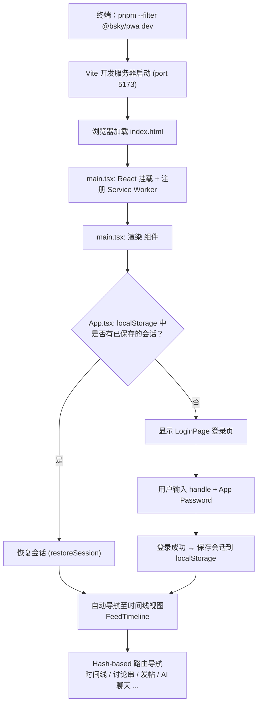
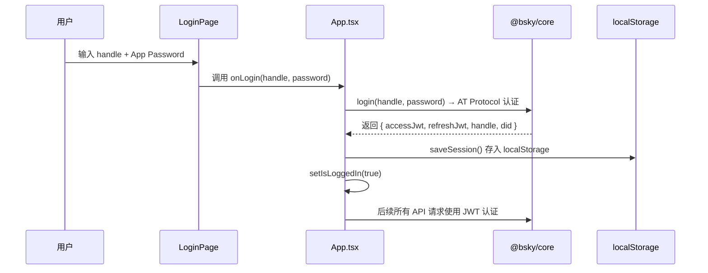

本文档面向**零基础开发者**，手把手教你如何在本机启动 Bluesky PWA 浏览器客户端。整个项目采用 monorepo 结构，PWA 端位于 `packages/pwa/` 目录下，与 TUI 终端端共享 100% 的业务逻辑（通过 `@bsky/app` 层的 React Hooks），你只需要启动一个 Vite 开发服务器即可在浏览器中预览。

---

## 启动全景图

PWA 客户端的启动流程可以用以下图表表示——理解它就能理解你即将执行的每一步操作背后的意义。



这个流程的核心思想是：**不需要 `.env` 文件**，所有用户凭证信息（Bluesky 会话令牌、AI API Key、界面偏好等）都存储在浏览器的 `localStorage` 中，随用随取，刷新不丢。

Sources: [packages/pwa/src/main.tsx](packages/pwa/src/main.tsx#L1-L22), [packages/pwa/src/App.tsx](packages/pwa/src/App.tsx#L1-L195)

---

## 第一步：准备工作

### 1.1 确认 Node.js 环境

项目依赖 Node.js >= 18，且使用 pnpm 作为包管理器。

```bash
node --version    # 应 >= 18
pnpm --version    # 应 >= 8
```

如未安装 pnpm，运行：

```bash
npm install -g pnpm
```

### 1.2 安装项目依赖

在项目根目录执行：

```bash
pnpm install
```

这会安装所有子包（`@bsky/core`、`@bsky/app`、`@bsky/pwa`）的依赖。安装完成后，你会在根目录看到 `pnpm-lock.yaml` 文件。

### 1.3 （可选）构建被依赖的包

PWA 依赖 `@bsky/app` 和 `@bsky/core`。如果你是从远程仓库克隆后首次启动，Vite 在开发模式下会自动解析 TypeScript 源码（因为使用了 workspace 协议），所以**通常不需要手动构建**。但如果遇到导入报错，可以先执行：

```bash
pnpm --filter @bsky/core build
pnpm --filter @bsky/app build
```

Sources: [package.json](package.json#L1-L20), [packages/pwa/package.json](packages/pwa/package.json#L1-L34)

---

## 第二步：启动开发服务器

### 2.1 启动命令

进入 `packages/pwa` 目录或使用 `--filter` 参数：

```bash
# 方式一：直接进入子目录
cd packages/pwa
pnpm dev

# 方式二：从根目录使用 filter（推荐）
pnpm --filter @bsky/pwa dev
```

### 2.2 看到什么

Vite 会输出类似以下内容：

```
  VITE v6.0.0  ready in 300ms

  ➜  Local:   http://localhost:5173/
  ➜  Network: http://192.168.x.x:5173/
```

Vite 配置中指定了 `server.open: true`，所以浏览器应该会自动打开 `http://localhost:5173/`。如果没有自动打开，手动在浏览器地址栏输入即可。

### 2.3 关键配置说明

| 配置项 | 值 | 说明 |
|--------|------|------|
| 开发服务器端口 | 5173 | 可在 `vite.config.ts` 中修改 |
| 自动打开浏览器 | 是 | `server.open: true` |
| 资源基础路径 | `./` | 相对路径，适配静态托管 |
| Node 模块垫片 | `os`、`fs`、`path` | 空桩文件，防止浏览器端引用 Node 模块时报错 |

Sources: [packages/pwa/vite.config.ts](packages/pwa/vite.config.ts#L1-L24)

---

## 第三步：登录（与 TUI 的关键区别）

PWA 与 TUI 最重要的区别在于**认证方式**：

| 特性 | TUI 终端客户端 | PWA 浏览器客户端 |
|------|---------------|-----------------|
| 凭证来源 | `.env` 文件 | 浏览器登录表单 |
| 会话存储 | 内存（每次启动需重新登录） | `localStorage`（刷新后自动恢复） |
| AI API Key | `.env` 文件 | 设置页面（⚙️）手动输入 |
| 首次启动 | 需先配置 `.env` | 直接显示登录页面 |

### 3.1 登录表单

启动后，你将看到登录页面：

```
🦋
Bluesky
登录到你的 Bluesky 账号

[ 用户名输入框       ]   ← 输入你的 handle，如 alice.bsky.social
[ 密码输入框         ]   ← 输入 App Password（不是账号密码！）
```

**重要：你必须使用 App Password（应用密码）**，而不是 Bluesky 账号的主密码。如需创建 App Password：

1. 登录 [bsky.app/settings/app-passwords](https://bsky.app/settings/app-passwords)
2. 点击 "Add App Password"
3. 给密码取个名字（如 "bsky-pwa"）
4. 复制生成的 16 位随机密码

### 3.2 登录后的自动流程

当你在 `LoginPage.tsx` 中点击登录按钮时，背后发生以下事情：



登录成功后：
- 会话令牌被保存到 `localStorage` 的 `bsky_session` 键中
- 应用自动切换到时间线视图（`FeedTimeline`）
- 下次刷新页面时，`App.tsx` 的 `useEffect` 会检查 `localStorage`，自动恢复会话

Sources: [packages/pwa/src/components/LoginPage.tsx](packages/pwa/src/components/LoginPage.tsx#L1-L99), [packages/pwa/src/hooks/useSessionPersistence.ts](packages/pwa/src/hooks/useSessionPersistence.ts#L1-L27)

---

## 第四步：理解 PWA 应用结构

### 4.1 应用架构总览

```
packages/pwa/
├── index.html              ← 入口 HTML（meta 标签、字体、manifest）
├── vite.config.ts          ← Vite 配置（React 插件、Node 模块垫片）
├── tailwind.config.ts      ← Tailwind CSS 配置
├── postcss.config.js       ← PostCSS 配置
├── public/
│   ├── manifest.json       ← PWA 清单（图标、显示模式、主题色）
│   ├── sw.js               ← Service Worker（离线缓存策略）
│   └── icons/              ← PWA 图标（64/192/512px）
└── src/
    ├── main.tsx            ← React 入口 + Service Worker 注册
    ├── App.tsx             ← 根组件：会话恢复 → 登录检测 → 视图路由
    ├── index.css           ← Tailwind 指令 + CSS 变量（亮/暗主题）
    ├── hooks/
    │   ├── useHashRouter.ts          ← Hash 路由（#/feed, #/thread?...）
    │   ├── useSessionPersistence.ts   ← localStorage 会话持久化
    │   └── useAppConfig.ts            ← localStorage 应用配置
    ├── components/
    │   ├── LoginPage.tsx     ← 登录页面
    │   ├── Layout.tsx        ← 整体布局（顶栏 + 侧栏 + 内容区）
    │   ├── Sidebar.tsx       ← 导航侧栏（7 个 Tab）
    │   ├── FeedTimeline.tsx  ← 虚拟滚动时间线
    │   ├── PostCard.tsx      ← 帖子卡片
    │   ├── ThreadView.tsx    ← 讨论串视图
    │   ├── ComposePage.tsx   ← 发帖/回复页面
    │   ├── AIChatPage.tsx    ← AI 聊天页面
    │   ├── ProfilePage.tsx   ← 用户个人页
    │   ├── SearchPage.tsx    ← 搜索页面
    │   ├── NotifsPage.tsx    ← 通知页面
    │   ├── BookmarkPage.tsx  ← 书签页面
    │   └── SettingsModal.tsx ← 设置模态框
    ├── services/
    │   └── indexeddb-chat-storage.ts  ← AI 聊天记录的 IndexedDB 存储
    ├── stubs/
    │   ├── fs.ts, os.ts, path.ts      ← Node 模块空桩
    └── utils/
        └── format.ts         ← 时间格式化、URI 辅助函数
```

### 4.2 文件加载顺序

以下是浏览器加载 PWA 时每个文件的执行顺序，理解它有助于诊断启动问题：

| 顺序 | 文件 | 作用 |
|------|------|------|
| 1 | `index.html` | 加载 CSS 字体、设置 viewport、加载 manifest |
| 2 | `main.tsx` (作为 ES Module) | 注册 Service Worker、挂载 React 根节点 |
| 3 | `App.tsx` | 检查 localStorage 会话、决定登录/主界面 |
| 4 | 首次渲染后 | `manifest.json` 被浏览器读取，触发 PWA 安装提示 |
| 5 | 空闲时 | `sw.js` 完成安装，缓存静态资源 |

### 4.3 无需 `.env` 的秘密

你可能注意到项目中 `packages/pwa/` 下没有 `.env.example` 或 `.env` 文件。这是因为 PWA 的所有「环境配置」都通过浏览器端机制解决：

| 传统 .env 变量 | PWA 中的等价方案 |
|---------------|-----------------|
| `BSKY_HANDLE` + `BSKY_PASSWORD` | 登录表单 → `localStorage` 存 `accessJwt` + `refreshJwt` |
| `AI_API_KEY` | 设置页面(⚙️) → `localStorage` 存 `bsky_app_config` |
| `AI_BASE_URL` / `AI_MODEL` | 设置页面默认值 `api.deepseek.com` / `deepseek-v4-flash` |
| `TARGET_LANG` | 设置页面选择目标语言 |
| `DARK_MODE` | 设置页面切换 → 同步到 CSS class |

所有持久化由两个 hook 完成：
- **`useSessionPersistence.ts`**：管理 Bluesky JWT 令牌，键名为 `bsky_session`
- **`useAppConfig.ts`**：管理 AI 配置、翻译语言、暗色模式，键名为 `bsky_app_config`

Sources: [packages/pwa/src/hooks/useAppConfig.ts](packages/pwa/src/hooks/useAppConfig.ts#L1-L43), [packages/pwa/src/App.tsx](packages/pwa/src/App.tsx#L50-L65)

---

## 第五步：浏览各个视图

### 5.1 路由系统

PWA 使用 **Hash 路由**（而非 History API 路由），原因是对静态托管（Cloudflare Pages、Netlify 等）最友好——无需服务器端路由重写配置。

路由格式：

| Hash | 视图 | 对应组件 |
|------|------|---------|
| `#/feed` | 时间线 | `FeedTimeline` |
| `#/thread?uri=at://...` | 讨论串 | `ThreadView` |
| `#/profile?actor=did:plc:...` | 个人主页 | `ProfilePage` |
| `#/notifications` | 通知 | `NotifsPage` |
| `#/search?q=关键词` | 搜索 | `SearchPage` |
| `#/bookmarks` | 书签 | `BookmarkPage` |
| `#/compose` | 发帖 | `ComposePage` |
| `#/ai` | AI 聊天 | `AIChatPage` |
| `#/ai?context=at://...` | AI 聊帖子 | `AIChatPage` |

### 5.2 导航侧栏

登录后，左侧侧栏提供 7 个导航入口：

```
📋  时间线      ← 默认首页
🔔  通知
🔍  搜索
🔖  书签
👤  个人主页    ← 自动使用当前登录用户
🤖  AI 聊天
✏️  发帖
```

每个按钮通过 `goTo({ type: 'feed' })` 等调用更新 URL Hash，触发 `popstate` 事件，`App.tsx` 根据 `currentView.type` 渲染对应组件。

### 5.3 暗色模式切换

在设置页面（⚙️）切换暗色模式时，`SettingsModal` 调用 `document.documentElement.classList.toggle('dark')`，同时同步更新 CSS 变量：

```css
:root {
  --color-primary: #00A5E0;
  --color-surface: #F8F9FA;
  --color-text-primary: #0F172A;
}
.dark {
  --color-surface: #121212;
  --color-text-primary: #F1F5F9;
}
```

Sources: [packages/pwa/src/hooks/useHashRouter.ts](packages/pwa/src/hooks/useHashRouter.ts#L1-L137), [packages/pwa/src/components/Sidebar.tsx](packages/pwa/src/components/Sidebar.tsx#L1-L68)

---

## 第六步：Service Worker 与 PWA 安装

### 6.1 Service Worker 注册

`main.tsx` 在页面加载后异步注册 Service Worker：

```typescript
if ('serviceWorker' in navigator) {
  window.addEventListener('load', () => {
    navigator.serviceWorker.register('./sw.js', { scope: './' });
  });
}
```

### 6.2 缓存策略

`sw.js` 采用两种策略：

| 请求类型 | 策略 | 示例 |
|---------|------|------|
| API 请求（`bsky.social`, `api.deepseek.com` 等） | Network First | 优先网络，失败时尝试缓存 |
| 静态资源（HTML、CSS、JS、图标） | Cache First | 优先缓存，提升加载速度 |

这意味着：
- 在线时，时间线数据永远是实时获取的
- 离线时，静态页面依然可以离线访问（但 API 数据会提示 "Network offline"）
- 第二次访问时，由于 Service Worker 已安装，页面加载速度会显著提升

### 6.3 PWA 安装

浏览器检测到 `manifest.json` 后，会在地址栏（或浏览器菜单）显示"安装"提示。安装后，应用将以独立窗口运行（`"display": "standalone"`），没有浏览器地址栏。

Sources: [packages/pwa/public/sw.js](packages/pwa/public/sw.js#L1-L80), [packages/pwa/public/manifest.json](packages/pwa/public/manifest.json#L1-L31)

---

## 常见问题排查

### 启动失败

| 现象 | 原因 | 解决方法 |
|------|------|---------|
| `Module not found: Can't resolve '@bsky/app'` | workspace 包未安装 | 在根目录执行 `pnpm install` |
| `TypeError: os.platform is not a function` | Node 模块在浏览器中被调用 | 检查代码中是否在浏览器层引入了 Node 模块；Vite 已提供空桩垫片 |
| 白屏，控制台报 CORS 错误 | 代理/VPN 拦截了请求 | 尝试关闭 VPN，或使用其他网络 |
| 登录后立即退出 | 会话恢复失败，JWT 过期 | 清除 `localStorage`，重新登录 |

### 登录问题

| 现象 | 原因 | 解决方法 |
|------|------|---------|
| "Invalid handle or password" | 使用了主密码而非 App Password | 前往 [bsky.app/settings/app-passwords](https://bsky.app/settings/app-passwords) 创建应用密码 |
| 登录成功但刷新后回到登录页 | `localStorage` 被清空 | 检查浏览器是否设置了"退出时清除数据" |
| 会话过期后没有自动跳转登录页 | `App.tsx` 的 `authError` 监听捕获到了 401 错误 | 这是设计行为——会自动清除 session 并回到登录页 |

### 调试小贴士

- **查看存储状态**：浏览器 DevTools → Application → Local Storage → 查看 `bsky_session` 和 `bsky_app_config` 键
- **查看 Service Worker**：浏览器 DevTools → Application → Service Workers → 查看注册状态和缓存内容
- **查看路由变化**：浏览器 DevTools → Console → 观察 URL Hash 的变化

Sources: [packages/pwa/src/App.tsx](packages/pwa/src/App.tsx#L67-L80)

---

## 下一步阅读

- **[四层架构设计：Core → App → TUI/PWA 分层原则](7-si-ceng-jia-gou-she-ji-core-app-tui-pwa-fen-ceng-yuan-ze)** — 理解 PWA 与 TUI 如何共享业务逻辑
- **[PWA 构建部署：Cloudflare Pages / Netlify / Vercel](30-pwa-gou-jian-bu-shu-cloudflare-pages-netlify-vercel)** — 将你的 PWA 发布到生产环境
- **[Hash 路由与会话持久化：useHashRouter 与 localStorage](22-hash-lu-you-yu-hui-hua-chi-jiu-hua-usehashrouter-yu-localstorage)** — 深入路由系统实现细节
- **[虚拟滚动时间线：@tanstack/react-virtual + IntersectionObserver 自动加载](23-xu-ni-gun-dong-shi-jian-xian-attanstack-react-virtual-intersectionobserver-zi-dong-jia-zai)** — 理解时间线的高性能渲染
- **[Service Worker 离线缓存策略与 PWA 安装](26-service-worker-chi-xian-huan-cun-ce-lue-yu-pwa-an-zhuang)** — 离线能力的深入解析