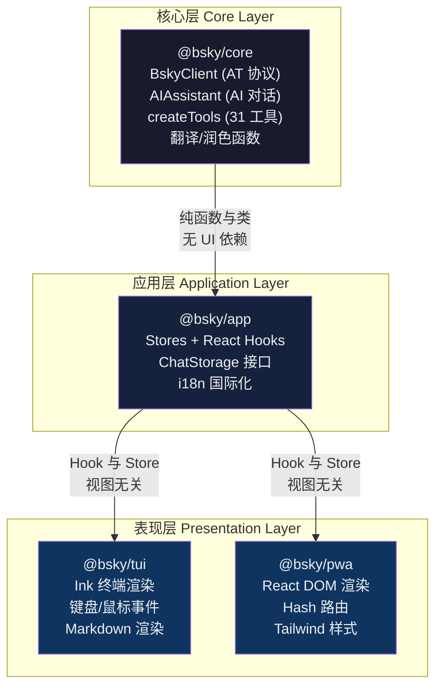
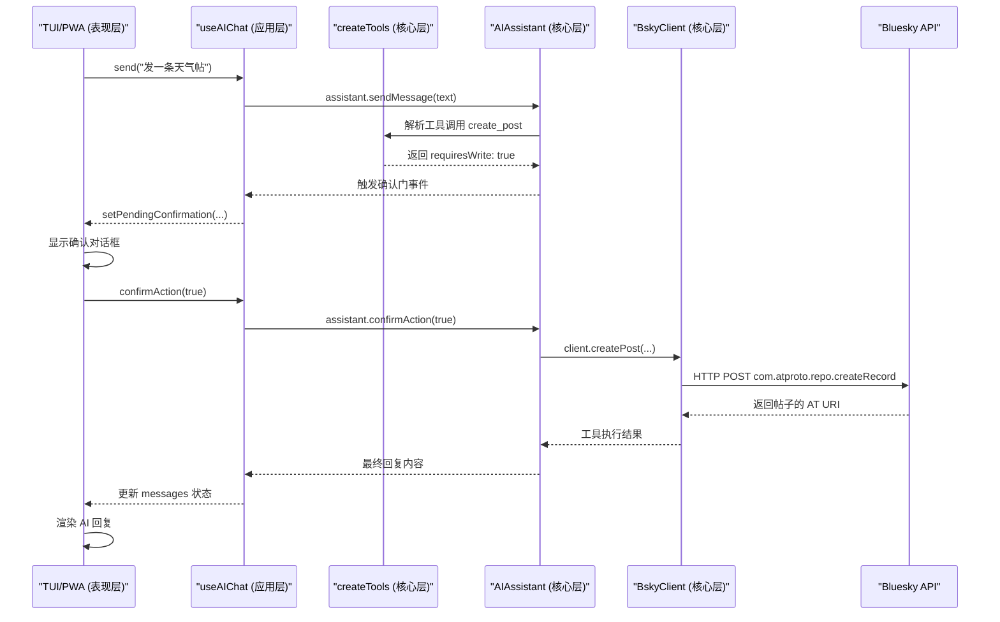

本页定义 `@bsky` 项目的完整分层架构：**Core（核心层）→ App（应用层）→ TUI/PWA（表现层）**。这一架构的核心目标是：让 AT 协议与 AI 能力成为纯逻辑的、可独立测试的库，让 React Hook 成为声明式的桥接层，让终端与浏览器两种 UI 共享同一套业务逻辑而不互相污染。以下从依赖方向、边界契约、数据流三个维度展开。

---

## 架构全景

依赖方向是单向且严格的：`core ← app ← tui/pwa`。没有任何一个下层包引用上层包的类型或模块。



### 包依赖矩阵

每个包的 `package.json` 明确声明了它的依赖范围，不会有循环引用：

| 包名 | 依赖 | 运行时依赖数 | 核心职责 |
|------|------|-------------|----------|
| `@bsky/core` | `ky`, `dotenv` | 2 | AT Protocol 客户端、AI 引擎、工具函数 |
| `@bsky/app` | `@bsky/core`, `react` | 2 | Stores、React Hooks、服务抽象 |
| `@bsky/tui` | `@bsky/app`, `@bsky/core`, `ink`, `ink-spinner`, `ink-text-input` | 5+ | 终端 UI 组件、键盘导航 |
| `@bsky/pwa` | `@bsky/app`, `@bsky/core`, `react-dom`, `@tanstack/react-virtual`, `react-markdown` | 5+ | 浏览器 UI 组件、虚拟滚动 |

Sources: [packages/core/package.json](packages/core/package.json#L1-L32), [packages/app/package.json](packages/app/package.json#L1-L30), [packages/tui/package.json](packages/tui/package.json#L1-L39), [packages/pwa/package.json](packages/pwa/package.json#L1-L34)

---

## 第一层：Core — 纯逻辑与协议引擎

`@bsky/core` 是整个系统的**零 UI 依赖**的纯逻辑层。它不导入 `react`，不关心渲染目标，只处理两类核心能力：Bluesky AT 协议交互和 AI 对话引擎。

### BskyClient：AT 协议的门面

`BskyClient` 封装了与 Bluesky PDS/AppView 的所有 HTTP 通信。它使用 `ky` 作为 HTTP 客户端，内部维护了会话状态（`session` 属性）、JWT 自动刷新机制（通过 `ky` 的 `afterResponse` hook 捕获 `ExpiredToken`/`InvalidToken` 错误后自动调用 `refreshSession`），以及公共 API 与认证 API 的双实例路由（`this.ky` vs `this.publicKy`）。

关键的设计决策是：**认证状态由 core 层自身维护，上层不直接操作 JWT 令牌**。`login()` 返回 `CreateSessionResponse` 后，`BskyClient` 内部持有 session 对象；上层可以通过 `isAuthenticated()` 检查状态，通过 `restoreSession()` 恢复会话，但无法直接读写 accessJwt。这防止了 UI 层意外泄露或篡改凭据。

```typescript
// core 层暴露的只是纯异步方法
const client = new BskyClient();
const session = await client.login(handle, password);
const timeline = await client.getTimeline(50);
const profile = await client.getProfile(handle);
```

Sources: [packages/core/src/at/client.ts](packages/core/src/at/client.ts#L1-L40), [packages/core/src/at/client.ts](packages/core/src/at/client.ts#L65-L75)

### AIAssistant：多轮对话引擎

`AIAssistant` 实现了一个完整的工具调用循环（Tool Calling Loop）：接收用户消息 → 调用 LLM API → 解析工具调用 → 执行工具 → 返回结果 → 再次调用 LLM，最多 10 轮迭代。它包含**写操作确认门（Write Confirmation Gate）**：当工具标记为 `requiresWrite: true` 时，`AIAssistant` 会暂停执行流，通过 `_confirmPromise` 等待上层（UI 层）调用 `confirmAction(true/false)` 来批准或取消操作。这一机制让 AI 不能未经用户确认就执行发帖、删除等写操作。

```typescript
// core 层 AIAssistant 的公共 API
assistant.addSystemMessage(prompt);
assistant.setTools(createTools(client));
const result = await assistant.sendMessage(userText);
// 或流式版本
const stream = assistant.sendMessageStreaming(userText);
```

Sources: [packages/core/src/ai/assistant.ts](packages/core/src/ai/assistant.ts#L1-L45), [packages/core/src/ai/assistant.ts](packages/core/src/ai/assistant.ts#L85-L120)

### 31 个工具函数：读写分离

`createTools(client)` 返回一个 `ToolDescriptor[]` 数组，每个工具包含 `definition`（函数签名，供 LLM 理解）、`handler`（执行函数）、`requiresWrite`（写操作标记）。读工具（如 `resolve_handle`、`get_timeline`、`search_posts`）的 `requiresWrite` 为 `false`，执行时不需要用户确认；写工具（如 `create_post`、`delete_post`、`like_post`、`repost`）的 `requiresWrite` 为 `true`，会在 `AIAssistant` 内部触发确认门。

这种读写分离设计意味着：**工具层自身不关心 UI，但它为 UI 层提供了管控 AI 行为的钩子**。TUI 端和 PWA 端可以用不同的方式呈现确认对话框（TUI 用 Ink 组件，PWA 用 React Modal），但确认逻辑本身在 core 层统一实现。

Sources: [packages/core/src/at/tools.ts](packages/core/src/at/tools.ts#L1-L200)

### 翻译与润色：纯函数

`translateText`、`translateToChinese`、`polishDraft` 是独立的纯函数，封装了对 LLM API 的单轮调用，附带指数退避重试逻辑。它们不属于 `AIAssistant` 类，因为它们不维护多轮对话状态。

Sources: [packages/core/src/index.ts](packages/core/src/index.ts#L1-L25)

---

## 第二层：App — 纯 Store + React Hook 模式

`@bsky/app` 是**视图无关的 React 桥接层**。它不依赖 `ink` 或 `react-dom`，只依赖 `react` 和 `@bsky/core`。它的核心模式是：**纯对象 Store + 订阅机制 + React Hook 包装**。

### Store 模式：订阅驱动的状态容器

每个 Store（如 `auth.ts`、`timeline.ts`、`postDetail.ts`）是一个普通的 JavaScript 对象，包含状态字段、操作方法、以及一个简单的发布-订阅机制：

```typescript
// store 的核心模式
const store = {
  state: ...,
  listener: null,
  _notify() { if (this.listener) this.listener(); },
  subscribe(fn) {
    this.listener = fn;
    return () => { this.listener = null; };
  },
  async load(client) {
    this.loading = true;
    this._notify();
    // ... 异步操作 ...
    this.loading = false;
    this._notify();
  }
};
```

这种模式不依赖任何状态管理库（Redux、Zustand、Jotai 等），选择的是**最小依赖 + 显式控制**。每个 Store 的 `subscribe` 返回一个取消函数，React Hook 在 `useEffect` 中绑定它，在卸载时自动解绑。

Sources: [packages/app/src/stores/auth.ts](packages/app/src/stores/auth.ts#L1-L70), [packages/app/src/stores/timeline.ts](packages/app/src/stores/timeline.ts#L1-L75)

### Hook 层：Store 的 React 适配器

每个 Hook（如 `useAuth`、`useTimeline`、`useAIChat`）遵循固定的模板：

```typescript
export function useAuth() {
  const [store] = useState(() => createAuthStore());  // 惰性初始化
  const [, force] = useState(0);
  const tick = useCallback(() => force(n => n + 1), []);  // 强制重渲染

  useEffect(() => store.subscribe(tick), [store, tick]);

  return {
    client: store.client,
    session: store.session,
    // ... 其余状态与操作
  };
}
```

这种模式的关键点：
- **惰性初始化**：Store 在组件首次渲染时才创建，不占用模块加载时间
- **细粒度订阅**：每个 Hook 只订阅自己关心的 Store，不会引起无关组件的重渲染
- **无 Context**：不使用 React Context，因为 `@bsky/app` 不假定 UI 树结构

Sources: [packages/app/src/hooks/useAuth.ts](packages/app/src/hooks/useAuth.ts#L1-L23), [packages/app/src/hooks/useTimeline.ts](packages/app/src/hooks/useTimeline.ts#L1-L30)

### 服务抽象：ChatStorage 接口

`ChatStorage` 是一个 TypeScript 接口，定义了聊天记录的 CRUD 操作：

```typescript
export interface ChatStorage {
  saveChat(chat: ChatRecord): Promise<void>;
  loadChat(id: string): Promise<ChatRecord | null>;
  listChats(): Promise<ChatSummary[]>;
  deleteChat(id: string): Promise<void>;
}
```

`@bsky/app` 提供了一个基于文件系统的实现 `FileChatStorage`（写入 `~/.bsky-tui/chats/`），但接口本身是抽象层。PWA 端在 `@bsky/pwa/services/indexeddb-chat-storage.ts` 中提供了 `IndexedDBChatStorage` 实现。TUI 和 PWA 通过 `useChatHistory(storage)` 接收不同的存储实现，但共享同一套 Hook 逻辑。

Sources: [packages/app/src/services/chatStorage.ts](packages/app/src/services/chatStorage.ts#L1-L89), [packages/app/src/hooks/useChatHistory.ts](packages/app/src/hooks/useChatHistory.ts#L1-L49)

### 导航系统：视图无关的路由

导航状态在 `app/src/state/navigation.ts` 中定义，是一个联合类型 `AppView`：

```typescript
export type AppView =
  | { type: 'feed' }
  | { type: 'detail'; uri: string }
  | { type: 'thread'; uri: string }
  | { type: 'compose'; replyTo?: string; quoteUri?: string }
  | { type: 'profile'; actor: string }
  | { type: 'notifications' }
  | { type: 'search'; query?: string }
  | { type: 'aiChat'; contextUri?: string }
  | { type: 'bookmarks' };
```

这个定义与 React Router 或 Ink Router 完全无关。TUI 端和 PWA 端可以有完全不同的路由实现（TUI 用 `goTo/goBack` 的栈操作，PWA 用 Hash 路由），但共享同一个 `AppView` 类型系统。

Sources: [packages/app/src/state/navigation.ts](packages/app/src/state/navigation.ts#L1-L66)

### i18n 系统

国际化的配置、语言包和 Hook 都在 `@bsky/app` 中实现。语言包（`zh.ts`、`en.ts`、`ja.ts`）定义了翻译键值对，`useI18n` Hook 根据当前语言环境返回翻译函数 `t(key)`。TUI 和 PWA 都通过 `useI18n` 获取翻译，无需各自实现 i18n 逻辑。

Sources: [packages/app/src/i18n/index.ts](packages/app/src/i18n/index.ts#L1-L5)

---

## 第三层 & 第四层：TUI 与 PWA — 共享逻辑，各自渲染

TUI 和 PWA 是**同级**的表现层，它们不互相依赖，但都依赖 `@bsky/app`。它们共享 100% 的应用逻辑（认证、时间线、AI 对话、翻译、导航状态、聊天存储接口），但渲染目标和交互方式完全不同。

### @bsky/tui：终端 UI

TUI 的入口是 `cli.ts`，它读取 `.env` 文件配置，通过 `render(React.createElement(App, ...), { stdin, stdout })` 启动 Ink 应用。它的核心特征：

- **渲染引擎**：Ink（React for terminal），基于 Yoga 布局引擎
- **键盘导航**：通过 `useInput` 处理按键事件，`useStdout` 获取终端尺寸
- **鼠标支持**：ANSI 转义序列追踪鼠标事件（`enableMouseTracking`）
- **Markdown 渲染**：自定义 `markdown.tsx` 组件，处理 CJK 文本换行
- **AI 面板**：`AIChatView.tsx` 叠加在主体内容之上，通过 Tab 键切换焦点

TUI 特有的功能包括：设置向导 `SetupWizard`（首次运行时通过交互式表单配置凭据）、草稿自动保存提示（退出 compose 时弹出「是否保存草稿」对话框）、图片上传（通过本地文件路径）。

Sources: [packages/tui/src/cli.ts](packages/tui/src/cli.ts#L1-L128), [packages/tui/src/components/App.tsx](packages/tui/src/components/App.tsx#L1-L200)

### @bsky/pwa：浏览器 UI

PWA 的入口是 `main.tsx`，它调用 `ReactDOM.createRoot` 渲染到 DOM，并在加载后注册 Service Worker。它的核心特征：

- **路由**：`useHashRouter`（Hash-based routing，不使用 React Router）
- **虚拟滚动**：`@tanstack/react-virtual` 实现长列表优化
- **流式 AI 输出**：SSE 实时令牌渲染 + `react-markdown` + `rehype-highlight`
- **会话持久化**：`localStorage` 保存 JWT session（通过 `useSessionPersistence`）
- **聊天存储**：`IndexedDBChatStorage`（替代 TUI 的 `FileChatStorage`）
- **Tailwind CSS**：语义色板变量，支持暗色模式

PWA 特有的功能包括：登录页面（TUI 没有登录页，凭据来自 .env）、Service Worker 离线缓存、PWA 安装提示。

Sources: [packages/pwa/src/main.tsx](packages/pwa/src/main.tsx#L1-L22), [packages/pwa/src/App.tsx](packages/pwa/src/App.tsx#L1-L195)

### 差异点总结

| 维度 | TUI | PWA |
|------|-----|-----|
| 渲染目标 | 终端 (Ink) | 浏览器 (React DOM) |
| 凭据来源 | `.env` + 设置向导 | 登录表单 + localStorage |
| 聊天存储 | `FileChatStorage`（JSON 文件） | `IndexedDBChatStorage` |
| 路由 | 状态栈（`goTo/goBack`） | Hash Router（`window.location.hash`） |
| 样式 | Ink 内置组件 | Tailwind CSS + 语义色板 |
| 图片 | 本地文件路径上传 | 文件选择器 + Blob URL |
| 离线支持 | 无 | Service Worker 缓存 |
| 文本渲染 | CJK 感知的自定义 Markdown | `react-markdown` + `remark-gfm` |

---

## 数据流：一次完整的用户操作

以「在 AI 面板中发帖」为例，展示四层数据流：



关键观察：**核心层的 `AIAssistant` 不直接调用 UI 层的对话框**，而是通过 Promise 暂停执行，等待 UI 层调用 `confirmAction` 恢复。这是分层架构中「控制反转」的典型应用。

---

## 分层原则总结

1. **依赖单向性**：`core → app → tui/pwa`，不存在反向引用。`core` 不知道 `react` 的存在，`app` 不知道 `ink` 或 `react-dom` 的存在。

2. **状态向下流动**：`core` 层维护 Protocol 会话和 AI 对话状态，`app` 层通过 Store/Hook 消费并包装这些状态，TUI/PWA 仅从 Hook 读取状态并渲染。

3. **接口抽象**：`ChatStorage` 接口让 TUI 和 PWA 使用不同的持久化方案；`AppView` 联合类型让 TUI 和 PWA 实现不同的路由机制。

4. **可测试性**：`core` 层可以脱离 UI 独立测试（已有 vitest 配置和 e2e 测试）；`app` 层可以通过 mock `core` 来测试 Hook 逻辑；UI 层只需关注渲染和交互。

5. **分离点清晰**：
   - 凭据管理：`core` 管会话刷新，`app` 管 `restoreSession`，TUI 管 `.env`，PWA 管 `localStorage`
   - 写操作确认：`core` 定义 `requiresWrite` 和确认门机制，`app` 传播 `pendingConfirmation` 状态，UI 渲染对话框
   - 持久化：`app` 定义接口，UI 提供具体实现

---

## 下一步阅读

- 深入了解核心层的 AT 协议客户端设计：[BskyClient：AT 协议客户端与 JWT 自动刷新机制](8-bskyclient-at-xie-yi-ke-hu-duan-yu-jwt-zi-dong-shua-xin-ji-zhi)
- 查看 AI 引擎的多轮对话与工具调用：[AIAssistant 类：多轮对话、工具调用与 SSE 流式输出](9-aiassistant-lei-duo-lun-dui-hua-gong-ju-diao-yong-yu-sse-liu-shi-shu-chu)
- 掌握 Store + Hook 模式的完整用法：[纯 Store + React Hook 模式：订阅驱动的状态管理](12-chun-store-react-hook-mo-shi-ding-yue-qu-dong-de-zhuang-tai-guan-li)