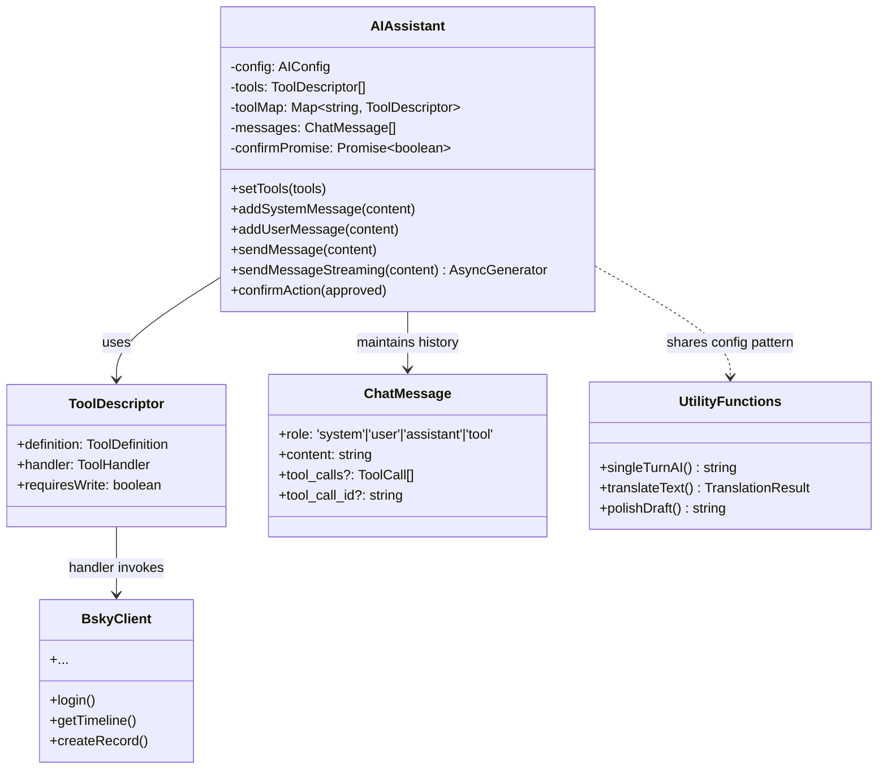
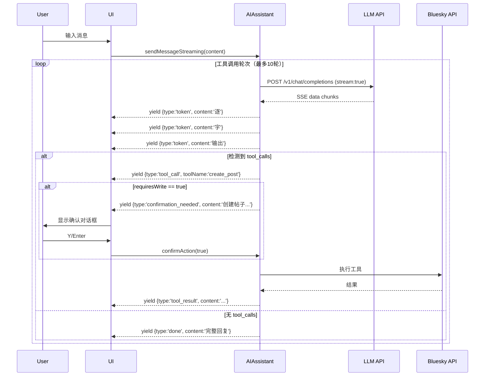

`AIAssistant` 是 `@bsky/core` 包中的有状态对话引擎，管理多轮对话上下文、执行 LLM 工具调用并驱动 SSE 流式输出。它位于 AI 集成的核心位置，向上承接 UI 层的用户输入，向下调度 31 个 Bluesky 工具函数的执行，并实现了一个写操作确认门控机制以确保用户对实际数据变更操作的掌控权。

Sources: [assistant.ts](packages/core/src/ai/assistant.ts#L1-L3), [index.ts](packages/core/src/index.ts#L12-L15)

## 架构概述：有状态对话引擎的三层职责



这个类图揭示了 `AIAssistant` 的三层责任边界：

- **状态管理层**：维护 `messages[]` 数组，记录 system/user/assistant/tool 四种角色的完整对话历史，支持 `loadMessages()`/`getMessages()` 实现对话持久化
- **工具调度层**：通过 `toolMap` 将 LLM 返回的 tool_call 名称映射到具体的 `ToolDescriptor` 处理函数，处理写操作确认门控
- **流式输出层**：通过 `AsyncGenerator` 逐步 yield `token`/`tool_call`/`tool_result`/`done` 事件，支持实时渲染

Sources: [assistant.ts](packages/core/src/ai/assistant.ts#L8-L41), [tools.ts](packages/core/src/at/tools.ts#L1-L26)

## 配置体系与构造策略

`AIAssistant` 的构造函数采用部分默认值 + 用户覆盖的模式：

```typescript
const DEFAULT_CONFIG: Partial<AIConfig> = {
  baseUrl: 'https://api.deepseek.com',   // DeepSeek 兼容 OpenAI API
  model: 'deepseek-v4-flash',            // 性价比最优的快速模型
};
```

`AIConfig` 接口仅要求三个字段——`apiKey`、`baseUrl`、`model`，其中 `apiKey` 是唯一必须由调用方提供的字段。`baseUrl` 的设计保留了灵活切换后端的能力：任何兼容 OpenAI Chat Completions API 的提供商均可接入，这一点在集成测试中通过 `.env` 的 `LLM_BASE_URL` 和 `LLM_MODEL` 变量得到了验证。

Sources: [assistant.ts](packages/core/src/ai/assistant.ts#L42-L48)

## 多轮对话的消息体系

对话状态由 `ChatMessage[]` 数组维护，支持四种角色，每种角色承载不同的语义：

| `role` 值 | 用途 | 关键字段 |
|---|---|---|
| `system` | 设定 AI 行为边界和上下文 | `content` 包含系统提示词 |
| `user` | 用户输入（提问或指令） | `content` 为文本 |
| `assistant` | AI 回复或 tool_call 提议 | `tool_calls[]` 包含函数调用；`reasoning_content` 存储推理过程 |
| `tool` | 工具执行结果 | `tool_call_id` 关联对应的 tool_call；`content` 为执行结果 |

特别需要关注的是 `reasoning_content` 字段——DeepSeek 系列模型支持在流式输出中返回推理链（reasoning tokens），这些内容被独立存储的 `reasoning_content` 字段中，随 assistant 消息一同加入对话历史。这意味着 AI 的"思考过程"不会被截断，在多轮工具调用中保持上下文的完整性。

Sources: [assistant.ts](packages/core/src/ai/assistant.ts#L5-L23)

## 工具系统集成：从合约定义到运行时执行

工具系统跨越三个文件，形成从声明到执行的完整链路：

```
contracts/tools.json          → 工具的权威声明（名称、描述、参数 schema、读写属性）
packages/core/src/at/tools.ts → createTools() 工厂函数，将合约声明 + BskyClient 绑定为可执行 ToolDescriptor[]
packages/core/src/ai/assistant.ts → setTools() 接收 ToolDescriptor[] 并构建 toolMap
```

### ToolDescriptor 三层结构

```typescript
export interface ToolDescriptor {
  definition: ToolDefinition; // 工具元数据（名称、描述、inputSchema）
  handler: ToolHandler;       // 执行函数：(params) => Promise<string>
  requiresWrite: boolean;     // 是否为写操作（需用户确认）
}
```

`createTools(client)` 工厂函数将 `BskyClient` 实例注入每一个工具的 `handler` 闭包中，返回包含 31 个工具的数组。读工具（requiresWrite: false）和写工具（requiresWrite: true）的比例约为 3:1——读工具覆盖时间线/帖子线程/用户资料/搜索/通知等查询场景，写工具则限定在发帖、点赞、转发、关注、上传图片五种操作。

Sources: [tools.ts](packages/core/src/at/tools.ts#L1-L26), [tools.json](contracts/tools.json#L1-L14)

### 工具选择机制：LLM 驱动的自动路由

当 `sendMessage()` 检测到 `tools` 数组非空时，会在请求体中注入 `tools` 参数并设置 `tool_choice: 'auto'`。这意味着 LLM 自行判断是否需要调用工具、调用哪个工具以及传入什么参数。这是整个系统最关键的智能决策点——LLM 需要将用户的自然语言指令（如"帮我看看 @alice.bsky.social 的最近帖子"）翻译为具体的工具调用链（`resolve_handle` → `get_author_feed`）。

```typescript
if (this.tools.length > 0) {
  body.tools = this.tools.map((t) => ({
    type: 'function',
    function: {
      name: t.definition.name,
      description: t.definition.description,
      parameters: t.definition.inputSchema,
    },
  }));
  body.tool_choice = 'auto';
}
```

Sources: [assistant.ts](packages/core/src/ai/assistant.ts#L260-L275)

## 写操作确认门控机制

这是项目的一个关键安全设计。写工具（requiresWrite: true）在执行前会触发一个 Promise 门控，等待 UI 层的用户确认：

```typescript
if (toolDesc.requiresWrite) {
  const approved = await this._waitForConfirmation();
  if (!approved) {
    toolResult = 'User cancelled the operation.';
    // 记录取消事件到对话历史
    this.messages.push({
      role: 'tool',
      content: toolResult,
      tool_call_id: tc.id,
    });
    continue;
  }
}
```

门控机制的核心实现是 `_waitForConfirmation()` 方法：

```typescript
private async _waitForConfirmation(): Promise<boolean> {
  this._confirmPromise = new Promise<boolean>((resolve) => {
    this._confirmResolve = resolve;
  });
  return this._confirmPromise;
}
```

这是一个异步屏障：当 LLM 决定调用写工具时，`sendMessage()` 的执行流在此暂停，等待 UI 层通过 `confirmAction(approved)` 方法注入用户的决策。UI 层可以展示一个确认对话框，描述即将执行的操作（`buildToolDescription()` 函数为每种写操作生成本地化的描述文本），收到用户 Y/N 后调用 `confirmAction()` 让执行流继续。

Sources: [assistant.ts](packages/core/src/ai/assistant.ts#L178-L198), [assistant.ts](packages/core/src/ai/assistant.ts#L286-L305)

## 两套执行模式：阻塞式与流式

`AIAssistant` 提供了两个核心方法，分别对应不同的 UI 渲染策略。

### sendMessage()：阻塞式多轮执行

这是原始的执行路径，适用于不需要实时令牌渲染的场景（如 TUI 端的历史消息回放或批量处理）。它的执行流程是一个循环，最多执行 10 轮工具调用：

```
用户消息 → makeRequest() → 解析 response
  ├─ 有 tool_calls → 执行工具 → 注入 tool 消息 → 继续循环
  └─ 无 tool_calls → 返回最终 content + intermediateSteps 元数据
```

`intermediateSteps` 数组记录了每一步的 `type`（tool_call/tool_result/assistant/user）和 `content`，使得 UI 层即使在非流式模式下也能展示完整的执行链路。

### sendMessageStreaming()：SSE 流式异步生成器

这是流式执行路径，基于 `AsyncGenerator` 实现，适用于需要实时渲染的场景（如 PWA 端的打字机效果）。它每次迭代 yield 一个结构化事件对象：

```typescript
async *sendMessageStreaming(content: string): AsyncGenerator<{
  type: 'tool_call' | 'tool_result' | 'token' | 'done';
  content: string;
  toolName?: string;
}>
```

完整的流式事件循环如下：



SSE 流式解析的核心逻辑在于 `delta.tool_calls` 的处理——由于工具调用可能跨多个 SSE chunk 分段传输，系统使用 `toolCallAccum: Map<number, {...}>` 按 index 累积增量数据，直到流结束才组装完整的 ToolCall 数组：

```typescript
if (delta.tool_calls) {
  for (const tc of delta.tool_calls) {
    const idx = tc.index;
    if (!toolCallAccum.has(idx)) {
      toolCallAccum.set(idx, { id: '', name: '', arguments: '' });
    }
    const acc = toolCallAccum.get(idx)!;
    if (tc.id) acc.id = tc.id;
    if (tc.function?.name) acc.name = tc.function.name;
    if (tc.function?.arguments) acc.arguments += tc.function.arguments;
  }
}
```

Sources: [assistant.ts](packages/core/src/ai/assistant.ts#L273-L320), [assistant.ts](packages/core/src/ai/assistant.ts#L409-L490)

## 工具函数集：单轮无工具调用场景

除了 `AIAssistant` 类，同一文件还导出了四个独立工具函数，用于不需要工具调用的单轮场景。

### singleTurnAI：基础调用函数

最底层的单轮调用函数，接收 `config`、`systemPrompt`、`userPrompt`，返回纯文本响应。不包含工具注册、消息历史管理或流式逻辑，是翻译和润色功能的基础。

### translateText：双模式智能翻译

`translateText()` 是 `singleTurnAI` 的上层封装，引入两个创新设计：

**模式选择**：`simple` 模式返回纯文本翻译（向后兼容）；`json` 模式请求 LLM 以 `{"source_lang": "en", "translated": "翻译结果"}` 格式输出，从而获得源语言检测能力。

**指数退避重试**：当翻译结果为空、JSON 解析失败或网络异常时，触发最多 3 次重试，延迟按 `800 * (attempt + 1)` ms（JSON 模式）或 `1000 * (attempt + 1)` ms（通用模式）递增。语言标签字典支持中英日韩法德西七种语言，未覆盖的语言回退为原代码。

```typescript
const LANG_LABELS: Record<string, string> = {
  zh: '中文', en: 'English', ja: '日本語', ko: '한국어',
  fr: 'Français', de: 'Deutsch', es: 'Español',
};
```

### translateToChinese：便利兼容函数

历史遗留的便利函数，调用 `translateText(config, text, 'zh', 'simple')`，返回纯文本。保持与早期版本的接口兼容。

### polishDraft：草稿润色

接收草稿文本和润色要求，通过 `singleTurnAI` 调用 LLM 对帖子草稿进行润色。系统提示词明确要求"只返回润色后的文本"，确保输出纯净。

Sources: [assistant.ts](packages/core/src/ai/assistant.ts#L532-L687)

## 对话持久化集成

`AIAssistant` 本身不负责持久化，它通过 `getMessages()` 和 `loadMessages()` 接口暴露对话状态，由上层存储层（`FileChatStorage` 或 `IndexedDBChatStorage`）完成序列化和反序列化。`ChatMessage` 接口的结构与 JSON 天然兼容，写入存储前只需 `JSON.stringify(messages)`，加载时通过 `loadMessages()` 恢复完整上下文。

Sources: [assistant.ts](packages/core/src/ai/assistant.ts#L113-L120)

## 边界限制与安全约束

系统在设计中明确了两类软硬限制：

- **最大工具调用轮次**：`MAX_TOOL_ROUNDS = 10`，防止 LLM 陷入无限工具调用循环。达到上限时抛出 `'Max tool calling rounds exceeded'` 错误
- **写操作确认门控**：`requiresWrite` 标记确保所有数据变更操作必须经过用户显式确认。`buildToolDescription()` 函数为每种写操作生成中文可读描述
- **网络错误兜底**：`fetch` 调用捕获 `TypeError` 中的 `'fetch failed'` 消息，转换为更友好的中文错误提示，指明需检查 `LLM_BASE_URL` 和网络连接

Sources: [assistant.ts](packages/core/src/ai/assistant.ts#L128-L129), [assistant.ts](packages/core/src/ai/assistant.ts#L276-L283)

## 使用模式速查

| 场景 | 方法 | 流式 | 工具调用 | 需要 BskyClient |
|---|---|---|---|---|
| AI 聊天面板 | `sendMessageStreaming()` | ✅ | ✅ | ❌（通过 setTools 注入） |
| 批量对话处理 | `sendMessage()` | ❌ | ✅ | ❌ |
| 翻译文本 | `translateText()` / `translateToChinese()` | ❌ | ❌ | ❌ |
| 润色草稿 | `polishDraft()` | ❌ | ❌ | ❌ |
| 纯 LLM 调用 | `singleTurnAI()` | ❌ | ❌ | ❌ |

Sources: [assistant.ts](packages/core/src/ai/assistant.ts#L1-L687)

## 深入理解

这份文档是架构探索的起点。建议按照以下路径继续深入：

- 了解工具函数的完整清单和读写分离策略：`[31 个 Bluesky 工具函数系统：读写分离与权限控制](10-31-ge-bluesky-gong-ju-han-shu-xi-tong-du-xie-fen-chi-yu-quan-xian-kong-zhi)`
- 查看系统提示词合约的具体内容：`[系统提示词合约：角色定义、翻译与草稿润色 Prompt](27-xi-tong-ti-shi-ci-he-yue-jiao-se-ding-yi-fan-yi-yu-cao-gao-run-se-prompt)`
- 了解聊天记录持久化的实现：`[聊天记录持久化：FileChatStorage 与 IndexedDBChatStorage](15-liao-tian-ji-lu-chi-jiu-hua-filechatstorage-yu-indexeddbchatstorage)`
- 查看 PWA 端如何在 React 中消费流式事件：`[AI 聊天流式页面：SSE 实时令牌渲染与 react-markdown](24-ai-liao-tian-liu-shi-ye-mian-sse-shi-shi-ling-pai-xuan-ran-yu-react-markdown)`
- 双模式翻译的详细策略：`[双模式智能翻译：simple/json 模式与指数退避重试](11-shuang-mo-shi-zhi-neng-fan-yi-simple-json-mo-shi-yu-zhi-shu-tui-bi-zhong-shi)`