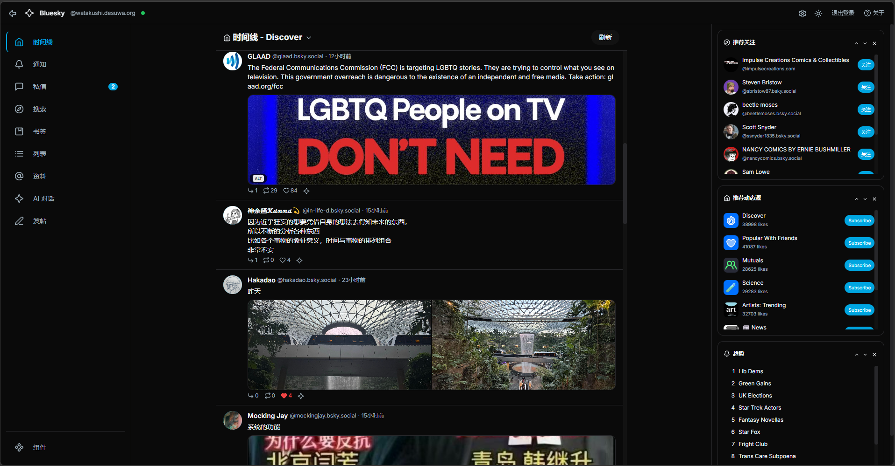
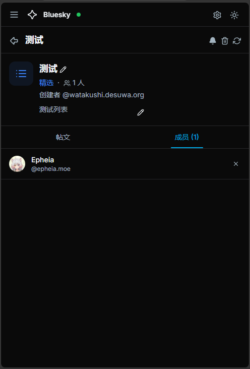
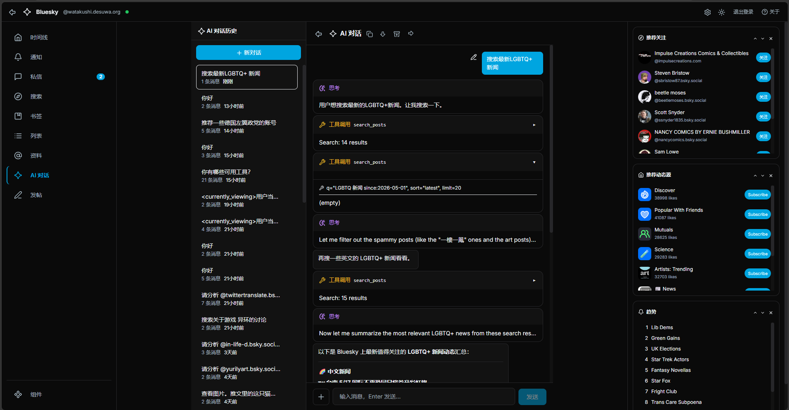
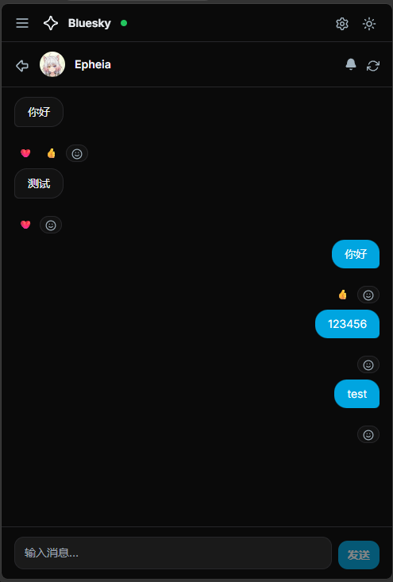
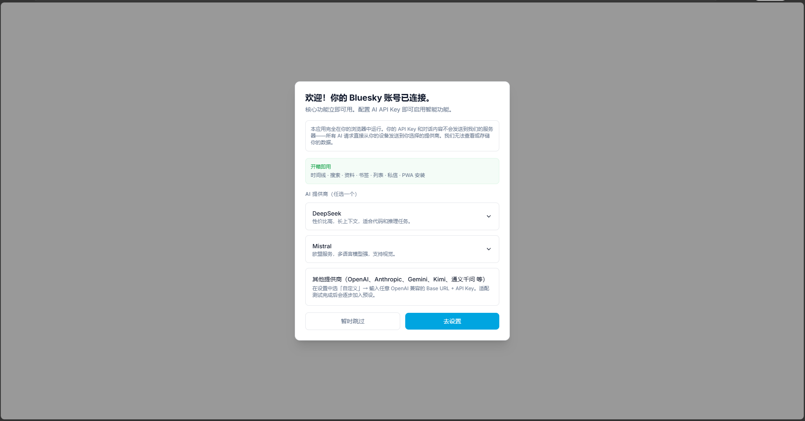

# 🦋 Bluesky 客户端

**你的 Bluesky，AI 加持。**  
双界面社交客户端——终端给键盘党，浏览器给所有人。  
纯前端，零服务器，隐私优先。

<div align="center">

[**打开网页版**](https://ai-bsky.pages.dev) · [**源代码**](https://github.com/epheiamoe/bsky)

</div>

---

## ✨ 功能一览

### 📰 时间线 & 讨论串



浏览 Following、Discover 和自定义 Feed。查看嵌套讨论串、引用帖和富媒体嵌入。虚拟滚动保证无论刷多远都流畅。

---

### 📋 列表



创建精选列表用于定制信息流，创建管理列表用于批量静音。随时管理成员、浏览列表帖文流。`#/lists` 查看你的收藏。

---

### 🤖 AI 对话



流式输出，思考过程可见。36 个工具桥接 AI 与 Bluesky——分析讨论、总结内容、管理列表、润色草稿。所有写操作需点击确认。自带 API Key，数据不经过我们的服务器。

---

### 💬 私信



私人对话 + emoji 反应 + 引用帖嵌入。后台静默轮询，新消息自动出现。静音对话、删除消息、搜索用户。

---

### 🌐 翻译


一键翻译任意帖子或讨论串。双模式：简易纯文本或带源语言检测的结构化 JSON。支持 7 种语言。

---

### 🎨 欢迎引导



第一次使用？欢迎引导卡片带你几步配置 AI Key——每个提供商都有详细步骤。直接跳过也能用全部核心功能。你的凭据不会离开浏览器。

---

**还有更多：**
- **书签** — 收藏任意帖子，稍后查看
- **搜索** — 帖子、用户、动态源 4 标签搜索
- **资料页** — 编辑头像、横幅、显示名称
- **发帖** — 多帖串 + 图片 + ALT 文本
- **草稿** — 自动保存到 Bluesky PDS + 本地回退
- **通知** — 实时刷新
- **PWA** — 可安装，离线使用
- **深色模式** — 跟随系统
- **国际化** — 中文 · English · 日本語

---

## 🚀 快速开始

### 终端（TUI）

```bash
git clone https://github.com/epheiamoe/bsky.git && cd bsky
pnpm install && pnpm -r build
cp .env.example .env   # 填入你的 Bluesky 账号 + App Password
cd packages/tui && npx tsx src/cli.ts
```

### 浏览器（PWA）

```bash
cd packages/pwa && pnpm dev     # → http://localhost:5173
```

或直接访问 **[ai-bsky.pages.dev](https://ai-bsky.pages.dev)** —— 在浏览器内登录，无需 `.env`。

---

## 🔒 隐私

一切在你的浏览器中运行。你的 Bluesky 凭据、API Key 和对话内容不会接触任何外部服务器。所有请求直接从你的设备发往 Bluesky 或你选择的 AI 提供商。无需信任，无从泄露。

---

## 🏗 架构

```
@bsky/core ──→ @bsky/app ──→ @bsky/tui  (Ink · 终端)
                          └─→ @bsky/pwa  (React · 浏览器)
```

业务逻辑只写一次。TUI 和 PWA 共享同一套 hooks。4 个包，一份代码，零重复。

---

## 📄 许可

[MIT](LICENSE) — 自由使用、修改、分发。

**v0.10.3** · [更新日志](CHANGELOG.md) · [English Docs](README.md)
