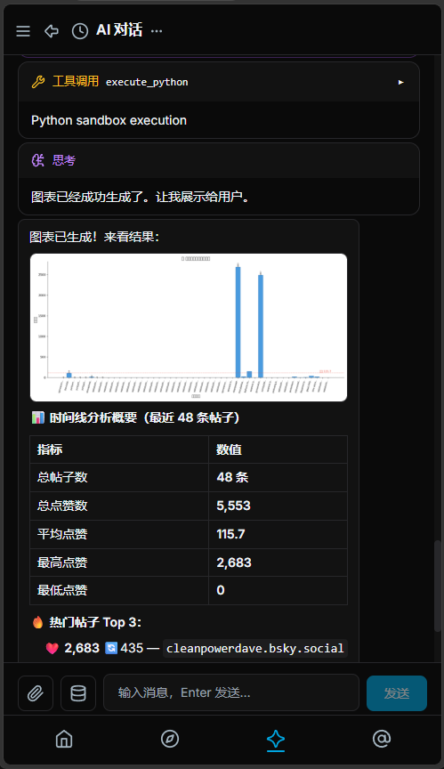
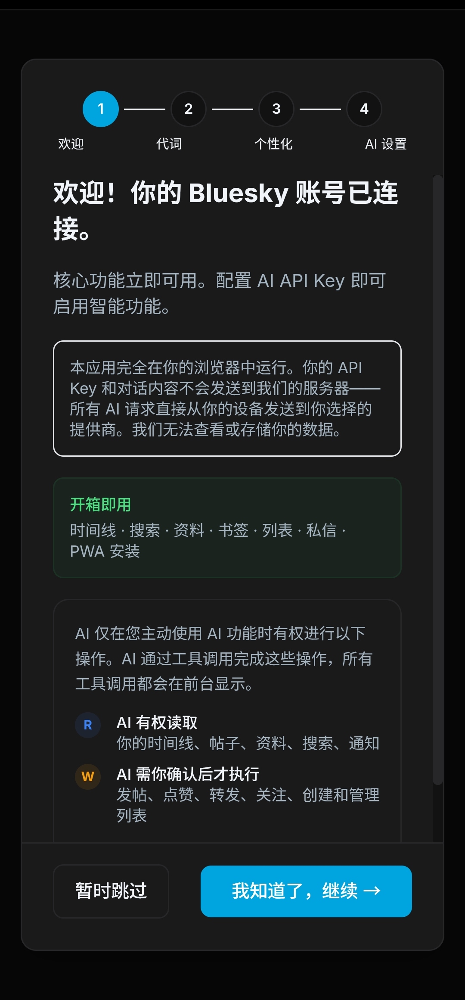
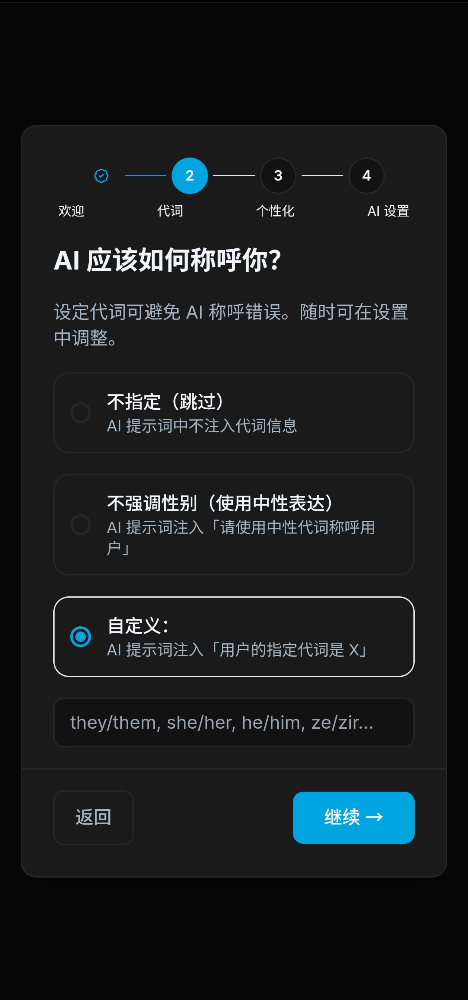
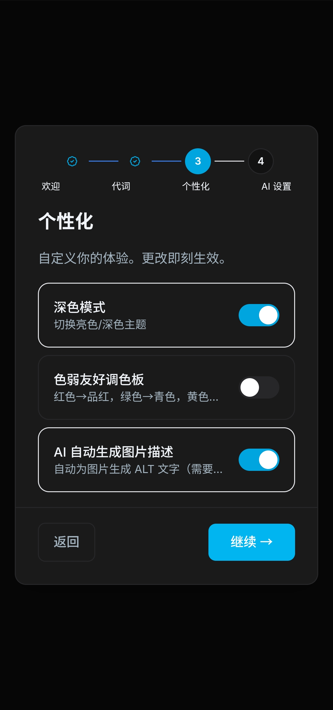
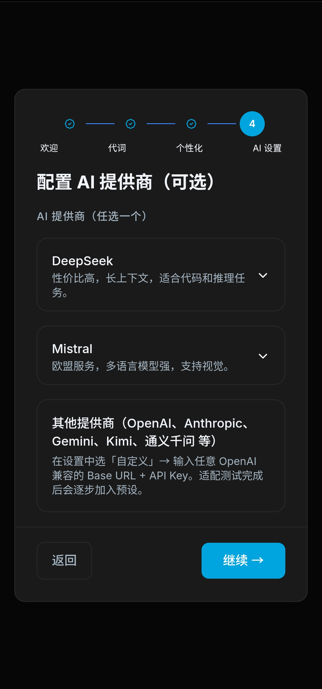
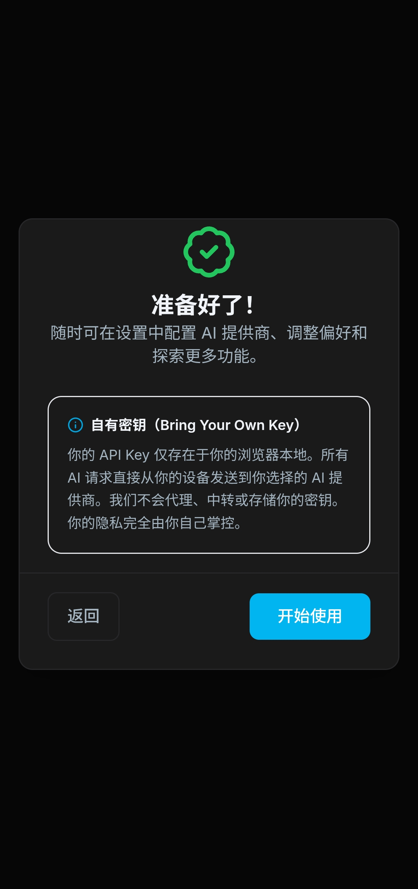
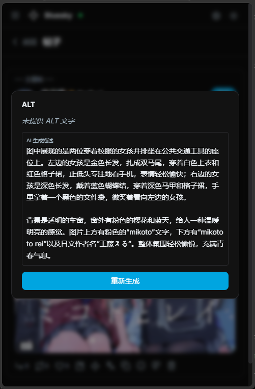

# 🦋 Bluesky 客户端

**你的 Bluesky，AI 加持。**  
双界面社交客户端——终端给键盘党，浏览器给所有人。  
纯前端，零服务器。AI 不止于 Bluesky——网页搜索、维基百科、任意 URL，尽在对话中。  
内置 [**MCP 服务器**](https://www.npmjs.com/package/@epheiamoe/bsky-mcp) 供外部 AI 客户端使用。隐私优先。

支持第三方PDS。

<div align="center">

[**打开网页版**](https://bsky.epheia.dev) · [**MCP 服务器 (npm)**](https://www.npmjs.com/package/@epheiamoe/bsky-mcp) · [**源代码**](https://github.com/epheiamoe/bsky)

</div>

---

## ✨ 功能一览

### 🤖 AI 对话 — 核心能力


流式输出，思考过程可见。**33 个工具**桥接 AI 与 Bluesky——分析讨论、总结内容、管理列表、润色草稿。所有写操作需点击确认。自带 API Key，数据不经过我们的服务器。

### 🐍 Python 沙箱 & bsky_tools



AI 在隔离沙箱中执行 Python 代码，进行数据分析、批量处理和可视化。**Pandas、NumPy、Matplotlib** 通过 Pyodide WASM 在浏览器内运行（PWA）或本地 Python（TUI/MCP）。

**bsky_tools** —— Python 库，让 AI 从代码中批量调用全部 33 个 Bluesky API 方法。搜索帖子、获取资料、分析时间线、生成图表——全部在一个 Python 脚本中完成，支持按对话隔离的工作区。

结果保存到工作区。上传 CSV/JSON，下载输出文件，在应用内预览图表。

---

### 🌍 AI 超脱 Bluesky — 内置网页搜索

> **无需任何密钥。无需配置。开箱即用。**

你的 AI 不会被锁在 Bluesky 里。三个内置工具让它零成本接入开放互联网：

| 工具                       | 功能                                         | 需要密钥？ |
| ------------------------ | ------------------------------------------ |:-----:|
| **`search_web_ddg`**     | DuckDuckGo 网页搜索 + jina.ai 阅读器——获取摘要和完整页面内容 | ✗ 无需  |
| **`search_wikipedia`**   | 直接调用 Wikipedia API，自动重定向和模糊匹配，支持多语言        | ✗ 无需  |
| **`fetch_web_markdown`** | 抓取任意 URL 并提取干净的 Markdown——文档、博客、任何公开页面     | ✗ 无需  |

问 AI「AT Protocol 有什么新动态？」「帮我总结这个 GitHub README」「查一下 Wikipedia 上的这个词条」——剩下的事交给它。

### 📰 时间线 & 讨论串


浏览 Following、Discover 和自定义 Feed。查看嵌套讨论串、引用帖和富媒体嵌入。虚拟滚动保证无论刷多远都流畅。

---

### 📋 列表


创建精选列表用于定制信息流，创建管理列表用于批量静音。随时管理成员、浏览列表帖文流。`#/lists` 查看你的收藏。

---

### 💬 私信


私人对话 + emoji 反应 + 引用帖嵌入。后台静默轮询，新消息自动出现。静音对话、删除消息、搜索用户。

---

### 🌐 翻译


一键翻译任意帖子或讨论串。双模式：简易纯文本或带源语言检测的结构化 JSON。支持 7 种语言。

---

### 🎨 欢迎引导 & 个性化设置

**一套以尊重为起点的引导体验，不只是功能配置。**

五个引导步骤逐步介绍产品理念——从 AI 透明度到个人身份表达。每一步都可跳过，随时可在设置中重新打开引导。

| 步骤 | 截图 | 说明 |
|------|------|------|
| ① **欢迎 + 授权说明** |  | 隐私保证、AI 权限分级（读取/需确认/绝不），以及可展开的全部 33 个 AI 工具清单——从第一天起完全透明 |
| ② **代词设定** |  | 选择 AI 如何称呼你：跳过（不注入代词）、中性（使用中性表达）、或自定义代词。在架构层面防止误称——代词注入每次系统提示 |
| ③ **个性化** |  | 深色模式、色弱友好调色板、AI 图片描述生成——三个即时生效的开关，无需等待保存 |
| ④ **AI 提供商** |  | 配置 DeepSeek、Mistral 或任意 OpenAI 兼容提供商，附逐步引导。BYOK——密钥不经过服务器 |
| ⑤ **完成** |  | 完成页显示 BYOK 隐私卡片，强调 API Key 仅在浏览器本地，并可前往完整设置面板 |

> **为什么这很重要**：大多数 AI 客户端跳过了知情同意和身份尊重。这套引导将 AI 代理权限和身份表达作为一等关注——AI 能读什么、什么需要确认、以及如何称呼你。所有设置稍后可在「设置→账号/设置→AI」中调整。

---

**还有更多：**

- **书签** — 收藏任意帖子，稍后查看
- **搜索** — 帖子、用户、动态源 4 标签搜索
- **资料页** — 编辑头像、横幅、显示名称
- **发帖** — 多帖串 + 图片 + ALT 文本
- **草稿** — 自动保存到你的 PDS + 本地回退
- **通知** — 实时刷新
- **PWA** — 可安装，离线使用
- **深色模式** — 跟随系统
- **国际化** — 中文 · English · 日本語

---

## 🦯 无障碍与人文关怀设计

为所有人打造——无论能力、身份或语言。

- **代词尊重**：开放式代词输入（非二元，非选择题）注入每次 AI 系统提示。可跳过、使用中性表达或自定义——AI 适应你，而非相反
- **屏幕阅读器语义**：规范的地标标签、列表角色、每个交互元素的 `aria-label`，动态 `<html lang>` 和页面标题
- **色弱友好调色板**：可选 `.cvd` 模式将 红/绿/黄 映射为品红/蓝绿/琥珀，覆盖三类色觉缺陷。随时切换，即时生效
- **AI ALT — 图像替代文本**：使用视觉模型为图片生成 ALT 描述。覆盖动态流、帖子详情、资料页、搜索、书签
- **国际化**：中文 · English · 日本語 — 包括设置向导和系统提示在内的所有 UI 字符串均已完整翻译
- **BYOK 隐私**：你的 API Key 仅在浏览器本地。所有 AI 请求直接从你的设备发往你选择的提供商。我们不会代理、中转或存储你的密钥



---

## 🔒 隐私

一切在你的浏览器中运行。你的 Bluesky 凭据、API Key 和对话内容不会接触任何外部服务器。所有请求直接从你的设备发往 Bluesky 或你选择的 AI 提供商。无需信任，无从泄露。

---

## 🚀 快速开始

### 终端（TUI）

```bash
git clone https://github.com/epheiamoe/bsky.git && cd bsky
pnpm install && pnpm -r build
cd packages/tui && npx tsx src/cli.ts
# 首次运行自动启动交互式配置向导
# 引导完成：授权确认 → 凭据 → AI 提供商 → 代词 → 完成
# 无需手动编辑 .env
```

### 浏览器（PWA）

```bash
cd packages/pwa && pnpm dev     # → http://localhost:5173
```

或直接访问 **[bsky.epheia.dev](https://bsky.epheia.dev)** 或 **[ai-bsky.pages.dev](https://ai-bsky.pages.dev)** —— 在浏览器内登录，无需 `.env`。

### MCP 服务器（供 AI 客户端使用）

```bash
pnpm install && pnpm -r build          # 首次构建
cd packages/mcp && pnpm build          # 构建 MCP 服务器
BSKY_HANDLE=... BSKY_APP_PASSWORD=... node dist/index.js
```

或从 npm 全局安装：

```bash
npm install -g @epheiamoe/bsky-mcp
BSKY_HANDLE=... BSKY_APP_PASSWORD=... bsky-mcp
```

---

## 🏗 架构

```
@bsky/core ──→ @bsky/app ──→ @bsky/tui  (Ink · 终端)
   │                     └─→ @bsky/pwa  (React · 浏览器)
   │
   └── @epheiamoe/bsky-mcp (npm: 供外部 AI 客户端使用的 MCP 服务器)
```

业务逻辑只写一次。TUI、PWA 和 MCP 共享同一核心。5 个包，一份代码，零重复。

---

## 📄 许可

[MIT](LICENSE) — 自由使用、修改、分发。

**v0.14.4** · [更新日志](CHANGELOG.md) · [English Docs](README.md)
